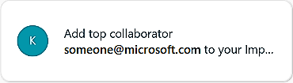

---
# Metadata Sample
# required metadata

title: To add a top collaborator
description: How-to steps -- Add a top collaborator. 
author: paul9955
ms.author: v-pascha
ms.date: 02/26/2018
ms.topic: get-started-article
localization_priority: normal 
ms.prod: mya
---

**To add a top collaborator** 

You use the Add top collaborator card to add the contact named on the card to your Important people list. 

1. In the MyAnalytics pane, click the Add top collaborator card.

    

    The contact is added to your list of important people. 
    
2. (Optional) You can view the updated list in your MyAnalytics dashboard.  