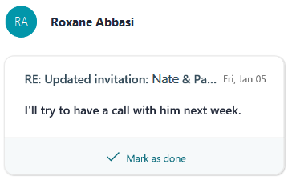

---
# Metadata Sample
# required metadata

title: To get more details about to-do items in MyAnalytics
description: How-to steps for more details about to-do items in MyAnalytics. 
author: paul9955
ms.author: v-pascha
ms.date: 02/26/2018
ms.topic: get-started-article
localization_priority: normal 
ms.prod: mya
---

**To get more details**

You can obtain more details about your to-do items. 
 
1. In the MyAnalytics pane, select the summary card. This displays an individual card for each task. Each card shows the name of the email recipient, the subject line of the message that triggered the card, and the sentence in the message that promises something.  

   
  
2. To open the message, select the message subject line. In this example, the subject line starts “RE: Updated invitation.” The email opens to the message that includes these words.