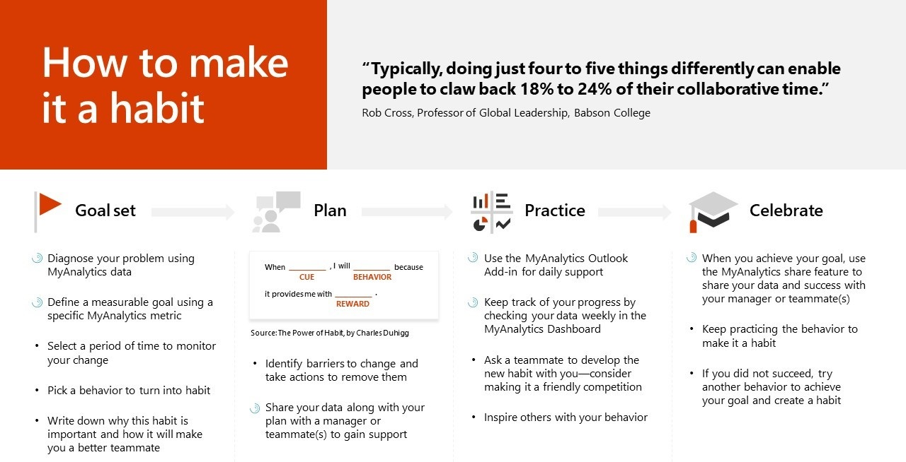

---
# Metadata Sample
# required metadata

title: Habit building method
description: Habit building method of MyA adoption material. 
author: paul9955
ms.author: v-pascha
ms.date: 03/29/2018
ms.topic: get-started-article
ms.prod: mya
---

## Habit-building method

What follows is a habit-building method based on behavioral science that can be used to help you turn a selected behavior into a habit, using MyAnalytics.

For more information about Rob Cross’s research, see: [Reclaiming Your Day](https://www.robcross.org/wp-content/uploads/2017/10/reducing-collaborative-overload-how-efficient-collaborators-reclaim-time-connected-commons.pdf).

For additional tailored behavior change tips, take the: [Collaborative Overload Personal Assessment](https://www.networkassessments.org/). 

To learn more about _The Power of Habit_, see: [The Power of Habit Resources](http://charlesduhigg.com/resources/).

