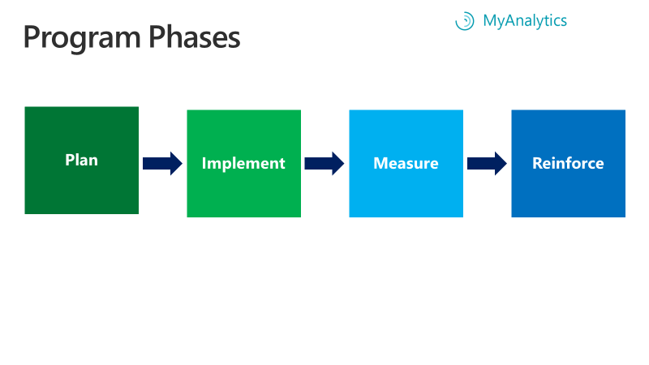

---
# Metadata Sample
# required metadata

title: MyA Teams Adoption -- Intro
description: MyA Teams Adoption by Kate Nowak -- Intro section
author: paul9955
ms.author: v-pascha
ms.date: 03/27/2018
ms.topic: get-started-article
ms.prod: wpa
---

# Get started

## The MyAnalytics Habit Change Program

The MyAnalytics Habit Change Program is a behavior-change program that is built around MyAnalytics. This program aims to help teams reduce burnout and increase productivity by changing bad collaboration habits. (To learn more about collaborative overload, see [Collaborative Overload](https://hbr.org/2016/01/collaborative-overload).

In this multi-week program, team members who are led by a manager work together to learn how to use MyAnalytics, diagnose problems, set and track goals, and develop new habits to change the way the team collaborates.

At its core, the program is a series of MyAnalytics learning modules and habit-building playbooks that can require as little as 15 minutes per week from team members. The biggest time investment is made upfront by the program manager who is responsible for designing a program that best matches the needs of the team. For example, a short program could encourage teams to experiment with new habits, or a longer program could have an overarching team goal and weekly check-in meetings. 

The following content is meant to help program managers design a wide range of custom habit-building programs for teams. 

> [!Note] 
> We assume that the initiator and leader of the program is a program manager; in the rare cases where no program manager is involved, the executive sponsor is the program leader.

## Choosing a team-based approach to change

We all know that change can be hard. People are hard-wired to stick to the status quo even when it is undesirable. However, behavior change doesn’t have to be overwhelming. The key is to keep change as simple as possible and focus on a few small daily habits. Research led by Rob Cross, Professor of Global Business at Babson College, shows that typically doing just four or five things differently can enable people to reclaim 18 to 24% of their collaborative time (see [Reclaiming Your Day](https://www.robcross.org/wp-content/uploads/2017/10/reducing-collaborative-overload-how-efficient-collaborators-reclaim-time-connected-commons.pdf)).

The results of individual change efforts are magnified when people commit to changing together as a group since people tend to behave as others do. Professor Sandy Pentland, who directs the MIT Connection Science and Human Dynamics labs, has said that collective intelligence builds when one person shows enthusiasm, recruits others, and the group begins to work together. “Just hearing something said rarely results in change in behavior. They’re just words. When we see people in our peer group play with an idea, our behavior changes.” (_The Culture Code_, by Daniel Coyle<!-- Pg __-->).

In [The Power of Habit](http://charlesduhigg.com/additional-resources/), Charles Duhigg writes, “The evidence is clear: if you want to change a habit, you must find an alternative routine, and your odds of success go up dramatically when you commit to changing as part of a group.” 

# Conditions for program success

Before you get started, it is important to make sure you set yourself up for success. The following program components are critical for the success of any change program:

 * [An executive sponsor](Team-adopt-intro.md#an-executive-sponsor)
 * [A program purpose statement](Team-adopt-intro.md#a-program-purpose-statement)
 * [A dedicated program manager](Team-adopt-intro.md#a-dedicated-program-manager)
 * [A well-defined and empowered team](Team-adopt-intro.md#a-well-defined-and-empowered-team)

### An executive sponsor

In multiple large studies conducted over the past two decades, an active and visible executive sponsor is consistently identified as the most important contributor to change-management success ([Prosci Best Practices Report](https://www.prosci.com/bookstore/best-practices-in-change-management-2016-edition.html)). Depending on the scope of the change, an executive sponsor does not have to be a c level executive. Regardless of title, this person should hold a senior-level leadership position and be a key decision-maker for the team. For more information on the role of the executive sponsor, see Build the Program Team.

### A program purpose statement

Program participants need to believe in the purpose behind a change to enthusiastically participate in a change program. When people are asked to behave in a way that conflicts with their beliefs, they tend to resist change. Therefore, a program’s executive sponsor and manager must partner to clearly define a compelling purpose statement for the program. Specifically, we recommend answering the following questions to define the program purpose:

 * What do we want to change about our existing collaboration habits?
 * Why is this change important for the business?
 * What are the employee benefits of the change?
 * What is the risk of not changing?

Keep in mind that what motivates management may not be what motivates employees. Research shows that people frequently overestimate the extent to which others share their own attitudes, beliefs, and opinions, and they find it difficult to imagine that others don’t know something that they themselves do know ([The Four Building Blocks of Change](https://www.mckinsey.com/business-functions/organization/our-insights/the-four-building-blocks--of-change)). To avoid these biases, spend the time to reflect on what specifically motivates your team and connect your program to things that are known to motivate employees such as their impact on their team and/or customer. ([The Irrational Side of Change Management](https://www.mckinsey.com/business-functions/organization/our-insights/the-irrational-side-of-change-management)).

Also, seek input from select members of your team as you answer these questions. Your team’s involvement in the development phase helps to cultivate the belief in the change and strengthen their commitment to it. Behavioral science shows that when people choose for themselves, they are far more committed to outcomes. This insight is also important to keep in mind when structuring the details of the program.

## A dedicated program manager

A dedicated program manager is the heart of a change program. This person has a deep understanding of the team’s challenges and is invested in realizing positive results. The program manager is typically the team’s direct manager and if not the direct manager, then someone with authority whom the team trusts and knows well. For more information on the role of the program manager, see [Build the Program Team](Team-adopt-plan.md#build-the-program-team).

## A well-defined and empowered team

Programs are most effective when the team is deliberately comprised of people working under the same conditions and toward the same business objectives. This is important for effective goal setting and program accountability. Collaboration problems as well as the root causes can vary significantly across teams even within the same department. While there is no “one-size fits all” solution to collaboration problems, the odds of defining a team goal and identifying new team norms that most of  the group supports increases when the team is cohesive – for example, an intact marketing team focused on the same product with the same manager. 

Most importantly, individuals participating in the program need to be empowered to change. They need to feel confident that they can experiment with new behaviors. For example, if the team goal is to reduce meeting hours but team members are afraid to decline a meeting invite, the program will fail. It is the job of both the executive sponsor and program manager to empower program participants through clear communications, behavior role-modeling, and rewards and recognition (for more information on rewards and recognition, see [Reinforce](Team-adopt-reinforce.md)).

# Program Phases

 
The MyAnalytics Habit Change Program has four phases: plan, implement, measure, and reinforce.

[Plan](Team-adopt-plan.md): In this phase, the program manager collaborates with key stakeholders to create the program plan that best meets the needs of the team. Planning activities include building the team, structuring the program, and developing the communications plan.

  > [!Note] 
  > Key stakeholders are people who’ve been chosen by the program manager to help build the program. The stakeholders include the executive sponsor, any managers involved in program implementation, and select team members from whom the program manager solicits feedback. 

[Implement](Team-adopt-implement.md): In this phase, the program is implemented. Program participants are engaged and supported with regular communications, resources, and check-ins.

[Measure](Team-adopt-measure.md): In this phase, the program manager collects and analyzes feedback and data from MyAnalytics, surveys, and any additional sources to measure the program results and create the program debrief.

[Reinforce](Team-adopt-reinforce.md): In this phase, the executive sponsor and program manager establish the appropriate rewards and recognition to support sustained change and decide on next steps for the program 
