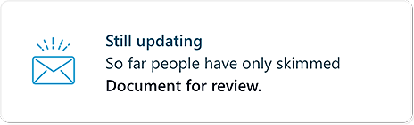

---
# Metadata Sample
# required metadata

title: Email read statistics
description: What proportion of recipients opened your messages? 
author: paul9955
ms.author: v-pascha
ms.date: 02/07/2018
ms.topic: get-started-article
ms.prod: mya
---

## Email read statistics 

MyAnalytics can tell you how many people have opened your emails and how long they spent reading them. It informs you about emails that you sent to five or more Office 365 users who are internal to your company. It displays this information in "cards," such as this one:

After you send an email message, it takes up to fifteen minutes before MyAnalytics can inform you about it. MyAnalytics groups similar information into a single summary card that you can select and expand to see a more detailed view.

[!INCLUDE [See info about a specific email message](../../Includes/to-see-info-about-email-message.md)]
