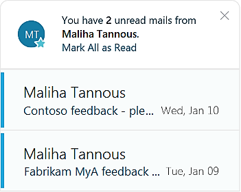

---
# Metadata Sample
# required metadata

title: Unread emails
description: What to do with MyAnalytics cards about unread emails. 
author: paul9955
ms.author: v-pascha
ms.date: 02/14/2018
ms.topic: get-started-article
ms.prod: mya
---

## Unread emails from important people  

Based on the list of important people, MyAnalytics displays cards to notify you of any unread email you have from Important people. Each card displays the sender’s name, the subject line, and the date of the message.

You can click the subject line of a message to open it, or mark all messages from the sender as read. To show you this list, MyAnalytics does not consider unread email that is in the Deleted Items folder nor email that is more than seven days old. 

MyAnalytics notifies you of messages from Important people if these messages are in your Inbox or its subfolders.

