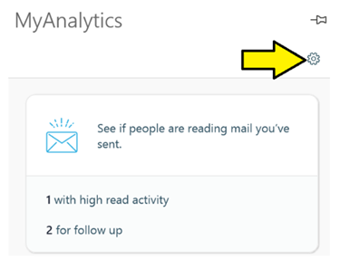
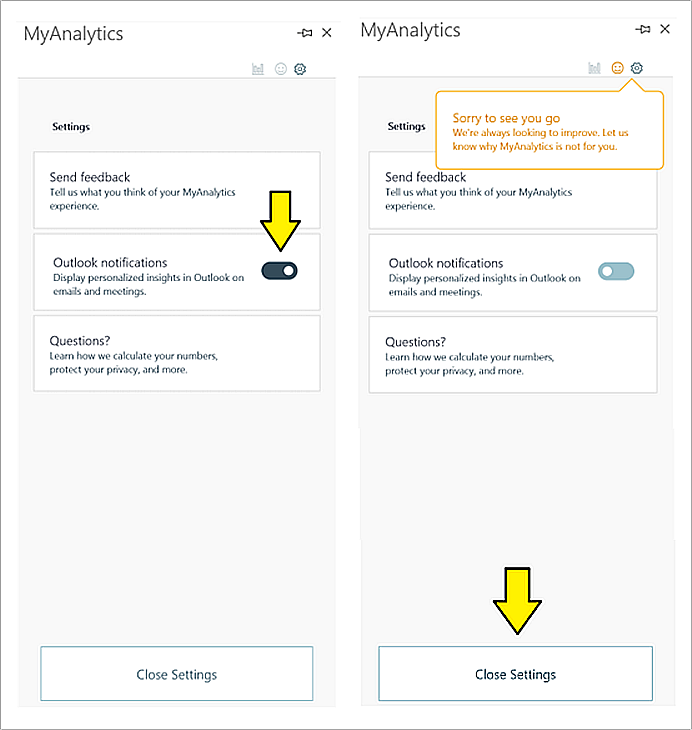

---
# Metadata Sample
# required metadata
title: MyAnalytics nudges in Outlook
description: This articles describes MyAnalytics nudges in Outlook and how they work.
author: buntus
ms.author: patboony
ms.date: 07/07/2018
ms.topic: get-started-article
localization_priority: normal 
ms.prod: mya
---

# MyAnalytics nudges in Outlook

## What are MyAnalytics nudges in Outlook? 
MyAnalytics nudges in Outlook (or MyAnalytics nudges) are brief, data and AI-driven notifications that appear in Microsoft Outlook while you are either reading or composing an email or a meeting invitation.  

MyAnalytics nudges can help boost your productivity and that of your team by displaying useful suggestions, tips, and best practices around managing email and running meetings. They help inform and guide you in making effective email and meeting decisions. They can also help you to reclaim focus hours and build better collaboration habits, in addition to other practical benefits. See the
[MyAnalytics nudges](#MyAnalytics-nudges) table.

## How MyAnalytics nudges work 
MyAnalytics nudges are seamlessly integrated into Outlook for Windows and Outlook on the web. MyAnalytics can display nudges in two ways: 

1.  While composing a meeting invitation or an email:

 

 In this example, the nudge is shown at the top of an email, reminding you of the after-hours impact you’ve generated for your colleagues. The nudge suggests that you make clear just how urgent this email is, so that recipients know if it can wait until working hours. Alternatively, you can hide the nudge temporarily by selecting **Dismiss this message**. 

2. While reading an email or a calendar invitation: 

   

While reading an email, this nudge reminds you of a potential outstanding to-do for the email sender. Selecting the link takes you to the MyAnalytics Add-in, which shows the list of to-do items. 
 

## Why don’t I see any MyAnalytics nudges? 
MyAnalytics nudges will start appearing for licensed MyAnalytics users in summer 2018 in the latest version of Outlook. Talk to your administrator about upgrading your Outlook version.

Nudges are available while reading mail in: 
   - Outlook on the web for Office 365 
   - Outlook on Windows: builds later than 8413 
       - Office 365 ProPlus Monthly Channel 
       -  Office 365 ProPlus Semi-Annual Channel (Targeted)  
       -  Office 365 ProPlus Semi-Annual Channel 

>[!Note]
>Nudges are not currently available in Outlook for Mac, Outlook for iOS, or Outlook for Android. These will be coming soon. 

MyAnalytics nudges use a technology called Actionable Messages. For more details on the rollout and availability, including version and build numbers, please see: [Actionable messages](https://docs.microsoft.com/outlook/actionable-messages/)
 
Nudges are available while composing mails and meetings in: 
 - Outlook for Windows: builds later than 9223 
     - Office 365 ProPlus Monthly Channel 

## Providing feedback 
You can provide feedback for each nudge by using the feedback control at the bottom of the MyAnalytics Add-in screen. If you send a thumbs down, we’ll show you less of that nudge. 

   

You can always provide overall feedback by selecting the smiley face in the upper right hand corner of the MyAnalytics Add-in. 

## Opting out of nudges

1. To opt out of MyAnalytics nudges, navigate to the MyAnalytics Add-in by selecting the MyAnalytics button on the ribbon.  

      

      If you are using Outlook on the web, the MyAnalytics icon can be found in the top right corner of the reading pane, or in the bottom right corner of the compose form.

     

2. Select the gear icon to access **Settings**.

   

3.  Toggle **Outlook notifications** to “Off" and then select **Close Settings**. 

    

## MyAnalytics nudges
 
### What types of MyAnalytics nudges will I see? 
MyAnalytics nudges can help you in various ways:
 

### Get more time to focus

| Where it shows up  | What it says | How it helps  |
|------|-------|---------|
|Reading pane (meeting invitation)|Looks like you have a lot of meetings this/next week. Would you like to reserve some time for focused work? **See available times**|Reminds the user (the meeting attendee) who has a heavy meeting load to book time for focused work|
|Reading pane (meeting invitation)|This meeting conflicts with your scheduled focus time. Do you want to move your focus block? **See available times**|Helps you to protect your focus time block, by suggesting that you move a booked focus session to another time when a meeting request conflicts with it.|

 

### Reduce unnecessary time in meetings

| Where it shows up | What it says | How it helps  |
|------|-------|---------|
|Reading pane (meeting invitation) |Looks like you have a lot of meetings this week. Can someone cover this meeting for you? **See who's available** | Helps the user (the meeting attendee) find a colleague who can cover the meeting on behalf of the attendee|

 

### Stay up-to-date with important relationships

| Where it shows up | What it says | How it helps |
|------|-------|---------|
| Reading pane (email) | You may have outstanding to-dos for sender. Would you like to review now? **See my to-dos** | Reminds the user that there may be outstanding to-do items for the sender |
|Reading pane (email) | You have other unread mail from sender. Would you like to review now? **See unread mails** |Reminds the user that there are unread emails from the sender |

 

### Reduce after-hours work and team impact 
| Where it shows up  | What it says | How it helps |
|------|-------|---------|
|Email compose | Your colleagues have been responding to your mails outside typical working hours. Consider **clarifying urgency** |Suggests that the user clarify the degree of urgency when emailing colleagues outside work hours |
