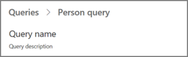
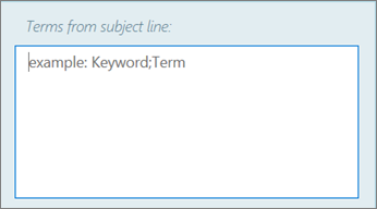

---

title: Workplace Analytics language support and guidelines
description: Describes the privacy and data access controls available in Workplace Analytics 
author: paul9955
ms.author: v-pausch
ms.topic: article
localization_priority: normal 
ms.prod: wpa

---

# Workplace Analytics language support and guidelines

The Workplace Analytics user interface is currently available in English, Japanese, and French. It is also available in preview mode in Chinese (Simplified), Chinese (Traditional), German, Italian, Korean, Portuguese (Brazil), Russian, and Spanish (Spain).

In certain circumstances, you can use Workplace Analytics with _data_ that is in other languages. Follow these guidelines:

* Query names and descriptions must be in English, Japanese, or French

   

* Column headers for the organizational data when you [prepare the organizational data](../Setup/Prepare-organizational-data.md) must be in English.

* Metric names can be in the language of your choice. See [Supported languages for column headers](../use/view-download-and-export-query-results.md?branch=pas-pd-other-char-sets#supported-languages-for-column-headers). 

* For content within organizational data, you can use languages other than English.

## Privacy settings

In [Privacy settings](../use/settings.md#privacy-settings), when adding the subject line terms to exclude from analysis, Workplace Analytics might not recognize uncommon compound words, especially those in other languages such as Japanese or Chinese. For best results, use single words, separated by a semicolon.

We appreciate all your feedback. To report any language-related issues, use the **Send feedback** button.

### Related topics

[Supported languages in meeting exclusion rules](../tutorials/meeting-exclusion-concept.md#supported-languages)

[Configure settings for Workplace Analytics](../use/settings.md)

[Privacy settings considerations for Workplace Analytics](../Privacy/privacy-considerations.md)
