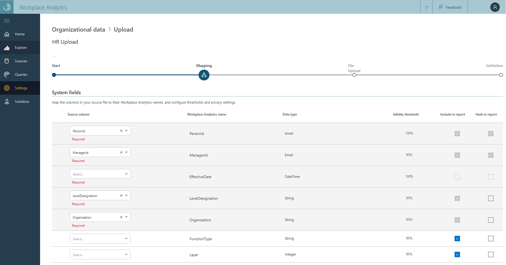
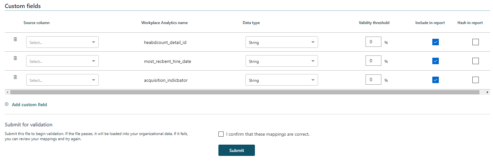

---
# Metadata Sample
# required metadata

title: Upload organizational data in Workplace Analytics
description: How to upload data from your organization to Workplace Analytics. 
author: paul9955
ms.author: v-pascha
ms.date: 04/06/2018
ms.topic: get-started-article
localization_priority: normal 
ms.prod: wpa
---

# Upload organizational data

This article presents the steps that administrators take to upload organizational data to Workplace Analytics. Complete these steps after preparing data as described in [Prepare organizational data](Prepare-organizational-data.md).

## Import tasks

The task of importing organizational data has three parts: 

1. [File upload](#file-upload)
2. [Field mapping](#field-mapping)
3. [Data validation](#data-validation)

After you have prepared your source data, you upload your .csv file and map fields. After you map fields, data validation might or might not succeed. If the data successfully validates, the overall data-import task is complete. If the data at first does not validate, you can choose from among further options, which are described in [Validation fails](#validation-fails).

## File upload

In this procedure, you specify a .csv file to upload to Workplace Analytics.

**To select the file to upload**

1. Go to the Workplace Analytics Home page.
2. In the left navigation pane, select **Settings**.
3. Select **Organizational data**. The Upload history area of this page displays the previous data uploads from your organization.
4. Select **New upload**. This displays the Organizational data > Upload page.
5. Select **Name your upload**, and then type the name of your new upload file. <!--FORMER: A “workflow” is the action of uploading your organization’s data.-->
6. Optionally, select **Add an optional description** and type a description of this upload.
7. In the Select file section, click **Select file**. In the dialog box that appears, select the .csv file that you want to import.

  > [!Note] 
  > If you are uploading new data, go to step 8, _Complete new file upload_. However, if you have uploaded data and then discovered that it contains sensitive, incorrect, or unauthorized data, you must remove the uploaded data and replace it with a new file. To do this, go to step 9, _Replace organizational data_. 

8. To complete a new-file upload, select **Next**. This displays the System fields table. Go to [Field mapping](#field-mapping).
9. To replace organizational data, in the Select file area, select **Show advanced options**. This opens the Append or replace area.
10. In the Append or replace section, select **Replace all existing organizational data with this file**. Note the warning that states “This option permanently deletes all previously uploaded organizational data.”
11. In the warning message that is displayed, select **Continue**. The data in the specified .csv file replaces the previously uploaded data for your organization.
12. Continue to [Field mapping](#field-mapping).

## Field Mapping

You need to map the fields (columns) for the source .csv file to field names that Workplace Analytics recognizes. You map these on the Upload page.

The UpLoad page displays two tables: System fields and Custom fields. You use these tables to map the data in your uploaded file.

### System default fields table

System default fields represent attributes that are known by Workplace Analytics and are used in specific calculations beyond grouping and filtering. A system field can be either required or optional.

* **Required fields** are identified in two ways. They appear in rows that have dark shading and under the Source column headers, they are identified by the word “Required.” These rows represent data that was found in the uploaded file. For the upload to succeed, you must map the required fields with a column in your .csv file that is the correct data type and meets the validity threshold. 

Every required field must have a valid, non-null value in every row. This means that, even if the names of these attributes are not present in the uploaded .csv file, other columns must be present in the .csv file that are mapped to these attributes.

* **Optional fields** appear below the required fields in rows that have lighter shading. These rows are commonly encountered system fields that Workplace Analytics suggests for use. You don't need to map these fields if your organization doesn't have data for them.

### Custom fields table

* **Custom fields** are displayed on this page below the optional fields. Custom fields are optional attributes you can create. Select a column from your source.csv file. Name the column, select the data type, set the [validity threshold](#set-validity-threshold-for-custom-fields), and then select the report option.

### Columns in the System fields and Custom fields tables

* **Source column** corresponds to each of the fields in the uploaded file.
* **Workplace Analytics name** is the name for your organization's Workplace Analytics.
* **Data type** is the data type of the fields.

   >[!Note]
   >If the data type is Boolean, the value for the Boolean field must be TRUE or FALSE.

* **Validity threshold** sets the percentage of rows in the uploaded file that must have a valid, non-null value for the attribute. The source file might still be valid even if some rows have invalid or missing values for some columns.

   For example, your data file updates information about people. Because every row in it is linked to a user, the PersonID field must be valid in every row. In this case, set the value for PersonID to 100%.

   The Validity threshold for required attributes is always 100%. If an attribute has a threshold lower than 100%, it cannot be required. For more information, see [Set Validity threshold for custom fields](#set-validity-threshold-for-custom-fields).
* **Include in report** excludes sensitive data from the report that Workplace Analytics generates about the import operation.  
* **Hash in report** de-identifies sensitive data. If you select this option, Workplace Analytics includes the data in the report that it generates about the import operation, but instead of displaying the actual value that was taken from the source file, it shows a hashed version of the value – a format that cannot be read.

**To map fields**

After you complete the steps in [File upload](#file-upload), the Upload page with the System fields table will appear.

1. Map the required fields.

    

  <ol type="a"> 
  <li>Determine which of the columns in your .csv file correspond to the second column in the table (Workplace Analytics name).</li>
  <li>Under Source column (the first column in the table), click the down arrow. This displays a list of the column names that were found in the .csv file. From the list, select the correct column name for this data.</li> 
  <li>Fill in appropriate values for the other columns in the table: Workplace Analytics name, Data type, and so on. (For more information, see [Columns in the System fields and Custom fields tables](#columns-in-the-system-fields-and-custom-fields-tables).) Repeat these mapping steps for the rest of the required fields and for the optional fields that you choose to map.</li>
  </ol>

2. Map the optional and custom fields, as applicable. You only need to map the columns in your source (.csv) file that your organization considers important for analysis. For example, if StartDate is important and your data contains this field, map it.

   

  <ol type="a">
  <li>Under Source column (the first column in the table), select the down arrow to display the list of column names that were found in the .csv file. From the list, select the correct column name for the data. In this example, you'd select **StartDate**.</li>
  <li>Set values for the other columns in the table, such as the data type, the validity threshold, and the hash setting for reports.</li>
  <li>Repeat these steps for all custom fields that are important to your organization.</li>
  </ol>

3. In the Submit for validation area, select **I confirm that these mappings are correct**, and then select **Submit**. This uploads the .csv file and starts the validation process.

Go to the next procedure, [Data validation](#data-validation).

## Data validation

After you complete the steps in [Field mapping](#field-mapping), the Upload page displays the _File is being uploaded_ screen.

 
> [!Important]  
> Observe the warning “You must stay logged in while the file is uploading or the upload will be canceled.” This is because the upload takes place with this page in your web browser. Do not close the browser (or this browser page). If you do close it, the upload will fail.

## Validation succeeds

If validation succeeds, the Upload page will indicate it and show the size of the upload and that the overall process is complete.
 

You can now select **Settings** > **Organizational data** to display the Data upload history page. You can then select **Succeeded** to see the workflows that were successfully validated (and uploaded). <!--  Note that this will work only work if you are on a native tenant. Demo is still on Volo. -->

On this page, you have the following options:
 * Select the eye icon to see a summary of the validation results.
 * Select the hierarchy symbol to see the mapping settings for the workflow.
 * Select the download symbol to see a list of validation warnings.

> [!Note]
> Each tenant can have only one upload in progress at a time. This means that you must complete the workflow of one data file – either guide it to a successful validation or abandon it – before you begin the workflow of the next data file. By looking at the Start – Mapping – Validation – Complete bar, you can tell whether any data file is in the upload workflow.

## Validation fails

The following illustration shows a failed validation.

 
After a failed validation, the Data load page shows the Validation failed notification. It also shows details about the validation attempt and it presents you with options.

Before you attempt to address the problem, consider selecting **Download issues**. This displays a log file that describes the problems in your data that might cause validation errors. Use the log to either fix the source data, change your mapping settings, or abandon the current attempt.

> [!Tip]
> If you have a small number of errors, you’ll probably want to fix them. If you have many errors, you might want to select **Abandon**.

### Options upon failed validation

* **Abandon** restarts the upload-map-validate process with new data rather than retrying the process with the current data, click **Abandon** (in the upper right corner of the page). Clicking Abandon does not retain any field mappings that you have made. 
* **Fix** has two options:
  * **Fix the source data** is recommended because it fixes the data in your source .csv file and increases the quality of data analysis.
  * **Change the mappings** enables you to change an incorrect data type, to lower the threshold. However, changing the threshold might negatively affect future data analysis. Select **Edit mapping** to set new mapping values, after which you can retry to validate your data file.
* **Upload file** is different than Abandon in that your mappings are retained with this option. After you select this option, follow the steps in [File upload](#file-upload).

## Tips

### Invalid values

When any row has an invalid value for any attribute, the entire upload will fail until the source file is fixed (or the mapping changes the validation type of the attribute in a way that makes the value valid). Lowering a threshold does not ignore or skip an invalid value.

### Adding missing data

Workplace Analytics does not modify or fill in data that is missing from HR uploads, even for EffectiveDate or TimeZone. The administrator is responsible for correcting such errors or omissions.

### Set Validity threshold for custom fields

The threshold depends on the intended use of the custom field. If you intend to use this data in much of your analysis, consider setting it to a high percentage. You can set a lower threshold for data that applies, for example, to only a small subset of people in your organization.

#### Set a high value

Generally, you should set the Threshold field to a high value. This is especially important if your analysis will focus on that field.

For example, you might include a ManagerId attribute. You might at first not think that you’re analyzing manager behavior and you might be tempted to omit this attribute. But the organization hierarchy is used implicitly by many Workplace Analytics analyses – for differentiating different work groups, for determining high- and low-quality meetings based on how many levels attend, and more.

#### Set a lower value

The goal of your analysis might be to determine sales effectiveness. Your data might include an attribute for sales attainment that only makes sense for members of your sales force, who constitute about 10% of the company. This number doesn’t apply to engineers or program managers, but it is critical for high-performers in sales.  
