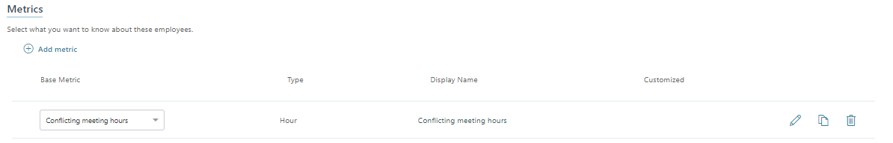

---

title: Customize a base metric in a Workplace Analytics query
description: How to customize and change a base metric in a Workplace Analytics query. 
author: paul9955
ms.author: v-mideh
ms.topic: article
localization_priority: normal 
ms.prod: wpa
---

# Customize a base metric in a query

Analysts create queries to determine workplace patterns and behaviors. An important step in the creation of a query is selecting a metric. This defines the query's area of focus.

As an analyst, you select metrics as you build queries. The metrics that you see on the page for building a query are "base metrics", which means that when you first select one, it appears in a simple, unfiltered form, such as "Email hours."

## Work with metrics in a query

You can change how a metric is used within a query in the following ways:

1. Customize the base metric.
2. Change the base metric.
3. Add additional base metrics.

### Customize the base metric

After you select a metric you can _customize_ it. A customized metric produces more refined results when used in a query. You customize a metric by applying filters to it. Although you do this on the query-builder page, these filters apply only to the metric and function independently from any filters that you apply to the query itself.

For example, you might start with the base metric "Email hours." You could customize it so that it became a more targeted metric: "Email hours where at least all attendees' and/or recipients' FunctionType equals R&D."  

### Change the base metric

You can also change the base metric. This means selecting a different base metric to use in place of the original one you chose.

#### Customizations are retained when you change the base metric

The previous example customized the "Email hours" base metric to be: "Email hours where at least all attendees' and/or recipients' FunctionType equals R&D."

After you apply a customization, let's say you want to *change* the base metric from "Email hours" to "Total emails sent during meetings." This change gives you a new metric that has retained the same customization. Your final, customized metric would be: "Total emails sent during meeting where at least all attendees' and/or recipients' FunctionType equals R&D."

In other words, the customization that you applied to the original base metric was not lost when you changed from that base metric to a different one.

### Add additional base metrics

You can also add additional base metrics to your query. You would do this to modify the query's area of focus.

## Walkthrough: Customize and change a base metric

To customize and then change a base metric:

1. On the **Analyze** > **Queries** page, select the type of query you want to create, such as a person or meeting query. **Note**: You currently can only customize metrics for a person or a meeting query.
2. Select and change **Enter query name here** to name your query and enter a description.
3. For **Group by**, select a time-grouping option -- day, week, or month.
3. Select a date range and a meeting exclusion rule.
4. In the **Metrics** section, select the plus (+) sign next to Add metric and then select a metric from the list:
 
   

   > [!Note]
   > You can select multiple metrics from the list. When you are finished, select elsewhere on the page to close the list.

   For this example, select the **Conflicting meeting hours** metric:

   

   The selected metric becomes the *base metric* for the query, and represents the area of focus for data analysis.

6. Customize the metric by following these steps:

   a. Select the **Edit** icon . This shows the option to apply filters to the base metric:

   

   b. Select the plus (+) sign next to **Add filter**. A filter is now added. In our example, it's the Initiator filter:

   

   c. Select the filter name, **Initiator**. This shows options that define the filters for email initiators:

   

   d. Define the filter details in the available fields. Optionally, define other filters (if others are available) by selecting AND or OR and adding details to the additional filters.

    For guidance on the proper use of AND or OR operators in conjunction with NOT operators, refer to [NOT Operators](#not-operators).

   e. Select **Confirm** at the top right of the page.

7. Optionally, you can now change the base metric. Select the drop-down arrow shown next to the name of the base metric, and then select a different metric.

   >[!Note]
     * Any base metric that is customizable shows a drop-down menu with the possible change options.
     * Not all base metrics can be changed. If no drop-down menu is available, the metric cannot be changed.
     * Changes are not always 1 to 1. For example, you can change from Conflicting meeting hours to Email hours, but because of variations in the available filters, the opposite change is not possible.

   If you select a new base metric with identical filter options, the metric will change but you'll see no additional changes. If you select a new base metric for which the filter options are a subset, additional available filters appear. If you edit the name of the metric and then change the base metric, the name that you edited is deleted.

8. After you create or edit all the metrics you want, confirm or cancel your changes:
   * If you select **Confirm**, all changes to the metric are saved.
   * If you select **Cancel**, all changes are discarded (reverted to the original state).
   * If you neither confirm nor cancel the changes, the changes are automatically confirmed.

9. Select **Run** to run the query with all confirmed metrics and customizations that you applied.

### NOT operators

Care should be taken when you use the 'NOT' operator in conjunction with other metric filters. For example, suppose that you wanted to add a query filter to exclude all meetings where the subject line contained all the following terms: sales, meetings, and office, by using a ‘NOT’ operator.

Assume that a meeting email had the subject line: “Sales meeting”, but did not also include the term 'office'. In this case, if you were to use the ‘NOT’ operator in conjunction with the 'OR' operator, any meetings that corresponded to the missing term would still be returned. If you want to exclude all the terms, not just any of them, use the 'AND' rather than the 'OR' operator. Otherwise, values will be returned when any one of the filter terms is not satisfied.
