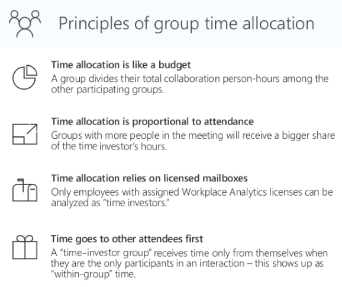

# Group-to-group queries

Group-to-group queries in Workplace Analytics give results that help you understand how a team invested their time across the rest of the organization and beyond. The query results list pairs of groups, as defined by the organizational attributes, along with how much time people in the first group (the "time investors") allocated to other groups ("collaborators").

## Overview of time allocation

An understanding of time allocation helps you create better group queries. The details of time allocation can be complicated. Here is a summary of the basic concepts:

* Time allocation measures how groups spent their time. For each interaction (a meeting attended or an email sent or received), the total time that one group spent on the interaction is divided among the other groups that participated.
* A time investor allocates their time among the other participants in the interaction (the collaborators) in proportion to how many people are in the collaborator group for that interaction.
* A group query can analyze time allocation only for employees in the population of measured employees, namely those who are licensed for Workplace Analytics. People who do not have a license for Workplace Analytics can appear as collaborators, but never as time investors.
* The time-allocation approach assumes that a time-investor group allocates time only to themselves if no other groups are participating in the meeting or email.

The following graphic depicts these concepts.

 

<!-- Per Dheepak, this pptx is not for public consumption 
> [!Note]  
> For more information, see the time allocation tutorial, which explains the logic and works through several examples. 
-->

## Create a group-to-group query

While setting up a group query differs markedly from setting up meeting or person queries, some of the options you set, such as for time-period aggregation, time range, and meeting-exclusion rules, are the same as for meeting and person queries.

**To create a group-to-group query**

1. On the **Analyze** > **Queries** page, select **Group-to-group**.
2. Select and change **Enter query name here** to a name, and then enter a description for the query.
3. For **Group by**, select a time-grouping option -- day, week, or month.
4. Select a date range. The query will analyze only those group-to-group interactions that took place during this date range.
5. Select a meeting exclusions rule. The query will ignore meetings that are filtered out by this rule.
6. In the **Select metrics** section, select one or more metrics that measure interactions between the time investors and collaborators, such as Collaboration hours, Email hours, or Meeting hours.

   

   To learn more about metrics for group-to-group queries, see [Group-to-group metrics](../use/metric-definitions.md#group-to-group-metrics).

   The following sections enable you to define how to group the time-investors and the collaborators. For example, to analyze how senior leaders allocated time across different organizations, you'd set the time investors' group to "level" and the collaborators' group to "organization." 

7. In the **Time investors** section, answer the next question _How do you want to group the time investors?_ by specifying an attribute for this group, for example, FunctionType, IsInternal, or TenureMonths. 

   

8. Optionally, you can remove some of the time investors from this analysis by applying one or more filters under the question _Do you want to limit the analysis to only certain time investors?_

9. In the **Their collaborators** section, you can add filters to exclude collaborators, such as Domain, FunctionType, or Organization, which are the same as for the time investors section.

   At this point, the collaborators are ungrouped, which means the query results will not show you which collaborators interacted with the time investors.

   

10. Answer the question _How do you want to group the people who collaborated with the time investors?_ to group the collaborators. This will show you which groups interacted with the time investors. You can also combine groups of collaborators for the purpose of isolating other specific groups who interacted with the time investors.

    

11. Select **Run** at the top right to run the query.
12. On the **Queries** > **Results** page, the query status shows as **Submitted**. After the query status changes to **Succeeded**, you can view it, share it, download it (in .csv file format), delete it, or [Copy an OData link](https://docs.microsoft.com/workplace-analytics/use/view-download-and-export-query-results#get-a-link-for-odata-feed-that-you-can-use-in-power-bi) to use in a visualization tool, such as Power BI or Excel.

## Related topics

[Metric descriptions](../Use/Metric-definitions.md)

[View, download, and export query results](../Use/View-download-and-export-query-results.md)

<!-- VERIFY THIS CONTENT THEN MAKE A NEW TOPIC OUT OF IT. FOR MORE IN-DEPTH LEARNERS

# Walkthrough

## Group time investors or collaborators

Before you create a query, you need a clear concept of the question that you want the query to answer. Whose time do you want to analyze, and what do you want to know about it. The example we'll use here is that of your Sales team. Specifically, how much time did they spend over a particular six-month period with the Product marketing team. To obtain this information, write a query that uses grouping and filtering, as described in this section. 

Using the Their collaborators section of the Group-to-group query page

### What grouping means

When you use the Group collaborators option, you create groups by finding commonalities between individuals. For example, do you want a group of people who all work in offices in the same time zone? Do you want a group of managers all at the same level? Do you want all people who work in IT to form a group? These are all attributes that are uploaded in the HR data. You can use any HR data attribute for grouping, plus one other attribute: the person's email domain. 

### What grouping accomplishes

When you create a query, you typically find out how much time certain people spent with certain other people. That is, you take the time that the "time investors" spent in the meeting and you allocate that time proportionally among the distinct other groups that were represented in (attended) the interaction.

## Step-by-step example

In this example, you want to find out how much time the people in Sales spent with marketing people in their interactions over the six-month period. These are the steps you take:

**To create the Sales - Product marketing query**

 1. Open the Queries page in Workplace Analytics.
 2. Select **Group-to-group** query.
 3. Enter a name and a description for the query.
 4. Indicate any particular meeting exclusions, or use the default set of meeting exclusions. 
 5. In the **Select metrics** section, select an interaction type to learn more about. In this case, select Hours.
 6. Several metrics pertain to this interaction type. Choose the metric that most closely matches the information you want. Now go to the Time investors section.
 7. You want to study the people in Sales. Sales is an example of a workplace function, so select FunctionType under How do you want to group the time investors?
 8. The next question is Do you want to limit the analysis to only certain time investors? Because you want to limit your current study to people in Sales, the answer is Yes. Create a filter in which FunctionType = Sales. You have just created a group that the query will report about. Move on to the Their collaborators section.
 9.  The first question in this section is Do you want to exclude any collaborators? The answer to this question depends on the scope of information that you want your query to supply. Your goal is to study the interaction between Sales and Product marketing. If these interactions are all you want to know about, you can now exclude all collaborators other than Product marketing. Do this by setting FunctionType in the left side of the filter builder, and adding all groups other than Product marketing on the right side. 
  
     Alternatively, you could exclude no groups. This would still answer your core question -- How much time did Sales spend with Marketing during these six months? But by letting the data from other groups also appear, you would see the Sales-Marketing interactions in the broader context of the overall behavior of your Sales team.

 10. Move on to the next question: How do you want to group the people who collaborated with the time investors? Because you are interested in the collaborators who are in Product marketing, and Product marketing is a workplace function, you want to group by workplace function, so select FunctionType.
 11. Finally, answer the question: Are there any collaborators you'd like to group all together to simplify the results? This question lets you optionally designate as "noise" the query results that you do not want to focus on. 

     Remember that you just selected FunctionType as the grouping mechanism for collaborators. If you do not answer this final question, the query will return discrete data about each group that interacted with your people in Sales. 

     If you do answer this question, you can have the query results treat all groups other than Product marketing as one "other" group, which it appropriately names "Other." To do this, in the filter builder, select FunctionType on the left, Equals in the center, and on the right, select all options other than Product Marketing. Now, when the query returns its results, all these other groups will appear together as one group called "Other." 

When we run this query, the query does this: It considers the time that the time investors spent in share interactions (such as meetings) and allocates it proportionally among the distinct other groups that attended the interaction. Again, note that groups are defined by the organizational (HR) attributes that selected to define them. 

## Group to simplify: more details

You can make your query results easier to interpret by using the Group to simplify option in the Their collaborators section. 
Grouping to simply doesn't change the allocation of time; it just simplifies the output of your query. In effect, it removes noise so that you can focus more easily on the data that you are seeking, on the answer to your question.

For example, the Sales team has met with individuals on six other teams. You care only about how much time they spent with one of those other teams, Product marketing. Use Group to simplify to concentrate on Product marketing. 

Although Sales also met with people in IT, Finance, R&D, Engineering, and Operations, you don't care about the time they spend with those groups. The total amount of time they spent with all those other groups combined might interest you, but the detailed breakdown does not. To clean up the query output in this regard, use the Group to simplify option under Their collaborators. The query results then treat Product Marketing as one group, and all other internal collaborators as a second group, called "other." Note that you cannot specify more than one "other" group; however, WpA automatically groups others into two groups by domain, internal others and external others. 

DELETED PER HARSHIT 25 JUNE 2018
7. Unlike with person or meeting queries, group-to-group queries require you to select a single metric of between-group collaboration:

* **Count** gives you the number of interactions that occurred between the two groups. These interactions are not subject to the time-allocation rules.

* **Hours** gives you how much time each time-investor group allocated to collaborators, regardless of who initiated the meeting or email.

* **Organizational load** is similar to hours but is limited to only the time associated with activities initiated by the time-investor group. -->