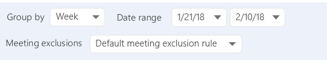

---
# Metadata Sample
# required metadata

title: Meeting queries in Workplace Analytics
description: When to use a meeting query and the type of data available for analysis in Workplace Analytics.  
author: madehmer
ms.author: rodonahu
ms.date: 07/16/2018
ms.topic: get-started-article
localization_priority: normal 
ms.prod: wpa
---

# Meeting queries

The Meeting query in Workplace Analytics gives you a list of any meetings that occurred during a specific period, along with their attributes.

## How to choose between a Meeting or Person query

Certain questions can be answered with either a meeting or person query.

 

But for most questions you want to answer, the lines are more clear cut.

Use a meeting query when you want to understand the relationship between different meeting attributes.

Use a person query when you want to understand the relationship between a person’s organizational attributes – like their team, level, or location – and how they use their time, or when you want to know how one aspect of a person’s time use might influence another aspect of their time use.

## Create a meeting query

Setting up a meeting query is simple.

Select whether you want the metrics for each meeting summarized by day, week or month, and the time period you’d like to analyze.

If you want to exclude meetings from the calculations using custom criteria, you can select your custom rule set – otherwise, use the default.

 

By running this query with no exclusions, you will get a helpful output file that can help you determine the right criteria to separate work-related activities from other calendar items.

 

## Add filters and metrics

You can add a filter to limit the list of meetings included in the output file. For example, the **Meeting** filter will limit the query based on the size, duration, and other attributes related to the meeting.

The other filters will limit the query based on the organizational attributes of the different meeting participants.

You can also add a base metric to customize what additional meeting data to include in the output file. For example, select the **Attendee meeting hours** metric to include the total number of adjusted meeting hours for all attendees.

To get more details on adding metric filters, see [Customize a metric](../Tutorials/customize-a-metric.md).
