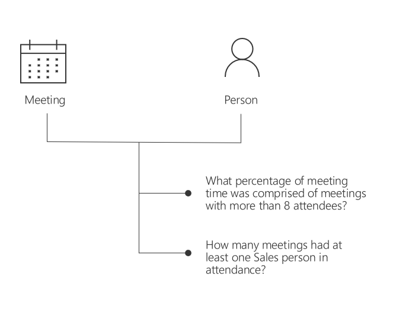
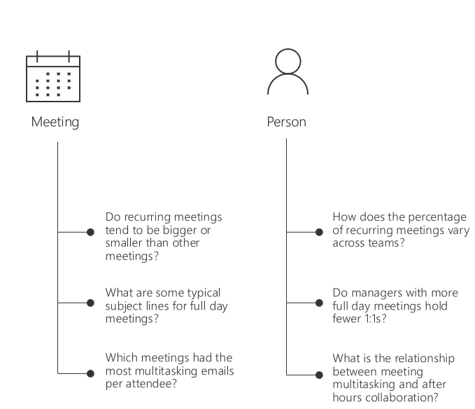
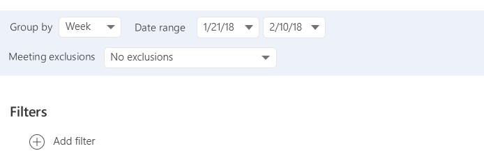
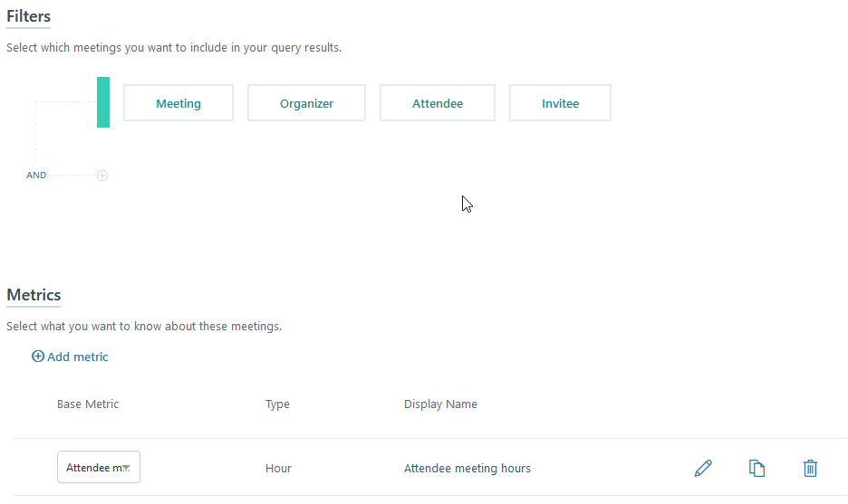
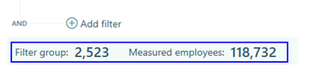
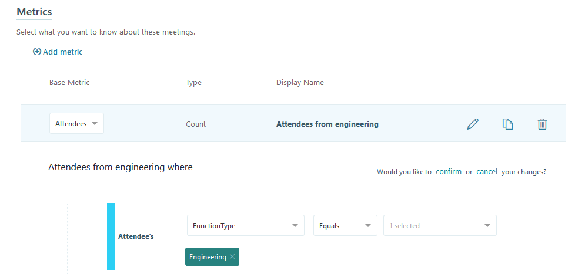
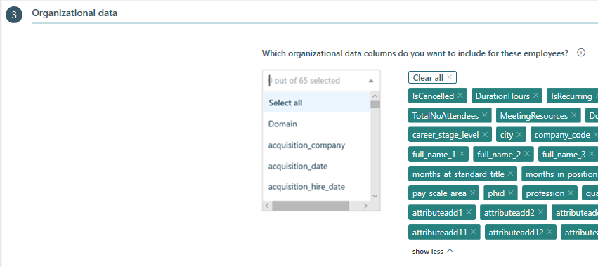

---
# Metadata Sample
# required metadata

title: Meeting queries in Workplace Analytics
description: When to use a meeting query and the type of data available for analysis in Workplace Analytics.  
author: paul9955
ms.author: v-midehm
ms.topic: article
localization_priority: normal 
ms.prod: wpa
---

# Meeting queries

A Workplace Analytics meeting query helps you analyze individual meeting trends. You can use a meeting query to get a list of all meetings and their attributes that occurred during a specific period.

## How to choose between a meeting query and a person query

Certain questions can be answered with either a meeting or person query:

 

But for most questions you want to answer, the lines are more clear cut:

Use a meeting query when you want to understand the relationship between different meeting attributes.

Use a person query when you want to understand the relationship between a person’s organizational attributes – like their team, level, or location – and how they use their time, or when you want to know how one aspect of a person’s time use might influence another aspect of their time use.

## Create a meeting query

Setting up a meeting query is simple. Select whether you want the metrics for each meeting summarized by day, week, or month, and the time period you’d like to analyze.

If you want to exclude meetings from the calculations by using custom criteria, you can select your custom rule set or simply use the default.

By running this query with no exclusions, you will get an output file that can help you determine the right criteria to separate work-related activities from other calendar items.

 

## Add filters

You can add a filter to limit the list of meetings included in the output file. For example, the Meeting filter limits the query based on the size, duration, or other attributes related to meetings.

You can also limit the query based on organizer, attendee, and invitee attributes for meetings.

When adding a filter, you can see the number of people included in the filter group and the total number of measured employees it's based on. This helps you decide if you've set up the correct filter (or filters) before running the query.

## Add metrics

You can add base metrics to customize your meeting data. For example, select the Attendees metric to include the total number of people that attended meetings. You can add a metric filter to further customize the data. For example, the following metric filter will only show meetings that included attendees from the engineering group.

To get more details on adding metric filters, see [Customize a metric](../Tutorials/customize-a-metric.md).

In the basic process to create a Meeting query, you will answer three questions:

1. What meeting properties do I want to analyze? (Filters section)
2. What time frame do I want to analyze? (Date range)
3. What data do I want to know about those meetings for that period? (Metrics section)

## Available data

With a meeting query, you can use the calendar metadata available from Office 365 for your company to get meeting details, including: Attendee meeting hours, attendees, invitees, emails sent during meetings, and so on.

## Select what organizational data to include

When you run a meeting query in Workplace Analytics, the output (.csv) file can be larger than necessary, with more organizational data columns than you need. You can use the Organizational data section to select which data columns to include in the output file, which:

* Improves data analysis with fewer columns in a smaller file.
* Further protects private data by excluding select columns from the file.
* Enables you to select **Clear all** to clear the selected columns and use **Select all** to include all columns. 

## Example query for long recurring meetings

Continuing the example from [Person queries](../Tutorials/meeting-queries.md), to investigate long meetings that include Operations and identify other significant meeting factors, such as if long meetings are recurring, you can create a meeting query with the following criteria:

* Time frame: Show the data aggregated weekly
* Meeting properties: Filters
  * Meetings include at least one person from Operations as attendee
  * Long meetings are two hours or more
  * Meetings are recurring
* What data: Metrics
  * Attendees
  * Attendee meeting hours

### To create a custom meeting query for long recurring meetings

1. In Workplace Analytics, select **Analyze** > **Queries** > **Meeting**.
2. Select and change **Enter query name here** to **Long recurring Ops meetings**.
3. For **Group by**, select **week**.
4. Enter the **Date range** you want.
5. For **Meeting exclusions**, select an exclusion rule for this query.
6. To add a custom filter to include only meetings with at least one attendee from Operations, under **Filters**, select **Add filter**, select **Attendee**, and then select **Function** > equals > **Operations**.
7. To add a custom filter to include only meetings that are two hours or longer, select the **+** (plus sign) to add another filter, then select **Meeting** > **Duration (in hours)** > greater than or equal to > **2**.
8. To add a custom filter to include only meetings that are recurring, select the **+** (plus sign) to add another filter, then select **Meeting** > **IsRecurring** > equals > **True**.
9. To add a metric for the number of attendees, in Metrics, select **Add metric**.
10. Select **Attendees**, and then select and change the metric's name to **Total attendees**.
11. To add a metric for the total meeting hours of attendees, select **Add metric** > **Attendee meeting hours**, and then select and change the metric's name to **Total attendee meeting hours**.
12. In the **Organizational data** section, you can select what data columns to include in the output (.csv) file. Select **Clear all** to clear all selected columns, and then select which columns you want to include from the list. Use **Select all** to include all columns, which is the default.
13. Select **Run** at the top right to run the query.
14. On the **Queries** > **Results** page, the query status shows as **Submitted**. After the query status changes to **Succeeded**, you can view it, share it, download it (in .csv file format), delete it, or [Copy an OData link](../use/view-download-and-export-query-results.md#get-a-link-for-odata-feed-that-you-can-use-in-power-bi) to use in a visualization tool, such as Power BI or Excel.

### Meeting query results

Each row of data represents a single meeting. You can select which of the following information to include in the columns of the query results:

* **IsCanceled**. Whether the meeting was canceled, or not
* **DurationHours**. The length of the meeting, in hours
* **IsRecurring**. Whether the meeting is part of a recurring series, or not
* **Subject**. Subject line of the meeting invitation
* **TotalAccept**. The number of invitees who accepted the meeting
* **TotalNoResponse**. The number of invitees who did not respond
* **TotalDecline**. The number of invitees who declined the meeting
* **TotalNoEmailsDuringMeeting**. The number of emails sent by attendees during the meeting
* **TotalNoDoubleBooked**. The number of invitees who were doubled booked
* **MeetingResources**. The alias portion of the meeting room's primary SMTP address. (For multiple rooms, use a list delimited by semi-colons.)
* **TotalNoAttendees** The number of people who attended the meeting
* **Meeting ID**. A unique ID number of the meeting
* **Start Date and Time**. When the meeting started
* **Meeting Resource Ids Count**. The number of meeting rooms reserved for each meeting  
* **Metrics**. Any other metrics that you included in the query

#### Example meeting query results

|**Meeting ID**|**Start Date**|**Duration Hours**|**Is Recurring**|**Is Canceled**|**Total # of emails sent during meeting**|**Subject**|**Metrics - Number of Attendees**|
|:-----:|:-----:|:-----:|:-----:|:-----:|:-----:|:-----:|:-----:|
|M1 |04/21/2020 5:00PM |1 |No |No |10 |Product demo |10 |
|M2 |04/22/2020 3:00PM |2 |Yes |No |41 |Marketing meeting |15 |

## Related topics

[Metric descriptions](../Use/Metric-definitions.md)

[View, download, and export query results](../Use/View-download-and-export-query-results.md)