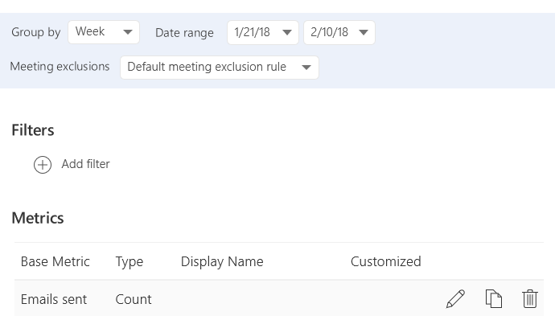

---
# Metadata Sample
# required metadata

title: Person queries in Workplace Analytics 
description: Describes how to use Person queries in Workplace Analytics to analyze the collaboration of individuals in your organization, from the point of view of each individual.     
author: madehmer
ms.author: rodonahu
ms.date: 7/16/2018
ms.topic: get-started-article
localization_priority: normal 
ms.prod: wpa
---
# Person queries

The person query analyzes data from the point of view of each individual in the organization.

This creates a lot of flexibility in analyzing data. For example, you can learn:

* How time use varies by different organizational attributes?
* How specific subgroups in the organization spend their time?
* How one aspect of collaboration influences other time-use habits?

The person query metrics fall within four broad categories. You can add standard metrics from each category to your query. Depending on the analysis, you can summarize a person’s collaboration metrics by day, week, or month.

Each query returns one row per person, per period.

The file will include any standard or customized metrics you specify.

 And your results will include any employee organizational data attributes that your Workplace Analytics admin has uploaded.

You can use organizational attributes to further summarize the person results and create powerful analyses that compare and contrast the collaboration of different groups in the organization.

## Create a person query

It’s simple to set up a person query.

* Select whether you want each person’s metrics summarized by day, week or month, and the period you’d like to analyze.
* Select a custom rule set to exclude meetings from the calculations, otherwise it'll use the default.

## Add filters

You can use filters to exclude certain rows from the output file based on the person’s organizational attributes, such as size or duration.

For example, the **Organization** filter can limit the query to those in the R&D and Engineering groups.

## Add metrics

You can add metrics to customize your person query data. The options vary based on the type of metric, but can include criteria related to meetings and email.

Meetings:

* When the event occurred
* How many people were involved
* Subject line keywords
* Attendee/organizer attributes

Email:

* When the email was sent
* How many people were included on the email
* Subject line keywords
* Recipient/sender attributes

For example, you can add a metric to get an email count for each person where at least one person from the Sales organization is included in email.

 

Under **Display name**, the custom name for this metric _Emails sent to Sales_ will become the column header in the output file.

To get more details on adding metric filters, see [Customize a metric](../Tutorials/customize-a-metric.md).