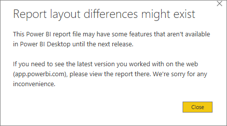
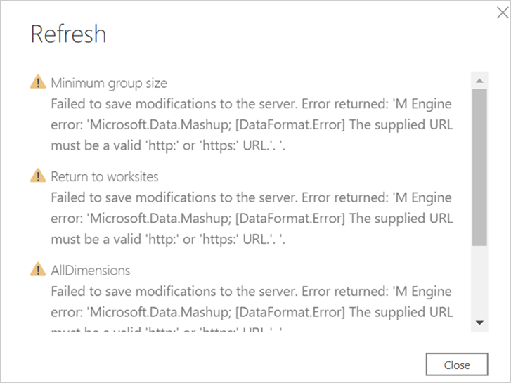

---

title: Power BI templates
description: Use a Power BI template to run a query, export its results, and visualize them in Power BI
author: madehmer
ms.author: v-mideh
ms.topic: article
localization_priority: normal 
ms.prod: wpa
---

# Power BI templates in Workplace Analytics

Workplace Analytics provides Power BI templates that analysts can use to visually analyze workplace patterns and trends. A Power BI template pre-populates a custom Workplace Analytics query and selects the applicable Power BI charts to show results from these queries.

Workplace Analytics Queries has a number of predefined query templates available. In the preselected filters and metrics section in Queries, you can identify the Power BI templates by the Power BI logo in the upper-right corner of the template:

   

Workplace Analytics includes the following dashboards that you can use in Power BI to visually analyze data. Select one of the following dashboards to see more details about it and how to set it up:

* [Business continuity](../tutorials/power-bi-bc.md)
* [Collaboration assessment](../tutorials/power-bi-collab-assess.md)
* [Collaboration overload](../tutorials/power-bi-collab-overload.md)
* [Collaboration tracker](../tutorials/power-bi-collab-track.md)
* [Influence insights](../tutorials/pbi-influence-db.md)
* [Manager impact](../tutorials/power-bi-manager-impact.md)
* [Quickstart overview](../tutorials/power-bi-quickstart.md)
* [Return to worksites](../tutorials/power-bi-return-tw.md)
* [Sales business continuity](../tutorials/pbi-bc-sales.md)
* [Teams insights](../tutorials/power-bi-teams.md)

## Power BI tips

A few tips to help you use these dashboards in Power BI:

* **Cross-filter and cross-highlight** - All visuals on a report page are interconnected. If you select a data point on one of the visuals, all the others on the page that contain that data will change, based on that selection.
* **Drill down into a visual that has a hierarchy** - When a visual has a hierarchy, you can drill down to reveal additional details. Some of the charts in the dashboards support this capability, such as the "By Organization and Level Designation" chart in the Business Continuity dashboard.
* **Export data as a table** – From the upper right corner of any visualization, select **More options** (**…**) and select **Export data**.

For more details about using Power BI, see [Interact with visuals in reports, dashboards, and apps](https://docs.microsoft.com/power-bi/consumer/end-user-visualizations).

## Share a dashboard

Like other products that work with sensitive data, such as HR systems, Workplace Analytics is not meant for the general workforce. Rather, its users are expected to have training regarding how to handle sensitive information. Training should be specific to your organization. See [Data-protection considerations](../privacy/data-protection-considerations.md) when using data generated by Workplace Analytics.

Anyone you share the Power BI *desktop file* with can access the underlying dataset at the same level of granularity as a Workplace Analytics Analyst. For this reason, consider the following alternatives that do not provide access to the underlying data:

* **Share as a PDF or other static file** - This option generates a report that's not interactive. See [Export reports from Power BI to PDF](https://docs.microsoft.com/power-bi/consumer/end-user-pdf).
* **Publish the report to Power BI Service and share insights in an app** - This option allows other users to navigate the dashboard without access to the underlying data. See [Distribute insights in an app](https://docs.microsoft.com/power-bi/service-how-to-collaborate-distribute-dashboards-reports#distribute-insights-in-an-app) for details.

## Frequently asked questions

##### Q1 Who can create the dashboard in Power BI?

You must be assigned the role of [Analyst](../use/user-roles.md) in Workplace Analytics to create the dashboard. You must also have a Power BI license and have the desktop version installed. See [Install and run Power BI Desktop](https://docs.microsoft.com/power-bi/desktop-getting-started#install-and-run-power-bi-desktop) for details.

##### Q2 How frequently is data refreshed in the dashboard?

The dashboard gets repopulated once a week after Workplace Analytics finishes its weekend processing. **Note**: You must manually adjust the **Selected time frame** setting in the dashboard's **Settings and scope** report to view the most recently processed data.

##### Q3 How do I share the dashboard with others in my organization?

You can share the dashboard with others in your organization *without sharing the underlying data* by publishing the insights in an app or as PDF or static file. See [Share a dashboard](#share-a-dashboard) for details.

##### Q4 Can I share the underlying dashboard dataset with others in my organization?

To maintain data privacy, only employees assigned the role of [Analyst](../use/user-roles.md) in Workplace Analytics should have access to the underlying dataset in the Power BI dashboard.

##### Q5 How do I know if I have the latest version of the template?

Starting with version 2 and later versions of a template, you can find the version number at the end of the title in the lower left of the dashboard’s Settings page.

##### Q6 How can I extend the dates of the query data used in the dashboard?

If you have been using a dashboard for a few months now, you are probably using query data for the last six months. You need to run new queries that include the last one year. For the Business continuity dashboard, see [Template update](../tutorials/power-bi-bc.md#template-update) for details.  

##### Q7 How do I set up and run a Workplace Analytics query?

See [Create a Person Query](./person-queries.md) for details.

##### Q8 How do I change the axis of a chart to use a different Organizational data attribute?

Only the required Organizational attributes are used when setting up the Power BI file. If you selected more Organizational attributes when setting up the queries, you can use those in the visuals. To use a different Organizational attribute:

1. Select the visualization you want to change.  
2. In the **Fields** pane, select and drag the Organizational attribute to the **Axis** section of the visualization.

##### Q9 How do I integrate additional metrics or data sources with this dashboard?

See [Connect to data in Power BI](https://docs.microsoft.com/power-bi/connect-data/) to learn more about how to connect data in Power BI. See [Prepare organizational data](../setup/prepare-organizational-data.md) to learn about what organizational data you can analyze in Workplace Analytics and see [Data sources](../use/data-sourcesv2.md) to see what data sources you can connect to and analyze from within Workplace Analytics.

##### Q10 How do I use Power BI?

See [Power BI documentation](https://docs.microsoft.com/power-bi/) for details on how to use Power BI.

##### Q11 What languages is the dashboard available in?

The dashboard is currently only available in English.

## Troubleshooting

##### Unable to open document

If you get the following error, you do not have the latest version of Power BI.

  

However, the template might work with the earlier version of Power BI that you're using. To test it:  

1. Close any warnings.
2. If you can view the **Settings** page, the dashboard will work with this version. If you cannot view **Settings**, you need to download the latest version of Power BI.

##### Report layout differences might exist

If you get the following error, you do not have the latest version of Power BI. However, the template might work with this earlier version. To test it, repeat the steps in the previous section.

  

##### OData request failed

The following error (or similar 500+ error) can occur for one of the following reasons.

  

* **If you were not prompted to sign in with your organizational account** while setting up the dashboard and Power BI fails to load the query data, follow these steps to clear existing permissions:

  1. In Power BI, open the **Transform data** menu, and select **Data source settings**.
  2. Select **Global permissions**, select `https://workplaceanalytics.office.com`, and then select **Clear permissions**.
  3. Select **Delete**.
  4. Close Power BI and follow the set up instructions for the applicable dashboard.

* **If you are signed in with the wrong organizational account**, you'll get an error when loading the data with the Power BI template. To fix it, follow these steps:

  1. In Power BI, open the **Transform data** menu, and select **Data source settings**.
  2. Select **Global permissions**, select `https://workplaceanalytics.office.com`, and then select **Edit permissions**.
  3. For **Credentials**, select **Edit**.
  4. In the **OData feed** dialog box, select **Organizational account**, and then select **Sign in** or **Sign in as a different user**.
  5. Select the account that you use to sign in to Workplace Analytics, enter the password, and then when prompted in **OData feed**, select **Save**.
  6. In **Edit Permissions**, select **OK**, and then close the **Data source settings** window.
  7. Close Power BI and follow the set up instructions in **Set up the dashboard** for the applicable dashboard.

##### The Power BI visuals fail to load or show errors in the tables

Power BI cannot complete a data join if data values are missing in the Organization or Level Designation tables. To validate this error:

1. In the **Fields** pane in Power BI, look for an **error** (!) icon in either the **Organization** or **LevelDesignation** tables. If you see an error about blank values similar to the following, select the field with the error to view it.

   **Blank-value error** - Column in table contains blank values and this is not allowed for columns on the one side of a many-to-one relationship or for columns that are used as the primary key of a table.

2. To remediate this error, select **Transform Data** > **Transform Data** to open the Power Query Editor.
3. Select the applicable query.
4. In the data preview table, locate the column for Organization and/or LevelDesignation, expand the column header, select **Remove Empty**, and then select **OK**.
5. Select the **Hourly collaboration** query and repeat Steps 3-4 to filter out empty values.
6. Select **Close & Apply** to apply the changes and return to the dashboard.

##### Failed to save modifications error in Power BI

The following error occurs because of a preview features setting in Power BI. To change the setting for the dashboard, go to **File** > **Options and Settings** > **Options** > **Preview features**. Clear the checkbox for preview features, and then save and restart the template.

  

##### OData error that the given URL neither points to an OData service or a feed in Power BI

When you publish this dashboard to workspaces, they get split into two parts, reports and datasets (data sources). This error occurs when your permission authentication token expires in Power BI. Do the following to reset permissions for the Power BI service.

1. Open your [Power BI service](https://docs.microsoft.com/power-bi/consumer/end-user-experience#open-the-power-bi-service)(app.powerbi.com).
2. From **Home**, select the **ellipsis** (**...**) on the ribbon to view the menu, and then select **Settings** > **Settings**.

  

3. Select **Datasets**, and then for the dashboard you're getting the error for, select the **ellipsis** (**...**) > **Settings**.
4. In **Data source credentials**, select **Edit credentials** for Workplace Analytics.
5. Select the account that you use to sign in to Workplace Analytics, enter the password, and then when prompted, select **Save**.

Do the following to reset your global permissions for the OData feed.

1. In Power BI, open the **Transform data** menu, and select **Data source settings**.
2. Select **Global permissions**, select `https://workplaceanalytics.office.com`, and then select **Edit permissions**.
3. For **Credentials**, select **Edit**.
4. In the **OData feed** dialog box, select **Organizational account**, and then select **Sign in** or **Sign in as a different user**.
5. Select the account that you use to sign in to Workplace Analytics, enter the password, and then when prompted in **OData feed**, select **Save**.
6. In **Edit Permissions**, select **OK**, and then close the **Data source settings** window.

## Support

* **Dashboard support** - Contact the Workplace Analytics team member that referred you to this page for support about onboarding, usage, and interpretation of the data contained within the dashboard.
* **Workplace Analytics support** - Refer to [Workplace Analytics documentation](../index.md) or [Workplace Analytics Support](../overview/getting-support.md) for additional help.
* **Support with other Microsoft products and tools** - Support for Power BI and other tools used in the context of this dashboard can be found through each product's associated support channels.

## Related topic

[View, download, and export query results](../use/view-download-and-export-query-results.md)
