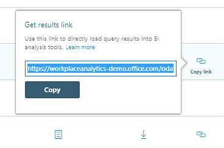
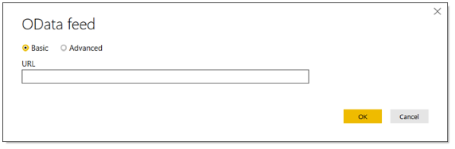

---
# Metadata Sample
# required metadata

title: Use the auto-refresh option for queries in Workplace Analytics 
description: Describes the auto-refresh option for queries in Workplace Analytics.     
author: paul9955
ms.author: v-midehm
ms.date: 02/21/2019
ms.topic: article
localization_priority: normal 
ms.prod: wpa
---

# Auto-refresh option for queries

## One-time queries show you a snapshot

As an analyst, you can run different kinds of queries in Workplace Analytics, including person, meeting, group-to-group, and person-to-group queries to get a snapshot of workplace behavior.

You can run a query as a one-time event where you set it up, run it one time, and get the results. To visualize workplace patterns uncovered by this query, you can load the results into a data analysis tool, such as Power BI or Excel.

## Auto-refresh shows you trends over time

Query results, especially when viewed in a data analysis tool, can uncover dynamic patterns. These patterns evolve over time because the workplace behavior of employees evolves over time. To isolate one instance of evolving workplace behavior over time, you can use the applicable query multiple times, on a regular schedule. To do this, you can use the auto-refresh feature for Workplace Analytics queries.

## Create a query with the auto-refresh option
[!INCLUDE [To create an auto-refresh query](../Includes/to-create-auto-refresh-query.md)]

### Behavior of auto-refresh for queries

* When you create the query, you run it for the first time. As it runs, it uses data from the exact date range that you defined.
* The query automatically runs again, once every week. Each run coincides with the date on which Workplace Analytics refreshes mail and calendar data from Microsoft Exchange.
* Each time the query runs automatically, its date range advances by one week. That is, its start date becomes one week later and its end date also becomes one week later.  
* Workplace Analytics will auto-refresh the query of the weekly schedule for one year.

### Get query results with the auto-refresh option

On the **Analyze** > **Queries** > **Results** page, find your query in the results table, which includes the following:

* The results (a .csv file) of the _latest_ weekly run. You can select **Download** to download an archived file of these results.
* The date on which the query last ran.
* An icon that indicates it as a query with the auto-refresh option.

## Auto-refresh query results in Power BI

On the **Results** page, you can copy a link to the query results and then use it in Power BI.

1. To the right of the query's row, select **Copy link**:

   

2. Select **Copy**. The Get results link dialog box displays the word "Copied."
3. In Power BI, on the Home tab, select **Get Data**, and then select **OData feed**.
4. In the **OData feed** dialog box, paste the link that you copied into the URL field:

   

5. Select **OK**.
6. Enter your client credentials, and then select **Connect**.

After you do this, Power BI maintains a connection to this query in Workplace Analytics. In the future, to visualize the query's current results, open the Workplace Analytics project in Power BI and select **Refresh**.

### Related topics

[View, download, and export query results](../use/view-download-and-export-query-results.md)