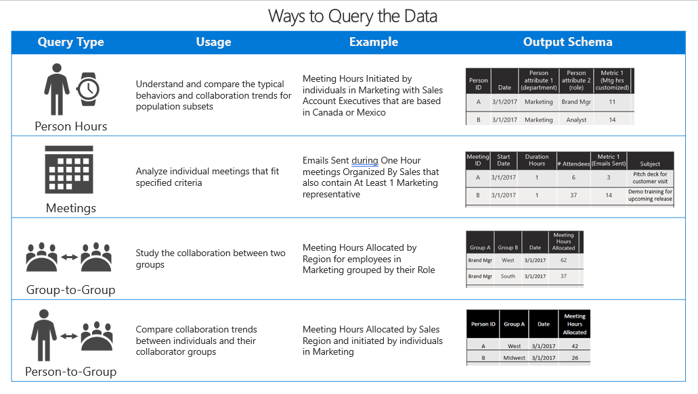
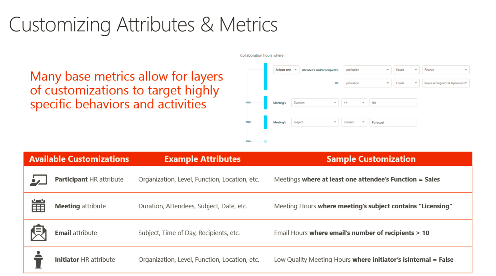

---
# Metadata Sample
# required metadata

title: Workplace Analytics query overview
description: Workplace Analytics offers a number of flexible queries for custom data analysis
author: paul9955
ms.author: v-midehm
ms.topic: article
localization_priority: normal 
ms.prod: wpa
---

# Queries overview

Workplace Analytics has a few different query options, including: **Person**, **Meeting**, **Group-to-group**, **Person-to-group**, and **Peer Comparison**. Each query type can help answer specific questions that you want to investigate. The different query types give you flexibility to look at data from multiple perspectives and generate powerful insights. You can also use the query types together to gain even more in-depth insights.

With these queries, you can:

* Select as many or as few metrics as you need, for any population or time range.
* Customize metrics with a broad range of interaction details.
* Get your data in a clean and easy-to-use format that can take your analysis to the next level.

### Time limit for querying data 

<!-- ORIGINAL: The historical data on which queries are run is time limited: You can run queries only on data that is no older than 27 months. This 27-month period is a rolling window. This means that—after you have 27 months of data—with each month that passes, the limit of data that you can query (which lies 27 months in the past) advances by one month. -->

The historical data on which queries are run is time limited: You can run queries only on data that is no older than 27 months. This 27-month period is a _rolling window_. This means that&mdash; after you have 27 months of data&mdash;as [Office 365 data](../use/data-sources.md#office-365-data-summary) is refreshed each week, the 27-month extent of data that you can query advances by one week to include the preceding 27 months.

The results of any queries that you've already run remain available to you, even after the data that was queried to produce those results passes the 27-month limit.

## Person query

Use a person query when you want to find broad trends in the organization by looking at aggregated metrics for a group of people.

Person query results show a de-identified list of the productivity metrics (such as time in meetings and email) of each measured employee. Each row of data represents one person and you can select to aggregate the results by day, week, or month.

With a person query you can compare across individual activities and attributes, such as:

* Time-use metrics
* Organizational attributes

See [Person queries](../Tutorials/person-queries.md) to learn more.

## Meeting query  

Use a meeting query when you want to understand the relationship between different meeting attributes.

With a meeting query you can compare across meeting attributes, such as:

* Size or duration
* Subject line keywords
* Double-booked or multitasking rates
* Meeting organizer attributes

See [Meeting queries](../Tutorials/meeting-queries.md) to learn more.

## Group-to-group query

Use a group-to-group query when you want to understand how one team invested their collaboration time with other teams within and outside of the organization.

For this query type, you can define a team in a variety of ways, with any organizational attribute or email domain. This enables you to answer questions such as:

* How did _Sales managers_ allocate their time between all external _customer domains_ (companies)?
* How much time did _Benefits analysts_ spend with _individual contributors_ in each _region_?
* How did _Corporate VPs_ allocate their time to _managers_ by _business unit_?

Group-to-group queries also offer alternative perspectives on collaboration. Rather than allocating collaboration hours across other teams, you can analyze the number of interactions between the teams, or analyze only those collaboration activities initiated by the “time giver” team.

See [Group-to-group queries](../Tutorials/group-to-group-queries.md) to learn more.

## Person-to-group query

Use a person-to-group query to help you understand how individuals invested their time with one or more collaborator teams within and outside of the organization.

As with a group-to-group query, you can define the person (or time investor) and that person's collaborator team or teams in a variety of ways, with any organizational attribute or email domain.

You can choose to analyze the number of interactions between a time investor and the defined collaboration team, or to analyze only those collaboration activities initiated by the specified time investor.

See [Person-to-group queries](../Tutorials/person-to-group-queries.md) to learn more. 

## Peer Comparison query

The peer comparison query helps you identify people whose collaboration patterns differ as compared to their peers. The output of this query lists the measured employees and their specified metrics, along with their peer group's average of those metrics. You can compare individuals with others who share the same manager, with their direct reports, or even with a custom peer group that is defined by organizational attributes you have uploaded.

See [Peer Comparison queries](../Tutorials/comparison-query.md) to learn more.

## Meeting exclusions

You can use Meeting exclusions to exclude meetings that fall outside relevant norms from the queries. You can select between the default meeting exclusion rules or create custom rules that match your company's meeting conventions.

See [Meeting exclusions](../Tutorials/meeting-exclusions-intro.md) to learn more.

## Business scenario

An analyst might start by looking at a person query to see trends of employees across the company related to meeting collaboration.

If the metrics show indications of poor meeting behavior, such as too many long meetings, the analyst could create a meeting query to investigate specific meetings in depth to uncover causes of the poor meeting behavior.

Additionally, the analyst could create a group query to identify the groups involved in those meetings and further investigate potential causes that could be addressed. Finally,  to address the problem, the analyst could work with a program manager to set up a change program. See [Teamwork solution](../Tutorials/solutionsv2-intro.md) to learn more.

There are three ways to create queries:

* Use and edit a [predefined query template](#predefined-query-templates)
* Create your own custom query
* Open and edit a previously run query

When you create or edit a query, you can select the metrics that you want to include (many can be customized), and you can use filters to narrow the results and focus in on specific data.

## Predefined query templates

Workplace Analytics includes a number of predefined query templates to help you get started with queries, including the following:

* **Quickstart overview** is a Power BI template that gives a high-level view of key organizational metrics.
* **Collaboration overload** is a Power BI template that identifies collaboration patterns.
* **Manager impact** is a Power BI template that analyzes manager trends.
* **Build focus hours** finds groups that have the lowest amount of focus time.
* **Meetings attendees query** analyzes meeting hours by the number of attendees.
* **Meetings day query** analyzes meeting hours by day of the week.
* **Meetings duration query** analyzes meeting hours by duration.
* **Meetings start time query** analyzes meeting hours by time of day.
* **Protect after hours** finds groups that collaborate the most outside of work hours.
* **Reduce meeting hours** finds groups that are overwhelmed by meetings.
* **Standard query** provides all base metrics available for a person query.

## Related topics

[Power BI templates](../Tutorials/Power-bi-templates.md)

[Workplace Analytics glossary](../Use/Glossary.md)

[Metric descriptions](../Use/Metric-definitions.md)