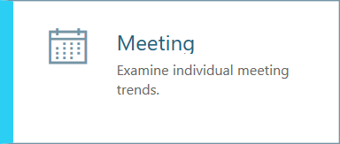
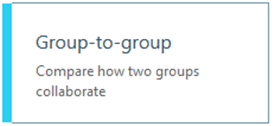

---
# Metadata Sample
# required metadata

title: Workplace Analytics privacy and data access
description: This article discusses the privacy and data access controls available in Workplace Analytics.  
author: madehmer
ms.author: rodonahu
ms.date: 06/13/2018
ms.topic: get-started-article
localization_priority: normal 
ms.prod: wpa
---
# Workplace Analytics query basics

Microsoft Workplace Analytics queries offer a powerful suite of tools to help you access the underlying collaboration data for your organization.

With these tools, you can:

* Select as many or as few metrics as you need, for any population or time range.
* Customize metrics with a broad range of interaction details.
* Get your data in a clean and easy-to-use format that can take your analysis to the next level.

 

## Person query

Use a person query when you want to understand the relationship between a person’s organizational attributes – like their team, level, or location – and how they use their time, or when you want to know how one aspect of a person’s time use might influence another aspect of their time use.

With a person query you can compare across individual activities and attributes such as:

* Time use metrics
* Organizational attributes

## Meeting query  

Use a meeting query when you want to understand the relationship between different meeting attributes.

With a meeting query you can compare across meeting attributes, such as:

* Size or duration
* Subject line keywords
* Double-booked or multitasking rates
* Meeting organizer attributes

## Group-to-group query

<!--

-->

Use a group-to-group query when you want to understand how one team invested their collaboration time across other teams within and outside of the organization.

In this type of query, you can define team in a variety of ways, using any organizational attribute or email domain. This allows you to answer questions such as:

* How did _Sales managers_ allocate their time between all external _customer domains_ (companies)? 
* How much time did _Benefits Analysts_ spend with _individual contributors_ in each _region_?
* How did _Corporate VPs_ allocate their time to _managers_ by _business unit_?

Group-to-group queries also offer alternative perspectives on collaboration. Rather than allocating collaboration hours across other teams, you can analyze the number of interactions between the teams, or analyze only those collaboration activities initiated by the “time giver” team.

## Person-to-group query

Use a person-to-group query to help you understand how individuals invested their time with one or more collaborator teams within and outside of the organization.

Similar to a group-to-group query, you can define the person (or time investor) and that person's collaborator team or teams in a variety of ways, using any organizational attribute or email domain.

You can choose to analyze the number of interactions between a time investor and the defined collaboration team, or analyze only those collaboration activities initiated by the specified time investor.

### Related topics

[Person queries](../Tutorials/Person-queries.md)

[Meeting queries](../Tutorials/meeting-queries.md)

[Group-to-group queries](../Tutorials/group-to-group-queries.md)

[Person-to-group queries](../Tutorials/person-to-group-queries.md)

[Workplace Analytics glossary](../Use/Glossary.md)

[Metric descriptions](../Use/Metric-definitions.md)
