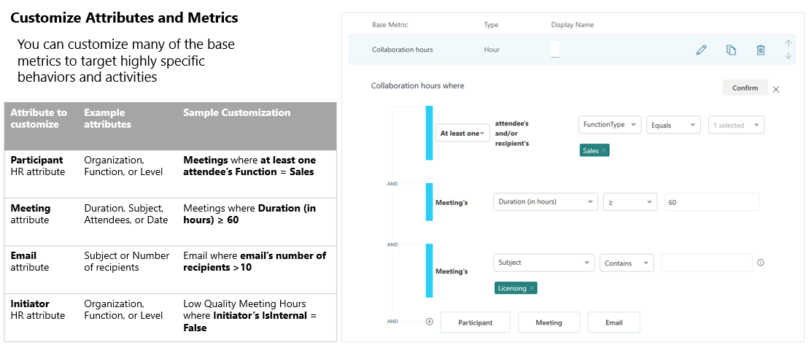

---

title: Workplace Analytics query overview
description: Workplace Analytics offers a number of flexible queries for custom data analysis
author: paul9955
ms.author: v-mideh
ms.topic: article
localization_priority: normal 
ms.prod: wpa
manager: scott.ruble
audience: Admin
---

# Queries overview

Workplace Analytics has a few different query options, including: **Person**, **Meeting**, **Group-to-group**, **Person-to-group**, **Peer comparison**, and **Network queries**. Each query type can help answer specific questions that you want to investigate. The different query types give you flexibility to look at data from multiple perspectives and generate powerful insights. You can also use the query types together to gain even more in-depth insights.

With these queries, you can:

* Select as many or as few metrics as you need, for any population or time range.
* Customize metrics with a broad range of interaction details.
* Get your data in a clean and easy-to-use format that can take your analysis to the next level.

## Time limit for querying data 

The historical data on which queries are run is time limited: You can run queries only on data that is no older than 27 months. This 27-month period is a _rolling window_. This means that&mdash; after you have 27 months of data&mdash;as [Microsoft 365 data](../use/office-365-data.md) is refreshed each week, the 27-month extent of data that you can query advances by one week to include the preceding 27 months.

The results of any queries that you've already run remain available to you, even after the data that was queried to produce those results passes the 27-month limit.

## Billing model differences

Tenants subscribe to Workplace Analytics through one of the following billing models:

* **Per-user-per-month (PUPM) model** &ndash; The tenant pays Microsoft a monthly fee that is based on the number of licensed users.
* **Consumption model** &ndash; The tenant pays Microsoft a fee that is based on the volume of query usage.

Your tenant's choice of billing model affects the appearance and behavior of the pages for creating queries (such as [person queries](person-queries.md) and [meeting queries](meeting-queries.md)) and the [query results](../use/view-download-and-export-query-results.md) page. Analysts will see the following differences:

### For analysts in PUPM-model tenants

The query-creation pages show analysts no information about query usage or tenant billing. This is because, in the PUPM model, the design and use of queries has no effect on the amount that your organization is billed. Billing charges accrue behind the scenes, independently of query usage:

### For analysts in consumption-model tenants

In this model, there is no minimum monthly licensing cost for your organization; rather, all fees are based on the running of queries. Each query that you run consumes a number of "units," based on the following factors: the number of measured employees being analyzed, the number of weeks of data included in the query output for each measured employee, the number of base metrics in the query, and which base metrics are used. (Metrics are arranged into "price tiers"; metrics in higher price tiers consume more units than metrics in lower price tiers. For more information, see [Consumption model details](#consumption-model-details).)

As you design a query, Workplace Analytics uses these factors to calculate the cost of the query. Within the query editor, you can see the estimated number of units that the query &ndash; in its current state &ndash; would consume. This number is updated as you edit the query:

In the bar above the estimated query cost, you can see how many units remain in your tenant's account. Analysts can continue to run queries as long as this balance remains above zero units.

#### Consumption model details

In a consumption-model tenant, queries consume "units" as they are run. Unit calculation is as follows:

**units consumed in a query** = **number of user-weeks analyzed** x **number of base metrics** x **price tier/1000**, where:

**user-weeks analyzed** is defined as the number of historical weeks of analysis multiplied by the population that you are analyzing. The population size is the number of employees, as indicated by the _Filter group_ output in the query definition. Your choice of a time period by which to aggregate metrics (by week or by month) does not affect your charges for the query.

**number of base metrics** is defined as the number of unique Workplace Analytics metrics that are included in the query. If the query includes multiple customizations of one base metric, it counts as only a single use of that base metric.

<u>Example:</u> If a query measures Meeting hours between 8:00 and 9:00 AM and Meeting hours between 9:00 and 10:00 AM, this counts as only a single metric, Meeting hours.

**price tier** is the rate at which a query consumes units. The higher the tier, the more units are consumed:

| Tier | Metric used in the query | Units |
| ---- | ------------ | -------------- |
| 1    | Most Workplace Analytics metrics &ndash; for example, collaboration hours, internal network size, low quality meeting hours, and 65 other basic metrics | 1.25 |
| 2    | Advanced Workplace Analytics metrics &ndash; There is only one in this category: the _Influence_ metric. | 2.25 |
| 3    | Workplace Analytics metrics with [CRM data](crm-queries.md) &ndash; namely, external-facing metrics that calculate across CRM contacts | 6.00 |

<!-- Note that the price is calculated per 1000 user-weeks. -->

Workplace Analytics uses this formula to calculate units consumed every time that you run a query except for recurring ([auto-refresh](query-auto-refresh.md) queries. The first time a recurring query runs, the formula uses the actual number of user-weeks that the query definition specifies. In subsequent runs of the query, the formula automatically uses one week as the query duration. You are not charged for any historical data that has already been analyzed.

No additional units are charged for the following:

* Workplace Analytics licenses that are assigned. You are charged for query volume, which is independent of licensing.  
* Your use of the following Workplace Analytics features: [plans](solutionsv2-intro.md), [My Team in Viva Insights](../use/viva-insights-my-team.md), [My organization in Viva Insights](../use/viva-insights-my-org.md), [Opportunities scan](use/solutions-scan.md), [Explore pages](../use/explore-intro.md).
* Your choice of a query-results visualization method, such as Excel, PowerPoint, Power BI, or another visualization tool.
* Your use of organizational attributes in queries.
* The number of analysts who run queries in your organization.

#### Results page

The **Queries** > **Results** page shows additional information if the consumption model is in use at your tenant:

* **PUPM-model tenants** &ndash; Analysts in a PUPM-model tenant can use the **Queries** > **Results** page as described in [View, download, and export query results](../use/view-download-and-export-query-results.md).

* **Consumption-model tenants** &ndash; For analysts in a consumption-model tenant, the **Results** page shows additional information. On this page, the **Query Cost** column shows the number of units charged to each query. Select the  (more information) option to see the details of this charge, namely the number of users analyzed, the number of base metrics used, the price tier of each metric, and the analysis period:

## Query types

You can find these queries on the **Analyze** > **Queries** page of Workplace Analytics.

### Person query

Use a person query when you want to find broad trends in the organization by looking at aggregated metrics for a group of people.

Person query results show a de-identified list of the productivity metrics (such as time in meetings and email) of each measured employee. Each row of data represents one person and you can select to aggregate the results by day, week, or month.

With a person query you can compare across individual activities and attributes, such as:

* Time-use metrics
* Organizational attributes

See [Person queries](../Tutorials/person-queries.md) to learn more.

### Meeting query  

Use a meeting query when you want to understand the relationship between different meeting attributes.

With a meeting query you can compare across meeting attributes, such as:

* Size or duration
* Subject line keywords
* Double-booked or multitasking rates
* Meeting organizer attributes

See [Meeting queries](../Tutorials/meeting-queries.md) to learn more.

### Group-to-group query

Use a group-to-group query when you want to understand how one team invested their collaboration time with other teams within and outside of the organization.

For this query type, you can define a team in a variety of ways, with any organizational attribute or email domain. This enables you to answer questions such as:

* How did _Sales managers_ allocate their time between all external _customer domains_ (companies)?
* How much time did _Benefits analysts_ spend with _individual contributors_ in each _region_?
* How did _Corporate VPs_ allocate their time to _managers_ by _business unit_?

Group-to-group queries also offer alternative perspectives on collaboration. Rather than allocating collaboration hours across other teams, you can analyze the number of interactions between the teams, or analyze only those collaboration activities initiated by the “time giver” team.

See [Group-to-group queries](../Tutorials/group-to-group-queries.md) to learn more.

### Person-to-group query

Use a person-to-group query to help you understand how individuals invested their time with one or more collaborator teams within and outside of the organization.

As with a group-to-group query, you can define the person (or time investor) and that person's collaborator team or teams in a variety of ways, with any organizational attribute or email domain.

You can choose to analyze the number of interactions between a time investor and the defined collaboration team, or to analyze only those collaboration activities initiated by the specified time investor.

See [Person-to-group queries](../Tutorials/person-to-group-queries.md) to learn more.

### Peer comparison query

The peer comparison query helps you identify people whose collaboration patterns differ as compared to their peers. The query includes the measured employees, their specified metrics, and their peer group's averages for those metrics.

You can compare individuals with others who share the same manager, with their direct reports, or even with a custom peer group as defined with organizational attributes.

See [Peer comparison queries](../Tutorials/comparison-query.md) to learn more.

### Network queries

You can use the Organizational network analysis (ONA) queries in Workplace Analytics to find out who are the best-connected people in your company, division, or group based on collaboration data. After you learn who your influencers are, you can act on the likelihood that these people can effectively connect within or across groups and become efficient drivers of change.

See [ONA person queries](ona-person-query.md) and [ONA person-to-person queries](ona-person-to-person-query.md) for more details.

## Meeting exclusions

You can use meeting exclusions to exclude meetings that fall outside relevant norms from the queries. You can select between the default meeting exclusion rules or create custom rules that match your company's meeting conventions.

See [Meeting exclusions](../Tutorials/meeting-exclusions-intro.md) to learn more.

## Business scenario

An analyst might start by looking at a person query to see trends of employees across the company related to meeting collaboration.

If the metrics show indications of poor meeting behavior, such as too many long meetings, the analyst could create a meeting query to investigate specific meetings in depth to uncover causes of the poor meeting behavior.

Additionally, the analyst could create a group query to identify the groups involved in those meetings and further investigate potential causes that could be addressed. Finally, to address the problem, the analyst could work with a program to set up an improvement plan. See [Plans: walkthrough](../Tutorials/solutionsv2-intro.md) to learn more.

You can create queries in the following ways:

* Edit and use a [predefined query template](#predefined-query-templates).
* Create your own custom query.
* Open and edit a previously run query.

When you create a new query or edit an existing query, you can select the metrics to include and customize. You can also use filters to narrow the results and focus in on specific data.

## Predefined query templates

Workplace Analytics includes the following predefined query templates to help you get started with queries. In addition to these, a number of Power BI templates are also available. For details, see [Power BI templates](power-bi-intro.md).

* **Domain collaboration** analyzes collaboration patterns with external domains.
* **Standard meeting query** analyzes meetings by using the available base meeting query metrics.
* **Standard person query** analyzes collaboration patterns by using the available base person query metrics.
* **Hourly collaboration** analyzes meeting, email, instant-message, and call activity by hour of the day.

## Videos

The videos in this section were used in a bootcamp for training analysts in how to run queries in Workplace Analytics.

### A week in the life  

The _A week in the life_ video demonstrates how to work with a [person query](person-queries.md).

<iframe src="https://player.vimeo.com/video/434889941" width="580" height="512" frameborder="0" allow="autoplay; fullscreen" allowfullscreen></iframe>

### Expensive meetings

The _Expensive meetings_ video demonstrates how to work with a [meeting query](meeting-queries.md). 

<iframe src="https://player.vimeo.com/video/434889528" width="580" height="512" frameborder="0" allow="autoplay; fullscreen" allowfullscreen></iframe>

## Related topics

* [Power BI templates](../Tutorials/Power-bi-templates.md)
* [Workplace Analytics glossary](../Use/Glossary.md)
* [Metric descriptions](../Use/Metric-definitions.md)