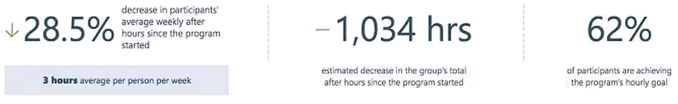

---
# Metadata Sample
# required metadata

title: Workplace Analytics Teamwork solution concepts
description: Concepts and definitions to help you better work with the Teamwork solution feature of Workplace Analytics. 
author: paul9955
ms.author: v-midehm
ms.date: 02/21/2019
ms.topic: conceptual
localization_priority: normal 
ms.prod: wpa
---

# Teamwork solution: Concepts

This section describes concepts whose understanding could help you complete tasks related to creating and monitoring programs by using the Teamwork solution feature. Those tasks are described in the step-by-step walkthrough for creating a program, [Solution: Walkthrough](solutionsv2-task.md).

## Use a .csv file

You can get a valid .csv file by creating the file (in a text editor or in Microsoft Excel) or by exporting it from an HR tool or service. This .csv file must contain the email addresses of people in your organization. After you obtain and upload the .csv file, the system uses either the email addresses or the PersonIDs to finalize the list of participants in the program that you will create. 

### CSV file privacy considerations  

#### Separation from org data

After you create and upload a .csv file for use in a program, the information in that .csv file is not added to the organizational data that Workplace Analytics stores. The .csv-file data is available only in the Solutions area of Workplace Analytics, and only for creating programs.

<!--However, you can choose to append the data in this .csv file to your existing organizational data. To do this, upload the file in a separate step (through the Settings page of Workplace Analytics). This makes its data available in other areas of Workplace Analytics, such as in the Explore dashboards and in flexible queries.--> 

#### Minimum group size

You can change the minimum group size to a level that you consider more relevant for your organization, but you cannot set the group size to lower than five.

In the **Group Details** area of the **Upload group** page, you can check the number of members shown for the uploaded group. (Workplace Analytics obtains this number from the number of rows in the uploaded .csv file.) If this number is less than the minimum group size that was set by the tenant, you cannot submit this group for processing and use.

> [!Note] 
> After you submit a group that was manually uploaded, if too many email addresses are invalid and the group drops below minimum group size, you can either delete the group or upload a new file, but you cannot create a program with a group that is smaller than the minimum group size. 

(Program managers) Return to [Upload a file to create a group](solutionsv2-task.md#upload-a-file-to-create-a-group).

(Analysts) Return to [Identify a group](solutionsv2-task.md#identify-a-group).

## Set a value for Max or Min goal

In the **Group Details** section of the **Upload group** panel, you set a Max or Min goal based on what the goal is. For example, you'd set a **Min goal** for **Focus hours** and a **Max goal** for **Meeting hours**. You express this goal as a numeric value for hours or as a percentage. Both goal types are relative to your group's initial benchmark value.

### Time-based goal

Set the number of hours by which the participants should increase or decrease the metric you chose for their program. For example, if the program aims to reduce meeting hours, set a goal to reduce meeting time to 10 hours per week from the initial benchmark value of 15 hours per week.

### Percentage-based goal

Set a percentage by which the participants should increase or decrease the metric you chose for their program. For example, if your program aims to reduce meeting hours, you can set a goal to reduce meeting time by 50% from the initial benchmark value of 15 hours per week.

### Initial setting

In the **Group Details** section of the **Upload group** panel, you can set a value for Max goal. This is not your final opportunity to set this goal. After you submit this group, Workplace Analytics calculates for the group a benchmark value that pertains to the program type. After you see the benchmark value, you can re-adjust the goal.

### Threshold

Over the course of a program, participants receive messages from Workplace Analytics about their progress. Participants who have success in meeting the goal you set receive a message such as 'Keep up the good work!' Those who have not yet met the goal receive a message that encourages them to work towards that goal. 

The dividing line between these two groups of people is the threshold. You can set a threshold in the Group Details area only if the goal you chose was percentage based. The threshold value is relative to the benchmark. 

**Example:** You want to reduce meeting hours from 15 hours to 10 hours, but you express this in the **Goal Details** area as reducing meeting hours by 50% from the initial benchmark of 15 hours. After you set the threshold to 10 hours, participants who have reduced their weekly meeting time to 10 hours receive a congratulatory email. Those whose meeting time remains above 10 hours receive email in a more compelling tone. 

Return to [Submit a group](solutionsv2-task.md#submit-a-group). 

## The Solutions > Manage page

Groups and programs are shown on the **Solutions** > **Manage** page of Workplace Analytics. You can track groups and programs in the following columns on this page. 

 * **Unassigned groups:** The cards in this column represent groups of people for whom program details have not yet been defined. These groups have a program type assigned to them that cannot be changed. The employees who constitute an unassigned group are the ones you selected on the **Solutions** > **Identify** page, or have manually uploaded. After you submitted your requirements for this group, Workplace Analytics calculated the exact group and its benchmark based on the last twelve weeks. 

   > [!Note] 
   > Workplace Analytics also determines who met the HR attribute requirements over these last twelve weeks. This means that it's possible that the group size you submitted on the **Identify** page has diminished by the time you reach this page. People will be excluded from the group if they no longer fit the filter criteria used to initially create the group. For more information, see [Group size and benchmark might differ](#group-size-and-benchmark-might-differ).

   You can delete groups from the unassigned-groups list.

   Groups whose card contains a 'CSV' logo were uploaded as .csv files and were not selected through analysis on the **Identify** page. 

* **Scheduled programs:** Programs listed in this column have been set up, but the start date for the program has not passed yet. In other words, the program has not yet started. If you are a program manager, you can edit a scheduled program until the night before the welcome email is sent out. (You cannot change the group, the program type, and the metric, but you can change all other aspects, including the goal, the habits, and the messaging.) 

   If you decide it's not the right time to start the program, you can also revert the scheduled program back to the status of "unassigned group."

* **Active programs:** After the program start date passes, the program becomes active. It remains active for twelve weeks. 

* **Completed programs:** A program ends automatically at the end of its twelfth week. You can also end a program early. You can review the results of all completed programs. You can end a program early either because its participants have reached and held their goals, or because it is not working, in which case you might want to reassess the program and restart it with different settings.

> [!Note] 
> Analysts have read-only access to the **Solutions** > **Manage** page. Program managers have read and write access to this page. For more information, see [Workflow phases, pages, and roles](solutionsv2-task.md#workflow-phases-pages-and-roles). 

Return to [Track programs](solutionsv2-task.md#track-programs) or [Next steps: processing tasks](solutionsv2-task.md#next-steps-processing-tasks).

## Available and selected employees

On the **Solutions** > **Identify** > **Collaboration Overload** page, groups of employees are shown below the chart:

   

* **Measured employees:** The total number of employees in the organization who are available for analysis.
* **In filter group:** The number of measured employees who remain available for analysis after you applied filters.
* **Selected group:** The number of employees in the group or groups that you selected in the chart.

Return to [Identify a group](solutionsv2-task.md#identify-a-group).

## Persistence of group selections

After you select groups, you can change other settings on this page. Not all of the settings that you can change retain the group selections that you've made: 

### Group selections are retained when

* You change the chart-view question. You can change the data that is shown by selecting different questions under Select a question to change the view of your chart. As you do this, the group or groups that you've selected remains the same, even though the data shown about the group is shown from different perspectives.

### Group selections are lost when

* You change the chart view. If you change the selections in the **Chart** (such as **Group by**) and then select **Apply**, your group selections are lost.
* You change the area of focus. If you change the area of focus, your group selections are lost.

To select groups again after you have changed the chart or area of focus, select **groups** in the chart.  

Return to [Identify a group](solutionsv2-task.md#identify-a-group).

## Progress report

The banner on the **Progress report** page shows the program type, the number of participants, and the program status. A chart shows what week the program is in and the program's progress, week by week, since it started. This progress is expressed in relevant terms for the program's goals; for example, if the goal is to decrease hours, it shows the number of hours decreased (or increased) since the program started. 

   

These highlighted numbers show the average value per person per week since the program started, as compared with the program benchmark. The benchmark, in turn, refers to the average value per person per week for the twelve weeks that immediately preceded the start of the program.

In this example, you can see a nearly 30% decrease in after-hours work since the program started. This means that, on average, a participant in this program is currently spending 28.5% less time emailing and in meetings after their set work hours. The goal for this program was to reduce after-hours work to two hours, average, per person, per week. As you can see, good progress has been made but that goal is still one hour away.

The middle number shows the aggregate (not weekly) number of after-hours time that was saved since the start of the program, for all participating employees. This number gives a hint of your ROI for implementing the program.  
The third number shows what proportion of participants are achieving the program goal. It compares the average value per person since the program started with the program goal. 

Return to [Track programs](solutionsv2-task.md#track-programs).

## Manually upload a .csv file

After you create and upload a .csv file to create a group, all email addresses that were successfully uploaded now constitute the group. After the upload successfully completes, the group can be processed. During processing, Workplace Analytics matches email address to PersonIDs, which lets it examine data for these people for the metrics that you chose. Now, Workplace Analytics can calculate metrics and a benchmark for the group. It also gives an estimate of the number of people in the group, based on the number of rows in the file. This estimate will change if some of the people turn out to lack valid Workplace Analytics licenses. 

### Privacy note

After you create and upload a file to create a group, Workplace Analytics matches the email addresses in the file to PersonIDs. From this point on, Workplace Analytics uses the PersonIDs and no longer shows email addresses in any of its outputs, for example, in the results of flexible queries. The email addresses are never again made visible to analysts or program managers. As for admins, they maintain access to the HR data, which includes email addresses, but they cannot match email addresses to PersonIDs. The person who uploads email addresses never sees the associated PersonIDs.

Return to [Next steps: processing tasks](solutionsv2-task.md#next-steps-processing-tasks).

## Use Workplace Analytics to identify a group

If you use the **Identify** page to select a group, please be aware of the following:

### Group size and benchmark might differ

When you analyze behavior on the Workplace Analytics **Identify** page, you can view up to one years' worth of data. Then, after you submit the group, Workplace Analytics calculates the benchmark for your area of focus. It does this by averaging 12 weeks of data, which is the 12 weeks that immediately precede the start date of your program. Consequently, the group size and benchmark numbers might differ from your expectations, as follows:

#### The group size might change

If you examined a period longer than twelve weeks -- the past six months, for example -- some people who fit the filter criteria during the six months might not fit the same criteria during the 12 weeks that Workplace Analytics uses. This is because, during that time, they might have changed jobs, left the organization, or made other changes that exclude them from the group you selected by filtering. So the calculated group size is now smaller.

Conversely, if you examined a period shorter than twelve weeks -- only four weeks, for example -- the final number of group members might go up because more people might meet your filter criteria.

#### The benchmark number might change

After the group has been determined, the benchmark is recalculated by using the data for this new group. This means that the benchmark numbers might also change from what you expected when you submitted the group initially. Benchmarks are also calculated for a 12-week window of data. 

Return to [Identify a group](solutionsv2-task.md#identify-a-group) 

Return to [Next steps: processing tasks](solutionsv2-task.md#next-steps-processing-tasks)

## Additional Concepts

### Dated attributes

Workplace Analytics uses the concept of dated attributes. Every time an admin uploads a file of organizational data, the file has an effective date. The attributes in the file can be used from the upload date forward. If people change organizations, are promoted, or make other job changes, those changes are reflected in the next uploaded file. For this reason, we recommend that you upload fresh data at least once a month to keep the data, the attributes, up to date. The term dated attributes applies only to HR data. When you identify a group, you filter the potential group members by their dated HR attributes. (You also filter by selecting a date range.) Few if any attributes (for example, PersonID) are not dated.

### Solutions and programs

What's the difference between a solution and a program? "Teamwork solution" refers to the area of Workplace Analytics in which you create programs that aim to change work habits. A program is something you create by combining a group of people who will work towards better work habits, a goal that has been chosen for those people, and a set period of time (twelve weeks) to work toward that goal.

## Related topics

[Solution: Introduction](solutions-intro.md)  

[Solution: Walkthrough](solutionsv2-task.md)

[Solution: Participants](solutions-participants.md)  
