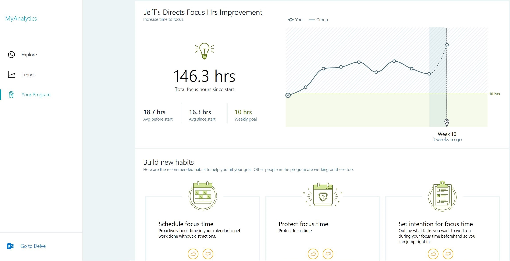
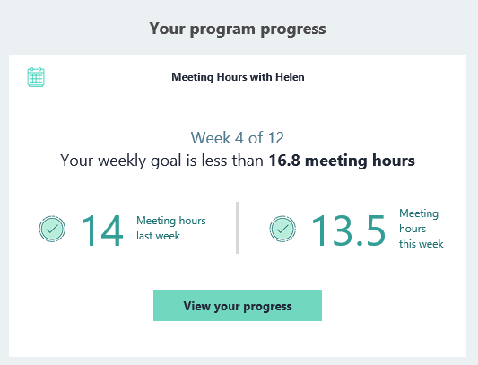

---
# Metadata Sample
# required metadata

title: Workplace Analytics Teamwork solution participants
description: A brief description of what participants in a Workplace Analytics plan (MyAnalytics users) experience during the plan
author: paul9955
ms.author: v-pascha
ms.date: 05/02/2019
ms.topic: conceptual
localization_priority: normal 
ms.prod: wpa
---

# Teamwork solution: The experience of plan participants

**Role** - participant in a habit-change plan, an information worker who is using MyAnalytics

While analysts and program managers create and manage programs in Workplace Analytics, the actual work of change is done by MyAnalytics users. These are the people for whom a need was identified and a plan created. They have the opportunity to change workplace habits for the better.

During a plan, participants receive or can view the following items:

# At plan start

## Welcome email

As a program manager schedules a plan, they can choose to let participants receive an automatically generated [welcome email](../Images/WpA/Tutorials/welcome-msg-prog-partic.png) from Workplace Analytics. This email explains the details of the plan: its duration and goals, and the habits they're expected to work on. 

# Throughout the plan

## MyAnalytics dashboard

The [MyAnalytics dashboard](../MyAnalytics/use/dashboard-2.md) is a constantly available resource for MyAnalytics users. In addition to its standard content, the dashboard also includes a new participant section during a plan. This section contains information such as recommended habits and the participant's progress against the plan goals, similar to the following:

## Email digest

All MyAnalytics users receive a weekly [email digest](../MyAnalytics/use/email-digest.md). In addition to its standard content, their email digest for partipants also includes a section  that summarizes their progress in the plan, similar to the following: 

## MyAnalytics inline suggestions

MyAnalytics inline suggestions in Outlook are brief, data- and AI-driven notifications that appear in Outlook while you are either reading or composing an email or a meeting invitation. Different inline suggestions apply to different situations. For example, if you have outstanding to-do tasks, an inline suggestion might ask whether you want to review them. 

While many inline suggestions are available to all MyAnalytics participants, some apply only to participants of particular Teamwork solution plans, as described in the following tables: 

### Collaboration plan

Participants in the Collaboration plan might see the following inline suggestions:

| Where it shows up  | What it says | How it helps  |
|------|-------|---------|
|Reading pane (meeting invitation) 	| Could this meeting be 45 minutes? Suggest shortening to save everyone one hour per month. **Reply to &lt;name&gt;** | Suggests that you ask the meeting organizer to shorten hour-long meetings to 45 minutes. |

| Where it shows up  | What it says | How it helps  |
|------|-------|---------|
|Meeting compose	| Some attendees have a lot of meetings this week. Is everyone required? **Mark who’s optional**  | Suggests that you reconsider whether everyone is required in the meeting that you are organizing, due to the high meeting load of your invitees. |

### Wellbeing plan

Participants in the Wellbeing plan might see the following inline suggestion:

| Where it shows up  | What it says | How it helps  |
|------|-------|---------|
|Reading pane (meeting invitation)  | Looks like this meeting is outside your typical working hours. Here are some alternate times that work for everyone. **See suggested times** | Suggests that you ask the organizer to move the meeting to a time during working hours that works for all attendees. |

## Broadly available inline suggestions

A number of other inline suggestions are available to all MyAnalytics participants, whether or not they are enrolled in a Teamwork solution plan. They are described in the following tables:

### Get more time to focus

[!INCLUDE [Inline suggestions about focus](../includes/inline-suggest-table-focus.md)]

### Stay up-to-date with important relationships

[!INCLUDE [Inline suggestions about important relationships](../includes/inline-suggest-table-important.md)]

### Reduce after-hours work and team impact

[!INCLUDE [Inline suggestions about after-hours work](../includes/inline-suggest-table-after-hours.md)]

### Build better collaboration habits

[!INCLUDE [Inline suggestions about collaboration](../includes/inline-suggest-table-collab.md)]

## Related topics

[Solution: Introduction](solutions-intro.md)  

[Solution: Walkthrough](solutions-task.md)

[Solution: Concepts](solutions-conceptual.md)
