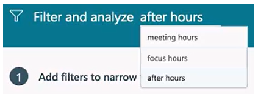
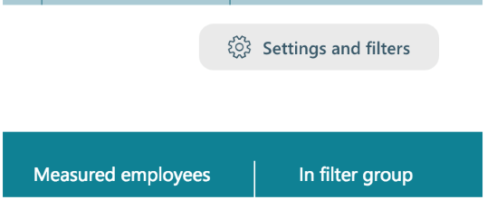
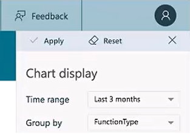
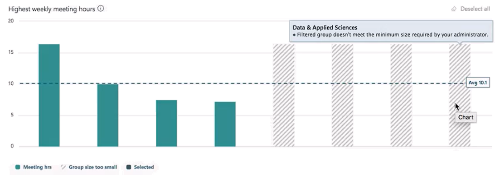
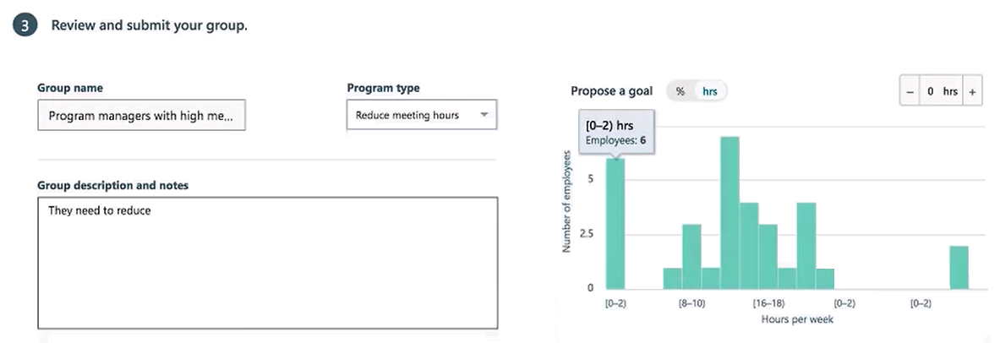
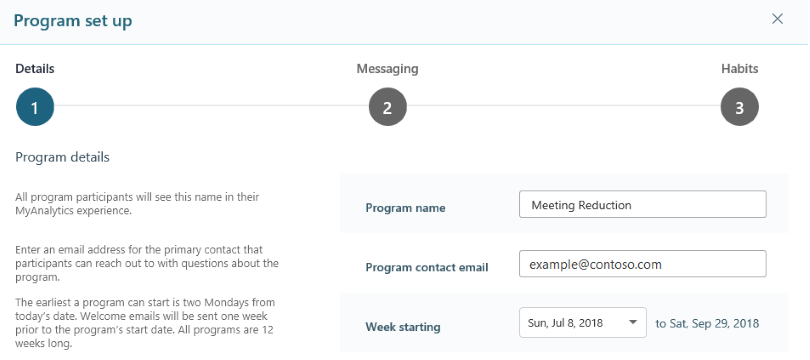
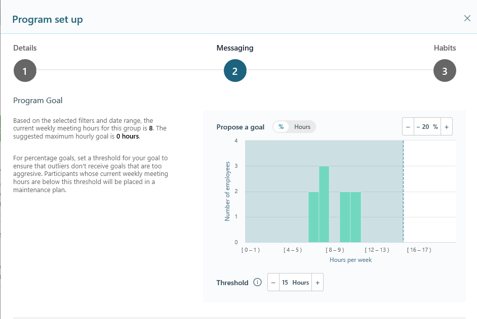
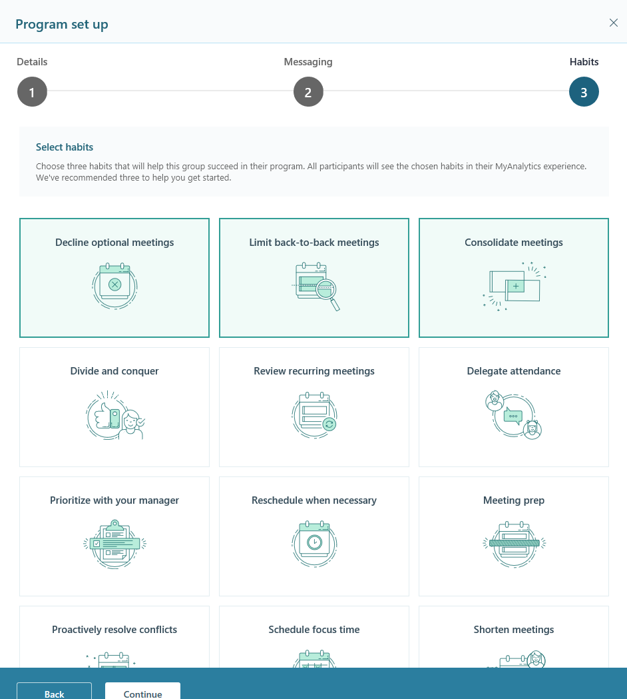
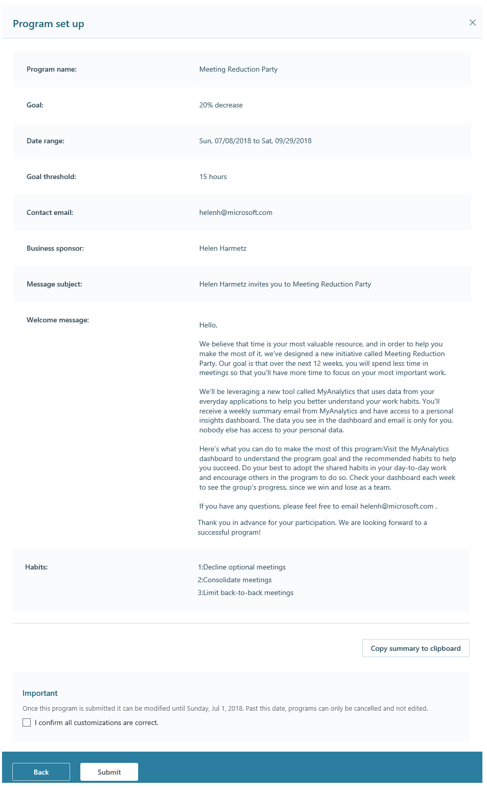
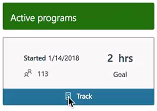

---
# Metadata Sample
# required metadata

title: Workplace Analytics Teamwork solution (walkthrough)
description: A walkthrough of the steps for creating a program by using functionality that is made available in the Workplace Analytics Teamwork solution area. 
author: paul9955
ms.author: v-pascha
ms.date: 06/27/2018
ms.topic: get-started-article
localization_priority: normal 
ms.prod: wpa
---

# Teamwork solution: Walkthrough 

Use the solutions area of Workplace Analytics to attempt to change employees' work habits for the better. On the Solutions pages of Workplace Analytics, you can create a program, track it while it is in progress, and examine it after it completes.

People in either of two roles can work on programs:

* Analysts can help identify groups and opportunities for change. 
* Program managers can design and track programs that are underway and examine programs that have completed.

## Workflow phases, pages, and roles 

Work on a program has the following phases:

| Workflow phase |Activity in this phase | Solutions page | Roles who can perform this activity |
| ---- | ---- | ---- | ---- |
| (1) [Identify](#identify-opportunities-for-improvement) | Identify a group that you want to take part in an improvement program.  | Identify | Both roles can identify users: Analysts can select groups, while program managers can manually upload groups. |
| (2) [Schedule](#schedule-a-program) | Define a program and assign it to a group. | Manage | Only program managers can define programs. Analysts have read access to the Manage page. |
| (3) [Track](#track-programs) | Track the group's progress in the program over its twelve-week length. | Track | Program managers only. They have both read and write access to the Track page.  |
| (4) [Examine](#track-programs) | Compare how well a completed program did against its goals. | Track | The examination of completed programs is done primarily by program managers. |

## Identify opportunities for improvement

 * **Role** - Analyst or program manager

The goal of the first phase in the solution workflow is to identify opportunities for improvement. An opportunity combines a group of people, a problem description, and a goal definition. You can create solutions that address problems in the areas of meeting hours, focus hours, or after hours. 

In this first phase, start by submitting a group of people, or even multiple groups -- you can submit as many groups as you think might benefit. After a group is submitted, it enters a queue as a candidate for a change program. (In the next phase, [Schedule a program](#schedule-a-program), a program manager starts with a group and creates the change program for it.) 

Both analysts and program managers can create groups. There are two pages on which you can create a group: Solutions > Identify and Solutions > Manage. Analysts can use both pages, while program managers can use only the Manage page. The roles have different options, as described here:  

 * **Analysts:** An analyst can create a group either by using charts to select groups or by manually uploading a group (in a .csv file):
   * <u>Charts.</u> To use charts to select a group, on the Solutions > Identify page, you choose an area for behavior change and then answer questions to perform an analysis of workplace behavior. Finally, use the results of this analysis to select one or more groups of people to put into an improvement program. For a step-by-step description, see [Identify a group](#identify-a-group). 
   * <u>File upload.</u> In this method, you first create a .csv file and then you upload it. For a step-by-step description, see [Upload a file to create a group](#upload-a-file-to-create-a-group). For more information about the file you upload, see [Use a .csv file](solutions-conceptual.md#use-a-csv-file). 

 * **Program managers:** Program managers can create groups only by manually uploading them. Use this method if you have a business reason to assign a program to a specific group of people. These people might recognize an area in which they want to improve, or you might have identified them as needing improvement in a certain behavior. The file you upload must have the .csv extension. You can assemble it by hand or export it from an HR tool. This file must use email addresses to identify people. 
   * <u>File upload.</u> In this method, you first create a .csv file and then you upload it. For a step-by-step description, see [Upload a file to create a group](#upload-a-file-to-create-a-group). For more information about the file you upload, see [Use a .csv file](solutions-conceptual.md#use-a-csv-file). 

The following section presents you with procedures for both ways to identify a group, uploading and selecting:

### Upload a file to create a group 

 * **Prerequisite** - Use this task if you already have a list (in the form of a .csv file) of people who will participate in the program. For more information, see [Use a .csv file](solutions-conceptual.md#use-a-csv-file).  
 * **Role** - Program manager

1. In Workplace Analytics, select **Solutions**.
2. On the Solutions page, under Identify, select **Go**. This opens the Solutions > Identify page.
3. In the Custom group card, select **Create**. The Upload group page opens.
4. Select **Browse**, locate and select a .csv file, and select **Open**.
5. Identify this group in the Group name field.
6. For Choose Program, select the program type. The choice of a program is final; you cannot change it after you submit this group.
7. For Max goal (Min goal, if the program is to increase Focus hours), select either a percentage-based or hour-based goal. If you select percentage-based, also set a value for Threshold. The choice of Max (or Min) goal is not final. For more information, see Set a value for Max goal.
8. (Optional) In the Group description and notes section, type a description of this group and the program.
9. Check the box for _I confirm that these selections are correct_ and select **Submit**. Workplace Analytics displays that your group has been successfully uploaded and that you can view groups that you've uploaded on the Manage page.

Go to [Schedule a program](#schedule-a-program).

### Identify a group

 * **Role** - Analyst

Use this procedure if you don't yet have a list of people (a .csv file) that you want to register for the program. To obtain this list of participants, you perform an analysis by using the options on the Collaboration Overload page.

> [!Tip]
> This procedure works best if you start it after you decide on an area of focus for your analysis. That is, if you know that some people in your organization have a problem with too many meeting hours, or too few focus hours, or that they collaborate too much after the workday ends. 

1. In Workplace Analytics, select **Solutions**.

2. On the Solutions page, under Identify, select **Go**. This opens the Solutions > Identify page. 

3. In the collaboration-overload card for your area of focus (Meeting hours, Focus hours, or After hours), select **Get started**. This opens the Collaboration Overload page.

4. (Optional) Although you just selected an area of focus on the Solutions > Identify page, if you decide that a different focus is better, you can change it on this page (Collaboration Overload). To do this, select the text (such as focus hours) in the Filter and analyze banner:

   
 
5. Scope your data. To do this, narrow the focus to specific people by applying filters.

   > [!Note]
   > You apply filters in the Filter summary area, in the right column of the page. If this area is not showing, select **Settings and filters** to re-display it:

   
 
6. In the right column, under Filter summary, select **Edit**. The Edit filters panel opens.  

7. Under Edit filters, select **Add filter**. Here's an example of how to add a filter:
   
   a. In the left box, select **Organization**.

   b. In the right box, select a predefined organization, such as **Operations**.

    -- or --

   b. In the right box, start typing the name of a manager and then click that name to select this manager's team.
   
   c. Optionally, you can add another organization filter. For example, select **Marketing** in the right box. If you do this, the Marketing filter selection is displayed next to your first filter selection (such as Operations) under the selection boxes.

8. You will soon see the results of this filtering in the form of a chart. Before Workplace Analytics displays the chart, you can, optionally, group the people whose behavior you are analyzing. You can use any of the available HR attributes to group them by. To do this, under Chart display, select **Group by** and then select (for example) **FunctionType**.

9. To apply the filters and other changes that you've made, select **Apply**:

   
 
   Workplace Analytics now displays a chart that shows data about the people that you selected by using filters. It groups these people by the Group by setting you chose -- in this case, FunctionType.  

10. To select a more precise group of people to include in the program, continue with your analysis. Under _Select a question to change the view of your chart_, Workplace Analytics displays several questions, such as _Which groups attend the highest number of meetings?_ 

   Selecting a question displays the answer to the question in the chart. By selecting a question that is relevant to the collaboration problem that you want to solve, you see groups of employees who are most likely to exhibit symptoms of that problem. Selecting a question also orders the displayed groups by the metric (such as meeting hours, focus hours, or number of meetings) that the question asks about.

   The chart displays vertical bars that represent groups of people. It represents each group in one of two ways: 

   * Groups that reach or exceed the minimum group size are colored blue-green. These groups are large enough for you to analyze.

   * Groups that don't reach the minimum group size are displayed with gray and white stripes. These groups are too small to analyze individually. (Also see [Minimum group size](solutions-conceptual.md#minimum-group-size).) For example, in the organization we are analyzing, the minimum group size is five. You can change the minimum group size to a level that you consider more relevant for your organization, but you cannot set the group size to lower than five. In the following chart, the Data & Applied Sciences group contains fewer than five people, so its bar is shown grayed out: 

       
  
       For more information, see [Available and selected employees](solutions-conceptual.md#available-and-selected-employees).

11. Select one or more groups for analysis. You can also select grayed-out groups. If you select enough of them so that their combined membership exceeds the minimum group size, you can use them in your analysis. 

    To select multiple groups, just click or tap them. To unselect a selected group, click or tap it again. For more information about what happens with selected groups when you make other settings on this page, see [Persistence of group selections](solutions-conceptual.md#persistence-of-group-selections).

After you have groups selected, go to the following procedure, [Submit a group](#submit-a-group). 

### Submit a group

 * **Role** - Analyst

1. After you have selected groups in [Identify a group](#identify-a-group), finish creating your program in the _Review and submit your group_ area: 

   
 
2. Type a group name and an optional description, and optionally change the program type. 

   > [!Note] 
   > The program type that you select here is final; it cannot be changed later.  

3. Note the histogram under Propose a goal. It displays the baseline state for the selected employees, according to the program type that you chose. For example, if your program is Reduce meeting hours, the columns in this histogram show the distribution of employee behavior regarding meeting hours -- that is, the hours per week that the employees in the selected groups spent in meetings. This baseline state helps you choose a useful and reasonable goal for these employees. 

4. Select a goal. You can pick either a time-based goal or a percentage-based goal: 

    * Time-based goal. Select **hrs** and then select a number of hours. Participants will see this as the maximum number of meeting hours per week that they should strive to reach over the course of the program. (For Focus hours, this goal will reflect the minimum number of hours.)

    * Percentage-based goal. Select **%** and then select a percentage amount. Participants should reduce their meeting hours by this much (or, for Focus hours, to increase the number by this much). If you choose percentage-based, you can also select a threshold. For more information, see [Threshold](solutions-conceptual.md#threshold). 

5. Select _I confirm that these selections are correct_ and select **Submit**. A notification appears in the lower-right area of the page; it lets you know whether your group has been successfully submitted. You can select this notification to open the Solutions > Manage page. 

## Next steps: processing tasks

After you select **Submit**, Workplace Analytics processes the group. Processing includes these tasks: 

1. <u>Create the group.</u> If you manually uploaded the group, Workplace Analytics matches the provided email addresses to PersonIDs in the system. If you selected a group by using the Identify page, the system creates the group based on the measured employees who meet the criteria set by the filters you used and the groups you selected when the group was submitted. For more information about manual upload, see [Manually upload a .csv file](solutions-conceptual.md#manually-upload-a-csv-file).

2. <u>Calculate the benchmark.</u> Workplace Analytics calculates a new benchmark for this program type and this group. For example, if you chose Reduce meeting hours as the program type, the calculated benchmark reflects the average amount of time these people spent in meetings over each week of the most recent 12 weeks of data that Workplace Analytics has for that group. 

3. <u>Display the group card.</u> Workplace Analytics displays the group in a card in the Unassigned groups column on the Solutions > Manage page. This card shows the group's title, program type, and date of submission. At first, the group's card indicates that the group is still being processed. After processing is finished, the displayed card is still just a group of people; it is not yet a program. (For more information about group and program cards, see [The Solutions > Manage page](solutions-conceptual.md#the-solutions--manage-page).)  

> [!Note] 
> After processing is finished, both the size of the group and the calculated benchmark might differ from what you expect. For more information, see [Group size and benchmark might differ](solutions-conceptual.md#group-size-and-benchmark-might-differ). 

Go to [Schedule a program](#schedule-a-program). 

## Schedule a program

 * **Role** - Program manager

In this phase, you work on the Solutions > Manage page of Workplace Analytics. You review submitted opportunities and focus on the ones best suited for a change program. You schedule change programs by specifying the goal, habits, and additional context. While programs are underway, you can review, edit, or cancel them.   

**To schedule a program**

1. In the Unassigned groups column, hover the mouse over the group for which you want to schedule a program. This displays the Assign option. 

2. Select **Assign**. This opens the Group summary pane, which displays details about the group such as its name, program type, size, and submitter. Use this page to confirm that the program details are correct. 

3. (Optional) Select **Copy summary to clipboard** to copy this information. You can then share it with others, perhaps to verify that program aspects are as expected. 

4. When you're ready to schedule the program, select **Customize**. This displays the Program setup page, open to the Details step:

   

   This page contains three required fields: Program name, Program contact email, and Start date. The program's end date (twelve weeks from the start date) is filled in automatically. 

5. After you complete the three fields, select **Continue**. Workplace Analytics now checks two things: 

 * Are any participants already assigned to a different program for the selected time? People cannot participate in two programs at the same time, so these people would be ineligible for your program until their current program finishes.  

 * Are any participants lacking a MyAnalytics license? MyAnalytics licenses are required for program participation. 

6. Workplace Analytics displays information about ineligible employees:
  
   

7. In this example, six employees are ineligible because of a conflicting program. You have two choices: 

 * Change the program start date so that your program starts after the other program finishes and these six people are free of their obligation to the other program. 

 * Start your program at the originally planned date and accept the fact that these six people will not participate. To do this, select the _I understand ..._ checkbox and then select **Continue**. Workplace Analytics recalculates the program benchmark for the final group of participants (the selected employees who are eligible during the entire twelve weeks).

   > [!Note] 
   > If excluding these people causes the group to fall below minimum group size, you cannot proceed. You'll need to choose a different start date or a new group of people. 

8. On the Messaging step of the Program setup page, you can change details about the program, such as the goal -- whether to express it as a percentage or as a number, and how high a percentage or number. 

   

   It makes sense to reset the goal here because the benchmarks might have changed because the group lost ineligible employees.

9. Type the name of your business sponsor. This can be the name of a person or, for example, of a leadership team. Workplace Analytics suggests a message subject and a welcome message. The name of the business sponsor and the program name are included in the message subject. 

10. (Optional) Edit the message subject and/or the welcome message.  

11. The Habits step of the Program setup page displays behavioral habits that pertain to the program goal. 

   

   Select three habits on this page. Base this selection on what you've found the team needs, perhaps through an analysis that was performed. Alternatively, you can base it on a prior agreement among the team participants. After you have selected three habits, select **Continue**.

12. The final page summarizes the program:

   

   Examine the displayed details. If you need to change anything, select **Back**. If the program is ready to go, select **I confirm that all customizations are correct**, and select **Submit**.

### The program starts

The program does not start immediately after you schedule it. Here are the events that lead up to the program-start date:

| Event | Notes |
| ----- | ----- | 
| Create and [schedule a program](#schedule-a-program) | <ul><li>After you submit the program, Workplace Analytics displays a message that tells you on which day the program will start.</li><li>On the Solutions > Manage page, the program's card moves from Unassigned groups to Scheduled programs.</li></ul> | 
| The next Monday arrives | <ul><li>Programs always start on a Sunday. On the Monday before that first Sunday, Workplace Analytics sends the welcome email (see an [example](solutions-participants.md#welcome-email)) to all program participants. (You had an opportunity to edit this welcome email in [Schedule a program](#schedule-a-program).)</li><li>After Workplace Analytics sends the welcome message to the new participants, the program is locked for editing.</li></ul> |
| The next Sunday arrives | <ul><li>This is the first day of the first week (of twelve weeks) of the program.</li><li>The program's card moves from Scheduled programs into Active programs.</li></ul> |

In this sequence of events, if you schedule a program on -- for example -- a Wednesday, the soonest the program can start is two Sundays later. 

Now that the program has started, you can track its progress. Go to [Track programs](#track-programs). 

## Track programs

 * **Role** - Program manager

You track programs on the Solutions > Manage page. Use this page to measure progress on the goal since program started, as well as ROI for the program. For a brief overview of the page, see [The Solutions > Manage page](solutions-conceptual.md#the-solutions--manage-page).)  

**To track an active program**

1. On the Solutions > Manage page, in the Active programs column, hover the mouse over a program's card. This displays the Track option:

   
 
2. Select **Track**. This opens the Solutions > Track page. This page displays information about the progress of the program up to this point. For more information, see [Progress report](Solutions-conceptual.md#progress-report). 

3. (Optional) To compare the results of one program (active or completed) with the results of another program (active or completed), select the **Progress for** drop-down list in the banner, and then select the name of the other program. The display switches to the progress for the selected program. 

4. (Optional) If appropriate, you can end the program before its twelve weeks have passed. To do so, click End program on the results page. If you select **End program**, you see a warning dialog box that asks you to confirm that you really want to end the program. 

## Related topics

[Solution: Introduction](solutions-intro.md)  

[Solution: Participants](solutions-participants.md)  

[Solution: Concepts](solutions-conceptual.md)
