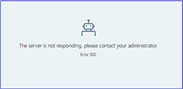

---

title: Workplace Analytics 500 error
description: This explains why users receive a 500 error when using Workplace Analytics 
author: paul9955
ms.author: v-midehm
ms.topic: troubleshooting
localization_priority: normal 
ms.prod: wpa
---

# Workplace Analytics 500 error

**I am receiving a 500 Error when I try to access Workplace Analytics**.

**Error Message:** 

"The server is not responding. Please contact your administrator. Error 500".

 

**Why is this happening?** 

Users will see this error message when they have just purchased their tenants for Workplace Analytics, and where we have not yet provisioned their tenant. 

> [!Note] 
> Provisioning typically takes from 24 to 72 hours after purchasing Workplace Analytics licenses.

**Escalation Process** 

To escalate this issue, contact [Microsoft support](https://support.microsoft.com/contactus/).