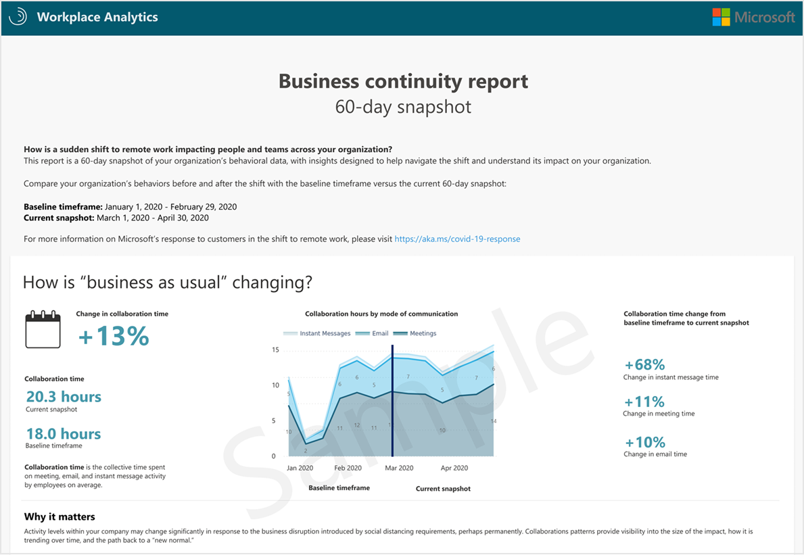

---

ROBOTS: NOINDEX,NOFOLLOW
title: Business continuity report
description: Use the Business continuity report to analyze organizational collaboration data
author: madehmer
ms.author: v-mideh
ms.topic: article
localization_priority: normal 
ms.prod: wpa
---

# Business continuity report

Organizations around the world are responding to sudden changes in the way they work. Microsoft wants to help you understand the business impact and what your organization can do to help navigate the shift to remote work.

The Business continuity report is a free Workplace Intelligence report that’s available to Microsoft 365 customers in the Microsoft 365 Admin Center. It analyzes [Microsoft Graph](https://docs.microsoft.com/graph) data to provide high-level insights about how collaboration for an organization has changed between a baseline timeframe of January to February 2020 as compared to a current snapshot of March to April.

This report helps business leaders understand how:

* Business is being impacted by the shift in work.
* Employees are adapting to the shift in work-life balance.
* Responsiveness to external relationships is impacted, such as with customers, partners, and vendors.

The following are a few of the top-level business questions that this report helps you analyze.

|Business question |Analysis |Metrics used |
|-------------|--------------|-------------|
|How is "business as usual" changing? |How are employee collaboration patterns changing in response to a shift in work?    Which collaboration tools are people substituting for in-person interaction? |**Collaboration time** is defined as the total time employees spend in meeting, email, and instant message activity on average weekly.    **Collaboration time for meeting activity** is the sum of the durations of meetings an employee has on their calendar (not counting meeting time that overlaps). This is shown on average each employee weekly.    **Collaboration time for email activity** is approximated by 5 minutes for a composed email, and 2.5 minutes for a read email. This is shown on average for each employee weekly.    **Collaboration time for instant message activity** is approximated by 30 seconds for each instant message (sent and received). This is shown on average for each employee weekly. |
|How are employees adapting to this shift? |What share of employees are experiencing significant shifts in their weekly work spans and collaboration levels?    How are working patterns flexing across collaboration mediums? |**After-hours work** is defined by the average time an employee spent on work outside of their working hours (as set in Outlook). Activity is relative to the time zone of the person who is sending email or instant messages.    For example, when a person in the Pacific Standard Time (PST) time zone sends an email at 9 AM PST. That email will register as sent at 9 AM on the collaboration time-of-day chart. When a user in the China Standard Time (CST) time zone sends an email at 9 AM CST, it’ll also register as 9 AM on the collaboration time-of-day chart.|
|Are employees maintaining external relationships? |Are employees still connecting with customers, partners, and vendors? |**External collaboration time** is the total time spent on meeting, email, and instant message activity with people who are not within the organization, on average for each employee. This activity is calculated the same way as internal collaboration, but only for activity with these external contacts.|

## Frequently asked questions

#### Q1 How do I access the report?

The report is available for download from the Microsoft 365 Admin Center. You'll see a post about the report in the Admin Center when it's available.

#### Q2 Where can I get more information?

You can use Workplace Analytics to get more detailed analysis and additional insights about your company. Contact your account team or go to [Workplace Analytics](https://www.microsoft.com/microsoft-365/business/workplace-analytics) to learn more.

#### Q3 Can I request a new report with a different time range?

No, the dates in this report are static and cannot be changed at this time.

#### Q4 What languages is the report available in?

The report is currently only available in English.
