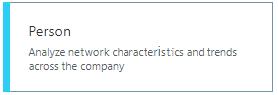

---
# Metadata Sample
# required metadata

title: Organizational network analysis (ONA) queries 
description: Describes how to use Organizational network analysis (ONA) queries in Workplace Analytics to determine the "Influence" metric of individuals in your organization
author: paul9955
ms.author: v-pausch
ms.topic: article
localization_priority: normal 
ms.prod: wpa
---

# Organizational network analysis (ONA) queries

It’s frequently necessary to implement changes within organizations, whether this be introducing new procedures or rolling out new systems or technology. The traditional top-down method of using formal authority to drive change – perhaps starting with mass emails – it’s not always the most effective way. It might fail for any of several reasons including company culture, technical challenges, or problems with personality.  

Instead, a more successful strategy uses change agents -- influential, well-connected people who are positioned at various levels within the hierarchy, not just at the top. Beyond an organization’s formal hierarchy there also exist informal networks; individuals can exert influence within those networks and between them. The most influential people are the ones who have large personal networks – that is, above-average numbers of relationships with colleagues.

Therefore, to help implement change, it pays to know who the influencers are. The Workplace Analytics ONA query was designed for this purpose. It can help you find out who the best-connected people in the company are. It bases this determination on their collaboration characteristics.

This query type lets analysts use a metric called _Influence_. This metric is a score of how well connected you are in the company. It acts recursively: if you’re connected to others who are well connected, you benefit from their connections as well. After you learn who the best connected people are in the company, division, or other group, you can act on the likelihood that these people can connect effectively within or across groups and become efficient drivers of change. 

## Run a query to determine Influence

1.	In Workplace Analytics, select **Analyze > Queries**.
2.	Under **Start custom Organizational Network Analysis (ONA) query**, select **Person**:

    

3.	Select and change **Enter query name here** to a name, and then enter a description for the query.
4.	For **Group by**, select a time-grouping option: **Monthly** or **Aggregated**. If you choose Monthly, the query results will contain one row with data for each month in the time period that you chose. If you choose **Aggregated**, the query results will contain one row for the entire time period that you chose. 

    > [!Note] 
    > You cannot select the auto-refresh option for ONA queries.

5.	Under **Select metrics**, select **Influence**. If you choose, you can also edit the **Display name** of this metric; the edited name will appear as a column name in the query results. (Other metric customization options are not available.)
6.	Under **Select filters**, select the groups of people for whom you want to see results. For example, to query about people in the engineering department or financial division, set this filter to **Domain Equals Engineering** or **Domain Equals Finance**.
7.	Under **Organizational data**, select the attributes that you want to appear in the results along with the metrics data. You can use these attributes to further summarize the results to create analyses that compare and contrast the collaboration of different groups in the organization.
8.	Select **Run**. The query takes a few minutes to complete. 
9.	On the **Queries > Results** page, the query status initially shows as **Submitted**. After the query status changes to **Succeeded**, you can view it or download it (as a .csv file).

> [!Note] 
> You can view, copy, export, and visualize query results in different ways for different query types. The topic [View, download, and export query results](../use/view-download-and-export-query-results.md) describes the various ways to see or share results. You can follow steps in that topic to [View query results](../use/view-download-and-export-query-results.md#view-query-results) or to [Download and import query results](../use/view-download-and-export-query-results.md#download-and-import-query-results), but note that the other sections of that topic (such as using and OData link) do not apply to ONA queries.

## ONA query output

The following columns are included in the query results for ONA queries:
 * **Person ID.** De-identified ID number for the person represented in that data row.
  * **Date.** The start date of the aggregated output (for example, for the week of June 3rd to June 10th, the start date would be the 3rd. For a month, it'll be the first day of the month your data encompasses).
 * **Person attributes.** Attributes about the person supplied through the latest organizational (HR) data upload.
 * **Metrics.** Any other metrics that you include in the query. See Person query metrics for more details.

## Related topics

[Metric descriptions](../use/metric-definitions.md)

[View, download, and export query results](../use/view-download-and-export-query-results.md)

Here are two articles from the Harvard Business Review about organizational change: 

[The Network Secrets of Great Change Agents](https://hbr.org/2013/07/the-network-secrets-of-great-change-agents)

[Convincing Skeptical Employees to Adopt New Technology](https://hbr.org/2015/03/convincing-skeptical-employees-to-adopt-new-technology)
