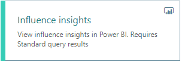
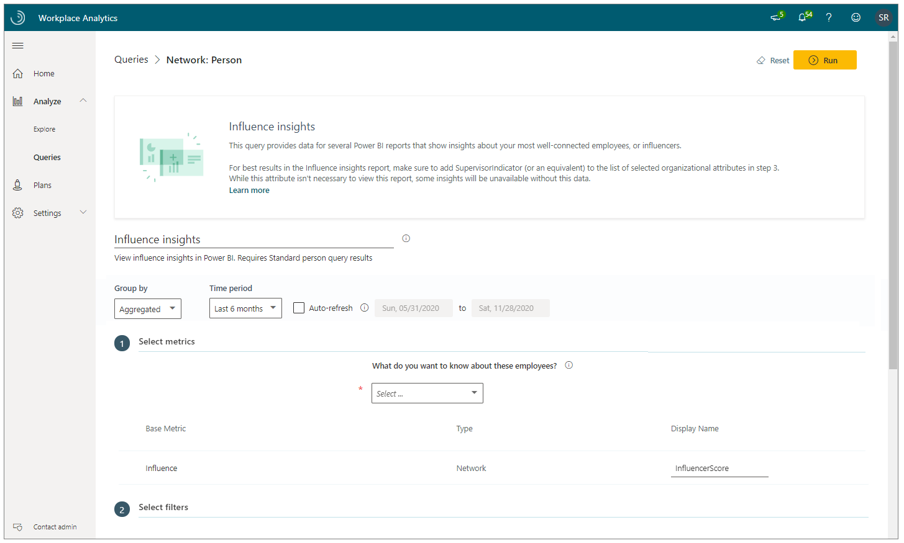
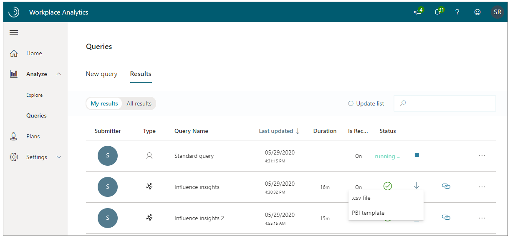
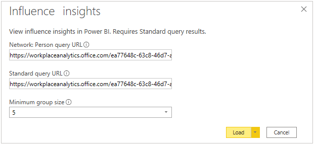
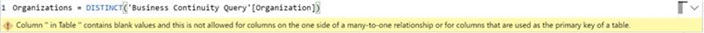

---

title: Power BI Influence insights
description: Description, setup, and use of the Power BI Influence insights dashboard
author: paul9955
ms.author: v-pausch
ms.topic: article
localization_priority: normal 
ms.prod: wpa
---

# Power BI Influence insights

Use the Power BI Influence insights dashboard to gain insights into influencers – people who are well connected in your company. This dashboard, which is populated by data from Workplace Analytics, lets you visualize and explore answers to the following business questions that leaders ask:

|Business question |Analysis |
|-------------|------------------|
|Where are the influencers in your company? | <ul><li>Which organizations have concentrated influencer presence?  </li><li> Which organizations have limited influencer presence?</ul> |
| Who makes decisions in your company?	| <ul><li> Are decisions being made in a top-down or in a more decentralized manner?  </li><li> Are employees at various levels in the hierarchy empowered to make decisions? </ul>|
| How are influencers adapting to the remote work situation? | <ul><li>How are influencers’ collaboration patterns changing in response to this disruption?  </li><li> What impact does this disruption have on the key roles that influencers play? </ul>|

Before you can use the Influence insights dashboard in Power BI, it must be populated with data. To do this, set up and run the predefined Influence insights and Standard query queries in Workplace Analytics. The results of these queries will refresh your downloaded Power BI dashboard on a weekly basis. 

After you successfully run these queries, you'll see the Influence insights Power BI template as an available download option for the Influence insights query. You’ll need this template to create the Influence insights dashboard in Power BI. After you download the Power BI template, you can then connect the query data from Workplace Analytics to the dashboard in Power BI.

After the Influence insights Dashboard is populated with data, you can use it to visualize, explore, and report about your organization's workplace patterns and trends.

## Prerequisites

Before you can run the queries and populate the dashboard in Power BI, you must:

 * Be assigned the role of [analyst](../use/user-roles.md) in Workplace Analytics.
 * Have the latest version of Power BI Desktop installed. If you have an older version of Power BI installed, uninstall it before installing the new version. Then go to [Get Power BI Desktop](https://www.microsoft.com/p/power-bi-desktop/9ntxr16hnw1t?activetab=pivot:overviewtab) to download and install the latest version.

## Set up the dashboard

This dashboard requires information that is produced by two queries. For this reason, you perform some steps to run the first query (**Influence insights**) and you perform some of steps a second time to run the second query (**Standard person** query).  

1.	In [Workplace Analytics](https://workplaceanalytics.office.com/), select **Analyze** > **Queries**.

2.	Under **Start from preselected filters and metrics**, select **Influence insights** (or select **Standard person query**, per Step 7) to open the predefined query, which contains the required metrics to populate the dashboard.

    
 
3. Select or confirm the following query settings:

   * **Name** - Customize or keep the default name
   * **Group by** - Select **Aggregated** for the **Influence insights** query; select **Month** for the **Standard person** query. 
   * **Time period** - Last 6 months
   * **Auto-refresh** - Enable the setting
   * **Meeting exclusions** - This choice is not available for the **Influence insights** query. You can select a meeting exclusion rule for the **Standard person** query.

   > [!Important]
   > * The dashboard can show you how a disruption can change your influencers’ work patterns. For best results, select **Last 6 months** for the **Time period** to include time before and after the disruption.
   > * In this procedure, there is no step to select metrics because the metrics for this query are preselected. If you try to delete a predefined metric, you'll see a warning that the deletion might disable portions of the Power BI dashboard and reduce query results. In turn, this can limit your ability to visualize collaboration patterns. Depending on the metric you delete, you might disable a single Power BI chart, several charts, or all the charts. Select **Cancel** to retain the metric.

      
 
4. In **Select filters**, for "**Which measured employees do you want to include?**" you can filter the employees in scope for the dashboard. For more details about filter and metric options, see [Create a Network: Person Query](./ona-queries.md).
5. In **Organizational data**, keep the preselected **Organization**, **LevelDesignation**, **FunctionType**, and **SupervisorIndicator** attributes that the dashboard requires. You can then select any other additional (columns) to include in the dashboard.

   > [!Important]
   > If you remove any of the required, preselected organizational data attributes, you might disable one or more Power BI charts.

6. Select **Run** to run the query. This might take several minutes to complete.

7. Repeat **Steps 2-6**; this time, specify the **Standard person query**. Make the same selections that you made for the Influence insights query but with the following exceptions:

    * You can also specify a meeting exclusion rule.
    * You must set the auto-refresh option for the Standard query to "on." 
    * For **Group by**, specify **Aggregated**.

8. In **Queries** > **Results**, after both queries successfully run, select the **Download** icon for the **Influence insights** query results, select **PBI template**, and then select **OK** to download the template.

   

9. Open the downloaded **Influence insights Power BI template**.
10. If prompted to select a program, select **Power BI**.
11. When prompted by Power BI, copy and paste the OData links for both queries into their respective fields.

    * In the Workplace Analytics **Queries** > **Results** page, select the **Link** icon for each query, and select to copy the generated OData URL link.
    * In Power BI, paste each copied link into its respective field.
    * Set the [**Minimum group size**]() for data aggregation within this report's visualizations in accordance with your company's policy for viewing Workplace Analytics data.
    * Select **Load** to import the query results into Power BI. Loading these large files might take some time to complete.

      
      

12. If you're already signed in to Power BI with your Workplace Analytics organizational account, the dashboard visualizations will populate with your data. You are done and can skip the following steps. If not, proceed to the next step.
13. If you're not signed in to Power BI, or if an error occurs when updating the data, sign in to your organizational account again. In the **OData feed** dialog box, select **Organizational account**, and then select **Sign in**.

    

14. Select and enter credentials for the organizational account that you use to sign in to Workplace Analytics, and then select **Save**.

    >[!Important]
    >You must sign in to Power BI with the same account you use to access Workplace Analytics.

15. Select **Connect** to prepare and load the data, which can take a few minutes to complete.

## Use the dashboard

After the Influence insights dashboard is set up and populated with Workplace Analytics data, you can use the Power BI visualization charts to analyze your organization's influence insights.

## About the dashboard reports

The following dashboard reports highlight unique insights about influencers and their impact. They can trigger discussion points for leaders on leveraging influencers' impressive networking capability to drive change or disseminate information more effectively across the company. 

The Glossary report at the end of the dashboard provides information about the underlying metric that drives the dashboard. An interpretation is provided in the text box of each report. Here are the influencers reports, with nuances to consider for each:

 * **Your influencers at a glance.** This report frames the data and gives an overview of the various reports. Select the "i" icon next to each business question to view the related report.
 * **Where are the influencers in your company?** This report shows where influencers are present at the organization level. You can select to focus on the top 5, 10, 15 or 20% of influencers. (After you make this  selection, it applies to all of the dashboard reports.) You can further filter and slice across other available attributes.
 * **Who makes decisions in your company?** This report shows you how employees at various levels are empowered to make decisions. You can view this at the organization level or by any other available attribute.
 * **How are influencers adapting to remote work situations?** Unlike the other reports, this report shows changes between the baseline time frame and the current time frame. It shows the trend in collaboration hours by channel for influencers and it demonstrates the slippage between work and life balance. 

## Power BI tips

A tip to help you use the Influence insights dashboard in Power BI:

 * **Cross-filter and cross-highlight.** Some visuals on a report page are interconnected. If you change a filter or pivot on one of the visuals, all the others on the page that contain that data will change, based on that selection.

For more details about using Power BI, see [Interact with visuals in reports, dashboards, and apps](https://docs.microsoft.com/power-bi/consumer/end-user-visualizations).

## Share the dashboard

Like other products that work with sensitive data, such as HR systems, Workplace Analytics is not meant for the general workforce. Rather, its users are expected to have training on how to handle sensitive information. Training should be specific to your organization. See [Data-protection considerations](../privacy/data-protection-considerations.md) when using data generated by Workplace Analytics.

Anyone you share the Power BI desktop file with can access the underlying dataset at the same level of granularity as a Workplace Analytics analyst. For this reason, consider the following alternatives that do not provide access to the underlying data:

 * **Share as a PDF or other static file** - This option generates a report that's not interactive. See [Export reports from Power BI to PDF](https://docs.microsoft.com/power-bi/consumer/end-user-pdf).
* **Publish the report to Power BI Service and share insights in an app** - This option allows other users to navigate the dashboard without access to the underlying data. See [Distribute insights in an app](https://docs.microsoft.com/power-bi/service-how-to-collaborate-distribute-dashboards-reports#distribute-insights-in-an-app) for details.

## Frequently asked questions

#### Q1. Who can create the dashboard in Power BI?

**A1.** You must be assigned the role of [Analyst](../use/user-roles.md) in Workplace Analytics to create the dashboard. You must also have a Power BI license and have the desktop version installed. See [Install and run Power BI Desktop](https://docs.microsoft.com/power-bi/desktop-getting-started#install-and-run-power-bi-desktop) for details.

#### Q2. How frequently is data refreshed in the dashboard?

**A2.** The dashboard gets repopulated once a week after Workplace Analytics finishes its weekend processing. **Note**: You must manually adjust the **Selected time frame** setting in the dashboard's **How are influencers adapting to remote work situations?** report to view the most recently processed data.

#### Q3. How do I share the dashboard with others in my organization?

**A3.** You can share the dashboard with others in your organization *without sharing the underlying data* by publishing the insights in an app or as PDF or static file. See [Share the dashboard](#share-the-dashboard) for details.

#### Q4. Can I share the underlying dashboard dataset with others in my organization?

**A4.** To maintain data privacy, only employees assigned the role of [Analyst](../use/user-roles.md) in Workplace Analytics should have access to the underlying dataset in the Power BI dashboard.

#### Q5. How do I set up and run a Workplace Analytics query?

**A5.** See [Create a Person Query](./person-queries.md) for details.

#### Q6. How do I change the axis of a chart to use a different Organizational data attribute?

**A6.** Only the required Organizational attributes are used when setting up the Power BI file. If you selected more organizational attributes when setting up your queries, you can use those additional attributes in your visuals. To use a different organizational attribute, search within the **Fields** pane for the Organizational attribute that you want to use. Then, click the visual you want to modify to select it. Finally, drag the Organizational attribute from the **Fields** pane to the **Axis** section in the **Visualizations** pane.

#### Q7. How do I integrate additional metrics or data sources with this dashboard?

**A7.** See [Connect to data in Power BI](https://docs.microsoft.com/power-bi/connect-data/) to learn more about how to connect data in Power BI. See [Prepare organizational data](../setup/prepare-organizational-data.md) to learn about what organizational data you can analyze in Workplace Analytics and see [Data sources](../use/data-sourcesv2.md) to see what data sources you can connect to and analyze from within Workplace Analytics.

#### Q8. How do I use Power BI?

**A8.** See [Power BI documentation](https://docs.microsoft.com/power-bi/) for details on how to use Power BI.

#### Q9. What languages is the dashboard available in?

**A9.** The dashboard is currently only available in English.

## Troubleshooting

If you are signed in with the wrong organizational account, you'll get an error message when loading the data with the Power BI template:

_OData error: The given URL neither points to an OData service or a feed_

To fix it, follow these steps:

1. Close the error message, open the **Transform data** menu, and select **Data source settings**.
2. In **Data source settings**, select **Global permissions**, select "**https://workplace.analytics.office.com**", and then select **Edit permissions**.
3. For **Credentials**, select **Edit**.
4. In the **OData feed** dialog box, select **Organizational account**, and then select **Sign in** or **Sign in as a different user**.
5. Select the account that you use to sign in to Workplace Analytics, enter the password, and then when prompted in **OData feed**, select **Save**.
6. In **Edit Permissions**, select **OK**, and then close the **Data source settings** window.
7. Close Power BI and follow the instructions in [Set up the dashboard](#set-up-the-dashboard).

#### Queries fail to load in Power BI

If you are not prompted to sign in with your organizational account when setting up the dashboard and Power BI fails to load the Business Continuity and Hourly Collaboration query data, follow these steps to clear existing permissions:

1. In Power BI, select **Transform data**, and then select **Data source settings** from the menu.
2. Select **Global permissions**, select **https://workplace.analytics.office.com**, and then select **Clear permissions**.
3. Select **Delete** to clear permissions.
4. Close Power BI and follow the instructions in [Set up the dashboard](#set-up-the-dashboard) to load the query data.

#### The Power BI visuals fail to load or show errors in the tables

Power BI cannot complete a data join if data values are missing in the Organization or LevelDesignation tables. To validate this error:

1. In the **Fields** pane in Power BI, look for an **error** (!) icon in either the **Organization** or **LevelDesignation** tables. If you see an error, such as the following about blank values, select the field with the error to view it.

   

2. To remediate this error, select **Transform Data** from the **Transform Data** menu to open the Power Query Editor.
3. Select the **Influence insights** query.
4. In the data preview table, locate the column for Organization and/or LevelDesignation, expand the column header, select **Remove Empty**, and then select **OK**.
5. Select the **Standard query** query and repeat Steps 3-4 to filter out empty values.
6. Select **Close & Apply** to apply the changes and return to the dashboard.

## Support

* **Dashboard support.** Contact Workplace Analytics support about onboarding, usage, and interpretation of the data contained within the dashboard.
* **Workplace Analytics support.** Refer to [Workplace Analytics documentation](../index.md) or [Workplace Analytics Support](../overview/getting-support.md) for additional help.
* **Support with other Microsoft products and tools.** Support for Power BI and other tools used in the context of this dashboard can be found through each product's associated support channels.

## Related topics

* [Power BI templates in Workplace Analytics](../tutorials/power-bi-templates.md)
* [View, download, and export query results](../use/view-download-and-export-query-results.md)

