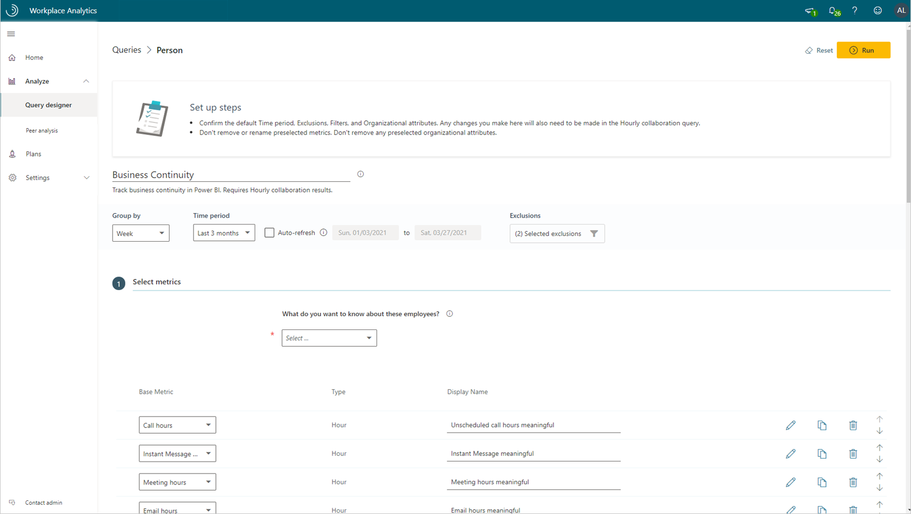
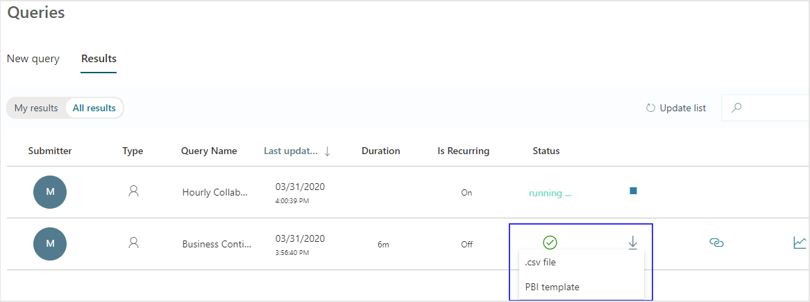

---

title: Power BI Business continuity dashboard
description: Use the Business continuity dashboard to visualize predefined query data from Workplace Analytics in Power BI
author: madehmer
ms.author: madehmer
ms.topic: article
localization_priority: normal 
ms.prod: wpa
---

# Power BI Business continuity dashboard

You can use the Power BI Business continuity dashboard populated by Workplace Analytics data to gain insights into how your organization and your employees are being impacted by the shift to remote work.

This dashboard directionally highlights where the shift to remote work might have the largest impacts, offering a measurable starting point for helping leaders understand where they might use tools and processes to support and sustain new ways of working.

The dashboard enables you to visualize and explore the following top-level business questions asked by leaders:

* How are collaboration activities changing?
* What are the impacts of work-life integration?
* Are external relationships being maintained?
* Are employees engaged and connected?
* How are work patterns evolving?
* How can remote work effectiveness be improved?

To populate the dashboard in Power BI, you must set up and successfully run the predefined **Business Continuity** and **Hourly Collaboration** queries in Workplace Analytics. The results of these queries will refresh your downloaded Power BI dashboard on a weekly basis.  

After you successfully run these required queries, you'll see the Power BI template as an available download option for the Business Continuity query. This template is required to create the dashboard in Power BI. After you download the Power BI template, you can then connect the query data from Workplace Analytics to the dashboard in Power BI.

When the Business continuity dashboard is populated with data, you can use it to visualize, explore, and report about your organization's workplace patterns and trends.

## Prerequisites  

Before you can run the queries and populate the dashboard in Power BI, you must:

* Be assigned the role of [Analyst](../use/user-roles.md) in Workplace Analytics. 
* Have the latest version of Power BI Desktop installed. If you have an earlier version of Power BI installed, uninstall it before installing the new version. 
Then go to [Get Power BI Desktop](https://www.microsoft.com/p/power-bi-desktop/9ntxr16hnw1t?activetab=pivot:overviewtab) to download and install the latest version.

## Template update

The Business Continuity dashboard is being updated on a frequent cadence to address evolving remote work business questions. To ensure you are using the latest version of the dashboard, download the Power BI template from your most recently run Workplace Analytics Business Continuity query, then repeat **Steps 8-15** in [Set up the dashboard](#set-up-the-dashboard).

> [!Note]
> If you’ve already run the queries before, you don’t need to run them again.

## Video: Dashboard setup

<iframe width="640" height="564" src="https://player.vimeo.com/video/402717048" frameborder="0" allowFullScreen mozallowfullscreen webkitAllowFullScreen></iframe>

## Set up the dashboard

1. In [Workplace Analytics](https://workplaceanalytics.office.com/), select **Analyze** > **Queries**.
2. Under **Start from preselected filters and metrics**, select **Business Continuity** (or **Hourly Collaboration** per **Step 7**) to open the predefined query, which contains the required metrics to populate the dashboard.

   

3. Select or confirm the following query settings:

   * **Name** - Customize or keep the default name
   * **Group by** - Week
   * **Time period** - Last 6 months
   * **Auto-refresh** - Enable the setting
   * **Meeting exclusions** - Select the preferred rule for your tenant

   > [!Important]
   > * The dashboard is designed to show you how a shift to remote work can change your organization's work patterns. For best results, select **Last 6 months** for the **Time period** to include time before and after a shift.
   > * If you try to delete a predefined metric, you'll see a warning that the deletion might disable portions of the Power BI dashboard and reduce query results. In turn, this can limit your ability to visualize collaboration patterns. Depending on the metric you delete, you might disable a single Power BI chart, several charts, or all the charts. Select **Cancel** to retain the metric.

   

4. In **Select filters**, select **Active only** for "**Which measured employees do you want to include?**" Optionally, you can further filter the employees in scope for the dashboard. For more details about filter and metric options, see [Create a Person Query](./person-queries.md).
5. In **Organizational data**, keep the preselected **Organization**, **LevelDesignation**, and **TimeZone** attributes that the dashboard requires. You can then select any other attributes (columns) to include in the dashboard.

   > [!Important]
   > If you remove the required, preselected Organizational data attributes, you might disable one or more Power BI charts.

6. Select **Run** to run the query, which might take several minutes to complete.
7. Repeat **Steps 2-6** for the **Hourly Collaboration** query, which requires the same selections as for Business Continuity.
8. In **Queries** > **Results**, after both queries successfully run, select the **Download** icon for the **Business Continuity** query results, select **PBI template**, and then select **OK** to download the template.

   

9. Open the downloaded **Business Continuity Power BI template**.
10. If prompted to select a program, select **Power BI**.
11. When prompted by Power BI, copy and paste the OData links for both queries into their respective fields.

    * In the Workplace Analytics **Queries** > **Results** page, select the **Link** icon for each query, and select to copy the generated OData URL link.
    * In Power BI, paste each copied link into its respective field.
    * Set the **Minimum group size** for data aggregation within this report's visualizations in accordance with your company's policy for viewing Workplace Analytics data.
    * Select **Load** to import the query results into Power BI. Loading these large files may take some time to complete.

    

12. If you're already signed in to Power BI with your Workplace Analytics organizational account, the dashboard visualizations will populate with your data. You are done and can skip the following steps. If not, proceed to the next step.
13. If you're not signed in to Power BI, or if an error occurs when updating the data, sign in to your organizational account again. In the **OData feed** dialog box, select **Organizational account**, and then select **Sign in**. See [Troubleshooting](#troubleshooting) for more details.

    

14. Select and enter credentials for the organizational account that you use to sign in to Workplace Analytics, and then select **Save**.

    >[!Important]
    >You must sign in to Power BI with the same account you use to access Workplace Analytics.

15. Select **Connect** to prepare and load the data, which can take a few minutes to complete.

## Use the dashboard

After the Business continuity dashboard is set up and populated with Workplace Analytics data, the following guidelines help you set up and use the Power BI visualization charts to analyze your organization's collaboration patterns.

### Settings

As a first step to viewing data in the dashboard, view and set the following parameters on the **Settings** page.

* **Earlier time frame** - This is the baseline for your analysis and all changes will be compared with this time frame.

    >[!Note]
    >The **Earlier time frame** must precede and not overlap with the **Current time frame**. If the two timeframes overlap, you'll get a warning about the timelines overlapping.

* **Current time frame** - This is the timeframe you want to compare with the earlier timeframe.
* **Organizational attribute to view the report by** - The primary “group-by” attribute shown in all subsequent reports. You can change this attribute at any time and all subsequent report pages will show group values by the new attribute.
* **Organizational attribute to filter by** – To filter the measured employee population, you can filter by any selected Organizational attribute, and then filter by any of the values for these attributes. If you filter, the measured employees count will reflect a reduced number. To clear an existing filter, select **Ctrl** while clicking the **Clear filter arrow** (or with a touchscreen, select the **Clear filter arrow**). Measured employees reflect the number of employees in the filtered population who were active in the specified time period. Active employees are those who sent at least one email or instant message in the work week included in the current timeframe.

  

After confirming the settings, check the number of measured employees to confirm this the population you want to analyze.

> [!Important]
> As new data is processed on a weekly basis, select **Refresh** in the Power BI Home ribbon to view the most recent data.

## About the dashboard reports

The dashboard reports directionally highlight where a shift to remote work is having the largest impact. They also give you a measurable starting point for identifying where leaders can use tools and processes to support employees in a new way of working. All metrics are defined in the **Glossary**. A “why it matters” interpretation is also included in a text box for each report.

The following describes each report with specific nuances to consider for each.

* **How are collaboration activities changing?** – Shows how employee collaboration patterns are changing in response to a shift in work patterns, and which collaboration tools people are substituting for in-person interactions.  
* **What are the impacts of work-life integration? [1]** - Helps you assess if some employees are disproportionately affected. You can select from multiple values to view the percentage of employees whose collaboration hours increased or decreased by more than the specified number of hours.
* **What are the impacts of work-life integration? [2]** - Shows changes in after-hours collaboration activity. You can select from multiple values to view the percentage of employees whose after-hours work increased or decreased by more than the specified number of hours.  You can also examine the activity by time of day for meetings, emails and instant messages. 
* **Are external relationships being maintained?** - Quantifies changes in communication with customers, partners, and other people outside the organization.  
* **Are employees engaged and connected?** - Unlike the other reports that show changes between the baseline and the current timeframes, *this report only shows metrics for the last two weeks of the current time frame*. This view enables you to assess if manager 1:1 meetings and organizational collaboration, which are keys to fostering employee engagement and community, are still occurring virtually.

  > [!Note]
  > The report’s metrics are based solely on the last two weeks of the **Current time frame** and not on a comparison with the **Earlier time frame**. Also, these charts are based on small group meetings of less than eight people and only analyze meeting, call, and instant-message activity, excluding email activity. For more details on metrics, see the Glossary in the dashboard.

### Power BI tips

A few tips to help you use the Business continuity dashboard in Power BI:  

* **Cross-filter and cross-highlight** - All visuals on a report page are interconnected. If you select a data point on one of the visuals, all the others on the page that contain that data will change, based on that selection.
* **Drill down into a visual that has a hierarchy** - When a visual has a hierarchy, you can drill down to reveal additional details. Any chart in the dashboard labeled with "By Organization and Level Designation" supports the Power BI drill down capability.
* **Export data as a table** – From the upper right corner of any visualization, select **More options** (**…**) and select **Export data**.

For more details about using Power BI, see [Interact with visuals in reports, dashboards, and apps](https://docs.microsoft.com/power-bi/consumer/end-user-visualizations).

## Share the dashboard

Like other products that work with sensitive data, such as HR systems, Workplace Analytics is not meant for the general workforce. Rather, its users are expected to have training regarding how to handle sensitive information. Training should be specific to your organization. See [Data-protection considerations](../privacy/data-protection-considerations.md) when using data generated by Workplace Analytics.

Anyone you share the Power BI *desktop file* with can access the underlying dataset at the same level of granularity as a Workplace Analytics Analyst.   For this reason, consider the following alternatives that do not provide access to the underlying data:

* **Share as a PDF or other static file** - This option generates a report that's not interactive. See [Export reports from Power BI to PDF](https://docs.microsoft.com/power-bi/consumer/end-user-pdf).
* **Publish the report to Power BI Service and share insights in an app** - This option allows other users to navigate the dashboard without access to the underlying data. See [Distribute insights in an app](https://docs.microsoft.com/power-bi/service-how-to-collaborate-distribute-dashboards-reports#distribute-insights-in-an-app) for details.

## Frequently asked questions

#### Q1 Who can create the dashboard in Power BI?

You must be assigned the role of [Analyst](../use/user-roles.md) in Workplace Analytics to create the dashboard. You must also have a Power BI license and have the desktop version installed. See [Install and run Power BI Desktop](https://docs.microsoft.com/power-bi/desktop-getting-started#install-and-run-power-bi-desktop) for details.

#### Q2 How frequently is data refreshed in the dashboard?

The dashboard gets repopulated once a week after Workplace Analytics finishes its weekend processing. **Note**: You must manually adjust the **Selected time frame** setting in the dashboard's **Settings and scope** report to view the most recently processed data.

#### Q3 How do I share the dashboard with others in my organization?

You can share the dashboard with others in your organization *without sharing the underlying data* by publishing the insights in an app or as PDF or static file. See [Share the dashboard](#share-the-dashboard) for details.

#### Q4 Can I share the underlying dashboard dataset with others in my organization?

To maintain data privacy, only employees assigned the role of [Analyst](../use/user-roles.md) in Workplace Analytics should have access to the underlying dataset in the Power BI dashboard.

#### Q5 How do I know if I have the latest version of the template?

Starting with version 2 and later versions of the template, you can find the version number at the end of the Business continuity dashboard title in the lower left of the dashboard’s [Settings](#settings) page.

#### Q6 How do I set up and run a Workplace Analytics query?

See [Create a Person Query](./person-queries.md) for details.

#### Q7 How do I change the axis of a chart to use a different Organizational data attribute?

Only the required Organizational attributes are used when setting up the Power BI file. If you selected more Organizational attributes when setting up the queries, you can use those in the visuals. 
To use a different Organizational attribute:

1. Select the visualization you want to change.  
2. In the **Fields** pane, select and drag the Organizational attribute to the **Axis** section of the visualization.

#### Q8 How do I integrate additional metrics or data sources with this dashboard?

See [Connect to data in Power BI](https://docs.microsoft.com/power-bi/connect-data/) to learn more about how to connect data in Power BI. See [Prepare organizational data](../setup/prepare-organizational-data.md) to learn about what organizational data you can analyze in Workplace Analytics and see [Data sources](../use/data-sourcesv2.md) to see what data sources you can connect to and analyze from within Workplace Analytics.

#### Q9 How do I use Power BI?

See [Power BI documentation](https://docs.microsoft.com/power-bi/) for details on how to use Power BI.

#### Q10 What languages is the dashboard available in?

The dashboard is currently only available in English.

## Troubleshooting

#### Unable to open document

If you get the following error, you do not have the latest version of Power BI.

  

However, the template might work with the earlier version of Power BI that you're using. To test it:  

1. Close any warnings.
2. If you can view the **Settings** page, the dashboard will work with this version. If you cannot view **Settings**, you need to download the latest version of Power BI.

#### Report layout differences might exist

If you get the following error, you do not have the latest version of Power BI. However, the template might work with this earlier version. To test it, repeat the steps in the previous section.

  

#### OData request failed

The following error (or similar 500+ error) can occur for one of the following reasons.

  

* **If you were not prompted to sign in with your organizational account** while setting up the dashboard and Power BI fails to load the query data, follow these steps to clear existing permissions:

  1. In Power BI, open the **Transform data** menu, and select **Data source settings**.
  2. Select **Global permissions**, select `https://workplace.analytics.office.com`, and then select **Clear permissions**.
  3. Select **Delete**.
  4. Close Power BI and follow the instructions in [Set up the dashboard](#set-up-the-dashboard).

* **If you are signed in with the wrong organizational account**, you'll get an error when loading the data with the Power BI template. To fix it, follow these steps:

  1. In Power BI, open the **Transform data** menu, and select **Data source settings**.
  2. Select **Global permissions**, select `https://workplace.analytics.office.com`, and then select **Edit permissions**.
  3. For **Credentials**, select **Edit**.
  4. In the **OData feed** dialog box, select **Organizational account**, and then select **Sign in** or **Sign in as a different user**.
  5. Select the account that you use to sign in to Workplace Analytics, enter the password, and then when prompted in **OData feed**, select **Save**.
  6. In **Edit Permissions**, select **OK**, and then close the **Data source settings** window.
  7. Close Power BI and follow the instructions in [Set up the dashboard](#set-up-the-dashboard).

#### The Power BI visuals fail to load or show errors in the tables

Power BI cannot complete a data join if data values are missing in the Organization or Level Designation tables. To validate this error:

1. In the **Fields** pane in Power BI, look for an **error** (!) icon in either the **Organization** or **LevelDesignation** tables. If you see an error, such as the following about blank values, select the field with the error to view it.

   

2. To remediate this error, select **Transform Data** from the **Transform Data** menu to open the Power Query Editor.
3. Select the **Business Continuity** query.
4. In the data preview table, locate the column for Organization and/or LevelDesignation, expand the column header, select **Remove Empty**, and then select **OK**.
5. Select the **Hourly Collaboration** query and repeat Steps 3-4 to filter out empty values.
6. Select **Close & Apply** to apply the changes and return to the dashboard.

## Support

* **Dashboard support** - Contact the Workplace Analytics team member that referred you to this page for support about onboarding, usage, and interpretation of the data contained within the dashboard.
* **Workplace Analytics support** - Refer to [Workplace Analytics documentation](../index.md) or [Workplace Analytics Support](../overview/getting-support.md) for additional help.
* **Support with other Microsoft products and tools** - Support for Power BI and other tools used in the context of this dashboard can be found through each product's associated support channels.

## Related topics

* [Power BI templates in Workplace Analytics](../tutorials/power-bi-templates.md)
* [View, download, and export query results](../use/view-download-and-export-query-results.md)
