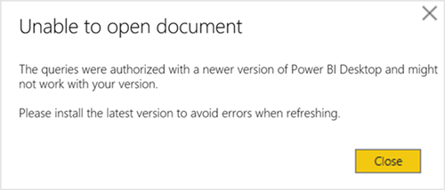
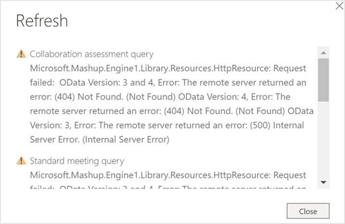
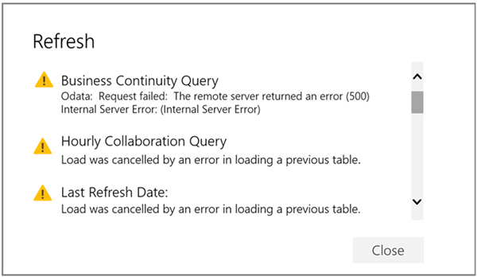

---

title: Power BI Collaboration assessment
description: Use the Collaboration assessment dashboard to visualize predefined query data from Workplace Analytics in Power BI
author: madehmer
ms.author: madehmer
ms.topic: article
localization_priority: normal 
ms.prod: wpa
---

# Power BI Collaboration assessment

The Power BI Collaboration assessment uses Workplace Analytics data to conduct a broad diagnostic of a company’s collaboration culture and employee experience. The report is designed to highlight collaboration patterns for different groups and organizational levels and to identify opportunities for improvements.

The different pages in the report help you answer the following questions relating to collaboration culture and employee experience.

**Collaboration culture**

1. How do employees spend their weekly collaboration time?
2. How is collaboration load impacting after-hours time?
3. How does the organization spend its meeting time?
4. How much time is going toward long or large meetings?
5. Who in the organization is generating the most workload by organizing meetings?
6. Can employees reclaim focus time through ‘compact’ scheduling practices?
7. Is multitasking during meetings driven by habit or necessity?
8. Which recurring meetings might present streamlining opportunities?
9. Are there opportunities to drive greater agility in emailing practices?

**Employee experience**

10. When does collaboration start impacting after-hours workload?
11. Who in the organization is at highest risk of burnout?
12. Is manager double-booking creating potential ripple effects across the company?
13. Are employees receiving sufficient 1:1 coaching time?
14. Are managers balancing oversight with employee empowerment and autonomy?
15. What managerial behaviors predominate across the company and by organization?

Each report includes a **What to examine** and **Why it matters** interpretation that explain how to analyze the data to answer the business questions and how to use best practices to maintain or improve company collaboration patterns and employee engagement.

To populate the dashboard in Power BI, you must set up and successfully run the predefined **Collaboration assessment** and **Standard meeting** queries in Workplace Analytics.

After you successfully run these queries, you can download the Power BI template for the Collaboration assessment query, which is required to create the dashboard in Power BI. After you download the Power BI template, you can then connect the query data from Workplace Analytics to the dashboard in Power BI.

## Prerequisites

Before you can run the queries and populate the dashboard in Power BI, you must:

* Be assigned the role of [Analyst](../use/user-roles.md) in Workplace Analytics.
* Have the latest version of Power BI Desktop installed. If you have an earlier version of Power BI installed, uninstall it before installing the new version. Then go to [Get Power BI Desktop](https://www.microsoft.com/p/power-bi-desktop/9ntxr16hnw1t?activetab=pivot:overviewtab) to download and install the latest version.

## Set up the dashboard

1. In [Workplace Analytics](https://workplaceanalytics.office.com/), select **Analyze** > **Queries**.
2. Under **Start from preselected filters and metrics**, select **Collaboration assessment** to open the predefined query, which contains the required metrics to populate the dashboard.
3. Select or confirm the following query settings:

   * **Name** - Customize or keep the default name
   * **Group by** - Week
   * **Time period** - Select the time period you want to analyze
   * **Auto-refresh** - Leave this setting disabled because this template is not designed to track metrics over time
   * **Meeting exclusions** - Select the preferred rule for your tenant

> [!Important]
> If you try to delete a predefined metric, you'll see a warning that the deletion might disable portions of the Power BI dashboard and reduce query results. In turn, this can limit your ability to visualize collaboration patterns. Depending on the metric you delete, you might disable a single Power BI chart, several charts, or all the charts. Select **Cancel** to retain the metric.

4. In **Select filters**, select **Active only** for **Which measured employees do you want to include?** Optionally, you can further filter the employees in scope for the dashboard. For more details about filter and metric options, see [Create a Person Query](./person-queries.md).
5. In **Organizational data**, keep the preselected **Organization** and **LevelDesignation** attributes that the dashboard requires.

> [!Important]
> If you remove the required, preselected Organizational data attributes, you might disable one or more Power BI charts.

6. You must then locate and select the organizational attribute that identifies people managers in your company (those who have employees who report to them directly or indirectly) as opposed to individual contributors (ICs). Because this field is not a required organizational attribute, your organization might not have included it when setting up Workplace Analytics. If you cannot find the field in the drop-down menu, contact your Workplace Analytics admin to confirm whether the field was included in the Organizational HR data file and made available in the query output.

> [!Important]
> You can still set up the dashboard without the people manager attribute. However, some of the Power BI charts and filtering capabilities will be disabled.

7. You can then select any additional attributes (columns) that you want to include in the reports.
8. Select **Run** to run the query, which can take a few minutes to complete.
9. Next you must run the required meeting query to get the required meeting metrics for the dashboard. Under **Start from preselected filters and metrics**, select **Standard meeting query** to open it.
10.	Select or confirm the following query settings:

    * **Name** - Customize or keep the default name
    * **Time period** – Select the time period you want to analyze; it should match the one you selected in the Collaboration assessment query.
    * **Auto-refresh** – Leave this setting disabled because this template is not designed to track metrics over time
    * **Meeting exclusions** - Select the preferred rule for your tenant

> [!Important]
> If you try to delete a predefined metric, you'll see a warning that the deletion might disable portions of the Power BI dashboard and reduce query results. In turn, this can limit your ability to visualize collaboration patterns. Depending on the metric you delete, you might disable a single Power BI chart, several charts, or all the charts. Select **Cancel** to retain the metric.

11. Optionally, you can add a filter to limit the list of meetings included in the output file.

> [!Important]
> If you filtered the **Collaboration assessment** query to focus on a specific organization (or any other organizational attribute), you must use the same filter for this **Standard meeting** query to reflect the same population.

12.	In **Organizational data**, keep the preselected **IsRecurring**, **Subject**, and **DurationHours** attributes that the dashboard requires.

> [!Important]
> If you remove the required, preselected Organizational data attributes, you might disable one or more Power BI charts.

13. You can then select any additional attributes (columns) that you want to include in the reports.
14.	Select **Run** to run the query, which can take a few minutes to complete.
15.	In **Queries** > **Results**, after both queries successfully run, select the **Download** icon for the **Collaboration assessment** query results, select **PBI template**, and then select **OK** to download the template.

   

16.	Open the downloaded **Collaboration assessment Power BI template**.
17. If prompted to select a program, select **Power BI**.
18.	When prompted by Power BI, copy and paste the OData links for both queries into their respective fields.

* In the Workplace Analytics **Queries** > **Results** page, select the **Link** icon for each query, and select to copy the generated OData URL link.
* In Power BI, paste each copied link into its respective field.
* Set the **Minimum group size** for data aggregation within this report's visualizations in accordance with your company's policy for viewing Workplace Analytics data.
* In **Manager indicator field**, enter the exact name of the organizational attribute that you selected in **Step 6**, which designates who in the organization is a people manager.
* Select **Load** to import the query results into Power BI. Loading these large files may take some time to complete.

19. If you're already signed in to Power BI with your Workplace Analytics organizational account, the dashboard visualizations will populate with your data. You are done and can skip the following steps. If not, proceed to the next step.
20. If you're not signed in to Power BI, or if an error occurs when updating the data, sign in to your organizational account again. In the **OData feed** dialog box, select **Organizational account**, and then select **Sign in**. See [Troubleshooting](#troubleshooting) for more details.

    

21. Select and enter credentials for the organizational account that you use to sign in to Workplace Analytics, and then select **Save**.

    >[!Important]
    >You must sign in to Power BI with the same account you use to access Workplace Analytics.

22. Select **Connect** to prepare and load the data, which can take a few minutes to complete.

## Dashboard settings

After the Collaboration assessment dashboard is set up and populated with Workplace Analytics data in Power BI, as a first step to viewing data in the dashboard, view and set the following parameters on the **Settings** page.

* **Time period** - This is the time period that you want to analyze.
* **Exclude specific weeks** – You can select one or more weeks to exclude from analysis, such as those that include company holidays.
* **Exclude employees with low collaboration** – Optionally, you can select to exclude employees who are likely non-knowledge workers or are not Outlook or Teams users. In the Collaboration assessment template, these are employees who spent on average less than five hours per week in collaboration—meetings, email and Teams chats & ad-hoc calls.
* **Exclude unusually low collaboration weeks based on individual collaboration patterns** – Optionally, you can select to exclude weeks with unusually low collaboration hours for a given employee, which is determined by comparing their individual weekly averages across the complete time period. These low collaboration weeks usually occur when employees are taking personal time off (PTO).
* **Select the organizations to analyze** – Optionally, you can select one or more organizations or functional groups within your company to focus the analysis on.

  

After confirming the settings, check the number of measured employees to confirm this the population you want to analyze.

## About the reports

The Collaboration assessment dashboard includes the following report pages.

**Collaboration culture**

* **Collaboration** – Shows average weekly collaboration hours per person, by manager indicator and organization. This highlights how employees are collaborating and what percentage of a standard 40-hour workweek is spent on meetings, email and Teams chats & ad-hoc calls. It’s important that employees have enough time to focus and get work done. Collaboration levels directly impact employee productivity and engagement.
* **Collaboration & after-hours** – Shows the average weekly collaboration hours per person by organization as compared to after-hours collaboration, and the percentage of a standard 40-hour workweek spent in collaboration. This highlights how collaboration load is impacting after-hours work.
* **Meeting culture** – Shows the percentage of time spent in the different meeting types by attendees and duration. This highlights how the organization spends its meeting time. Large or long recurring meetings are easy candidates to streamline by reducing the number of attendees or the meeting frequency or duration.
* **Long or large meetings** – Shows the percentage of meeting time spent in large or long meetings by organization. Analyzing meeting practices at the organizational level can help pinpoint sources of meeting overload to streamline or those organizations with successful meeting best practices that could be replicated across the company.
* **Generated workload** – Shows the distribution of employees by the number of meeting hours each employee generated by organizing meetings. This highlights who in the organization is generating the most workload by organizing meetings.
* **Fragmentation** – Shows the fragmented hours as compared to the number of meetings that employees attend weekly. This can help you guide employees to reclaim important focus time through compact meeting scheduling practices.
* **Multitasking** – Shows the distribution of employees by their average collaboration hours and average multitasking rate. This analysis helps determine if multitasking rates during meetings are a function of habit or a consequence of lacking enough free time during the workday to catch up on email outside of meetings.
* **Meeting engagement** – Shows recurring meetings by meeting impact and meeting engagement and lists the top 20 low engagement recurring meetings. This highlights which recurring meetings are good candidates to streamline by reducing the number of attendees or the meeting cadence or duration.
* **Email load** – Shows the distribution of emails sent based on the number of recipients of each email. It also shows the percentages of these email categories sent by employees in each organization. This can help your organization drive greater agility in emailing practices.

**Employee experience**

* **After-hours pressure** – Shows the average number of after-hours collaboration hours per week as a function of total time spend in collaboration and highlights if and when weekly collaboration starts impacting after-hours workload. 
* **Burnout risk** – Shows the distribution of employees by collaboration hours and workweek span, which helps you identify who in the organization is at highest risk of burnout.
* **Double-booking** – Shows the distribution of managers by meeting hours and the percentage of double-booked manager time in meetings. This highlights how double-booked meetings have downstream impacts that hinder organizational agility.

  >[!Important]
  >To filter for manager data only, you must select all manager groups in the Manager Indicator at the upper right of the page.

* **Manager 1:1 time & frequency** – Shows the distribution of employees by how much weekly 1:1 time they get with their managers and the frequency of these meetings. This highlights if employees are getting enough 1:1 manager coaching. 
* **Co-attendance** – Shows the percentage of employees who spend more than 30% of their meeting time in meetings where their manager is also present. This highlights if managers are balancing oversight with employee empowerment and autonomy. However, it’s important to account for any expectations and norms unique to your company when analyzing the data across the different groups.

  >[!Important]
  >To filter for manager data only, you must select all manager groups in the Manager Indicator at the upper right of the page.

* **Manager relationship** – Shows the distribution of employees based on their average co-attendance meeting rate and average weekly 1:1 meeting time with their managers compared across the company. It also analyzes different segments of manager behaviors based on co-attendance rates and manager 1:1 meeting time.

The dashboard also includes a **Glossary** page that describes all the report metrics.

## Power BI tips

A few tips to help you use the Business continuity dashboard in Power BI:  

* **Cross-filter and cross-highlight** - All visuals on a report page are interconnected. If you select a data point on one of the visuals, all the others on the page that contain that data will change, based on that selection.
* **Export data as a table** – On the upper right of any visualization, select **More options** (**…**) and select **Export data**.

For more details about using Power BI, see [Interact with visuals in reports, dashboards, and apps](https://docs.microsoft.com/power-bi/consumer/end-user-visualizations).

## Share the dashboard

Like other products that work with sensitive data, such as HR systems, Workplace Analytics is not meant for the general workforce. Rather, its users are expected to have training regarding how to handle sensitive information. Training should be specific to your organization. See [Data-protection considerations](../privacy/data-protection-considerations.md) when using data generated by Workplace Analytics.

Anyone you share the Power BI *desktop file* with can access the underlying dataset at the same level of granularity as a Workplace Analytics Analyst. For this reason, consider the following alternatives that do not provide access to the underlying data:

* **Share as a PDF or other static file** - This option generates a report that's not interactive. See [Export reports from Power BI to PDF](https://docs.microsoft.com/power-bi/consumer/end-user-pdf).
* **Publish the report to Power BI Service and share insights in an app** - This option allows other users to navigate the dashboard without access to the underlying data. See [Distribute insights in an app](https://docs.microsoft.com/power-bi/service-how-to-collaborate-distribute-dashboards-reports#distribute-insights-in-an-app) for details.

## Frequently asked questions

#### Q1 Who can create the dashboard in Power BI?

You must be assigned the role of [Analyst](../use/user-roles.md) in Workplace Analytics to create the dashboard. You must also have a Power BI license and have the desktop version installed. See [Install and run Power BI Desktop](https://docs.microsoft.com/power-bi/desktop-getting-started#install-and-run-power-bi-desktop) for details.

#### Q2 How frequently is data refreshed in the dashboard?

The Collaboration assessment report is designed to conduct a broad diagnostic of your company’s collaboration culture and employee experience for a given time period. The report is not designed to track metrics over time and therefore there is no need to refresh the report on a weekly basis.

#### Q3 How do I share the dashboard with others in my organization?

You can share the dashboard with others in your organization *without sharing the underlying data* by publishing the insights in an app or as PDF or static file. See [Share the dashboard](#share-the-dashboard) for details.

#### Q4 Can I share the underlying dashboard dataset with others in my organization?

To maintain data privacy, only employees assigned the role of [Analyst](../use/user-roles.md) in Workplace Analytics should have access to the underlying dataset in the Power BI dashboard.

#### Q5 How do I set up and run a Workplace Analytics query?

See [Create a Person Query](./person-queries.md) and [Create a meeting query](./meeting-queries.md) for details.

#### Q6 How do I change the axis of a chart to use a different Organizational data attribute?

Only the required Organizational attributes are used when setting up the Power BI file. If you selected more Organizational attributes when setting up the queries, you can use those in the visuals. To use a different Organizational attribute:

1. Select the visualization you want to change.  
2. In the **Fields** pane, select and drag the Organizational attribute to the **Axis** section of the visualization.

#### Q7 How do I integrate additional metrics or data sources with this dashboard?

See [Connect to data in Power BI](https://docs.microsoft.com/power-bi/connect-data/) to learn more about how to connect data in Power BI. See [Prepare organizational data](../setup/prepare-organizational-data.md) to learn about what organizational data you can analyze in Workplace Analytics and see [Data sources](../use/data-sourcesv2.md) to see what data sources you can connect to and analyze from within Workplace Analytics.

#### Q8 How do I use Power BI?

See [Power BI documentation](https://docs.microsoft.com/power-bi/) for details on how to use Power BI.

#### Q9 What languages is the dashboard available in?

The dashboard is currently only available in English.

## Troubleshooting

#### Unable to open document

If you get the following error, you do not have the latest version of Power BI.

  

However, the template might work with the earlier version of Power BI that you're using. To test it:  

1. Close any warnings.
2. If you can view the **Settings** page, the dashboard will work with this version. If you cannot view **Settings**, you need to download the latest version of Power BI.

#### Report layout differences might exist

If you get the following error, you do not have the latest version of Power BI. However, the template might work with this earlier version. To test it, repeat the steps in the previous section.

  

#### OData request failed

An error similar to the following can occur for one of the following reasons.

  

* **If you were not prompted to sign in with your organizational account** while setting up the dashboard and Power BI fails to load the query data, follow these steps to clear existing permissions:

  1. In Power BI, open the **Transform data** menu, and select **Data source settings**.
  2. Select **Global permissions**, select `https://workplace.analytics.office.com`, and then select **Clear permissions**.
  3. Select **Delete**.
  4. Close Power BI and follow the instructions in [Set up the dashboard](#set-up-the-dashboard).

* **If you are signed in with the wrong organizational account**, you'll get an error when loading the data with the Power BI template. To fix it, follow these steps:

  1. In Power BI, open the **Transform data** menu, and select **Data source settings**.
  2. Select **Global permissions**, select `https://workplace.analytics.office.com`, and then select **Edit permissions**.
  3. For **Credentials**, select **Edit**.
  4. In the **OData feed** dialog box, select **Organizational account**, and then select **Sign in** or **Sign in as a different user**.
  5. Select the account that you use to sign in to Workplace Analytics, enter the password, and then when prompted in **OData feed**, select **Save**.
  6. In **Edit Permissions**, select **OK**, and then close the **Data source settings** window.
  7. Close Power BI and follow the instructions in [Set up the dashboard](#set-up-the-dashboard).

## Support

* **Dashboard support** - Contact the Workplace Analytics team member that referred you to this page for support about onboarding, usage, and interpretation of the data contained within the dashboard.
* **Workplace Analytics support** - Refer to [Workplace Analytics documentation](../index.md) or [Workplace Analytics Support](../overview/getting-support.md) for additional help.
* **Support with other Microsoft products and tools** - Support for Power BI and other tools used in the context of this dashboard can be found through each product's associated support channels.

## Related topics

* [Power BI templates in Workplace Analytics](../tutorials/power-bi-templates.md)
* [View, download, and export query results](../use/view-download-and-export-query-results.md)
