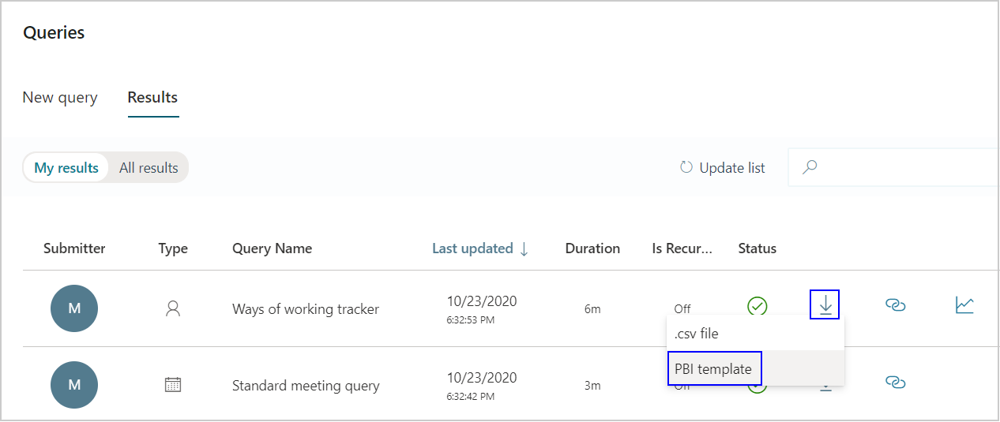

---

title: Power BI Ways of working tracker
description: Use the Ways of working tracker dashboard to visualize predefined collaboration data from Workplace Analytics in Power BI
author: madehmer
ms.author: v-mideh
ms.topic: article
localization_priority: normal 
ms.prod: wpa
---

# Ways of working tracker

The Power BI Ways of working tracker uses Workplace Analytics data to help you, as an analyst track changes in collaboration over time and helps you target opportunities to improve employee wellbeing, meeting culture, and manager effectiveness.

This dashboard helps you track how collaboration is affecting the key performance indicators (KPIs) for employees by answering the following business questions.

* **How have the KPIs evolved over time?** – Shows trends for the key indicator categories, including average values for the most recent week’s top collaboration metrics.
* **How have KPIs changed in the last week?** – Shows how collaboration in the key indicator categories have changed from last week’s rolling average as compared to the   previous weeks’ rolling average.
* **How do organizations compare?** – Shows the collaboration averages per week for each organizational group for each key category.
* **Have any key scorecard metrics changed?** – The scorecards for each of the key indicators show weekly averages by organizational group and the percentage change from the baseline to the current time period.
* **Are trends moving in the right direction?** – The trend pages show how the key indicators are changing over time, including improving manager coaching and reducing after-hours work, lengthy, bloated, and meetings attended by employees and their managers.

The dashboard also includes an **Example interventions** page that has ideas on how to drive positive change with best practices based on industry insights and research. The **Glossary** page describes the metrics used in the different reports.

To populate the dashboard in Power BI, you must set up and successfully run the predefined **Ways of working tracker** query in Workplace Analytics. The query results will refresh your downloaded Power BI dashboard on a weekly basis.

>[!Note]
>The template and dashboard name has been changed from Collaboration tracker to Ways of working tracker.

## Demonstration

This uses sample data that is only representative of the dashboard and might not be exactly what you see in a live dashboard specific to your organization's unique data.

 <iframe width="800" height="486" src="https://msit.powerbi.com/view?r=eyJrIjoiOGNmZDVjNTQtZjdiYy00M2JjLWE5MjAtMTM3YzY0Zjk3OTI2IiwidCI6IjcyZjk4OGJmLTg2ZjEtNDFhZi05MWFiLTJkN2NkMDExZGI0NyIsImMiOjV9&embedImagePlaceholder=true" frameborder="0" allowFullScreen="true"></iframe>

## Prerequisites

Before you can run the queries and populate the dashboard in Power BI, you must:

* Be assigned the role of [Analyst](../use/user-roles.md) in Workplace Analytics.
* Have the latest version of Power BI Desktop installed. If you have an earlier version of Power BI installed, uninstall it before installing the new version. Then go to [Get Power BI Desktop](https://www.microsoft.com/p/power-bi-desktop/9ntxr16hnw1t?activetab=pivot:overviewtab) to download and install the latest version.

## Set up the dashboard

1. In [Workplace Analytics](https://workplaceanalytics.office.com/), select **Analyze** > **Queries**.
2. Under **Start from preselected filters and metrics**, select **Ways of working tracker** to open the predefined query, which contains the required metrics to populate the dashboard.
3. Select or confirm the following query settings:

   * **Name** - Customize or keep the default name
   * **Group by** - Week
   * **Time period** - Select the time period you want to analyze
   * **Auto-refresh** - Enable the setting
   * **Meeting exclusions** - Select the preferred rule for your tenant

   > [!Important]
   > If you try to delete a predefined metric, you'll see a warning that the deletion might disable portions of the Power BI dashboard and reduce query results. In turn, this can limit your ability to visualize collaboration patterns. Depending on the metric you delete, you might disable a single Power BI chart, several charts, or all the charts. Select **Cancel** to retain the metric.

4. In **Select filters**, select **Active only** for **Which measured employees do you want to include?** Optionally, you can further filter the employees in scope for the dashboard. For more details about filter and metric options, see [Create a Person Query](./person-queries.md).
5. In **Organizational data**, keep the preselected **Organization** and **LevelDesignation** attributes that the dashboard requires. You can then select any additional attributes (columns) that you want to include in the reports.

   > [!Important]
   > If you remove the required, preselected Organizational data attributes, you might disable one or more Power BI charts.

6. Select **Run** to run the query, which can take a few minutes to complete.
7. In **Queries** > **Results**, after both queries successfully run, select the **Download** icon for the **Ways of working tracker** query results, select **PBI template**, and then select **OK** to download the template.

    

8. Open the downloaded **Ways of working tracker Power BI template**.
9. If prompted to select a program, select **Power BI**.
10. When prompted by Power BI:

    * In the Workplace Analytics **Queries** > **Results** page, select the **Link** icon for the Ways of working tracker query, and then select to copy the generated OData URL link.
    * In Power BI, paste the copied link into its respective field.
    * Set the **Minimum group size** for data aggregation within this report's visualizations in accordance with your company's policy for viewing Workplace Analytics data.
    * Select **Load** to import the query results into Power BI. Loading these large files may take some time to complete.

11. If you're already signed in to Power BI with your Workplace Analytics organizational account, the dashboard visualizations will populate with your data. You are done and can skip the following steps. If not, proceed to the next step.
12. If you're not signed in to Power BI, or if an error occurs when updating the data, sign in to your organizational account again. In the **OData feed** dialog box, select **Organizational account**, and then select **Sign in**. See [Troubleshooting](../tutorials/power-bi-templates.md#troubleshooting) for more details.

    

13. Select and enter credentials for the organizational account that you use to sign in to Workplace Analytics, and then select **Save**.

     >[!Important]
     >You must sign in to Power BI with the same account you use to access Workplace Analytics.

14. Select **Connect** to prepare and load the data, which can take a few minutes to complete.

## Dashboard settings

After the Ways of working tracker dashboard is set up and populated with Workplace Analytics data in Power BI, as a first step to viewing data in the dashboard, view and set the following parameters on the **Settings** page.

* **Earlier time  period** - This is the baseline for your analysis and all changes will be compared with this time frame.

    >[!Note]
    >The **Earlier time frame** must precede and not overlap with the **Current time frame**. If the two timeframes overlap, you'll get a warning about the timelines overlapping.

* **Current time period** – This is the time period you want to compare with the earlier time period.
* **Organizational attribute to view the report by** - The primary “group-by” attribute shown in all subsequent reports. You can change this attribute at any time and all subsequent report pages will show group values by the new attribute.
* **Organizational attribute to filter by** – To filter the measured employee population, you can filter by any selected Organizational attribute, and then filter by any of the values for these attributes. If you filter, the measured employees count will reflect a reduced number. To clear an existing filter, select **Ctrl** while clicking the **Clear filter arrow** (or with a touchscreen, select the **Clear filter arrow**). Measured employees reflect the number of employees in the filtered population who were active in the specified time period. Active employees are those who sent at least one email or instant message in the work week included in the current timeframe.

After confirming the settings, check the number of measured employees to confirm this is the population you want to analyze.

  

## About the reports

The Ways of working tracker dashboard includes the following reports for tracking how collaboration is affecting the KPIs of wellbeing, meeting culture, and manager effectiveness for your employees.

* **How have the KPIs evolved over time?** – Shows trends for the key indicator categories, including the weekly average and the four-week rolling average values for the top collaboration metrics. Under **Select trendlines to display** at the upper right of the page, you can select to show only one or both averages in the charts.
* **How have KPIs changed in the last week?** – Shows how collaboration in the key indicator categories have changed when comparing the most recent week’s four-week rolling average with the previous rolling average. The colors of the number represent a change between the current week and the four-week rolling average. In **Filter Organization**, you can select one or more organizational groups to include in the data and the chart. In **Filter Metrics**, you can select a metric to view in the chart.
* **How do organizations compare?** – Charts the weekly collaboration averages for each organization by category. In the **What to watch** for section for each chart, explains how to interpret the chart data.
* **Have any key scorecard metrics changed?** – The scorecards use colors to represent the percentage changes or trend directions for the current time period as compared to the previous time period, which you set on the **Settings** page. **Green** represents a positive change, **yellow** represents no change (or less than a five percent negative change), and **red** represents a negative change in the percentage or trend. The following scorecards list the weekly averages and their change percentages, which are based on the comparison of the weekly current period average with the previous time period.

  * **Wellbeing scorecard** –Values are listed by organization for the key indicators that focus on wellbeing, including collaboration hours, after-hours work, and burnout risk.
  * **Meeting culture scorecard** –Values are listed by organization for the key indicators that focus on meeting culture, including reduce meeting hours, reduce lengthy meeting hours, and reduce bloated meetings.
  * **Manager effectiveness scorecard** – Values are listed by organization for the key indicators that focus on manager effectiveness, including increasing manager 1:1 coaching, reducing the number of meetings where managers and employees are in attendance, and improving coaching relationships.

* **Are the KPIs trending in the right direction?** – The charts on the left of these trend pages show how the different key indicators are trending by comparing weekly averages between the different organizational groups for the current time period. The charts on the right compare how the averages have changed between the current and baseline time periods. Each trend page also includes a **Why it matters** section that explains why the indicator is important to analyze.

  * **After-hours trends** – Charts the weekly averages by organization for after-hours collaboration as compared to collaboration that occurred during working hours for the current time period. The other chart compares how employee averages by organization for after-hours collaboration have changed between the current and baseline time periods.
  * **Lengthy meeting trends** – Charts the weekly meeting averages for hours spent by organizational groups in lengthy meetings as compared to non-lengthy meeting hours spent in the current time period. The other chart shows how the averages have changed between the current and baseline time periods by organizational group.
  * **Bloated meeting trends** – Charts the weekly meeting averages for hours spent by organizational groups in bloated meetings as compared to non-bloated  meeting hours spent in the current time period. The other chart shows how the averages have changed between the current and baseline time periods by organizational group.
  * **Manager coaching trends** – Charts the total number of employees by organizational group who averaged n number of 1:1 meetings with their managers and met the goal of 60-minutes per month for the current time period. It compares managers who met and did not meet the 60-minute monthly goal. The other chart shows how the trend has changed by organizational group between the current and baseline time periods.
  * **Co-attendance trends** – Charts the weekly meeting averages for hours spent by organizational groups in meetings that were attended by managers and their employees as compared to regular meeting hours where they didn’t attend the same meetings for the current time period. The other chart shows how the averages have changed between the current and baseline time periods by organizational group.

The dashboard also includes an **Example interventions** page that has ideas on how to drive positive change with best practices based on industry insights and research. The **Glossary** page describes the metrics used in the different reports.

### Training opportunity

Use this training module to learn how to <!-- ADD THIS WHEN THE RIGHT LINK IS AVAILABLE  set up and interpret the results from the Power BI Business continuity dashboard: [Evaluate shifts in work patterns with the Business continuity dashboard in Microsoft Workplace Analytics](https://aka.ms/wpa-bcd) -->

## Power BI tips, troubleshooting, and FAQs

For details about how to share the dashboard and other Power BI tips, troubleshoot any issues, or review the most frequently asked questions, see [Power BI templates in Workplace Analytics](../tutorials/power-bi-templates.md).

## Related topic

[View, download, and export query results](../use/view-download-and-export-query-results.md)

