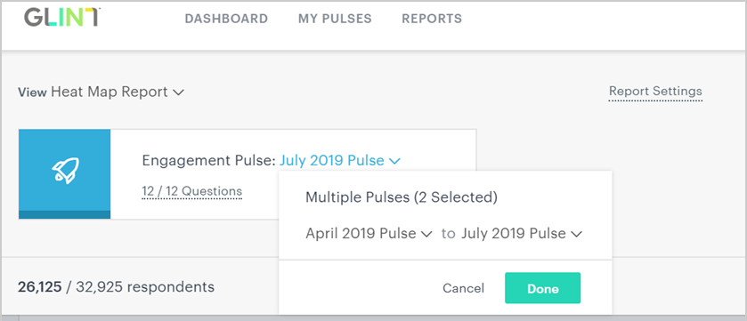
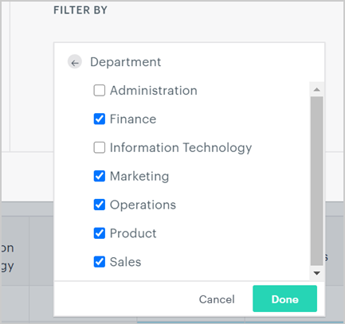
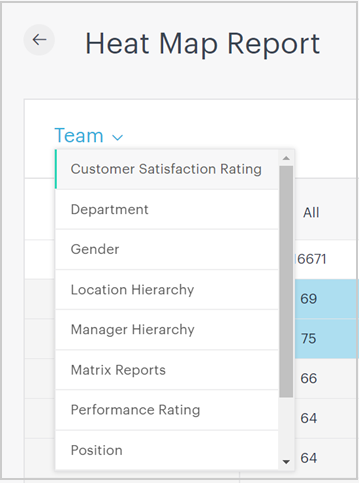
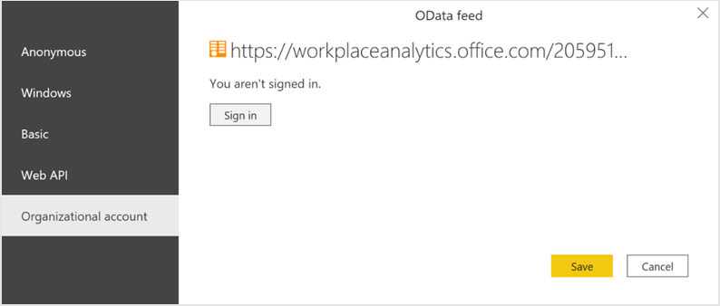

---

title: Behavior patterns dashboard
description: Use this dashboard to visualize analysis in Power BI that combines Workplace Analytics and Glint data
author: madehmer
ms.author: v-mideh
ms.topic: article
localization_priority: normal 
ms.prod: wpa
---

# Behavior patterns with Glint

The Behavior patterns dashboard uses a Power BI template to combine behavioral data from Workplace Analytics and sentiment data from Glint. Leaders get insights into underlying factors that might be contributing to both how their employees feel and how they work. The analysis helps identify opportunities to influence behavior and improve business outcomes.

It uses survey scores and working patterns to identify outlying teams who might need attention. Even for leaders who are already aware of team issues, the dashboard creates high-level visibility enabling them to use research-based and data-driven actions to change or improve workplace behaviors.

This release of the dashboard combines the following data.

|Theme |Representative Glint survey question |Workplace Analytics metrics |
|------------|------------|------------|
|Wellbeing |My company takes a genuine interest in employees' wellbeing. |<ul><li>After hours metrics </li><li>Collaboration hours </li><li>Workweek span </li></ul>|
|Prioritization |I know what I should be focusing on right now. |Manager one-on-one hours |
|Employee connection |My company is doing a good job of helping employees feel connected to one another. |<ul><li>Internal network size</li><li>Small group meeting hours </li></ul>|

The dashboard includes the following reports.

* **Is there a relationship between employee wellbeing and collaboration?** – Compares wellbeing scores for the selected HR attributes, such as organization or level designation, and shows how workweek span, after hours, and collaboration hours might be affecting wellbeing for specific groups. You'll also see research-based, actionable strategies to help change behaviors that might contribute to low wellbeing scores.
* **Is there a relationship between work prioritization and manager engagement** – Compares prioritization scores for the selected HR attribute to show how manager one-on-one hours might be affecting employees’ ability to focus on and prioritize their work. Gives teams easy-to-implement plans that create opportunities for employees to more regularly meet with their managers one-on-one and prioritize their work.
* **Look for teams feeling disconnected that will benefit from better networking** – Compares employee connection scores for the selected HR attribute to show how small group meeting hours and internal network size might be affecting employees’ feeling of connection. Helps leaders identify and support teams who might have underlying conditions that are affecting both their connection scores and collaboration patterns.
* **How can I take action to improve employee wellbeing?** - Summarizes opportunities to improve employee wellbeing by addressing related behaviors. After changes start to occur, leaders can use Workplace Analytics data to measure real-time change in collaboration behaviors and track improvement with subsequent Glint survey scores.
* **How can I take action to improve prioritization and connection?** - Summarizes opportunities to improve focus on priority tasks and employee connection by addressing related behaviors. After changes start to occur, leaders can use Workplace Analytics data to measure real-time change in collaboration behaviors and track improvement with subsequent Glint survey scores.

## Demonstration

This uses sample data that is only representative of the dashboard and might not be exactly what you see in a live dashboard specific to your organization's unique data.

<iframe width="800" height="486" src=https://msit.powerbi.com/view?r=eyJrIjoiZTYwMWI3MDctYTU3Mi00N2MxLWE4NmYtNjU4YzhlYmMxMGQ4IiwidCI6IjcyZjk4OGJmLTg2ZjEtNDFhZi05MWFiLTJkN2NkMDExZGI0NyIsImMiOjV9&embedImagePlaceholder=true frameborder="0" allowFullScreen="true"></iframe>

## Setup video

The following video describes how to set up the dashboard, which might not be your exactly what you experience with data that's unique to organization.

<iframe src="https://player.vimeo.com/video/475970348" width="800" height="486" frameborder="0" allow="autoplay; fullscreen" allowfullscreen></iframe>

## High-level steps

The high-level steps required to populate the dashboard in Power BI:

1. [Get Glint data](#get-the-glint-data) - In Glint, select the corresponding survey questions and the population to analyze in Power BI, including the HR attributes you want to analyze, such as team and position. Then export a Heat Map report file with this data.
2. [Get Workplace Analytics data](#get-the-workplace-analytics-data) - Set up and run the predefined **Behavior patterns for Glint** query in Workplace Analytics. After the query successfully runs, download the Power BI template for the Glint query on the **Results** page. This template is required to create the dashboard in Power BI.
3. [Load both into Power BI](#load-the-data-in-power-bi) - Connect to and load both the query data from Workplace Analytics and the Heat map from Glint into Power BI.

## Prerequisites

The following is required before you can run the query in Workplace Analytics and populate the dashboard in Power BI.

* Your company uses Glint with the same measured population as Workplace Analytics has data for:

  * The population reflected in the Glint Heat Map report is the same as the filtered population in the Behavior patterns for Glint query.
  * You have Glint survey content for the last six months that includes questions on employee wellbeing, prioritization, and connectivity.

* Be assigned the role of Analyst in Workplace Analytics.
* Have the latest version of Power BI Desktop installed. If you have an earlier version of Power BI installed, uninstall it before installing the new version. Then go to [Get Power BI Desktop](https://www.microsoft.com/p/power-bi-desktop/9ntxr16hnw1t?activetab=pivot:overviewtab) to download and install the latest version.
* Have at least one of the following organizational attributes already uploaded and processed in Workplace Analytics.

  * **Level designation** - Each employee's level in the organization.
  * **Organization or team** - Each employee’s team assignment, which reflects the organization or business division they're in.

## Get the Glint data

1. In Glint, select **Reports** > **Heat Map**, and then select the reports that have questions on wellbeing, prioritization, and connectivity. If the questions spread across different pulse dates, select the **Multiple Pulses** option.

   

2. In **Filter By**, select the applicable departments for the population you want to analyze in Power BI, and then select **Done**.

   

3. Select the grouping attributes that are also used in Workplace Analytics for the report.

   

4. In **Add section**, select (up to five) other grouping attributes to analyze by, which must also be present in Workplace Analytics.
5. Select **Export to spreadsheet** to download the report.

   

6. Save the spreadsheet in an accessible location.

## Get the Workplace Analytics data

1. In [Workplace Analytics](https://workplaceanalytics.office.com/), select **Analyze** > **Queries**.
2. Under **Start from preselected filters and metrics**, select **Behavior patterns for Glint** to open the predefined query.
3. Select or confirm the following query settings:

   * **Name** - Customize or keep the default name
   * **Group by** - Week
   * **Time period** - Select the time period that corresponds to the time period that the Glint survey questions ask about
   * **Auto-refresh** - Keep this setting disabled
   * **Meeting and attendee exclusions** - Select the preferred rules for your tenant

   > [!Important]
   > If you try to delete a predefined metric, you'll see a warning that the deletion might disable portions of the Power BI dashboard and reduce query results. In turn, this can limit your ability to visualize collaboration patterns. Depending on the metric you delete, you might disable a single Power BI chart, several charts, or all the charts. Select **Cancel** to retain the metric.

4. In **Select filters**, select **Active only** for "**Which measured employees do you want to include?**," and optionally, you can further filter the employees in scope for the dashboard. For more details about filter and metric options, see [Create a Person Query](./person-queries.md).
5. In **Organizational data**, keep the preselected **Organization** and **LevelDesignation** attributes that the dashboard requires and up to three more that match up with the attributes included in Glint data.

   > [!Important]
   > If you remove the required, preselected Organizational data attributes, you might disable one or more Power BI charts.

6. Select **Run** to run the query, which can take a few minutes up to a few hours to complete.
7. In **Queries** > **Results**, after the query successfully runs, select the **Download** icon for the **Behavior patterns for Glint** query results, select **PBI template**, and then select **OK** to download the template.

## Load the data in Power BI

1. Open the downloaded **Behavior patterns for Glint** template.
2. If prompted to select a program, select **Power BI**.
3. When prompted by Power BI, enter the following, and then select **Load** to import the query results into Power BI.

    * In the Workplace Analytics **Queries** > **Results** page, select the **Link** icon, and then select to copy the generated OData URL link.
    * In Power BI, paste the copied OData link for **Workplace Analytics query for Glint URL**.
    * In the **Glint Heat Map report**, copy and paste the Heat Map file path.
    * In **Minimum group size**, enter a number for data aggregation within this report's visualizations that complies with your company's policy for viewing Workplace Analytics data.

4. If you're already signed in to Power BI with your Workplace Analytics organizational account, the dashboard visualizations will populate with your data. You are done and can skip the following steps. If not, proceed to the next step.
5. If you're not signed in to Power BI, or if an error occurs when updating the data, sign in to your organizational account again. In the **OData feed** dialog box, select **Organizational account**, and then select **Sign in**. See [Troubleshooting](../tutorials/power-bi-templates.md#troubleshooting) for more details.

    

6. Select and enter credentials for the organizational account that you use to sign in to Workplace Analytics, and then select **Save**.

     >[!Important]
     >You must sign in to Power BI with the same account you use to access Workplace Analytics.

7. Select **Connect** to prepare and load the data, which can take a few minutes to complete.

## Dashboard settings

After the Behavior patterns dashboard is set up and populated with both the Glint and Workplace Analytics data in Power BI and before viewing data in the dashboard, set the following parameters on the **Settings** pages.

* **Settings (1) Map themes to Glint survey Heat Map** – Map the work pattern used in Workplace Analytics data to compare with the applicable question in the Glint survey.
* **Settings (1) Select time period for each report theme** – Select the time periods for each of the work patterns that you want to view in the reports.
* **Settings (2) Map the Glint attribute of interest to the corresponding Workplace field** - The primary “group-by” attribute that represents the teams in both Glint and Workplace Analytics must be mapped to each other because they're used and shown in all subsequent reports. You can change these mappings at any time and all subsequent report pages will show group values based on your changes. To clear an existing mapping, select the **Reset arrow**.

## Power BI tips, troubleshooting, and FAQs

For details about how to share the dashboard and other Power BI tips, troubleshoot any issues, or review the most frequently asked questions, see [Power BI templates in Workplace Analytics](../tutorials/power-bi-templates.md).

## Related topic

[View, download, and export query results](../use/view-download-and-export-query-results.md)
