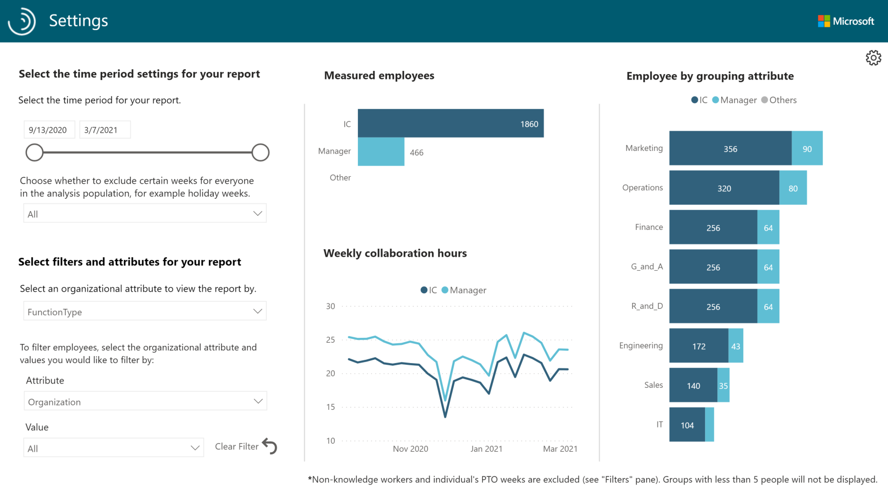

# Manager effectiveness

The Manager effectiveness dashboard for Power BI uses Workplace Analytics data to view standard behaviors and leadership exposure among managers in your organization. Leaders can use this analysis to measure behaviors and trends of people managers across the organization. You'll also get insights about key behaviors by organization and best practices recommended by industry experts to either maintain or improve leadership work patterns.

This dashboard provides insights into the following areas about your organization.

* **Manager metrics** - Shows the metrics and trends about manager behaviors in key areas, such as average collaboration, meeting, email, and focus hours.
* **Leadership exposure** – Shows how leaders interact with employees in your organization, including manager coaching hours, manager generated workload meetings and email, meeting hours with managers, and skip-level meetings.

The dashboard includes the following reports that answer the related business questions, along with a **Why it matters** interpretation.

* **Coach - Do managers have enough time for their employees?** - Shows the weekly average number of hours that managers spend collaborating with people in the organization grouped by organizationa and type of communication, including meetings, emails, chats, and calls. It also shows the average percentage of collaboration time that managers spent with direct reports as compared to others in the organization.
* **Coach - Are employees receiving sufficient coaching time with their manager?** – Shows the monthly average number of minutes that employees spent in 1:1 meetings with their direct managers. It also shows the percentage of employees who spent different ranges of time in the last four weeks in 1:1s with their manager and the average frequency of 1:1 time for employees grouped by organization in a week, month, or quarter.
* **Empower - Are managers balancing oversight with employee autonomy?** - Shows the percentage of employees whose managers co-attend their meetings and the weekly average number of hours that managers co-attended meetings with their direct reports.
* **Empower - How are manager habits impacting employee empowerment, workflows, and trust?** - Compares average percentages of collaboration load that's generated by managers as compared to individual contributors grouped by organization. It also compares scheduled and unscheduled collaboration time that managers generate, including meetings, email, Teams calls and chats.
* **Connect - Do managers have a large, diverse, and influential network to enable and support their teams?** - Shows average connectivity metrics for managers, including distinct internal connections across different organizations and what percentage of managers are in the top 20 percent of influencers. It also shows details about the size and breadth of contacts and influencing potential for managers, which are grouped by organization.
* **Connect - Do well-connected and influential managers have well-connected teams?** - Shows the internal network size of managers as compared to individual contributors grouped by organization. It also shows the internal network size distribution of managers as compared to the full organizational population grouped by organization.
* **Model - Are managers modeling good work-life balance?** -Shows the weekly average of after-hours work for managers as compared to individual contributors in the organization. It also shows the difference in average workweek span collaboration hours for managers and for individual contributors, which is grouped by organization.
* **Track changes - How are manager behaviors evolving?** - Shows metrics for the key indicator trends for managers, including metrics about coaching and empowerment, network connections, and after-hours work habits.
* **Areas of improvement - How can manager effectiveness be improved?** - Lists some opportunity areas with related best practices and recommendations and links to related articles about ways to help your managers improve in each area.

The dashboard also includes:

* [**Settings**](#dashboard-settings) for specifying the time period and filters and mapping the attributes for the reports.
* **Glossary** that describes the metrics used in the different reports.

To populate the dashboard in Power BI, you must set up and successfully run the predefined **Manager effectiveness** query in Workplace Analytics. After you successfully run it, you'll see the Power BI template as an available download option for the query. This template is required to create the dashboard in Power BI. After you download the Power BI template, you can then connect the query data from Workplace Analytics to the dashboard in Power BI.

When the dashboard is populated with your data, you can use it to visualize, explore, and report about your manager's workplace patterns and trends.

## Prerequisites

Before you can run the query and populate the dashboard in Power BI, you must:

* Be assigned the role of [Analyst](../use/user-roles.md) in Workplace Analytics.
* Have the latest version of Power BI Desktop installed. If you have an earlier version of Power BI installed, uninstall it before installing the new version. Then go to [Get Power BI Desktop](https://www.microsoft.com/p/power-bi-desktop/9ntxr16hnw1t?activetab=pivot:overviewtab) to download and install the latest version.

## Set up the dashboard

1. In [Workplace Analytics](https://workplaceanalytics.office.com/), select **Analyze** > **Queries**.
2. Under **Start from preselected filters and metrics**, select **Manager effectiveness** to open the predefined query, which contains the required metrics to populate the dashboard.
3. Select or confirm the options for **Group by**, **Time period**, and **Meeting exclusions**.
4. In **Select metrics**, keep the preselected metrics, which are required for the dashboard to work.
5. In **Select filters**, select **Active only** for **Which measured employees do you want to include in your query results?** Optionally, you can further filter the employees in scope for the dashboard. For more details about filter and metric options, see [Create a Person Query](./person-queries.md).
6. In **Organizational data**, you can choose **Select all** to include all available attributes. For best results, select all required attributes that identify managers and their groups, such as **LevelDesignation**, **ManagerId**, **Organization**, and **SupervisorIndicator**.
7. Select **Run** (at top right) to run the query, which can take a few minutes up to a few hours to complete.
8. After the query successfully runs, in **Queries** > **Results**, select the **Download** icon for the **Manager effectiveness** query results, select **PBI template**, and then select **OK** to download the template.
9. Open the downloaded **Manager effectiveness** template.
10. If prompted to select a program, select **Power BI**.
11. When prompted by Power BI, in Workplace Analytics **Queries** > **Results**, select the **Link** icon for the **Manager effectiveness** query, and then select to copy the generated OData URL link, and then select **Load** to import the query results into Power BI. Loading these large files may take a few minutes up to a few hours to complete.
12. If you're already signed in to Power BI with your Workplace Analytics organizational account, the dashboard visualizations will populate with your data. You are done and can skip the following steps. If not, proceed to the next step.
13. If you're not signed in to Power BI, or if an error occurs when updating the data, sign in to your organizational account again. In the **OData feed** dialog box, select **Organizational account**, and then select **Sign in**. See [Troubleshooting](../tutorials/power-bi-templates.md#troubleshooting) for more details.

    

14. Select and enter credentials for the organizational account that you use to sign in to Workplace Analytics, and then select **Save**.

     >[!Important]
     >You must sign in to Power BI with the same account you use to access Workplace Analytics.

15. Select **Connect** to prepare and load the data, which can take a few minutes to complete. After the data loads, you'll see visualization charts in Power BI about manager effectiveness within your organization.

## Dashboard settings

After the Manager effectiveness dashboard is set up and populated with Workplace Analytics data in Power BI, as a first step to viewing data in the dashboard, view and set the following parameters on the **Settings** page.

* **Time period** – Select the time period you want to view data for in the dashboard.
* **Exclusions** - Select the weeks you want to exclude for everyone in the analysis population, such as holiday weeks where everyone is away from work.
* **Organizational attribute to view the report by** - For **Dimension**, select the primary “group-by” attribute shown in all subsequent reports. You can change this attribute at any time and all subsequent report pages will show group values by the new attribute.
* **Manager indicator attribute** – Select the attribute that identifies managers who manage people within your organization, such as **SupervisorIndicator**.
* **Individual contributor attribute value** - Select the attribute value that identifies employees as individual contributors who do not manage people within your organization.
* **Manager attribute value** - Select the attribute value that identifies employees as managers who manage people within your organization.

  

## Power BI tips, troubleshooting, and FAQs

For details about how to share the dashboard and other Power BI tips, troubleshoot any issues, or review the most frequently asked questions, see [Power BI templates in Workplace Analytics](../tutorials/power-bi-templates.md).

## Related topic

[View, download, and export query results](../use/view-download-and-export-query-results.md)
