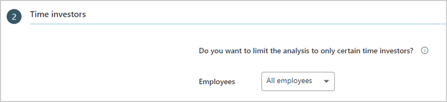

---

title: Return to worksites dashboard
description: Use the Return to worksite dashboard to visualize different seat-allocation options in Power BI based on Workplace Analytics data
author: madehmer
ms.author: v-mideh
ms.topic: article
localization_priority: normal 
ms.prod: wpa
---

# Return to worksites

The Return to worksites dashboard uses a Power BI template that’s populated by Workplace Analytics data to help you determine how to allocate limited-capacity seats to employees (who work at desks) for each of your organization's worksites.

As worksites begin opening at limited capacity to address safety concerns, employee seats become a limited resource. This dashboard helps you make the most of the limited seats by optimizing for on-site collaboration. The two allocation plans identify teams or a subset of teams who will benefit the most by returning to work because of their high collaboration patterns with others in the same location.

While this dashboard can help with planning, you must consider it in combination with other key factors, such as the nature of the work and individual employee circumstances and preferences.

The dashboard includes the following reports to help you allocate worksite seating:

* **Which teams collaborate the most with others in the worksite?** – Shows how teams have collaborated on-site as compared with off-site collaboration, where you can evaluate relationships across the organization or use a filter to evaluate a specific location. This view is the basis for the two alternative plans for seating allocation in the dashboard. With either plan, team leaders must account for personal circumstances of individual team members and their ability to return to work when determining how to allocate available workspaces.
* **Plan 1:  Allocate seats to the teams with the most on-site collaboration** – This allocation plan identifies which teams should return to work based on the selected location and limited-seating capacity. This plan simplifies a leader’s decision by making it an all-or-nothing seat allocation for each team. However, if on-site leadership requires all teams have some worksite presence during a limited-seat capacity opening, then Plan 2 is a better option.
* **Plan 2:  Allocate seats across teams in proportion to on-site collaboration** – This option provides each team with some presence in a limited-capacity worksite. It allocates each team a proportionate number of seats based on the team’s on-site collaboration patterns and the limited-seat capacity for the selected location. If leadership prefer the all-or-nothing approach, then Plan 1 is a better option.

To populate the dashboard in Power BI, you must set up and successfully run the predefined Return to worksites query in Workplace Analytics. After the query successfully runs, you can download the Power BI template for the Return to worksites query on the Results page. This template is required to create the dashboard in Power BI. After the template is downloaded, you need to connect the query data from Workplace Analytics to the dashboard in Power BI.

After the dashboard populates with data, you can evaluate which of the two seat-allocation plans will work for your organization’s teams.

## Demonstration

 <iframe width="800" height="486" src="https://msit.powerbi.com/view?r=eyJrIjoiZWMyNTJmNzktOWQzYy00OTEwLTgxZmQtZDZmMGI1OTJjYjYwIiwidCI6IjcyZjk4OGJmLTg2ZjEtNDFhZi05MWFiLTJkN2NkMDExZGI0NyIsImMiOjV9&embedImagePlaceholder=true" frameborder="0" allowFullScreen="true"></iframe>

## Prerequisites

Before you can run the queries and populate the dashboard in Power BI, you must:

* Be assigned the role of Analyst in Workplace Analytics.
* Have the latest version of Power BI Desktop installed. If you have an earlier version of Power BI installed, uninstall it before installing the new version. Then go to [Get Power BI Desktop](https://www.microsoft.com/p/power-bi-desktop/9ntxr16hnw1t?activetab=pivot:overviewtab) to download and install the latest version.
* Have the following organizational attributes already uploaded and processed in Workplace Analytics.

  * **Worksite location** - Represents the most recent worksite location (or projected location) for each employee.
  * **Team or Organization** - Each employee’s team assignment that reflects the organizational level at which decisions for seat allocation can be made for each worksite.

## Set up the dashboard

1. In [Workplace Analytics](https://workplaceanalytics.office.com/), select **Analyze** > **Queries**.
2. Under **Start from preselected filters and metrics**, select **Return to worksites** to open the predefined query.
3. Select or confirm the following query settings:

   * **Name** - Customize or keep the default name
   * **Group by** - Week
   * **Time period** - Last 3 months
   * **Auto-refresh** - Keep this setting disabled
   * **Meeting exclusions** - Select the preferred rule for your tenant

   > [!Important]
   > The dashboard is designed to allocate worksite seats by team based on the current organizational structure. For best results, select **Last 3 months** for the **Time period** to reflect the most current organizational structure.

    

4. In **Select metrics**, keep **Collaboration hours** selected.
5. In **Time investors** > **Do you want to limit the analysis to only certain time investors?**, keep **All employees** selected. Optionally, you can further filter the employees in scope for the dashboard. For example, excluding contractors or essential workers who already have seats allocated at a worksite. For more details about filter and metric options, see [Create a Person Query](./person-queries.md).

    

6. In **Their Collaborators**, do not exclude any collaborators.  
7. For the **How do you want to group the people who collaborated with the time investor?** question, select the organizational attribute that represents the employee’s worksite location, such as **Office** or **Building**.

   > [!Important]
   > The dashboard is designed to allocate worksite seats based on the amount of on-site collaboration time. If the worksite location is not selected, you might disable one or more Power BI charts.

8. For the **Do you want to focus the analysis on a particular set of collaborators and group all others as Unclassified?** question, keep the preselected filter as **IsInternal** equal to **True**.

    

9. In **Organizational data**, keep the preselected **Organization** and **LevelDesignation** attributes, and add the organizational attributes that reflect the worksite locations and applicable Teams (or Organizations) requiring seat allocation.

   > [!Important]
   > You must include the organizational attribute selected in **Step 7** for worksite locations or the data won’t load correctly in Power BI.

10. Select **Run** to run the query, which can take a few minutes up to a few hours to complete.
11. In **Queries** > **Results**, after both queries successfully run, select the **Download** icon for the **Return to worksites** query results, select **PBI template**, and then select **OK** to download the template.
12. Open the downloaded **Return to worksites** template.
13. If prompted to select a program, select **Power BI**.
14. When prompted by Power BI, enter the following, and then select **Load** to import the query results into Power BI.

    * **Query OData link or file path** - Both options are in the Workplace Analytics **Queries** > **Results** > **Return to worksites**. Data from the .csv file will load faster than through the OData link, which can take several minutes to several hours to load.

      * For the link, select the **Link** icon, and then select to copy the generated OData URL link and paste it in.
      * For the file path, select the **Download** icon, and then download the file. After it downloads, copy and paste the file path and file name.

    * **Minimum group size** - Enter a number for data aggregation within this report's visualizations that complies with your company's policy for viewing Workplace Analytics data.
    * **Location organizational attribute** - Enter the case-sensitive name of the organizational attribute you selected in the Return to worksites query that represents the worksite locations.

    

15. If you're already signed in to Power BI with your Workplace Analytics organizational account, the dashboard visualizations will populate with your data. You are done and can skip the following steps. If not, proceed to the next step.
16. If you're not signed in to Power BI, or if an error occurs when updating the data, sign in to your organizational account again. In the **OData feed** dialog box, select **Organizational account**, and then select **Sign in**. See [Troubleshooting](../tutorials/power-bi-templates.md#troubleshooting) for more details.

    

17. Select and enter credentials for the organizational account that you use to sign in to Workplace Analytics, and then select **Save**.

     >[!Important]
     >You must sign in to Power BI with the same account you use to access Workplace Analytics.

18. Select **Connect** to prepare and load the data, which can take a few minutes to complete.

## Dashboard settings

After the Return to worksites dashboard is set up and populated with Workplace Analytics data in Power BI, as a first step to viewing data in the dashboard, view and set the following parameters on the **Settings** page.

* **Team attribute** - The primary “group-by” attribute that represents the teams shown in all subsequent reports for making your seat allocation plan. You can change this attribute at any time and all subsequent report pages will show group values by the new attribute.
* **Filter attribute** – To filter the employee population, you can filter by any selected Organizational attribute, and then filter by any of the values for these attributes. If you filter, the employee count will reflect a reduced number. To clear an existing filter, select **Ctrl** while clicking the **Clear filter arrow** (or with a touchscreen, select the **Clear filter arrow**). This reflects the number of employees in the filtered population for the time period, that's specified on this page.
* **Number of employees** – Confirm that the number of employees meets your expectations.
* **Employee representation** – Shows the **Number of employees** divided into the different teams, which is based on the Team attribute selected on the left, and by location, which is based on the Organizational attribute selected for worksite locations in the query. In addition to employee count, the percent excluded statistic indicates what percentage of each team in the specified location has no active weeks of collaboration in their most recent role (as specified in the organizational data), or are in a group with less than the specified minimum number of employees.

> [!Important]
> * If a worksite already has essential workers with permanent seat assignments, or employees who have chosen not to return, you must filter them out of the seat allocation plan. Use the filter attribute or re-run the **Return to worksites** query and use filters for the **Time investors** in **Step 5**.
> * A high value for **% excluded**, such as greater than 50 percent, might suggest a group who has recently experienced organizational changes, which can cause their data to be less reliable for developing a seat allocation plan.

> [!Tip]
> When you select a chart bar for **Teams**, it updates the data to show that team’s **Location**. Select a chart bar for **Location** and it will update the data to that location’s **Teams**.

## Seat allocation plans

For either seat allocation plan, you’ll need the following information.

* The number of employees permitted in each location.
* The number of essential employees who are returning regardless of other factors. To account for essential employees, filter them out of your employee population and subtract their number from the total employees permitted in each location.

After you specify a location and the number of employees permitted in that location, each plan allocates and assigns seats to teams who spend more time in on-site collaboration. Each plan summary provides an estimate of the on-site collaboration. These estimates factor in adjustments to on-site collaboration based on the proportion of employees who are not assigned a seat.

## Dashboard demo

<iframe src="https://player.vimeo.com/video/460378380" width="640" height="480" frameborder="0" allow="autoplay; fullscreen" allowfullscreen></iframe>

## Return to worksites playbook

The last report in the Return to worksites dashboard describes further analysis you can do for planning when, who, where, and how employees can return to work. The analyses that help answer where and when require a Microsoft service engagement to deploy through Azure with [Workplace Analytics Azure Templates](../azure-templates/overview.md). The [Return to worksites playbook](https://docs.microsoft.com/workplace-analytics/tutorials/Return-to-worksites-playbook.pdf) has more details and instructions on how to create and use the analyses.

## Power BI tips, troubleshooting, and FAQs

For details about how to share the dashboard and other Power BI tips, troubleshoot any issues, or review the most frequently asked questions, see [Power BI templates in Workplace Analytics](../tutorials/power-bi-templates.md).

## Related topics

* [Return to worksites playbook](https://docs.microsoft.com/workplace-analytics/tutorials/Return-to-worksites-playbook.pdf) 
* [View, download, and export query results](../use/view-download-and-export-query-results.md)
