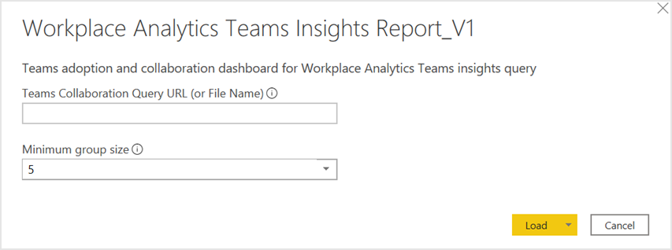

---

ROBOTS: NOINDEX,NOFOLLOW
title: Power BI Teams dashboard
description: Use the Power BI Teams insights dashboard to visualize predefined query data from Workplace Analytics in Power BI
author: madehmer
ms.author: madehmer
ms.topic: article
localization_priority: normal
ms.prod: wpa
---

# Power BI Teams insights

As employees shift to remote work and to digital only collaboration, Workplace Analytics can help you stay on track and make data-driven decisions that can help your employees do their best work.

The Power BI Teams insights dashboard directionally highlights where a shift to remote work might have the largest impacts, offering a measurable starting point for helping leaders understand where they might use tools and processes to support and sustain new ways of working.

This dashboard enables you to visualize and explore your company’s current activity in Teams and learn how you can help your team be successful moving forward. The dashboard includes the following reports that answer these business questions:

* **What does adoption look like so far?** - Shows how groups are adopting Teams for collaborating and productivity over time.
* **Where can you focus training and education for Teams adoption?**– Shows who is using Teams and how much time they’re spending in Teams calls and instant messages. This gives you a holistic view of how different groups in your organization are currently using Teams and who could benefit from additional Teams training.
* **How can Teams help employees speed up communication?** (best practices) – Teams can help employees find the right mode of communication for what they want to accomplish. For example, group communications on Teams enables faster file sharing and easy-to-follow conversation records.
* **Are employees working after hours in Teams?** (best practices) – Shows average activity by time of day during and outside of the group’s set working hours. As collaboration moves digitally, it’s important to establish communication guidelines and boundaries to encourage employees to balance work and life and maintain good wellbeing.
* **How can you build momentum as your company adopts Teams?** (best practices) – Shows how you can create opportunities for employees to make meaningful changes in their work patterns, including communication, wellbeing, and meeting culture recommendations and best practices.

   

The dashboard also includes a **Summary of Key Metrics** page that shows opportunity indicators for remote work, such as Time in Teams, Teams usages, and Transitioning to Teams data and the **Glossary** page describes all the report metrics. It also includes a **Why it matters** interpretation on the report’s page.

To populate the dashboard in Power BI, you must set up and successfully run the predefined **Teams Insights** query in Workplace Analytics. The query results will refresh your downloaded Power BI dashboard on a weekly basis.

## Prerequisites  

Before you can run the queries and populate the dashboard in Power BI, you must:

* Be assigned the role of [Analyst](../use/user-roles.md) in Workplace Analytics.
* Have the latest version of Power BI Desktop installed. If you have an earlier version of Power BI installed, uninstall it before installing the new version.
Then go to [Get Power BI Desktop](https://www.microsoft.com/p/power-bi-desktop/9ntxr16hnw1t?activetab=pivot:overviewtab) to download and install the latest version.

## Set up the dashboard

1. In [Workplace Analytics](https://workplaceanalytics.office.com/), select **Analyze** > **Queries**.
2. Under **Start from preselected filters and metrics**, select **Teams Insights** to open the predefined query, which contains the required metrics to populate the dashboard.
3. Select or confirm the following query settings:

   * **Name** - Customize or keep the default name
   * **Group by** - Week
   * **Time period** - Select the time period for this analysis
   * **Auto-refresh** - Enable the setting
   * **Meeting exclusions** - Select the preferred rule for your tenant

   > [!Important]
   > If you try to delete a predefined metric, you'll see a warning that the deletion might disable portions of the Power BI dashboard and reduce query results. In turn, this can limit your ability to visualize collaboration patterns. Depending on the metric you delete, you might disable a single Power BI chart, several charts, or all the charts. Select **Cancel** to retain the metric.

4. In **Select filters**, select **Active only** for "**Which measured employees do you want to include?**" Optionally, you can further filter the employees in scope for the dashboard. For more details about filter and metric options, see [Create a Person Query](./person-queries.md).
5. In **Organizational data**, keep the preselected **Organization**, **LevelDesignation**, and **TimeZone** attributes that the dashboard requires. You can then select any other attributes (columns) to include in the dashboard.

   > [!Important]
   > If you remove the required, preselected Organizational data attributes, you might disable one or more Power BI charts.

6. Select **Run** to run the query, which might take several minutes to complete.
7. In **Queries** > **Results**, after the query successfully runs, select the **Download** icon for the **Teams Insight** query results, select **PBI template**, and then select **OK** to download the template.

   

8. Open the downloaded **Teams Insights Power BI template**.
9. If prompted to select a program, select **Power BI**.
10. When prompted by Power BI:

    * In the Workplace Analytics **Queries** > **Results** page, select the **Link** icon for the query, and select to copy the generated OData URL link.
    * In Power BI, paste the copied link into the URL field.
    * Set the **Minimum group size** for data aggregation within this report's visualizations in accordance with your company's policy for viewing Workplace Analytics data.
    * Select **Load** to import the query results into Power BI. Loading these large files may take some time to complete.

    

11. If you're already signed in to Power BI with your Workplace Analytics organizational account, the dashboard visualizations will populate with your data. You are done and can skip the following steps. If not, proceed to the next step.
12. If you're not signed in to Power BI, or if an error occurs when updating the data, sign in to your organizational account again. In the **OData feed** dialog box, select **Organizational account**, and then select **Sign in**. See [Troubleshooting](#troubleshooting) for more details.

    

13. Select and enter credentials for the organizational account that you use to sign in to Workplace Analytics, and then select **Save**.

    >[!Important]
    >You must sign in to Power BI with the same account you use to access Workplace Analytics.

14. Select **Connect** to prepare and load the data, which can take a few minutes to complete.

## Dashboard settings

After the Teams insights dashboard is set up and populated with Workplace Analytics data in Power BI, as a first step to viewing data in the dashboard, view and set the following parameters on the **Settings** page.

* **Date** - This is the time period that you want to analyze.
* **Organizational attribute to view the report by** - The primary “group-by” attribute shown in all subsequent reports. You can change this attribute at any time and all subsequent report pages will show group values by the new attribute.
* **Organizational attribute to filter by** – To filter the measured employee population, you can filter by any selected Organizational attribute, and then filter by any of the values for these attributes. If you filter, the measured employees count will reflect a reduced number. To clear an existing filter, select the **Eraser** icon to clear the selections. Measured employees reflect the number of employees in the filtered population who were active in the specified time period. Active employees are those who sent at least one email or instant message in the work week included in the current date range.

After confirming the settings, check the number of measured employees to confirm this is the population you want to analyze.

> [!Important]
> As new data is processed on a weekly basis, select **Refresh** in the Power BI Home ribbon to view the most recent data.

### Power BI tips

A few tips to help you use the dashboard in Power BI:  

* **Cross-filter and cross-highlight** - All visuals on a report page are interconnected. If you select a data point on one of the visuals, all the others on the page that contain that data will change, based on that selection.
* **Drill down into a visual that has a hierarchy** - When a visual has a hierarchy, you can drill down to reveal additional details. Any chart in the dashboard labeled with "By Organization and Level Designation" supports the Power BI drill down capability.
* **Export data as a table** – From the upper right corner of any visualization, select **More options** (**…**) and select **Export data**.

For more details about using Power BI, see [Interact with visuals in reports, dashboards, and apps](https://docs.microsoft.com/power-bi/consumer/end-user-visualizations).

## Share the dashboard

Like other products that work with sensitive data, such as HR systems, Workplace Analytics is not meant for the general workforce. Rather, its users are expected to have training regarding how to handle sensitive information. Training should be specific to your organization. See [Data-protection considerations](../privacy/data-protection-considerations.md) when using data generated by Workplace Analytics.

Anyone you share the Power BI *desktop file* with can access the underlying dataset at the same level of granularity as a Workplace Analytics Analyst.   For this reason, consider the following alternatives that do not provide access to the underlying data:

* **Share as a PDF or other static file** - This option generates a report that's not interactive. See [Export reports from Power BI to PDF](https://docs.microsoft.com/power-bi/consumer/end-user-pdf).
* **Publish the report to Power BI Service and share insights in an app** - This option allows other users to navigate the dashboard without access to the underlying data. See [Distribute insights in an app](https://docs.microsoft.com/power-bi/service-how-to-collaborate-distribute-dashboards-reports#distribute-insights-in-an-app) for details.

## Frequently asked questions

#### Q1 Who can create the dashboard in Power BI?

You must be assigned the role of [Analyst](../use/user-roles.md) in Workplace Analytics to create the dashboard. You must also have a Power BI license and have the desktop version installed. See [Install and run Power BI Desktop](https://docs.microsoft.com/power-bi/desktop-getting-started#install-and-run-power-bi-desktop) for details.

#### Q2 How frequently is data refreshed in the dashboard?

The dashboard gets repopulated once a week after Workplace Analytics finishes its weekend processing. **Note**: You must manually adjust the **Selected time frame** setting in the dashboard's **Settings and scope** report to view the most recently processed data.

#### Q3 How do I share the dashboard with others in my organization?

You can share the dashboard with others in your organization *without sharing the underlying data* by publishing the insights in an app or as PDF or static file. See [Share the dashboard](#share-the-dashboard) for details.

#### Q4 Can I share the underlying dashboard dataset with others in my organization?

To maintain data privacy, only employees assigned the role of [Analyst](../use/user-roles.md) in Workplace Analytics should have access to the underlying dataset in the Power BI dashboard.

#### Q5 How do I know if I have the latest version of the template?

You can find the version number at the end of the dashboard title in the lower left of the dashboard’s [Settings](#dashboard-settings) page.

#### Q6 How do I set up and run a Workplace Analytics query?

See [Create a Person Query](./person-queries.md) for details.

#### Q7 How do I change the axis of a chart to use a different Organizational data attribute?

Only the required Organizational attributes are used when setting up the Power BI file. If you selected more Organizational attributes when setting up the queries, you can use those in the visuals. 
To use a different Organizational attribute:

1. Select the visualization you want to change.  
2. In the **Fields** pane, select and drag the Organizational attribute to the **Axis** section of the visualization.

#### Q8 How do I integrate additional metrics or data sources with this dashboard?

See [Connect to data in Power BI](https://docs.microsoft.com/power-bi/connect-data/) to learn more about how to connect data in Power BI. See [Prepare organizational data](../setup/prepare-organizational-data.md) to learn about what organizational data you can analyze in Workplace Analytics and see [Data sources](../use/data-sourcesv2.md) to see what data sources you can connect to and analyze from within Workplace Analytics.

#### Q9 How do I use Power BI?

See [Power BI documentation](https://docs.microsoft.com/power-bi/) for details on how to use Power BI.

#### Q10 What languages is the dashboard available in?

The dashboard is currently only available in English.

## Troubleshooting

#### Unable to open document

If you get the following error, you do not have the latest version of Power BI.

  

However, the template might work with the earlier version of Power BI that you're using. To test it:  

1. Close any warnings.
2. If you can view the **Settings** page, the dashboard will work with this version. If you cannot view **Settings**, you need to download the latest version of Power BI.

#### Report layout differences might exist

If you get the following error, you do not have the latest version of Power BI. However, the template might work with this earlier version. To test it, repeat the steps in the previous section.

  

#### OData request failed

If you are signed in with the wrong organizational account, you'll get an error message when loading the data with the Power BI template:

  **OData error**: The given URL neither points to an OData service or a feed.

To fix it, follow these steps:

1. In Power BI, open the **Transform data** menu, and select **Data source settings**.
2. Select **Global permissions**, select `https://workplace.analytics.office.com`, and then select **Edit permissions**.
3. For **Credentials**, select **Edit**.
4. In the **OData feed** dialog box, select **Organizational account**, and then select **Sign in** or **Sign in as a different user**.
5. Select the account that you use to sign in to Workplace Analytics, enter the password, and then when prompted in **OData feed**, select **Save**.
6. In **Edit Permissions**, select **OK**, and then close the **Data source settings** window.
7. Close Power BI and follow the instructions in [Set up the dashboard](#set-up-the-dashboard).

#### The Power BI visuals fail to load or show errors in the tables

Power BI cannot complete a data join if data values are missing in the Organization or Level Designation tables. To validate this error:

1. In the **Fields** pane in Power BI, look for an **error** (!) icon in either the **Organization** or **LevelDesignation** tables. If you see an error, such as the following about blank values, select the field with the error to view it.

   

2. To remediate this error, select **Transform Data** from the **Transform Data** menu to open the Power Query Editor.
3. Select the **Business Continuity** query.
4. In the data preview table, locate the column for Organization and/or LevelDesignation, expand the column header, select **Remove Empty**, and then select **OK**.
5. Select the **Hourly Collaboration** query and repeat Steps 3-4 to filter out empty values.
6. Select **Close & Apply** to apply the changes and return to the dashboard.

## Support

* **Dashboard support** - Contact the Workplace Analytics team member that referred you to this page for support about onboarding, usage, and interpretation of the data contained within the dashboard.
* **Workplace Analytics support** - Refer to [Workplace Analytics documentation](../index.md) or [Workplace Analytics Support](../overview/getting-support.md) for additional help.
* **Support with other Microsoft products and tools** - Support for Power BI and other tools used in the context of this dashboard can be found through each product's associated support channels.

## Related topics

* [Power BI templates in Workplace Analytics](../tutorials/power-bi-templates.md)
* [View, download, and export query results](../use/view-download-and-export-query-results.md)
