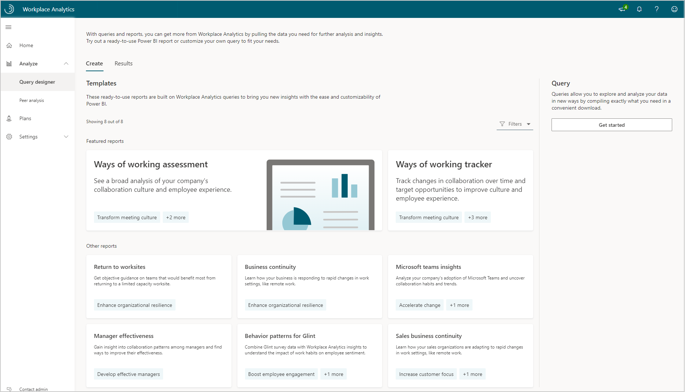
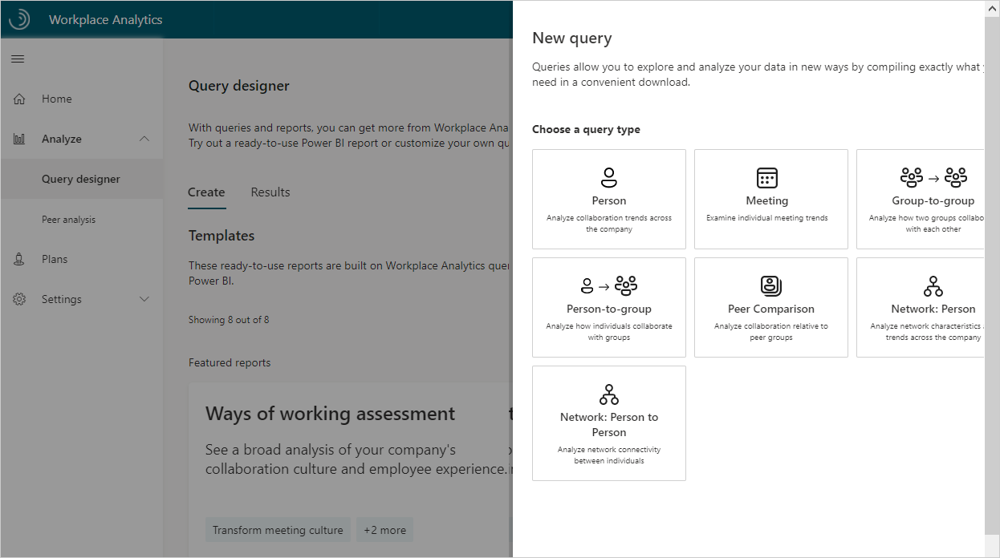
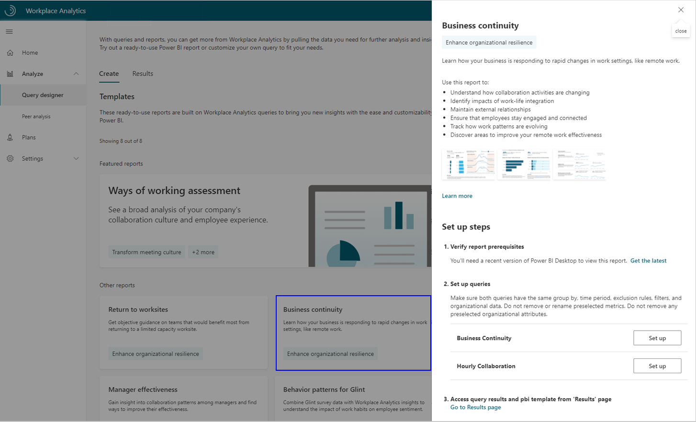
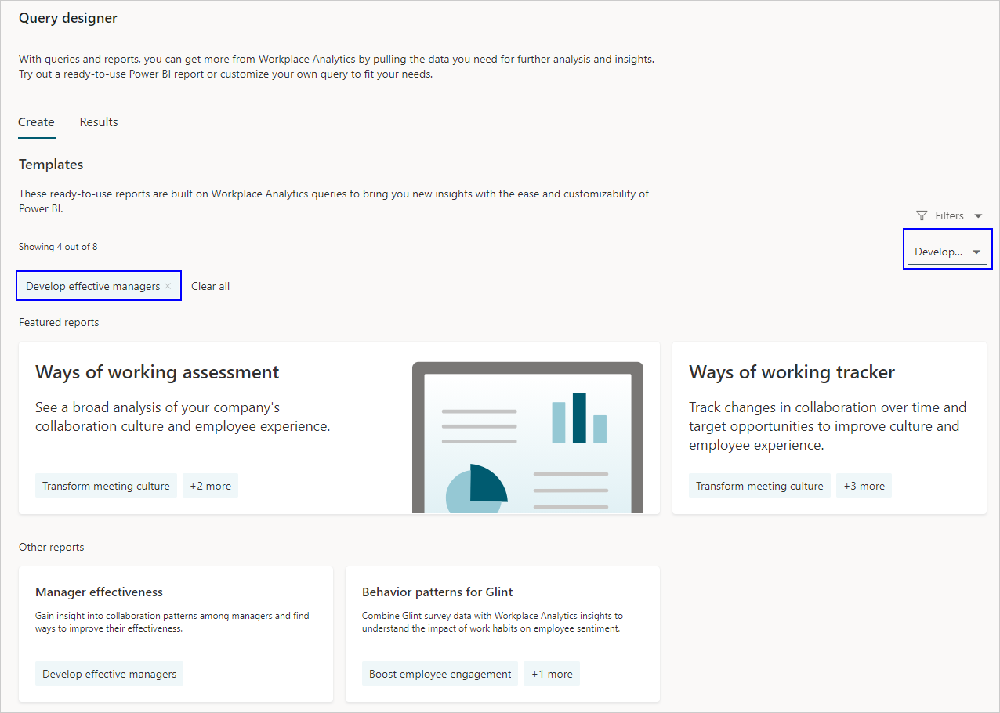
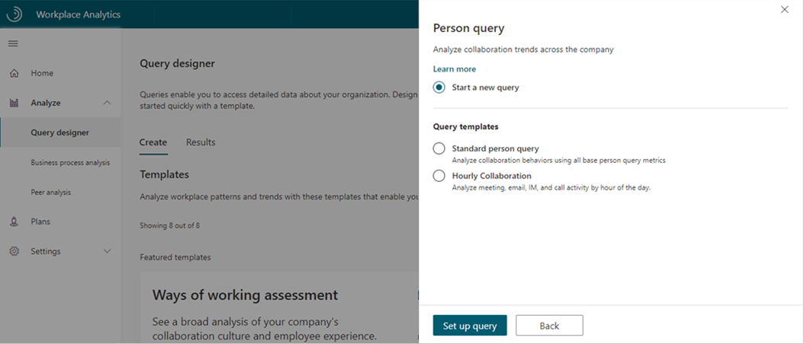
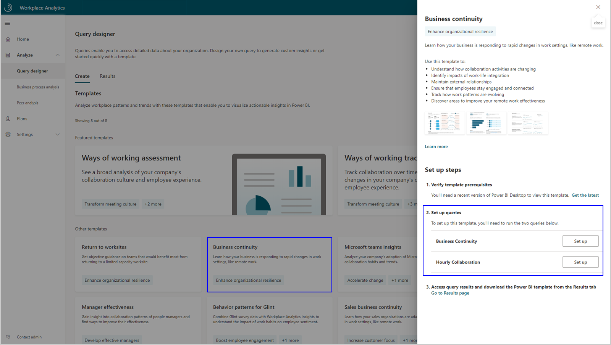

# Query designer

The Query designer in Workplace Analytics has the flexibility to either help you find answers to common business challenges or provide you the tools to create custom datasets that help you answer your own custom business challenges.

Within the Query designer, you can either use the templates or create your own query.

* [**Templates**](#templates) - Provide an easy way to pull Workplace Analytics metrics into a Power BI template, where you can quickly analyze workplace patterns and trends. Each template helps you understand a different business challenge, such as how to transform meeting culture, enhance organizational resilience, develop effective managers, boost employee engagement, and more.

  

* [**Queries**](#queries) - Enable you to create datasets that help you answer custom business challenges. After creating a dataset, you can then analyze the data in a tool of your choice.

  

## Templates

In Workplace Analytics, select **Query designer** to see predefined templates that help you analyze behavioral insights that relate to specific business outcomes.

For example, select the **Business continuity** section to see more details about the report, example report data, prerequisites, and setup steps.

You can also filter the templates and reports list to see what is available for a specific business insight. For example, the following shows what you'll see if you select **Filters** > **Develop effective managers**.

### Power BI templates

Workplace Analytics includes the following Power BI templates.

* [**Ways of working assessment**](./power-bi-collab-assess.md) - Power BI template that shows a quick and easy way to see current collaboration behaviors and culture and insights into employee wellbeing and engagement in your organization.
* [**Ways of working tracker**](./power-bi-collab-track.md) - Power BI template that shows how you can track behavior change and target opportunities to improve employee wellbeing, meeting culture, and manager effectiveness.
* [**Return to worksites**](./power-bi-return-tw.md) - Power BI template that shows how to plan who returns to work, and when, where, and how they do for the different work locations.
* [**Business continuity**](./power-bi-bc.md) - Power BI template that shows example insights into how shifting to remote work has impacted business.
* [**Microsoft Teams insights**](./power-bi-teams.md) - Power BI template that shows how adopting Microsoft Teams can affect collaboration and productivity in your organization.
* [**Manager effectiveness**](./power-bi-manager.md) - Power BI template that helps leaders measure behaviors and trends of their people managers across four key themes within the organization, including coach, empower, connect, and model.
* [**Behavior patterns for Glint**](./power-bi-glint.md) - Power BI template that combines behavioral data from Workplace Analytics and sentiment data from Glint for insights that help identify opportunities to influence behavior and improve business outcomes.
* [**Sales business continuity**](./pbi-bc-sales.md) - Power BI template that shows insights into how shifting to remote work has impacted your sales organization.

## Queries

In **Query designer** > **Query**, select **Get started** to create your own custom version of one of the following types of queries. Or when available and listed, you can also select from one or more related templates. The following shows when creating a person query, where you can select to **Start a new query** or select the **Standard person query** or **Hourly Collaboration** that already have specific metrics set up to help get you started.

When you create a new query or edit an existing query, you select the metrics to include. You can also use filters to narrow the results and focus in on specific data. Then you can download the query data results as .csv files or depending on the type of data, visualize it directly in Workplace Analytics. See [View, download, and export query results](../use/view-download-and-export-query-results.md) for details.

* [**Person queries**](person-queries.md) - Use to find broad organizational trends by analyzing aggregated productivity metrics (such as time in meetings and email) for a de-identified list of individual employees.
* [**Meeting queries**](meeting-queries.md) - Use to analyze the relationship between different meeting attributes, such as size or duration, subject line keywords, double-booked hours, and multitasking hours.
* [**Group-to-group queries**](group-to-group-queries.md) - See how a team invested their collaboration time with other teams within and outside of the organization. You can define a team in a variety of ways, with any organizational attribute or email domain. This also offers alternative perspectives on collaboration.
* [**Person-to-group queries**](person-to-group-queries.md) - Helps analyze the number of interactions between a time investor and the defined collaboration team, or to analyze only those collaboration activities initiated by the specified time investor. You can define the person and collaborator team or teams in a variety of ways, with any organizational attribute or email domain.
* [**Peer comparison queries**](comparison-query.md) - Helps identify people whose collaboration patterns differ as compared to their peers. The query includes the measured employees, their specified metrics, and their peer group's averages for those metrics. You can compare individuals with others who share the same manager, with their direct reports, or even with a custom peer group as defined with organizational attributes.
* **Network queries** - Use [ONA person queries](ona-person-query.md) and [ONA person-to-person queries](ona-person-to-person-query.md) to find out who the best-connected people in your company, division, or group are, which is based on collaboration data. After you learn who your influencers are, you can act on the likelihood that these people can effectively connect within or across groups and become efficient drivers of change.

### Query templates

In addition to the Power BI templates, Workplace Analytics also includes the following query templates.

* **Domain collaboration** analyzes collaboration patterns with external domains.
* **Standard meeting query** analyzes meetings by using the available base meeting query metrics.
* **Standard person query** provides all base metrics available for a person query.
* **Hourly Collaboration** analyzes meeting, email, instant-message, and call activity by hour of the day.

## Prerelease setup steps

Because you are using a prerelease of the Query designer, the specific steps in the currently published Workplace Analytics documentation do not match this new experience. Documentation for each of the individual Power BI templates have steps for using the original **Queries** page.

For example, for Business continuity, you’ll see the new Query designer instead of the original Queries page. So instead of following the initial steps in [Set up the dashboard](power-bi-bc.md#set-up-the-dashboard), you’ll select the **Business Continuity** card and follow the on-screen setup steps included in the **Query designer**.

## Example setup

As mentioned in the previous section, all the templates in the new Query designer included on-screen setup steps. For example, do the following to set up a new Business continuity dashboard.

1. In [Workplace Analytics](https://workplaceanalytics.office.com/), select **Analyze** > **Query designer**.
2. In **Templates**, select **Business continuity** to open the template details that include the setup steps, and then in step 2, select **Set up** next to **Business Continuity** (or **Hourly Collaboration** per **Step 6**) .

   

3. In **Select filters**, select **Active only** for "**Which measured employees do you want to include?**" Optionally, you can further filter the employees in scope for the dashboard. For more details about filter and metric options, see [Create a Person Query](./person-queries.md).

   

4. In **Organizational data**, keep the preselected **Organization**, **LevelDesignation**, and **TimeZone** attributes that the dashboard requires. You can then select any other attributes (columns) to include in the dashboard.

   >[!Important]
   >If you remove the required, preselected Organizational data attributes, you might disable one or more Power BI charts.

5. Select **Run** to run the query, which might take a few minutes to complete.
6. When prompted, select to return to Query designer to set up another query, and then repeat  **Steps 2-5** for the **Hourly collaboration** query, which requires the same selections as for Business continuity.
7. When prompted, continue to results, and then after both queries successfully run, select the **Download** icon for the **Business continuity** query results, select **PBI template**, and then select **OK** to download the template.

   

8. Open the downloaded **Business continuity Power BI template**.
9. If prompted to select a program, select **Power BI**.
10. When prompted by Power BI, copy and paste the OData links for both queries into their respective fields.

    * In the Workplace Analytics **Query designer** > **Results** page, select the **Link** icon for each query, and select to copy the generated OData URL link.
    * In Power BI, paste each copied link into its respective field.
    * Set the **Minimum group size** for data aggregation within this report's visualizations in accordance with your company's policy for viewing Workplace Analytics data.
    * Select **Load** to import the query results into Power BI. Loading these large files may take some time to complete.

    

11. If you're already signed in to Power BI with your Workplace Analytics organizational account, the dashboard visualizations will populate with your data. You are done and can skip the following steps. If not, proceed to the next step.
12. If you're not signed in to Power BI, or if an error occurs when updating the data, sign in to your organizational account again. In the **OData feed** dialog box, select **Organizational account**, and then select **Sign in**. See [Troubleshooting](../tutorials/power-bi-templates.md#troubleshooting) for more details.

    

13. Select and enter credentials for the organizational account that you use to sign in to Workplace Analytics, and then select **Save**.

    >[!Important]
    >You must sign in to Power BI with the same account you use to access Workplace Analytics.

14. Select **Connect** to prepare and load the data, which can take a few minutes to complete.
15. If you have preexisting query results that the dashboard is no longer using, a best practice that reduces processing time is to turn off the auto-refresh or delete the queries that the dashboard is no longer using. See [Stop the auto-refresh option](../Tutorials/Query-auto-refresh.md#stop-the-auto-refresh-option) for details.

## Meeting exclusions

You define meeting exclusions to exclude types of meetings from analysis (such as all-day training meetings) where their inclusion might skew query results. You can select between the default meeting exclusion rules or create custom rules that match your company's meeting conventions.

See [Meeting exclusions](meeting-exclusions-intro.md) for details.

## Attendee exclusions

You can use the responses by meeting invitees to optionally exclude them from analysis. For example, invitees who accepted a meeting invitation as "Tentative" would normally be included in analysis by default. By adding an attendee exclusion, you can explicitly exclude them. In this way, creating attendee exclusions lets you effectively redefine "meeting attendance."

See [Attendee exclusions](attendee-exclusion-rules.md) for details.

## Data time limit

The historical data that queries and reports use is time limited. You can run queries only on data from the last 27 months. This 27-month period is a _rolling window_. After the first 27 months of [Microsoft 365 data](../use/office-365-data.md) is uploaded and processed in Workplace Analytics, it refreshes each week. This means the 27-month extent of data that you can query advances by one week to include the preceding 27 months.

However, historical query results that have already been run remain available, even after the data in the query results passes the 27-month limit.

## Related topics

* [Power BI templates](../Tutorials/Power-bi-templates.md)
* [View, download, and export query results](../use/view-download-and-export-query-results.md)
* [Workplace Analytics glossary](../Use/Glossary.md)
* [Metric descriptions](../Use/Metric-definitions.md)
