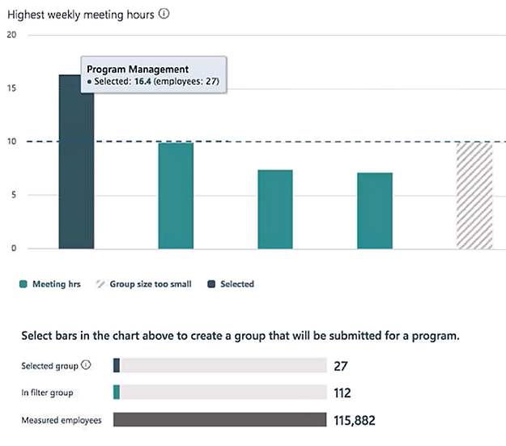

---
# Metadata Sample
# required metadata

title: Workplace Analytics plans concepts
description: Concepts and definitions to help you better work with the plans feature of Workplace Analytics. 
author: paul9955
ms.author: v-pausch
ms.topic: conceptual
localization_priority: normal 
ms.prod: wpa
---

# Plans: Concepts

This section describes concepts whose understanding can help you create and monitor Teamwork improvement plans. These creation and monitoring tasks are described in the step-by-step walkthrough for creating a plan, [Plans: Walkthrough](solutionsv2-task.md).
 
## Use of a .csv file

One way to identify a group for an improvement plan is to upload a list of the group’s members in a .csv file. You obtain such a file by creating it in a text editor or in Microsoft Excel or by exporting it from an HR tool or service. This .csv file must contain the email addresses of people in your organization. After you obtain and upload the file, the system uses the email addresses to finalize the list of participants in the plan that you will create. 

Finalizing the participant list means determining whether any proposed participants are ineligible for the plan because they are already enrolled in a plan, their email address is invalid, or they are not using MyAnalytics.  

### Invalid email addresses

An "invalid" email address means that the email address was formatted incorrectly, the person is not a measured employee (they have no Workplace Analytics license), or the person is not in the partition that the user is currently working in. 

### Csv file privacy considerations

#### Separation from org data

After you create and upload a .csv file to identify participants  in a plan, the information in that .csv file is not added to the organizational data that Workplace Analytics stores. The .csv-file data is available only in the plans area of Workplace Analytics, and only for creating plans.

#### Minimum group size

You can change the minimum group size to a level that you consider more relevant for your organization, but you cannot set the group size to a value lower than five.

<!-- 
In the **Group Details** area of the **Upload group** page, you can check the number of members shown for the uploaded group. (Workplace Analytics obtains this number from the number of rows in the uploaded .csv file.) If this number is less than your organization’s minimum group size, you cannot submit this group for processing and use. LEANNA SAYS THIS IS LEGACY. -->

> [!Note] 
> After you submit a group that was manually uploaded, if too many email addresses are invalid and the group drops below minimum group size, you cannot create a plan with that group. You can try again by uploading a different .csv file. For more information, see [Upload a .csv file](solutionsv2-task.md#upload-a-csv-file) and [Find the group through analysis](solutionsv2-task.md#find-the-group-through-analysis).

## Validation

During validation, Workplace Analytics checks the following about each potential participant. (You must validate your group regardless of how you identified its members – by using filters or by uploading a .csv file.)

 * Is their email address valid? This check helps verify that the person still works for the company. (See [Invalid email addresses](#invalid-email-addresses).)
 * Do they have a MyAnalytics license and a Workplace Analytics license? To participate in a plan, they must have both.
 * Are they already enrolled in a plan? A person can be in only one plan at a time.
 * Have they opted out of MyAnalytics? If the person has opted out, they cannot participate in plans. 

After validation, Workplace Analytics reports the results, including the number of qualified participants. The results also show any warnings, which display the numbers of participants who’ve failed any tests.

 
All four of the possible errors are shown here. If your number of qualified participants (25, in this case) is above the minimum group size, you can move forward with the plan. See [Start the plan](solutionsv2-task.md#start-the-plan).

If the number of qualified participants falls below the minimum group size, you cannot proceed with this group as it is. To move forward, you need to make changes outside of Workplace Analytics. For example, you could ask an admin to assign licenses to those who are missing them, and then to upload the file again. Or you could upload a different group. 

As for those who have opted out or are already in a plan, you cannot enroll them in a plan at this time. 

You must validate the group of potential participants whether you identified that group through filters or by uploading a file. If you uploaded a file and validation fails, you might decide to upload a new file to try again. After any subsequent upload, you must select **Validate** again. After a file that you’ve uploaded successfully validates, go to [Start the plan](solutionsv2-task.md#start-the-plan).

## Set a value for Max or Min target

In the **Group details** section of the **Upload group** panel, you set a Max or Min value based on what the target is. For example, you would set a **Min target** for Focus hours and a **Max target** for Meeting hours. This target represents a percentage change from your group's initial benchmark value.

Set a percentage by which the participants should increase or decrease the metric you chose for their plan. For example, if your plan aims to reduce meeting hours, you can set a target to reduce meeting time by 50% from the initial benchmark value of 15 hours per week.

<!-- NO LONGER WORKS LIKE THIS
### Initial setting

In the **Group details** section of the **Upload group** panel, you can set a value for Max target. This is not your final opportunity to set this target. After you submit your group, Workplace Analytics calculates for the group a benchmark value that pertains to the plan type. After you see the benchmark value, you can re-adjust the target.
-->

<!-- 
### Threshold

Over the course of a plan, participants receive messages from Workplace Analytics about their progress. Participants who have success in meeting the target you set receive a message such as 'Keep up the good work!' Those who have not yet met the target receive a message that encourages them to work towards that target.

The dividing line between these two groups of people is the threshold. The threshold value is relative to the benchmark. The threshold value cannot be modified.

Return to [Submit a group](solutionsv2-task.md#submit-a-group). 
-->

## The Plans > Manage page

Groups and plans are shown on the **Plans > Manage** page of Workplace Analytics. You can track groups and plans in the table on this page. To find a plan, first filter the table contents by using the dropdown to select plans in the following states: **Drafts**, **Active**, or **Completed**.

**Drafts** are plans that you have begun to define, and saved. A draft plan remains in the draft state until you select **Start plan**. It does not go live until you select **Start plan**, even if you’ve set its start date and that date passes. You can take either of two actions with draft plans: delete them or start them. On this page, if you click **Start now** for a draft plan, the **Set up new plan** panel opens. 

**Active** plans are currently ongoing. After you select **Active**, the display shows plans that are either scheduled or active. If the plan is active, the option in its row is **Track** and its start date is in the past. You can take either of two options with Active plans: track them or stop them. 

A **Scheduled** plan has been set up (you’ve selected **Start plan**) but its start date lies in the future. Scheduled plans are listed as active plans; the different is in the options you have:

 * **Edit:** One option for a scheduled plan is **Edit**. Selecting  **Edit** lets you change the plan’s details, such as its start date.

 * **Send to draft:** In the row of a scheduled plan, the square means **Stop**. Selecting **Stop** stops the plan from starting and sends it back to the draft state.

For plans that have started, click **Track** to display the tracking dashboard. 

A **Completed** plan is one that has finished, either because its twelve weeks have passed or because someone ended the plan early.

Return to [Track plans](solutionsv2-task.md#track-plans)<!-- or [Next steps: processing tasks](solutionsv2-task.md#next-steps-processing-tasks)-->.

## Available and selected employees

On the **Plans** > **Teamwork** page, groups of employees are shown below the chart:

   
 
* **Measured employees:** The total number of employees in the organization who are available for analysis.
* **In filter group:** The number of measured employees who remain available for analysis after you applied filters.
* **Selected group:** The number of employees in the group or groups that you selected in the chart.

Return to [Select a group](solutionsv2-task.md#select-a-group).

## Persistence of group selections

After you select groups, you can change other settings on this page. Not all of the settings that you can change retain the group selections that you've made: 

### Group selections are retained when

* <u>You change the chart-view question.</u> You can change the data that is shown by selecting different questions under Select a question to change the view of your chart. As you do this, the group or groups that you've selected remains the same, even though the data shown about the group is shown from different perspectives.

### Group selections are lost when

* <u>You change the chart view.</u> If you change the selections in the **Chart** (such as **Group by**) and then select **Apply**, your group selections are lost.
* <u>You change the area of focus.</u> If you change the area of focus, your group selections are lost.
* You apply <u>new page settings</u> in the panel. 

To select groups again after you have changed the chart or area of focus, select **groups** in the chart.  

Return to [Select a group](solutionsv2-task.md#select-a-group).

## Progress report

The banner on the **Track** page shows the plan type, the number of participants, and the plan status. A chart shows what week the plan is in and the plan's progress, week by week, since it started. This progress is expressed in relevant terms for the plan's targets.

The highlighted numbers show the average value per person per week since the plan started, as compared with the plan benchmark. The benchmark, in turn, refers to the average value per person per week for the twelve weeks that immediately preceded the start of the plan.

Return to [Track plans](solutionsv2-task.md#track-plans).

## Manually upload a .csv file

After you create and upload a .csv file to create a group, all email addresses that were successfully uploaded now constitute the group. After the upload successfully completes, the group can be processed. During processing, Workplace Analytics matches email address to PersonIDs, which lets it examine data for these people for the metrics that you chose. Now, Workplace Analytics can calculate metrics and a benchmark for the group. It also gives an estimate of the number of people in the group, based on the number of rows in the file. This estimate will change if some of the people turn out to lack valid Workplace Analytics licenses.

### Privacy note

After you create and upload a file to create a group, Workplace Analytics matches the email addresses in the file to PersonIDs. From this point on, Workplace Analytics uses the PersonIDs and no longer shows email addresses in any of its outputs, for example, in the results of flexible queries. The email addresses are never again made visible to analysts or program managers. As for admins, they maintain access to the HR data, which includes email addresses, but they cannot match email addresses to PersonIDs. The person who uploads email addresses never sees the associated PersonIDs.

<!-- 
Return to [Next steps: processing tasks](solutionsv2-task.md#next-steps-processing-tasks).
-->

<!-- NO LONGER RELEVANT. PUBLISH IN MAY AND THEN DELETE

## Use Workplace Analytics to identify a group

If you use the **Identify** page to select a group, please be aware of the following:

### Group size and benchmark might differ

When you analyze behavior on the Workplace Analytics **Identify** page, you can view up to one years' worth of data. Then, after you submit the group, Workplace Analytics calculates the benchmark for your area of focus. It does this by averaging 12 weeks of data, which is the 12 weeks that immediately precede the start date of your plan. Consequently, the group size and benchmark numbers might differ from your expectations, as follows:

#### The group size might change

If you examined a period longer than twelve weeks -- the past six months, for example -- some people who fit the filter criteria during the six months might not fit the same criteria during the 12 weeks that Workplace Analytics uses. This is because, during that time, they might have changed jobs, left the organization, or made other changes that exclude them from the group you selected by filtering. So the calculated group size is now smaller.

Conversely, if you examined a period shorter than twelve weeks -- only four weeks, for example -- the final number of group members might go up because more people might meet your filter criteria.

#### The benchmark number might change

After the group has been determined, the benchmark is recalculated by using the data for this new group. This means that the benchmark numbers might also change from what you expected when you submitted the group initially. Benchmarks are also calculated for a 12-week window of data. 

Return to [Select a group](solutionsv2-task.md#select-a-group) 

-->
## Additional Concepts

### Dated attributes

Workplace Analytics uses the concept of dated attributes. Every time an admin uploads a file of organizational data, the file has an effective date. The attributes in the file can be used from the upload date forward. If people change organizations, are promoted, or make other job changes, those changes are reflected in the next uploaded file. For this reason, we recommend that you upload fresh data at least once a month to keep the data, the attributes, up to date. The term dated attributes applies only to HR data. When you identify a group, you filter the potential group members by their dated HR attributes. (You also filter by selecting a date range.) Few if any attributes (for example, PersonID) are not dated.

## Related topics

* [Plans: Introduction](solutionsv2-intro.md)  
* [Plans: Walkthrough](solutionsv2-task.md)
* [Plans: Participants](solutionsv2-participants.md)  
