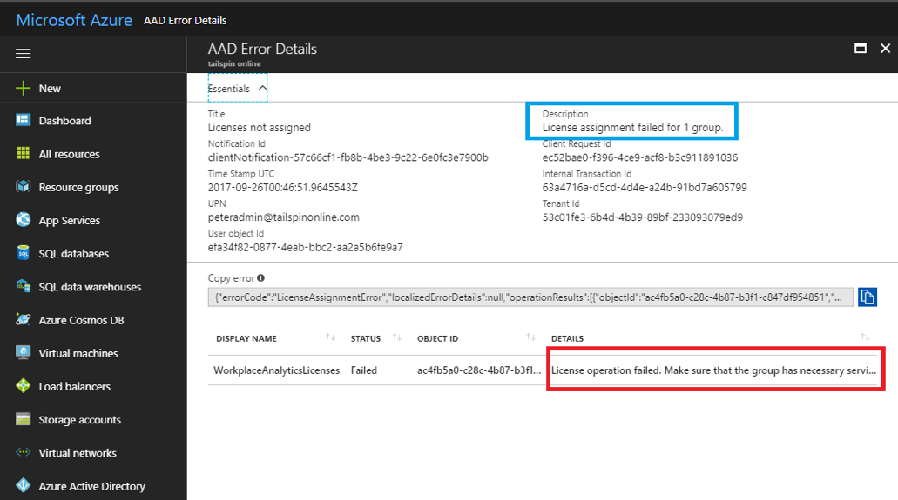

---

title: Group-based licensing for Workplace Analytics
description: Assign group-based licensing for Workplace Analytics
author: madehmer
ms.author: madehmer
ms.topic: article
localization_priority: normal 
ms.prod: wpa
ms.collection: M365-analytics
manager: scott.ruble
audience: Admin
---

# Assign group-based licenses for Workplace Analytics

Some Microsoft Online products are "add-ons," which require a service plan that's enabled for a user or a group. With group-based licensing, the system requires that both the prerequisite and add-on service plans be enabled for the group, so that any new users who are added to the group can get a valid service plan assignment.

Here's an example:

Microsoft Workplace Analytics is an add-on product that contains a single service plan with the same name and ID of WORKPLACE_ANALYTICS. This service plan can only be assigned to a user, or a group, when one of the following prerequisites are also assigned:
- Exchange Online (Plan 1) (Id: EXCHANGE_S_STANDARD)
- Exchange Online (Plan 2) (Id: EXCHANGE_S_ENTERPRISE)

If you try to assign this product on its own to a group, the portal will return an error:

The error notification details will include the following error message:
> _License operation failed. Make sure that the group has necessary services before adding or removing a dependent service. **The service Microsoft Workplace Analytics requires Exchange Online (Plan 2) to be enabled as well.**_

Before you assign this add-on license to a group, ensure that the group also contains the prerequisite service plan. You can update an existing group that already contains the full Office 365 E3 product that includes Exchange Online.
Or you can create a standalone group that contains only the minimum products required to make the add-on work, which you can use to license only the selected users for the add-on product.

For example, you can assign the following products to the same group:

- Office 365 Enterprise E3, with only the Exchange Online (Plan 2) service plan enabled
- Microsoft Workplace Analytics

The resulting assignment is valid and applied to the group. And thereafter, any users added to this group will consume one license of the E3 product and one license of the Workplace Analytics product. At the same time, those users can be members of another group that gives them the full E3 product and they will still consume only one license for that product.

>[!Tip]
>You can create multiple groups, for each prerequisite service plan. For example, if you use both Office 365 Enterprise **E1** and Office 365 Enterprise **E3** for your users, you could create two groups to license Microsoft Workplace Analytics; one using E1 as a prerequisite and the other using E3. This will allow you to distribute the add-on to E1 and E3 users without consuming additional licenses.

## Related topics

- [Environment requirements for Workplace Analytics](environment-requirements.md)
- [Group-based licensing](https://aka.ms/Instructions_AssignLicenseUsingGBL)
