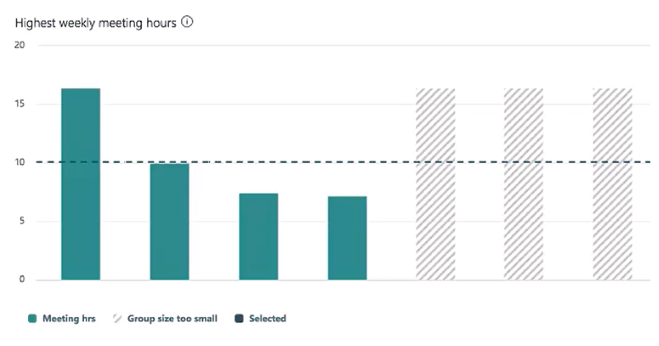

---
# Metadata Sample
# required metadata

title: Configure settings for Workplace Analytics
description: Describes how Workplace Analytics administrators can set and edit settings in Workplace Analytics. 
author: buntus
ms.author: v-johtob
ms.date: 11/16/2018
ms.topic: get-started-article
localization_priority: normal 
ms.prod: wpa
---

# Configure Workplace Analytics settings

## Workplace Analytics settings

On the **Settings** page, admins can customize system defaults and privacy settings and can also upload [organizational data](../Use/settings.md#organizational-data) to Workplace Analytics, from the corresponding tabs. This article focuses on system defaults and privacy settings. 

Follow company-specific legal and privacy guidelines to define and confirm the settings to use in Workplace Analytics. Then you are ready to provision Workplace Analytics. 

[!INCLUDE [To open the Workplace Analytics Settings page](../includes/to-open-wpa.md)]

## System and privacy

On the **System and privacy** tab, in the **System defaults** section, you can configure the following employee options:

- Default time zone
- Working days and hours
- Hourly rate

### Default time zone

This setting lets you configure the default time zone, which is used to compute after-hours metrics for employees whose time zone information was not originally provided in the organizational data file upload. Typically, the default time zone is the time zone of the corporate headquarters or the time zone in which most employees reside.

If a measured employee or other internal collaborator does not have the time zone defined in the organizational data file, or if you do not update the default time zone setting for your zone, Workplace Analytics uses Pacific Standard Time (PST).

#### To configure the default time zone

- From the **Default time zone** list box, under **System defaults**, select the appropriate time zone.

    

### Working days and hours

Users can set their own working days and hours in [Outlook settings](https://outlook.office.com/owa/?path=/options/calendarappearance).
No option exists within the organizational data file to upload working days and hours; however, the **Working days and hours** setting lets admins specify the default working and non-working days and hours of employees who have not already configured these settings in their mailboxes.

  

#### To configure working days and hours

1. Under **Working days**, select the appropriate check boxes for the days of the week.
2. From the **Working day starts** and **Working day ends** list boxes, select the appropriate start and end times.

### Hourly rate

The **Hourly rate** field in **System defaults** is related to the optional **HourlyRate** _column_ in the organizational data file that admins can choose to include, and use to calculate the total cost of low-quality meetings, as summarized on the [Meetings overview](../use/explore-metrics-meetings-overview.md#hourly-rate) page.

If you include the **HourlyRate** column in the organizational data file, cost is calculated as the sum of a person's default hourly rate for the organization multiplied by low-quality meeting hours.

The **Hourly Rate** _field_ lets admins set the hourly rate for employees when required. 
If no hourly rate is assigned to a meeting participant in the organizational data file, 
the default hourly rate field in System defaults is set to $75. However, admins can change the 
default value to any other hourly rate.

#### To configure the hourly rate

-  In the **Hourly rate** field, under System defaults, enter the appropriate employee hourly rate.

## Privacy settings

In the **Privacy settings** section, you can configure and customize the data that you want to include for analysis. You can use privacy settings to:

* Specify the minimum group size
* Specify whether to hide subject lines in Meeting query results
* Exclude words from subject lines
   
### Specify the minimum group size

   The minimum group size setting determines what you can view in the visual dashboards in [Explore metrics](../Use/Explore-Metrics-Week-in-the-Life.md) and in the [Solutions](../tutorials/solutions-task.md) area, and helps maintain employee privacy by ensuring that individuals cannot be easily identified by the attributes of the group. 
    The default minimum group size is set to five, but you can adjust the group size to suit the needs of your organization. However, you cannot set the size to lower than five. Larger group sizes reduce the risk of identification of individual group members.

**Example**

In the following chart, the blue-green columns on the left represent groups whose size exceeds the minimum group size. For this reason, they display real data. The gray and white columns on the right represent no data because the groups are below the minimum-group-size threshold.

> [!Note]
> The minimum-group-size rule applies to charts that display information derived from HR data. In other words, the charts display information about circumstances that exist in your organization -- such as managers at a specific level or employees in a particular city.  

**Histogram charts: an exception to the rule**

For histogram charts, the minimum-group-size rule is applied differently, in the following ways:

1. **Filter group too small, then no histogram appears**

   If the _filter group_ that the histogram uses for its data is below minimum group size, Workplace Analytics does not display the histogram at all.

2. **Bin population too small, the bin still appears**

   In histograms, the x-axis consists of rectangles, called "bins", that are based on average metric values, and the y-axis determines the number of people whose average metric value puts them in that bin. _Neither of these values reflects organizational data._ For this reason, the histogram still displays data for a bin even if it contains fewer people than the minimum-group-size value. Histogram charts can safely display this information because the information is based on metrics -- on values calculated from observed behavior, _not_ on HR data.

   Even if a bin in a histogram contained data for only one individual, the histogram still displays that data. 
   You cannot single out this individual because you do not know what HR �group� they belong to. (In other charts, such as 
   column charts, an individual in a group below the threshold might be identifiable, but in a histogram the HR group to 
   which individuals belong is the larger filter group.) You also cannot determine the precise metric value of individuals 
   because they are in a bin with a minimum 0.5-hour range.

  You can see histogram charts on the following pages in Workplace Analytics:

* In Explore on the Management and coaching tab 
* In Solutions:  
    * To set goals 
    * To track program success on the Track page 

### Specify whether to hide subject lines in [Meeting query](../tutorials/meeting-queries.md) results

 This enables you to control whether to include or hide subject lines in meeting query results, which, by default, are _not_ shown.

  

   If you select **Yes** for **Hide subject lines from Meeting query results**, the subject lines are converted to hashed values (a system-generated number), so that the text in subject lines is not readable in any queries. You can still create query-based keywords in the subject lines. However, you won't be able to see a list of meetings that show the subject lines. 

   If you select **Yes**, you could run a meeting query with the subject-line keyword �All-hands,� and (based on the attributes you include in the query) it could show data about the number of meetings, the length of meetings, the size of meetings, and so on, with that subject line. However, you could not get a specific list -- one line item for each meeting -- of all the meetings with the subject line �All-hands.�
    
### Exclude words from subject lines

   Subject lines are useful for analysts who want to set up meeting exclusion rules or to query meeting data. You can enter a list of specific keywords or terms that occur in the subject lines of emails and meetings that you want to exclude from analysis.  You can decide to:

   - Exclude instances of collaboration between:
        - Specific email addresses
        - Specific users in specific domains

   That is, you can exclude from analysis any emails and meetings emails to, or from, specific users, or exclude all users from specified domains. Any and all emails and meetings in which these email addresses are included (as both sender or recipient, and attendee or invitee) are excluded. Regarding domains, you only have the option to exclude (blacklist) not include (whitelist) specific domains.

   Terms can be any combination of letters, numbers and special characters: for example, client attorney privilege; D&I. Any items you exclude will not be included in the analysis, so it is important to carefully consider and balance your privacy and data analysis goals.  if you exclude domains, email addresses, or subject terms that frequently appear within the collaboration data set, it could adversely skew your analysis. Exclusion occurs before metadata is processed within Workplace Analytics. Learn more about [Workplace Analytics privacy and data access](../privacy/privacy-and-data-access.md).

> [!Note]
> Office 365 admins should not assign licenses to any excluded email addresses.

   
  
   As an example, if you exclude the email address of the CEO, (ceo@company.com) all meetings and emails in which the CEO is included are removed from analysis. This means that for all meetings and emails that include the CEO, the metadata for all other recipients and attendees included in those same emails and meetings is also excluded. If a user has multiple aliases, you must enter each email address for each alias that you want to exclude. When adding email addresses to exclude, it's important to consider all the implications of an exclusion.

 **Example: Exclude terms from subject line**

To exclude all emails that contain the keywords "confidential", "ACP", and "privileged", you would enter: **confidential;ACP;privileged**

#### Keyword exclusion logic

* You can use upper or lower-case keywords
* Matches exact string match for subject keywords
* Does not match partial words; you must list each partial word as a separate term

#### Examples: Keyword exclusion logic

Term from subject line to exclude | Actual subject line | Excluded
---------|----------|---------
 legal;acquisition | Verify this is LEGAL | Yes - Case is ignored
 legal;acquisition | Is this illegal | No - Does not match partial words, and did not exclude illegal
 legal;acquisition | Acquisitions are finalized | No - Does not match partial words, and did not exclude acquisitions
 legal;acquisition |Is this a legal acquisition | Yes  - Excluded both legal and acquisition

 When you add subject-line terms to exclude from analysis, Workplace Analytics might not recognize uncommon compound words, especially those in languages such as Japanese or Chinese. For best results, use single words, separated by semicolons.

### To configure privacy settings

1. Under **Privacy settings**, configure the minimum group size in the corresponding field.
2. Hide any desired meeting subject lines from query results in the corresponding drop-down menu. 
3. Exclude any domains, email addresses, or words from subject lines that you want from analysis.
4. Carefully verify that your privacy settings are correct and then select **"I confirm that all privacy settings are complete and that data will not be made available until user licenses have been applied**". Settings are not final until you select this check box.
5. At the top right of the page, select **Save**.

  Workplace Analytics only begins processing data when privacy settings run for the first time after you select **Save**. 
  Processing your data can take up to two weeks to complete. Once the data is ready, you can then upload the organizational 
  data file. Privacy settings take effect after the organizational data file is uploaded and processed.
  
   

> [!Note] 
> All subsequent changes to privacy settings after privacy settings run for the first time do not take effect until the next time that Workplace Analytics refreshes collaboration data. 
Any changes made to system defaults affect existing data.

### Video: Privacy

<iframe width="640" height="564" src="https://player.vimeo.com/video/282897705" frameborder="0" allowFullScreen mozallowfullscreen webkitAllowFullScreen></iframe>

## Organizational data

On the **Upload** page, on the **Organizational data** tab, admins can upload an organizational data file to Workplace Analytic in .csv format. 

Organizational data is contextual information about employees (for example, job title, level, location) and can come from human resources or other information systems.
Changes to specific attributes in the organizational data file only take effect from their specified effective date. 

For information on preparing and uploading the organizational data file, see [Preparing organizational data](../Setup/prepare-organizational-data.md).

## Settings Analysis

On the **Settings analysis** page, you can analyse your meeting data, for example, meetings that are not business-related, and add exclusion rules to remove any meetings that you don't want to include for analysis.

