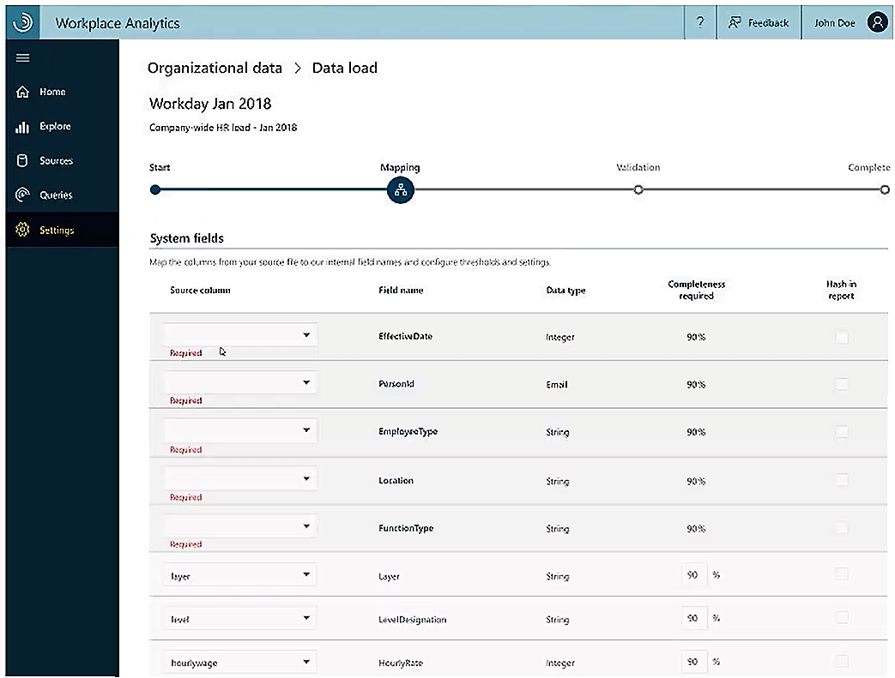
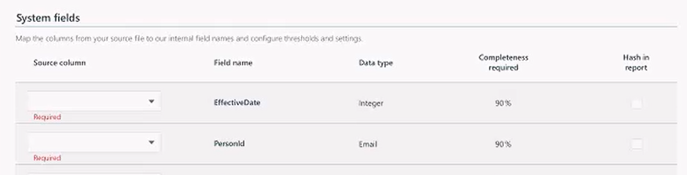
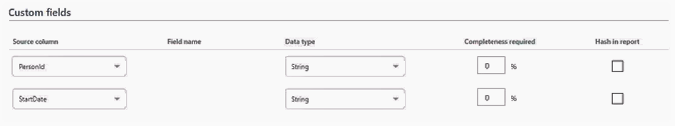
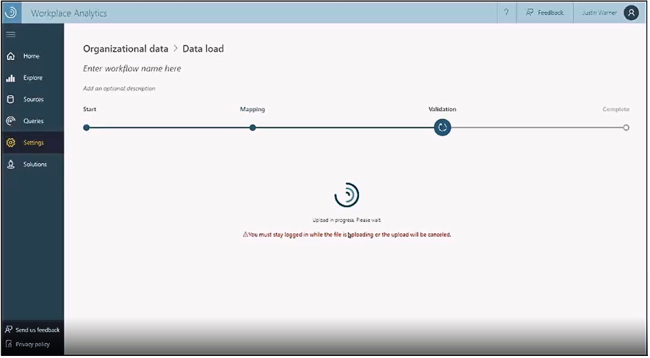
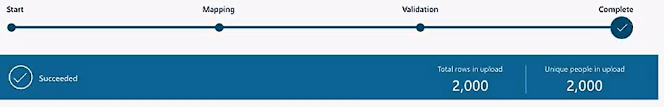
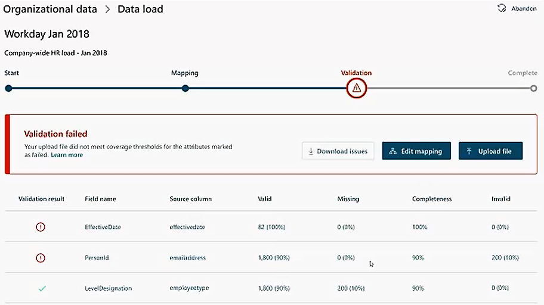

---
# Metadata Sample
# required metadata

title: Upload organizational data in Workplace Analytics
description: How to upload data from your organization to Workplace Analytics. 
author: paul9955
ms.author: v-pascha
ms.date: 04/06/2018
ms.topic: get-started-article
ms.prod: wpa
---

# Upload organizational data

This article presents the steps that administrators take to upload organizational data to Workplace Analytics. Complete these steps after preparing data as described in [Prepare organizational data](Prepare-organizational-data.md).

## Import tasks

The task of importing organizational data has three parts: 

1. [File upload](Upload-organizational-data.md#file-upload)
2. [Field mapping](Upload-organizational-data.md#field-mapping)
3. [Data validation](Upload-organizational-data.md#data-validation)

After you have prepared your source data, you upload your .csv file and map fields. After you map fields, data validation might or might not succeed. If the data successfully validates, the overall data-import task is complete. If the data at first does not validate, you can choose from among further options, which are described in [Validation fails](Upload-organizational-data.md#validation-fails).

## File upload

In this procedure, you specify a .csv file to upload to Workplace Analytics.

**To select the file to upload**

1.	Navigate to the page for Workplace Analytics. 

     – or – 

    Click the Office 365 waffle menu (
) and then click **Workplace Analytics**. 

2.	In the left navigation pane, click **Settings**.
3.	Click **Organizational data**. The Upload history area of this page displays the previous data uploads from your organization.
4.	Click **New upload**. This displays the Organizational data > Data load page. 
5.	Click **Enter workflow name here** and type the name of your new workflow. A “workflow” is the action of uploading your organization’s data. 
6.	(Optional) Click **Add an optional description** and type a description of this workflow. 
7.	In the Select file area, click **Choose file**. In the dialog box that appears, select the .csv file that you want to import. 

  > [!Note] 
  > If you are uploading new data, go to step 8, _Complete new file upload_. However, if you have uploaded data and then discovered that it contains sensitive, incorrect, or unauthorized data, you must remove the uploaded data and replace it with a new file. To do this, go to step 10, _Replace organizational data_. 

8.	<u>Complete new-file upload:</u> Click **Next**. This displays the System fields table. 
9.	Go to the next procedure, [Field mapping](Upload-organizational-data.md#field-mapping). 
10.	<u>Replace organizational data:</u> In the Select file area, click **Show advanced options**. This opens the Load type area. 
11.	In the Load type area, select **Replace all previous loads with this load**. Note the warning that states “Selecting this option will destroy your previous loads and use this new load as the base.”
12.	In the warning message that is displayed, click **[Continue]**. The data in the .csv file that you specified replaces the previously uploaded data for your organization. 
13.	Go to the next procedure, [Field mapping](Upload-organizational-data.md#field-mapping).

## Field Mapping

In this procedure, you map the fields (columns) in your source .csv file to field names that Workplace Analytics recognizes. You do this mapping on the Data load page:

 
The Data Load page displays two tables: System fields and Custom fields. You use these tables to map the data in your uploaded file. 

### System fields table

A system field can be either _required_ or _optional_: 

 * **Required fields** are identified in two ways: They appear in rows that have dark shading; under the Source column header, they are identified by the word “Required.”) These rows represent data that was found in the file that you uploaded. They are mandatory because the upload would fail if the mapping excluded one or more of these fields. In other words, you must map each of the required fields; you start this by choosing a value from the drop-down list. 
 * **Optional fields** are represented by rows with lighter shading. They appear below the required fields. These rows are commonly encountered system fields that Workplace Analytics suggests for use. For example, a field in this section might be called “Layer”; if “Layer” is not used in your organization, do not map this field. 

### Custom fields table

 * **Custom fields** are displayed on this page below the optional fields. Custom fields are not system fields. For the custom fields, you choose a source column from your source.csv, you give the column a name, choose the data type for it, set the appropriate completeness value, and finally decide whether to hash it. The completeness value depends on the intended use of the custom field: If you intend to use this data in much of your analysis, you should pick a high value. You can pick a lower value if it applies, for example, to only a small subset of people in your organization. 

### Columns in the System fields and Custom fields tables

 * **Source column.** Each of these fields corresponds to a column in the file that you uploaded.    
 * **Field name.**  This is the name that will be used in the Workplace Analytics product. 
 * **Data type.**  This is the data type of the field. 
 * **Completeness required.**  A source file might still be valid even if some rows have invalid or missing values for some columns. When you set “Completeness required,” you state the percentage of rows in the uploaded file that must be valid for this column so that the file validates. For example, if the data file updates information about people, since every row must be linked to a user, the PersonID field must be valid in every row. In this case, set the value for PersonID to 100%.
 * **Hash in report.** Use this field to obscure sensitive data. Selecting this option changes the way Workplace Analytics displays data in the report that it generates about the import operation. Instead of displaying the actual value that was taken from the source file, it would show a hashed version of the value – a format that cannot be read. 

**To map fields**

After you complete the steps in [File upload](Upload-organizational-data.md#file-upload), you are on the Data load page with the System fields table displayed.

1. <u>Map system fields:</u>

    
 
  <ol type="a"> 
  <li>Determine which of the columns in your CSV file correspond to the second column in the table (Field name).</li>
  <li>Under Source column (the first column in the table), click the down arrow. This displays a list of the column names that were found in the .csv file. From the list, select the correct column name for this data.</li> 
  <li>Fill in appropriate values for the other columns in the table: Field name, Data type, and so on. 
  For more information, see Columns in the System fields and Custom fields tables. Repeat these mapping steps for the rest of the required fields and for the optional fields that you choose to map.</li>
  </ol>

2. <u>Map custom fields:</u> 
Custom fields are optional: you need not map them all. Select the columns in your source (.csv) file that your organization considers important for the analysis that you want to perform. For example, if StartDate is important and your data contains this field, complete the row for StartDate. 

   
 
  <ol type="a">
  <li>Under Source column (the first column in the table), click the down arrow. This displays a list of the column names that were found in the .csv file. From the list, select the correct column name for this data – in this example, select **StartDate**.</li>
  <li>Set values for the other columns in the table: Select the data type, set a completeness-required percentage (see Setting “Completeness required” for custom fields), and select whether you want to hash the value in the report.</li>
  <li>Repeat these steps for the rest of the custom fields in your data that are important to your organization.</li>
  </ol>

3. Under Submit for validation, select **I confirm that these customizations are correct** and click **Submit**. This uploads the .csv file and starts the validation process. 
Go to the next procedure, [Data validation](Upload-organizational-data.md#data-validation).

## Data validation

After you complete the steps in [Field mapping](Upload-organizational-data.md#field-mapping), the Data load page displays the _Upload in progress_ screen:

 
> [!Important]  
> Observe the warning “You must stay logged in while the file is uploading or the upload will be cancelled.” This is because the upload takes place via this page in your web browser. Do not close the browser (or this browser page). If you do close it, the upload will fail. 

## Validation succeeds

If validation succeeds, the Data load page indicates that validation succeeded, it shows the size of the upload, and it shows the overall process as complete:
 

Click **_[how to get there?]_** to display the Data upload history page under Organizational data. On this page, click **Succeeded** to see the workflows that successfully validated (and uploaded). 

On this page, you have the following options:
 * Click view details (the eye icon) to see a summary of the validation results.
 * Click the hierarchy symbol to see the mapping settings for the workflow. 
 * Click the download symbol to download the validated .csv file. 

> [!Note] 
> Each tenant can have only one upload in progress at a time. This means that you must complete the workflow of one data file – either guide it to a successful validation or abandon it – before you begin the workflow of the next data file. By looking at the Start – Mapping – Validation – Complete bar, you can tell whether any data file is in the upload workflow. 

## Validation fails

The following illustration shows an example of a failed validation. 

 
After a failed validation, the Data load page shows the Validation failed notification. It also shows some details about the validation attempt and it presents you with several options: 

 * <u>Download issues:</u> Click this to see a log file that describes the problems in your data that can cause validation errors. Examine this file to decide what to do next: fix the source data or change your mapping settings. If you have a small number of errors, you’ll probably want to fix them. If you have many errors, you might want to abandon. (See the following choices.) 
 * <u>Abandon:</u> To restart the upload-map-validate process with new data rather than to retry the process with the current data, click Abandon (in the upper right corner of the page). Clicking Abandon does not retain any field mappings that you have made. 
 * <u>Fix:</u> If you decide to fix the errors, you have two options: 
   * <u>Fix the source data.</u> Fixing the data in your source .csv file is recommended, because it will increase the quality of the WPA analysis.
   * <u>Change the mappings.</u> This is the right choice if you originally had chosen the wrong data type. You could also lower the Completeness required threshold, but making that change, while getting you past this step, could negatively affect future WPA analysis. Click Edit mapping to set new mapping values, after which you can retry to validate your data file. 
 * <u>Upload file:</u> The difference between Upload file and Abandon is that your mappings are retained if you click Upload file. After you click Upload file, follow the steps in [File upload](Upload-organizational-data.md#file-upload). 

## Tips

### Setting “Completeness required” for custom fields

The purpose of a custom field determines whether you should assign it a higher or a lower value for Completeness required:

#### Set a high value

Generally, you should set the Completeness required field to a high value. This is especially important if your analysis will focus on that field. 

For example, you might include a ManagerId attribute. You might at first not think that you’re analyzing manager behavior and you might be tempted to omit this attribute. But building the organization hierarchy is used implicitly by many Workplace Analytics analyses – for differentiating different work groups, for determining high- and low-quality meetings based on how many levels attend, and more.

#### Set a lower value

The goal of your analysis might be to determine sales effectiveness. Your data might include an attribute for sales attainment that only makes sense for members of your sales force, who constitute 10% of the company. This number doesn’t apply to engineers or documentation writers, so there is no way to fill it out for them, but it is critical for high-performers in sales.  
