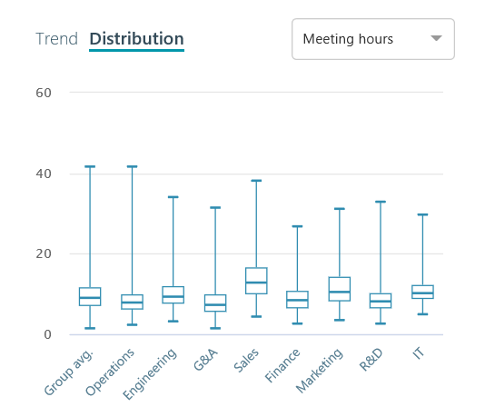

---
# Metadata Sample
# required metadata

title: Chart types in Workplace Analytics
description: This article describes the different chart types and how to use the chart features in Workplace Analytics dashboards.

author: rodonahu
ms.author: rodonahu
ms.date: 1/19/2018
ms.topic: get-started-article
ms.prod: wpa
---

# Chart types in Workplace Analytics
This article describes the different chart types and how to use the chart features in Workplace Analytics dashboards.

## Chart types
Workplace Analytics has several different chart types to help visualize your data in a variety of ways.

## About chart data

  * By default, Workplace Analytics groups data by organization, and shows the average metric for the nine largest organizations in the chart, as well as the average for all groups (including any beyond the top nine)
  * Your administrator can set a minimum group size threshold required for data to show in the chart. If the group size is less than the minimum, the group will be disabled. You can see the name of the group, but not the values. When the size of a group equals zero, that group is not shown
  * To see different organizations, or other organizational attributes, use the filters in **Chart display**

## Bar charts
Bar charts compare data across groups. Each bar shows the average value for the metric such as email or meeting hours per person per week in each group for the period selected. 

### To view the specific values for a group 
* Hover over the bar for the group you want.

### To hide or unhide a metric from the bar chart 
* In the legend below the chart, click the name of the metric to hide it. Click again to unhide the metric.

## Trend line charts
Trend line charts compare metric values over time. The default trend line is the company average. Each line shows the weekly average for the month for the Group by attribute value you have selected, over a rolling 13-month period. 

### To add a group trend line to the chart  
* Click the corresponding group bar in the adjacent bar chart. 

### To remove a group trend line from the chart, but keep it in the legend
 * Click the corresponding text in the legend. 
 
 ### To remove a group trend line from the chart completely 
 * Click the corresponding bar in the adjacent bar chart. 
 
 ### To reset all added lines from the chart and return to the default view 
*  Click **Reset**. 
 
 ### To view the specific values for a date 
 * Hover over the line on the date you want.
 
 ### To switch between the metrics (such as Emails or Meetings) 
 * Click the text or menu above the chart.

## Distribuition charts 
Distribution charts compare the distribution of metric values within a group. Each box plot shows the maximum, minimum, median, upper quartile, and lower quartile for the group for the period selected.

Each individual value within a group represents the average value for a person (for example: the person with the highest average is represented by the maximum point on the box plot).

### To view the distribution statistics for a group 
* Hover over the box plots for that group.

### To switch between the metrics (such as **Emails** or **Meetings**) 
* Click the text above the chart.

## Chart Settings

[[Lorem imp sum placeholder - UI change, awaiting new text]]

