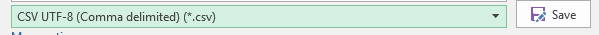

---

title: Workplace Analytics FAQ
description: Frequently asked questions about Workplace Analytics
author: paul9955
ms.author: madehmer
ms.topic: article
localization_priority: normal
ms.prod: wpa
---

# Frequently asked questions for Workplace Analytics

The most commonly asked questions and answers about Workplace Analytics are grouped into the following sections:

* [Setup and configuration](#setup-and-configuration)
* [Organizational data](#organizational-data)
* [Language support](#language-support)
* [Meeting exclusions](#meeting-exclusions)
* [Data validation and verification](#data-validation-and-verification)
* [Explore dashboards](#explore-dashboards)
* [Queries](#queries)

## Setup and configuration  

##### Q1. Do I assign licenses with Office 365 Admin Center, PowerShell, or Azure group-based licensing?

A1. Workplace Analytics licenses are assigned just like any other Microsoft 365 product licenses. You can assign them with the [Office 365 Admin Center](https://docs.microsoft.com/office365/admin/subscriptions-and-billing/assign-licenses-to-users?view=o365-worldwide&tabs=One), [PowerShell](https://docs.microsoft.com/office365/enterprise/powershell/assign-licenses-to-user-accounts-with-office-365-powershell), or [Azure group-based licensing](https://docs.microsoft.com/azure/active-directory/users-groups-roles/licensing-groups-assign). Learn more details about these options in the Workplace Analytics documentation at [Assign licenses](../setup/assign-licenses-to-population.md), [Assign group-based licenses](../use/group-based-licensing.md), [Assign licenses with PowerShell](../use/assigning-licenses-with-powershell.md), and [Environment requirements for Workplace Analytics](../setup/environment-requirements.md).

##### Q2. Does Workplace Analytics retain and use data about employees that no longer work for the organization?

A2. Workplace Analytics maintains historical organizational data that can include the de-identified data of past (previously licensed) employees. Organizational data is updated each time Workplace Analytics receives and processes it (usually monthly). However, the appearance of new data does not affect historical data. For more information, see [Prepare organizational data > How often to upload](../setup/prepare-organizational-data.md#how-often-to-upload-organizational-data).

##### Q3. How many people should be Workplace Analytics admins and/or analysts?

A3. This depends on the size of your organization and your requirements for managing organizational data. The number of analysts should be as many as your organization requires to perform data analysis. See [Assign Workplace Analytics roles](../setup/assign-roles-to-wpa-admins.md) and [User roles in Workplace Analytics](../use/user-roles.md) for more details.

<!-- THIS ANSWERED A QUESTION FROM JEREMY. REMOVE FOR NOW. 
> [!Tip] 
> While Workplace Analytics imposes no limit on the number of analysts in an organization, a large number of analysts might make it difficult to navigate the page for managing partitions. For more information, see [Partitions in Workplace Analytics](https://docs.microsoft.com/Workplace-Analytics/setup/partitions-in-wpa). -->

##### Q4. Can our organization's Office 365 admin also be our Workplace Analytics admin?

A4. Yes. It's up to your organization to choose who gets assigned which role. See [Assign Workplace Analytics roles](../setup/assign-roles-to-wpa-admins.md) and [User roles in Workplace Analytics](../use/user-roles.md) for more details.

##### Q5. Can I assign the Workplace Analytics admin and analyst roles to the same person?

A5. Yes. It's up to your organization to choose who gets assigned which role. Ideally, the admin and analyst roles are assigned to different people to prevent any misuse or external linking of org data with collaboration metrics. See [Assign Workplace Analytics roles](../setup/assign-roles-to-wpa-admins.md) and [User roles in Workplace Analytics](../use/user-roles.md) for more details.

##### Q6. Who should I assign Analyst Limited Access role to?

A6. The Analyst Limited Access role is for the analyst who needs access only to insights generated in the Workplace Analytics Explore-the-metrics dashboards. See [Assign Workplace Analytics roles](../setup/assign-roles-to-wpa-admins.md) and [Explore](../use/explore-intro.md) for more details.

##### Q7. After changing the configuration and privacy settings, when do the changes take effect in the data?

A7. Any changes to [Configuration and Privacy settings in Workplace Analytics](../setup/maintain-workplace-analytics.md) go into effect at the next organizational collaboration or data-processing upload. For more details, see [How often to upload](../setup/prepare-organizational-data.md#how-often-to-upload-organizational-data) in [Prepare organizational data](../setup/prepare-organizational-data.md).

##### Q8. What if my licensed population works in different time zones or has varying working hours?

A8. If measured employees or other internal collaborators have their time zones defined as part of your organizational data, then Workplace Analytics will use their individual time-zone settings for after-hours metrics and for other time-related metrics. However, if the organizational data does not have a time zone defined for an employee, Workplace Analytics will use the default time-zone setting that your admin sets in Workplace Analytics for that employee's data. For more details, see [Default time zone](settings.md#default-time-zone).

##### Q9. Can I configure what data certain analysts can access and use?

A9. You can assign analysts the Analyst Limited Access role, which limits them to the Explore dashboards. See [Assign Workplace Analytics roles](../setup/assign-roles-to-wpa-admins.md) and [User roles in Workplace Analytics](../use/user-roles.md) for more details.

## Organizational data

##### Q1. What causes the upload of the organizational (HR) data to fail?

A1. An upload can fail if the data has invalid values, is missing required data, or the validity threshold (checks for non-null values) for optional data is set too high. See [Use only valid values and formats](../setup/prepare-organizational-data.md#use-only-valid-values-and-formats) and [Subsequent uploads of organizational data](../setup/upload-organizational-data.md) for details.

##### Q2. What format do I save the data upload file as?

A2. You must save the data upload file as a CSV UTF-8 file format in Excel before the upload. Follow the steps in [Save a workbook to text format (.txt or .csv)](https://support.office.com/article/Save-a-workbook-to-text-format-txt-or-csv-3E9A9D6C-70DA-4255-AA28-FCACF1F081E6) and select to save the file as a **CSV UTF-8** file:

   

##### Q3. What format must I save the organizational or HR data file as?

A3. The file name must contain only alphanumeric characters (letters and numbers), with no spaces or special characters. For example: **FileName2.csv**.

##### Q4. How do I format the header columns in the .csv file?

A4. All field header or column names must:

* Begin with a letter (not a number).
* Contain only alphanumeric characters (letters and numbers, for example Date1).
* Have at least one lower-case letter (Hrbp); all uppercase won't work (HRBP).
* Have no spaces (Date1).
* Have no special characters (non-alphanumeric, such as @, #, %, &, and *).
* Match exactly as listed for [Workplace Analytics' Required and Reserved optional attributes](../setup/prepare-organizational-data.md#required-reserved-optional-and-custom-attributes), including for case sensitivity (for example PersonId and HireDate).

> [!Note]
> Special characters and spaces are OK in attribute names because they are automatically reformatted during field mapping to the accepted format for column names. This list is also included in [Use only valid values and formats](../setup/prepare-organizational-data.md#use-only-valid-values-and-formats).

##### Q5. What format must the row field values have in the .csv file?

A5. The field values in the data rows must comply with the following formatting rules:

* The required EffectiveDate and HireDate field values must be in the MM/DD/YYYY format.
* The required PersonId and ManagerId field values must be a valid email (gc@contoso.com, not < gc> gc@contoso.com).
* The required TimeZone field values must be in a [supported Windows format](https://docs.microsoft.com/windows-hardware/manufacture/desktop/default-time-zones).
* The required Layer field values must be numbers only.
* Have no special characters (non-alphanumeric, such as @, #, %, &, and *).
* The required HourlyRate field values must be numbers only, which Workplace Analytics assumes is in US dollars for calculations and data analysis.

     > [!Note]
     > Workplace Analytics doesn't currently do any currency conversions for the HourlyRate data. All calculations and data analysis in Workplace Analytics assume the data to be in US dollars.

     The field values also must not contain any of the following:

     * No accent marks (á)
     * No tildes (~)
     * No short or long dashes (-, --)
     * No commas (,)
     * No "new line" characters (\n)
     * No double (" ") or single quotes (' ')

     Limit character length of field values in rows to a maximum of 128 KB, which is about 1024 x 128 characters

     > [!Note]
     > These lists are also included in [Use only valid values and formats](../setup/prepare-organizational-data.md#use-only-valid-values-and-formats).

##### Q6. Can the data contain double-byte characters?

A6. Yes. The data can include double byte characters, such as Japanese characters.

##### Q7. What percentage does Workplace Analytics require for the validity threshold for required fields?

A7. Workplace Analytics requires that the PersonId field meet 100% of the validity threshold (which checks for non-null values), because each row of data should have a PersonId for each person in your organization. The other required fields must be greater than 95% of the validity threshold.

##### Q8. How do I append new columns onto an already existing organizational data file?

A8. You can append the existing organization data to update attribute values for existing employees, to add new employees, or to add new attributes. Refer to **Step 9** in the [File upload steps](../setup/upload-organizational-data.md#file-upload) for details.

##### Q9. For my first organizational data upload, should I choose "append" or "replace"?

A9. For your first upload, you will not have either of these choices. For more details about your first upload, see [First upload of organizational data](../setup/upload-organizational-data-1st.md). For more information about when to append or replace, see [Subsequent uploads of organizational data](../setup/upload-organizational-data.md).

## Language support

##### Q1. Can I upload an HR (org data) file that has non-English words or letters?

A1. Yes. The HR file can have non-English words or letters for the following:

   * File names and individual rows can have them.
   * You can upload fully localized HR files, but you must map each attribute or column header to an English name.

##### Q2. Can I construct a query with filters and/or meeting subject lines?

A2. Yes. You can use filters in queries that include the following, see [Customize a base metric in a query](../tutorials/customize-a-metric.md) for more details:

   * Attributes or values from your org data that include non-English words or characters.
   * Meeting subject lines (which may include non-English words or characters) as specific filter criteria.

## Meeting exclusions

##### Q1. What is the difference between the privacy settings and meeting exclusion rules?

A1. Privacy settings are set up for the overall data accessed and used by Workplace Analytics. For details, see [Workplace Analytics privacy settings](../use/settings.md#privacy-settings). Meeting exclusion rules are used in Workplace Analytics to help ensure that query results accurately represent relevant meeting norms within the organization. For details, see [Meeting exclusion rules in Workplace Analytics](../tutorials/meeting-exclusions-intro.md).

##### Q2. Can other analysts use the meeting exclusion rule sets that I create?

A2. Yes. Anyone in your organization can use the meeting exclusion rules that anyone else in the organization has created. For more questions and answers about meeting exclusion rules, see [Application of meeting-exclusion rules](../tutorials/meeting-exclusion-concept.md#application-of-meeting-exclusion-rules).

## Data validation and verification

#####  Q1. Why is my measured population less than the number of employees with assigned licenses?

A1. You might have selected only a subset of your population for data analysis or your admin might have excluded a subset of the population from the organizational data that's uploaded into Workplace Analytics. For more details, see [Page settings](explore-page-settings.md), [Office 365 data](office-365-data.md), [Assign licenses](../setup/assign-licenses-to-population.md), and [Whom to include in the organizational data](../setup/prepare-organizational-data.md#which-employees-to-include).

##### Q2. Why do the totals seem too high for other internal collaborators and external collaborators?

A2. The collaborator totals include the number of external (or other internal) people with whom the measured employees have collaborated at least one time during the selected period.

> [!Note]
> The totals included in the [Summary header](../use/explore-metrics-external-collaboration.md#summary-header) on the External collaboration page do not change with any filter applied in [Page settings](chart-types.md#page-settings-and-filters). For details, see [External collaboration](../use/explore-metrics-external-collaboration.md). For more details about measured employees, see [Office 365 data](office-365-data.md).

##### Q3. Why doesn't the email or meeting trend line extend back for the entire historical 13-month period (or for the custom time period I set)?

A3. Business policies can impact historical data processed by Workplace Analytics. As you view historical data, if you see a steady decline or point-in-time drop in email and/or meeting activity, it might be due to archiving. On the Sources page, you can select a time period where the email volume is stable. For details, see [Office 365 data summary in Data sources](../use/office-365-data.md).

##### Q4. How does Workplace Analytics process data for meetings and emails sent to distribution lists?

A4. Workplace Analytics processes email and meetings data for a distribution list as a single entity or person. It does not expand the distribution list and assign meeting and email hours to all of its members. For more accurate data, upload the org data attributes for these files by adding attributes of the distribution-list members or whatever best describes the list population. See [Upload organizational data](../setup/prepare-organizational-data.md) for detailed steps.

##### Q5. When a person sends a message from a shared mailbox, who gets credit or shows as the sender of the message?

A5. It depends on the permissions that are set for the Exchange Online shared mailbox.

 * **Send As** permissions - The shared mailbox gets credit for sending the email.
 * **Send on Behalf** permissions - The person who sends the message gets the credit.

For more about permissions, see [Which permissions you should use in shared mailboxes](https://docs.microsoft.com/exchange/collaboration-exo/shared-mailboxes#which-permissions-should-you-use).

(Also see this question about [Delegate access and Send on Behalf](#q5-how-does-workplace-analytics-treat-email-and-meetings-sent-on-behalf-of-another-individual-who-delegated-access-or-a-shared-mailbox).)

## Explore dashboards

##### Q1. How do I change the meeting exclusion rule sets used on the Explore dashboards?

A1. To change the meeting exclusion rule for use on the Explore dashboards, see [Use rules in the Explore dashboards](../tutorials/meeting-exclusion-rules.md#select-which-rule-to-use).

##### Q2. Why do I have fewer "filtered employees" than "measured employees" with no filters applied?

A2. The data can change based on what [Page settings](../use/explore-page-settings.md) are selected for the Explore or Plans pages you are using, which are not necessarily considered filters, but can still show varying totals. For details, see [Page settings for meeting exclusions](../use/explore-metrics-external-collaboration.md#page-settings). For more details about measured employees, see [Office 365 data](office-365-data.md).

##### Q3. How does Workplace Analytics estimate the cost of low-quality meetings? Can I customize this estimate?

A3. Admins can include optional hourly-rate data in the organizational data upload, which Workplace Analytics can use to calculate the total cost of low-quality meetings for the [Meetings overview](../use/explore-metrics-meetings-overview.md) data.

* If this HR data is provided, cost is calculated as the sum of a person's default hourly rate for the organization multiplied by low-quality meeting hours.
* If no hourly rate is assigned to a meeting participant, a default hourly rate of $75 is used. On the **Settings** page, admins can change the **Hourly Rate** field from its default value to any other hourly rate.

##### Q4. Why are a group's total meeting hours (included as part of working hours and after-hours work) larger than the group's total meeting hours for the week?

A4. This can occur because of the way Workplace Analytics calculates meeting hours:

* The meeting-hours total includes adjusted hours for attended meetings.
* As compared to total working hours and after-hours work that includes the number of meeting hours (not adjusted) for scheduled meetings.

This discrepancy can occur when meetings overlap, and Workplace Analytics doesn't know which meetings were attended, so the meeting hours total will include adjusted hours, which are an estimate of time actually spent in meetings. For example, let's say a group of five employees is double booked for two meetings from 4:30 to 5:30 PM, and the group's work day ends at 5 PM. For this scenario, Workplace Analytics adjusts the meeting hours to one hour, since the group cannot attend two meetings at the same time. However, Workplace Analytics doesn't adjust for the two scheduled meetings, which results in it adding five hours to total working hours and five hours to after-hours work. The group can avoid this discrepancy by declining any scheduled meetings that they do not attend.

##### Q5. What is the total workday length assumed for calculating focus hours?

A5. If measured employees or other internal collaborators have their time zones defined as part of your organizational data, then Workplace Analytics uses their individual time-zone settings for working hours, focus hours, and other time-related metrics. However, if the organizational data does not define a time zone for an employee, Workplace Analytics uses the default time-zone setting that your admin sets in Workplace Analytics for that employee. For more details, see [Time zone setting](../setup/configure-wpa-settings.md#time-zone) and [Focus hours and fragmented hours](../use/explore-metrics-week-in-the-life.md#focus-hours-and-fragmented-hours).

## Queries

##### Q1. When should I use a group-to-group query instead of a person-to-group query?

A1. Use a **group-to-group** query when you want to understand how one team invested their collaboration time with other teams within and outside of the organization.

Use a **person-to-group** query to help you understand how individuals invested their time with one or more collaborator teams within and outside of the organization. See [Queries overview](../tutorials/query-basics.md) for more details.

##### Q2. For a group-to-group query, what's the difference between the results for "Collaborators Within Group" and for "Same group as Time Investor?"

A2. If the result of a query defines the same set of people as members of both the time investors and collaborators groups, and these individuals also match any defined filters, then the collaborators are grouped together under the Collaborators Within Group results. The Same group as Time Investor results apply when a time-investor group allocates time only to themselves if no other groups are participating in the meeting or email.  See [Group-to-group query output](../use/csv-query-output-file.md#group-to-group-query-output) and [Overview of time allocation](../tutorials/group-to-group-queries.md#overview-of-time-allocation) for more details.

##### Q3. How do I analyze collaboration hours at my company for a specific time frame, such as 8 PM to 8 AM?

A3. You can use the Collaboration hours metric to filter for a specific time frame, regardless of when it occurs. Note that query results that use the Collaboration hours to filter for a time period that includes after-hours time, such as 8 PM to 8 AM, will include all people who collaborated during this time regardless of if they have this time period set as their working or non-working hours on their calendar.

##### Q4. Why don't totals for meeting hours and email hours match up with totals for working hours and after hours in person query output?

A4. Because totals for working hours and after hours calculate the "time booked on your calendar" instead of "time in meetings." Calculations for total meeting hours (time in meetings) adjusts the duration time to account for double booked meetings, where a person has two meetings scheduled at the same time or times that overlap on the calendar. A heuristic logic orders which meetings a person likely attended and assigns time accordingly. For more details, see [Person query output](../use/csv-query-output-file.md#person-query-output).

<!-- Original Q5 that was here. 

##### Q5. A person who has delegate access (for example, an executive assistant, or "EA") can organize meetings and send email on behalf of another person, such as a corporate leader. In its calculations, does Workplace Analytics view the _EA_ or the _leader_ as the creator of these items?

A5. The _leader_ is considered to be the creator. Note the following: 

 * <u>For meetings</u>, the EA must first have been granted delegate access to the leader's calendar. Then, the EA can open the leader's shared calendar and create and send the meeting invitation. In this situation, no metrics are attributed to the EA. Workplace Analytics considers the meeting request to have veen sent by the leader. 
 
  * <u>For emails</u>, no metrics are attributed to the EA. Workplace Analytics considers the email to have been sent by the leader. 
-->

##### Q5. How does Workplace Analytics treat email and meetings sent on behalf of another individual (who delegated access) or a shared mailbox?

A5. The shared-mailbox and delegate-access cases are treated differently by Workplace Analytics:  

 * **Shared mailbox** - If an individual sends an email or a meeting invitation on behalf of a shared mailbox, Workplace Analytics does not use this action in its calculations. 

 * **Delegate access** - If an individual sends an email or a meeting invitation on behalf of the mailbox of another user who has granted delegate access, Workplace Analytics considers the meeting request or email to have been sent by the individual whose mailbox the meeting is sent from (that is, _not_ the user who has delegate access).

(Also see this question about [Send As and Send on Behalf](#q5-when-a-person-sends-a-message-from-a-shared-mailbox-who-gets-credit-or-shows-as-the-sender-of-the-message).)

##### Q6. When I download and view a query, why is the data unreadable or not shown correctly in Excel?

A6. You probably opened the .csv file as is. For Excel to show the data correctly, you need to *import* the .csv file into Excel. For Excel 2016 users, follow the steps in [Download and import a query](view-download-and-export-query-results.md#download-and-import-query-results). For other versions of Excel, open **Help** within Excel and search and use Excel's instructions on how to import a .csv file. 

