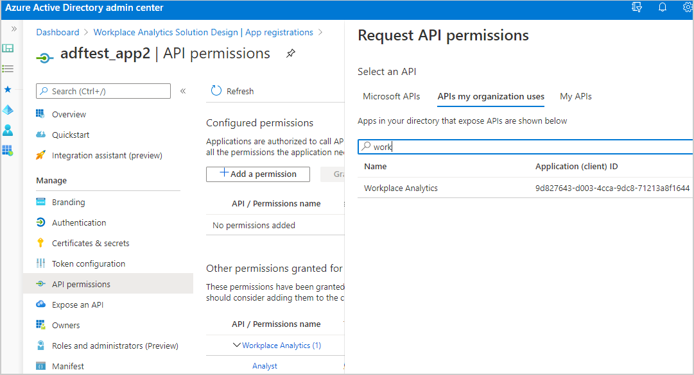
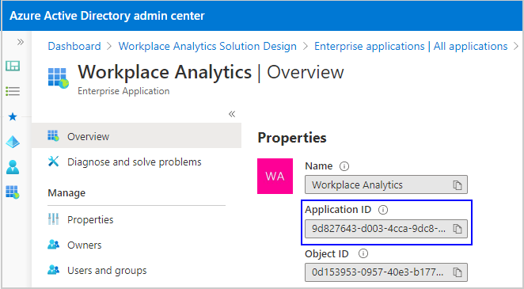
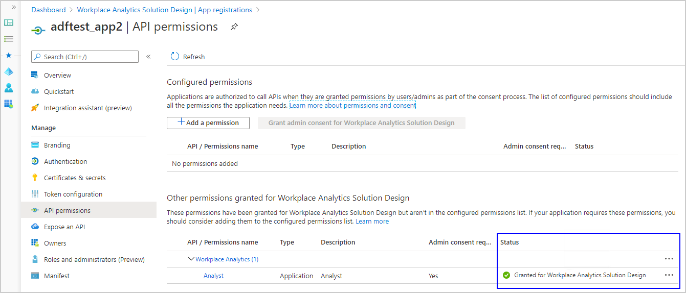
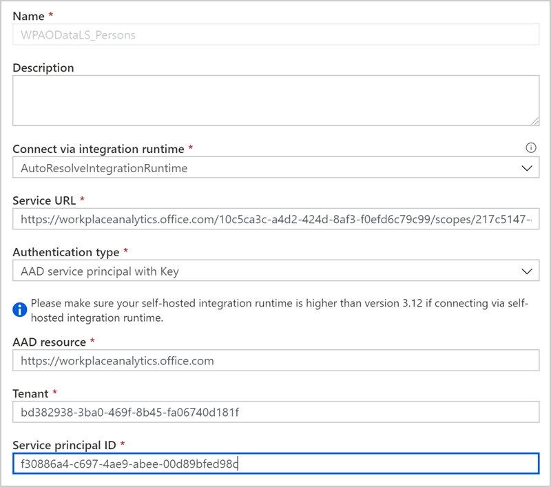

# Workplace Analytics Data export

_Data export is available only as part of a Microsoft service engagement._

Your company might have unique data-analysis needs requiring custom exploration of Workplace Analytics insights and data that goes beyond what's available in Workplace Analytics. For example, you might have custom data exploration that requires you to combine Workplace Analytics data with data outside of Workplace Analytics.

After you get a CS agreement, you can ask your Microsoft representative to enable data export for your Microsoft 365 tenant.
<!--You can also specify which partition to enable data export for in the Workplace Analytics app. The ability to specify what data can be exported by whom helps you maintain data protection.-->

After data export is enabled, your Workplace Analytics admin can view and use the Data export page in Workplace Analytics to save the SAS URI, which points to an Azure storage container with write-only permission.

Saving the SAS URI enables a workflow that exports the Workplace Analytics data to the storage container. The data will be exported each time it is refreshed in Workplace Analytics, for the agreed duration of the CS agreement.

## Data included in the export

You can export pre-processed Workplace Analytics data to a designated Azure storage container as .csv files. The export uses the latest available organizational data that was uploaded and processed in Workplace Analytics.

If you add new organizational data attributes to your Workplace Analytics upload, you must also add them as additional fields that you want to include in the export in the **Field privacy** section on the **Data export** page. The new fields are added to the next data export after the data upload is next refreshed and processed in Workplace Analytics. For details, see [Upload organizational data (subsequent uploads)](../setup/upload-organizational-data.md).

The following .csv files are included in data exports. Select a file to view what's included in that file, such as the data column names, data types, and definitions:

* [Meetings](#meetings)
* [MeetingParticipants](#meetingparticipants)
* [PersonHistorical](#personhistorical)
* [MailParticipants](#mailparticipants)
* [Mails](#mails)
* [Calls](#calls)
* [CallParticipants](#callparticipants)
* [InstantMessages](#instantmessages)
* [InstantMessageParticipants](#instantmessageparticipants)

## Azure environment requirements

Before exporting Workplace Analytics data, confirm the following:

* Your company has a current Azure subscription and an Azure storage account with an Azure storage container for storing the exported Workplace Analytics data.

* Have a write-only SAS URI for the storage container. To learn more about SAS, see [Delegating Access with a Shared Access Signature](/rest/api/storageservices/delegate-access-with-shared-access-signature).

## To export data from Workplace Analytics

1. If you have already installed Azure Templates, use the SAS URI created after deployment which grants write-only access to the raw data folder that was set up during deployment and use that URI in **Step 3**.
2. In Workplace Analytics, go to **Settings** > **Data export**.
3. In **Azure storage container SAS URI**, enter the URI for the Azure storage container.
4. In the **Field privacy** section, select which fields to export as raw values and as hashed values. Note the options for the required fields at the top of the list are locked and unchangeable, as shown in the following graphic.

   >[!Note]
   >When you add new attributes to your organizational data and you want to include them in a data export, you must repeat this step to add the new attributes as additional fields to include in the export.

5. Select **Save** (top right) to save your selections and enable a workflow that exports the Workplace Analytics data to the storage container. The applicable data is then exported to Azure during each subsequent data refresh in Workplace Analytics.

   

## Automate query data export to Azure with Azure Data Factory UI

Do you need to combine Workplace Analytics query data with other Azure data sources, such as HR or Sales data for more advanced data analytics and reporting? Are you manually downloading large amounts of static query data from Workplace Analytics and then uploading it into Azure on a routine basis?

With Azure Data Factory and Azure Active Directory, you can automate the export of Workplace Analytics query data through the OData query link to connect and automatically refresh an Azure data store of your choice.

You can then join dynamically refreshed Workplace Analytics query data with other organizational datasets for more advanced analysis and data science projects.

### Pick a setup path

To set up the automated OData connection between Workplace Analytics query data and your choice Azure data store, you can use one of the following paths to create and configure a new Azure analytics app, which needs company-specific information (secrets) about your private network and your choice data store.

* [Set up with Azure Data Factory UI](#to-set-up-with-azure-data-factory-ui) – This path steps you through creating and registering an app and creating a data factory for the data export through the Azure Data Factory UI.
* [Set up with Azure PowerShell](https://github.com/microsoftgraph/M365Insights/blob/master/README.md) – This path automates the process end-to-end through PowerShell with predefined scripts that create and register the app, prompt for your organization’s specific parameters, and create and deploy the data factory.

### Prerequisites

* **Workplace Analytics licensed analyst** – Must be assigned a license and an Analyst role for Workplace Analytics and have query results with the data you want to export.
* **Microsoft Azure subscription** – If you don't have an Azure subscription, create a [free account](https://azure.microsoft.com/free/) now. You’ll be using [Azure Active Directory](/azure/active-directory/), [OData connector](/azure/data-factory/connector-odata#supported-capabilities), and [Data Factory](/rest/api/datafactory/) for this setup.
* **Azure data store** – Your data store must be [supported by the OData connector](/azure/data-factory/connector-odata).
* **Azure admin** – You need Azure admin privileges to create and register the app in Azure. You also need to ask the Azure global admin to grant you permissions in Azure Data Factory to connect your new app to the Azure data store.

### To set up with Azure Data Factory UI

The following steps you through how to automate the export of Workplace Analytics query data to your choice Azure data store with the [Azure Data Factory UI](/azure/data-factory/introduction). Use the following steps in conjunction with the [Azure documentation](/azure/data-factory/introduction) to complete this setup.

1. Follow the steps in [Register an application using the Azure portal](/azure/active-directory/develop/quickstart-register-app#register-a-new-application-using-the-azure-portal) to create and register a new analytics app in Azure Active Directory.
2. In **Azure Active Directory App registrations**, select the app from **Step 1**,  and then grant it permissions for accessing Workplace Analytics by selecting **View API permissions**, and then select **Add a permission**.
3. Enter and search for the **Workplace Analytics App name** or **ID** and then select the applicable **Workplace Analytics app** from the list.

   

   To find the Application (client) ID:

   * In **Active Directory**, select **all applications**, and then enter **Workplace Analytics** for the Workplace Analytics enterprise app that you want to use.
   * Select **Workplace Analytics** from the list.
   * In **Workplace Analytics Application ID**, copy the ID and paste it in **APIs my organization uses** search field.

     

4. In **Request API permissions**, select **Application permissions**, select **Analyst**, and then select **Add permissions**.
5. In **API permissions**, the global admin must select **Grant admin consent for [Workplace Analytics…]** before you can continue to the next step.

    

6. Follow the steps in [Create data factory](/azure/data-factory/quickstart-create-data-factory-portal) to create a new analytics data factory within Azure Active Directory.
7. In the **Azure Data Factory Overview**, select **Author & Monitor** to open Azure Data Factory.

    >[!Note]
    >Keep all your browser windows open because you must switch between them to complete the following steps.

8. In **Azure Data Factory**, select **Create a pipeline**.
9. Select the **ellipsis** (**...**) next **Datasets**, and then select **New dataset**. For more details, see [Datasets in Azure Data Factory](/azure/data-factory/concepts-datasets-linked-services).
10. In **Select a data store**, enter **odata**, and then select **OData**.
11. In **General**, enter a name and description for the Workplace Analytics query data you’re linking to.
12. Select **Connection**, select **New**, and then enter a name and description for the OData link, such as **WPA_Odata_Collab**.

13. In **Connect via integration runtime**, select **AutoResolveIntegrationRuntime**.
14. In [Workplace Analytics](https://workplaceanalytics.office.com/) > **Query designer** > **Results**, copy the OData link for the query data you want to connect to Azure.

    >[!Important]
    >For automatically refreshed data, you must link to a query that uses the [Auto-refresh option](../tutorials/query-auto-refresh.md#create-a-query-with-the-auto-refresh-option). For static query results, you’ll need to enter a new OData link each time to update the query data in the connected Azure data store.

     

15. In **Service URL**, paste the query OData link that you copied in the previous step.
16. In **AAD resource**, enter `https://workplaceanalytics.office.com`.
17. In **Active Directory**, select **Overview** for the new app, and then copy the **Application (client) ID**.

     

18. In **Azure Data Factory** > **New linked service** > **Service principal ID**, copy the client ID. For  details, see [Linked service properties](/azure/data-factory/connector-odata#linked-service-properties).

     

19. In **Authentication type**, select either **AAD service principal with Key** or **AAD service principal with Cert**. Keep **New linked service (OData)** open in a separate browser window. For details about these options, see [Use Azure Key Vault secrets in pipeline activities](/azure/data-factory/how-to-use-azure-key-vault-secrets-pipeline-activities).
20. In **Azure Active Directory** > **your newly registered analytics app**, select **Certificates & secrets**, and then do one of the following.

    * **For Key authentication**, select **New client secret** and in **Add a client secret**, enter a description, select when it expires, and then select **Add**. In **Client secrets**, select the new secret, and then select the **Copy icon** to copy it.
    * **For Certificate authentication** (preferred for higher security), select a certificate and copy it.

21. In **Azure Data Factory**, do the following for the applicable authentication type:

    * For Service principal key, paste the new client secret copied in the previous step in **Service principal key**.
    * For **Azure key vault**, copy and paste the certificate and the other required information. See [Set and retrieve a secret from Azure Key Vault](/azure/key-vault/secrets/quick-create-portal) for details.

22. Select **Test connection** to test the OData linked service.
23. After you see **Connection successful**, select **Create**.
24. In **Connection** > **Linked service** for the new OData linked service, select the new dataset you just created in the previous steps.
25. In **Connection** > **Path**, select **Edit**, and then enter the **Entity set name**. To find it, copy the OData query link from [Workplace Analytics](https://workplaceanalytics.office.com/) > **Query designer** > **Results**, and open it in a new browser window. Then search for **metadata** to find the entity name, which is shown after **$metadata#**. For example, the entity name shown in this graphic is **Persons**:

     

26. Select **Preview data** for the path to confirm you entered the correct entity.
27. In **Azure Data Factory** > **Properties**, confirm the name and description for this new dataset.
28. Select **Publish all** at the top, and then select **Publish**.
29. In **Pipelines**, create a new pipeline that can use the new OData dataset to copy the Workplace Analytics data to the external resource. For details, see [Create a pipeline](/azure/data-factory/tutorial-copy-data-portal#create-a-pipeline).
30. For the new pipeline, select **Source**, and in **Source dataset**, select the name of new OData dataset, and in **Use query**, select **Table**.
31. Create a linked service for the data store you want to export to. For details, see [Linked services](/azure/data-factory/author-management-hub#linked-services).
32. In **Azure Data Factory** > **Author**, select the new pipeline, and then select **Add trigger** > **Trigger now** to manually run the last published pipeline, as shown in the following graphic. You can also schedule a trigger for this new pipeline by selecting **Add trigger** > **New/Edit** > **New**, and complete the required information for it. See [Pipeline execution and triggers in Azure Data Factory](/azure/data-factory/concepts-pipeline-execution-triggers) for details.

     

33. In **Sink** > **Sink dataset**, select the linked service name you created in a previous step.

You can then use this new data factory to access query data from Workplace Analytics and copy it to your choice data store (blob storage) by using the Azure Resource Manager template. You can reuse this new app over time for multiple projects without having to repeat these steps. You can also reuse the data factory you created for new pipelines.

### Related information

[Automate query data export with PowerShell](https://github.com/microsoftgraph/M365Insights/blob/master/README.md)

## Exported .csv files

The .csv files that are listed in this section are included in data exports.

### Meetings

This file includes one row for each meeting or appointment with the following metrics. Recurring meetings result in a row for each occurrence.
  
|Column name|Data type|Description|
|-----------------|---------------|-----------------|
|MeetingId|string|Unique identifier for each meeting (including recurring meetings); primary key|
|ICalUid|string|Meeting calendar ID|  
|Subject|string|Meeting subject (respects tenant privacy settings; see [Workplace Analytics Privacy settings](../use/privacy-settings.md) for details)  |
|IsRecurring|Boolean|True if this is a recurring meeting|
|IsCanceled|Boolean|True if the meeting was canceled|
|StartTime|datetime|Meeting start time|
|DurationMinutes|integer|Meeting length in minutes|
|TotalAccept|integer|Total number of meeting acceptances|
|TotalDecline|integer|Total number of meeting declines|
|TotalNoResponse|integer|Total number of invitees who did not respond to the meeting invite|
|TotalTentativelyAccepted|integer|Total number of invitees who tentatively accepted|
|TotalAttendees|integer|Sum of total accept, total no-response, plus organizer|
|TotalDoubleBooked|integer|Number of attendees who had conflicting meetings or appointments on their calendar|
|TotalEmailsDuringMeeting|integer|Number of emails sent during the meeting by all attendees who did not decline the meeting invitation|

### MeetingParticipants

This file has one row for each participant in a calendar meeting with the following metrics.
  
|Column name |Data type |Description |
|-----------------|---------------|-----------------|
|MeetingId |string |Unique identifier for each meeting (including recurring meetings); foreign key matching [Meetings](#meetings) table|
|PersonHistoricalId |string |Unique value for a participant any time an HR attribute changes; foreign key matching [PersonHistorical](#personhistorical) table|
|LocalStartTime |datetime |Start time of the meeting in the participant's local time|
|IsOrganizer |Boolean |True if this participant organized the meeting|
|IsDoubleBooked |Boolean |True if this person has more than one meeting at this time in their calendar|
|Response |enumerated |Invitee's response to the meeting: declined, tentative, accepted, or no response|
|DurationMinutesAdjusted |double |Time spent in meeting, adjusted if double booked|
|NumberOfEmailsDuringMeeting |integer| The number of emails sent by this participant in this meeting|

### PersonHistorical

This file includes one row for each person that has HR attribute changes and for each HR change with the following metrics. A new row is created when a person's HR attributes change.
  
|Column name|Data type|Description|
|-----------------|---------------|-----------------|
|PersonHistoricalId|string|Unique value for every person for each HR change; primary key|
|EmailAddress|string|Masked value, unique for every email address|  
|StartDate|datetime|Effective start date of last HR change (does not apply for original hire date, or leave date)|
|EndDate|datetime|Effective end date of last HR change (does not apply for original hire date, or leave date)|
|PopulationType|string|Type of employee. See [PopulationType](#populationtype).|
|ManagerId|string|Unique value for each person's manager|
|HR Attribute 1|varies |HR values that have been added to the dataset; see [HR attributes](#hr-attributes).|
|   ...   |||
|HR Attribute n|varies |HR values that have been added to the dataset; see [HR attributes](#hr-attributes).|
|LevelDesignation|string|HR values for employee levels that represent an employee's experience, management level, or seniority within the organization.|
|Organization|string|HR values for the internal organization for which employees belong that's specific and identifiable by the organization's leaders.|
|IsInternal|Boolean|True if PopulationType is either MeasuredEmployee or InternalCollaborator|
|ExternalCollaboratorId|string|Email address if PopulationType is ExternalCollaborator and the tenant is configured to include external email IDs in the report|

#### PopulationType

The following describes possible values for the **PopulationType** column.

|Value|Description|
|------|------|
|MeasuredEmployee|An employee who has a Workplace Analytics license assigned|
|InternalCollaborator |A person within the company who does not have a Workplace Analytics license assigned|
|ExternalCollaborator |A person with a domain that does not match the default company domain|
|DistributionList |An Active Directory distribution list|
|MeetingRoom |A meeting room|

#### HR attributes

The HR attributes represent organizational data your company has uploaded for use in Workplace Analytics. The attributes include a required set of attributes, optional attributes, and custom attributes. For more information about these attributes, see [Prepare organizational data](../setup/prepare-organizational-data.md#attribute-reference).

### MailParticipants

This file includes one row for every email sent and received with the following metrics.
  
|Column name|Data type|Description|
|-----------------|---------------|-----------------|
|MailId|string|Unique identifier for every email sent; foreign key matching primary key of the [Mails table](#mails)|
|PersonHistoricalId:|string|Unique identifer for every person; foreign key matching [PersonHistorical](#personhistorical) table primary key|  
|IsSender|Boolean|True if this person sent the email|
|LocalSentTime|datetime|Local time when the email was sent|
|PersonTimeSpentInHours|double|Time spent reading or writing email in hours (heuristic estimated value)|
|PersonTimeSpentInMinutes|double|Time spent reading or writing email in minutes (heuristic estimated value)|

### Mails

This file includes one row for every email sent with the following metrics.

|Column name|Data type|Description|
|-----------------|---------------|-----------------|
|MailId|string|Unique identifier for each email; primary key|
|ConversationId|string|Unique thread identifier|
|Subject|string|Meeting subject (respects tenant privacy settings; see [Workplace Analytics Privacy settings](../use/privacy-settings.md) for details)|
|SentTime|datetime|When the email was sent, in the sender's local time|
|SenderTimeSpentinMinutes|double|How many minutes spent writing the email (heuristic estimated value)|
|NumberOfRecipients|integer|Number of email recipients, not including the sender|

### Calls

This file includes one row for each call with the following metrics. Recurring, scheduled calls (also referred to as _meetings_) result in a row for each occurrence.

|Column name |Data type |Description |
|-----------------|---------------|-----------------|
|CallRecordId |string |Unique identifier for each call (including scheduled calls); primary key  |
|MeetingId |string |Meeting calendar ID (iCalUID + StartDate) associated metadata found on the mapped MeetingId (if a scheduled call/meeting) |
|AppName | string |Name of the source app (for example: Teams, Skype) |
|IsScheduledCall |Boolean |True if this is a scheduled call |
|TotalParticipants |integer |Sum of total participants for the call |
|InteractionType |enumerated |Invitee's response to the call: joined or attended, tentative, accepted, or no response |

### CallParticipants

This file includes one row for each participant in a call with the following metrics.
  
|Column name|Data type|Description|
|-----------------|---------------|-----------------|
| CallRecordId | string | Unique identifier for each call (including scheduled calls); primary key  |
| PersonHistoricalId | string | Unique value for a participant any time an HR attribute changes; foreign key matching [PersonHistorical](#personhistorical) table |
| IsOrganizer | Boolean | True if this participant organized the call |
| LocalStartTime | datetime | Start time of the call in the participant's local time |
| LocalEndTime | datetime | End time of the call in the participant's local time |

### InstantMessages

This file includes one row for each instant message with the following metrics.

|Column name|Data type|Description|
|-----------|---------|------------|
| InstantMessageId |string |Unique identifier for each instant message; foreign key matching InstantMessage table |
| AppName |string |Name of the source app (for example: Teams, Skype) |
| SentTime |datetime |Sent time of the instant message in the participant's local time |
| InteractionType |enumerated |The type of instant message received by a person: GroupChat, OneOnOneChat |
| TotalParticipants |double |Sum of total IM participants (includes sender) |

### InstantMessageParticipants

This file includes one row for each participant in an instant message with the following metrics.

|Column name |Data type |Description |
|-----------|----------|-----------|
|InstantMessageId |string |Unique identifier for each instant message; foreign key matching [InstantMessage](#instantmessages) table |
|PersonHistoricalId |string |Unique value for a participant any time an HR attribute changes; foreign key matching [PersonHistorical](#personhistorical) table |
|isAfterHours |Boolean |True if this instant message was sent after hours |
|IsSender |Boolean |True if this person was the instant message sender |
|LocalSentTime |datetime |Sent time of the instant message in the participant's local time |
|SenderTimeSpentInMinutes |double |Time spent in instant message, approximation |

