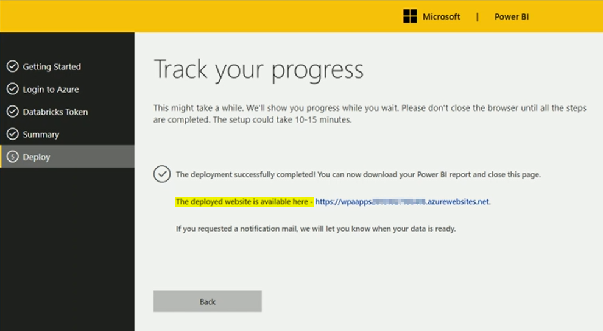
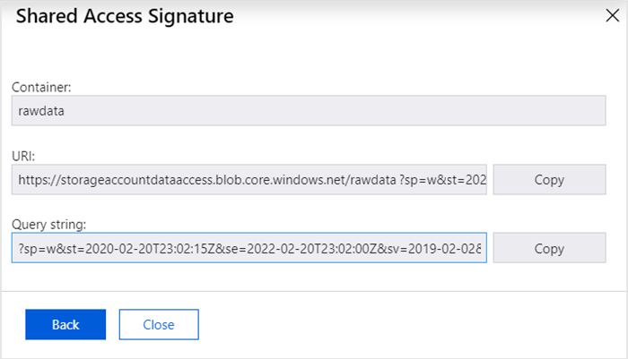
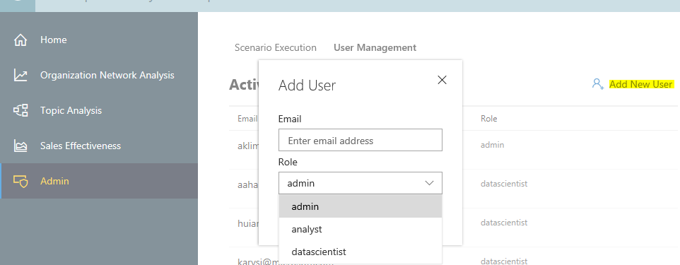
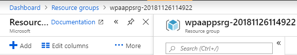
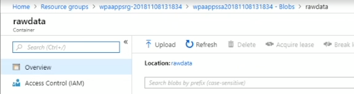

---

ROBOTS: NOINDEX,NOFOLLOW
title: Deploy and configure Workplace Analytics Azure Templates 
description: Learn how to deploy and configure Workplace Analytics Azure Templates
author: madehmer
ms.author: madehmer
ms.topic: article
localization_priority: normal 
ms.prod: wpa
ms.collection: M365-analytics
manager: scott.ruble
audience: Admin
---
# Deploy and configure Workplace Analytics Azure Templates

_These templates are only available as part of a Microsoft service engagement._

Before you can use Workplace Analytics Azure Templates for advanced data analysis, you need to do the following:

 - [Review the security considerations](#security-considerations)
 - [Confirm the prerequisites](#prerequisites)
 - [Deploy the templates](#deployment)
 - [Generate SAS URI for Data Access](#generate-sas-uri-for-data-access)
 - [Configure the templates](#configuration-add-users-and-assign-roles)
 - [Process the data](#process-the-data)
 - Additional [configuration](#configuration) and [Audit logs](#audit-logs) are also available

## Security considerations

Before deploying and configuring these templates, review the following security principles.

* Data is stored in your Azure subscription.
* Data is encrypted on disk and all access to and communication between Azure Resources and these templates are enabled and secured with the Secure Sockets Layer (SSL) certification.
* Authentication leverages Azure Active Directory.
* Authorization is set at the Azure Databricks and Azure Templates level by the Azure administrator who installs and sets up the Workplace Analytics Azure Templates.
* An Azure Template Configuration log is created during installation.

## Prerequisites

Before deploying Workplace Analytics Azure Templates, confirm or complete the following:

1. Confirm that [Workplace Analytics is set up](../setup/set-up-workplace-analytics.md) and ready to use.
2. Enable [Workplace Analytics data export](../data-access/data-access.md) for the Azure tenant.
3. Do the following for the Azure subscription that will host these templates and the data exported from Workplace Analytics:

   * Confirm you have either an Azure Admin or an Azure Contributor role to deploy these templates.
   * Get [applicable Azure AD permissions](https://docs.microsoft.com/azure/active-directory/develop/active-directory-how-applications-are-added) for yourself (or the admin doing the deployment) from your Office 365 global administrator.
   * If the Workplace Analytics team is deploying the templates, confirm that vendor accounts are set up for the team and that the Technical Operations engineer also has the applicable Azure AD permissions to install and set up the templates.

## Deployment

1. Get and open the Azure deployment link for the Workplace Analytics Azure Templates from the Workplace Analytics team.
2. On the **Getting Started** page, select **Next**.
3. When prompted, select the Azure subscription.
4. For **Resource group**, you can select to:

   * **Create new** to create a new resource group.
   * **Use existing** to use an existing resource group and append the existing group with what's needed for this template, including any updates for any of the other templates in this group.

5. Select the applicable **Region** and then select **Next**.
6. On the **Deployment Review** page, confirm the selections and then select **Next**.
7. After the Azure Databricks workspace deployment is done, you are automatically signed in to Azure Databricks. If you’re not, you need to sign in manually.
8. On the **Databricks Token** page, you need to [generate the Azure Databricks Token](https://docs.azuredatabricks.net/api/latest/authentication.html#generate-a-token) for the App source.
9. On the **Summary** page, select a SKU for the data cluster, which must be about 30 percent larger than your Workplace Analytics dataset (ask your Workplace Analytics Admin for help with this), for the following Azure components:

   * [Azure Resource Group](https://docs.microsoft.com/azure/azure-resource-manager/resource-group-overview#resource-groups)
   * [Azure Blob storage account](https://docs.microsoft.com/azure/storage/blobs/storage-blobs-introduction)
   * [Azure Databricks](https://docs.microsoft.com/azure/azure-databricks/)
   * [Azure SQL database](https://docs.microsoft.com/azure/sql-database/sql-database-dtu-resource-limits-single-databases)
   * [Azure Analysis Services](https://docs.microsoft.com/azure/analysis-services/)
   * [Azure Web Apps (App Service)](https://docs.microsoft.com/azure/app-service/)
   * [Azure Key Vault](https://docs.microsoft.com/azure/key-vault/key-vault-use-from-web-application)

10. Select **Next** and review deployment information. For example, confirm the Databricks cluster is assigned. If it's empty, no resources will be deployed for it.
11. In **Deployment Review**, select **Next** to deploy and configure the resources for the Azure components. This two-phase deployment can take up to 60 minutes to complete.
12. After the deployment is complete, open, copy, and save the deployed website link for the templates, as shown in the following graphic.

    >[!Important]
    >You must save this deployment link because you and the other users you add need the link to configure and use the templates.

    

## Generate SAS URI for Data Access

After deployment, you need to create a write-only SAS URI on the raw data container in the storage account created during the deployment. The SAS URI is given to the Workplace Analytics admin to configure the weekly automated data access feed that is required to drive a few of the Azure Templates.

1. Use Storage Explorer (or Storage Explorer (preview) web) application to view the raw data container in the storage account created during deployment.
2. Right-click the **rawdata** folder and select **Get Shared Access Signature**.
3. In **Shared Access Signature**, set a two-year expiry time.
4. In **Permissions**, confirm only **Write** is selected, and then select **Create**.
5. For URI, select **Copy** to copy the complete URI, which will be similar to the example URI in the following graphic.
6. Give the new URI that you copied in the previous step to your Workplace Analytics admin, who needs it to configure [automatic data exports](../data-access/data-access.md#to-export-data-from-workplace-analytics).

    

## Configuration: Add users and assign roles

As the Azure Templates admin, you can use the Admin page to manage security, privacy settings, and other administrative processes. Before other people can use the templates, you need to add them as users and assign them one of the following roles based on the tasks they need to accomplish with the templates:

* **Azure Templates Admin**

  * Can add other users and assign roles for the templates.
  * Can share the templates website link with other users.
  * Can share the link to access the [Azure Databricks Workspace](https://docs.azuredatabricks.net/user-guide/workspace.html) with assigned Data scientists.
  * Configure specific template settings on the [Configuration](#configuration) page.
  * Access and [audit logs](#audit-logs).

* **Analyst**

  * Can access, use, and customize the analytical templates available through the Workplace Analytics Azure Templates website link.
  * Can access, use, and customize the Power BI reports and dashboards connected to the Workplace Analytics Azure Templates.

* **Data scientist**

  * Can access, use, and customize the same analytical templates and Power BI reports and dashboards as the Analyst.
  * Can also access the Azure Databricks Workspace and use Python or R scripts to derive new insights.

**To add users and assign them roles:**

1. Use the website link (from the last step in Deployment) to open the Workplace Analytics Azure Templates.

2. Select **Admin** > **User Management** > **Add New User**.

3. Type the email address for the new user and select the applicable role for this user, as shown in the following graphic.

     

## Process the data

After adding users, you need to process the Workplace Analytics data that you want to use with these templates:

1. In Azure Resource groups, locate the folder that the deployment just created. The new resource group name begins with **wpaappsrg** and includes the deployment date and time, as shown in the following graphic.
  
   

    The new storage group contains a **rawdata** folder, as shown in the following graphic.

     

2. Confirm that the following .csv files are in the new **rawdata** folder:

   * **MailParticipants.csv**
   * **Mails.csv, MeetingParticipants.csv**
   * **Meetings.csv**
   * **PersonalHistorical.csv**

   If these .csv files are not already in the **rawdata** folder, you need to use the Azure Storage Explorer (or other comparable tool) to connect to the Azure storage group that currently stores your Workplace Analytics data set, and select and copy these files into that folder.

3. In the Workplace Analytics Azure Templates app, select **Admin** > **Scenario Execution**, select the **rawdata** folder, and then select **Process data**.

   

## Configuration

As an admin, you can configure template settings in **Admin** > **Configuration**, including:

* The minimum group size, maximum number of nodes and links in data analysis with the Organizational Network Analysis Azure Template.
* If the Process Explorer Azure Template either surfaces and uses, or does not surface or use, email subjects in blob storage datasets to help train the model for categorization.
* Set the number of days to retain data created and saved as joined datasets with the **Join Datasets Template**.

## Audit logs

As an admin, you can audit user activity in **Admin** > **Logs**. Select the **information** (i) icon in the **Message** column to see more details about a specific  activity.

## Get support

* For help with Workplace Analytics Azure Templates, email your questions or feedback to wpaazuretemplates@microsoft.com.
* For setup and data analysis help with Workplace Analytics, open [Workplace Analytics](https://workplaceanalytics.office.com), select the **smiley face** icon (at the top of the UI), enter your question or feedback, and then select **Send**.
* For general help with Office 365 and Azure subscriptions, components, assigning licenses, and issues with user access and permissions, contact [Microsoft Support](https://support.microsoft.com/).

## Related topics

* [Workplace Analytics Azure Templates overview](./overview.md)
* [What's new in Workplace Analytics Azure Templates](./release-notes.md)
* [Organization Network Analysis Azure Template](./organization-network-analysis.md)
* [Topic Analysis Azure Template](./topic-analysis.md)
* [Process Explorer Azure Template](./process-explorer.md)
