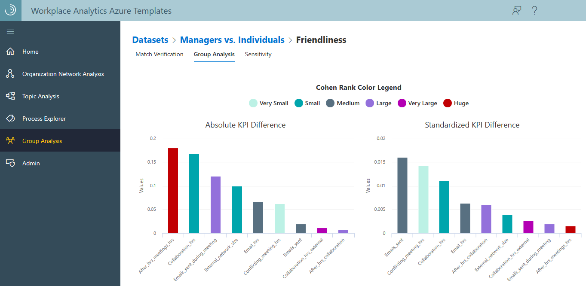
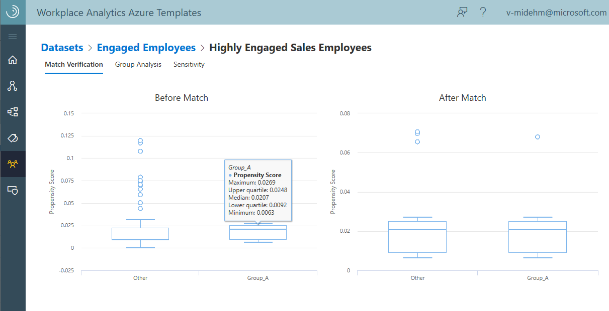
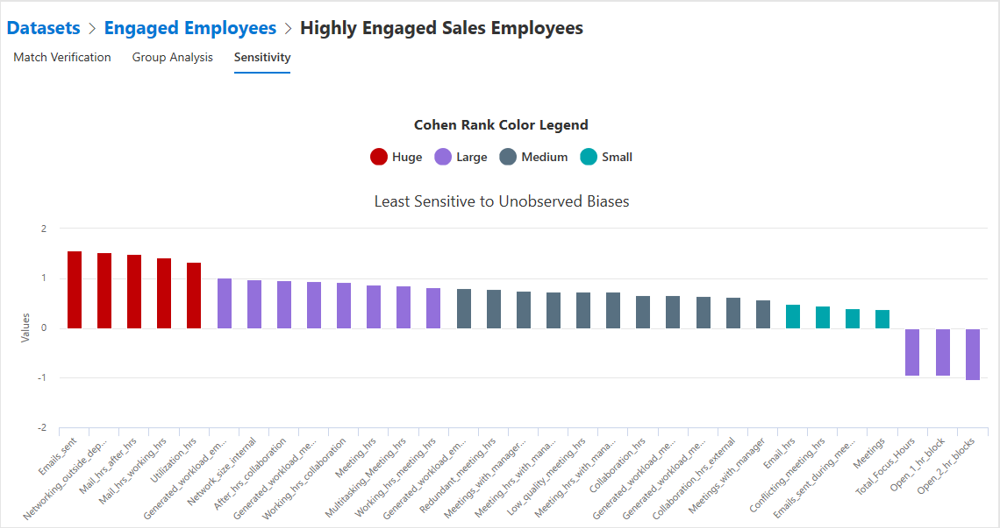

# Group Analysis Azure Template for Workplace Analytics

_These templates are only available as part of a Microsoft service engagement._

Workplace Analytics Azure Templates includes the Group Analysis template that enables you to compare two groups, such as managers and individual contributors, and determine the major differences between them.

You can choose which metrics to analyze and which attributes remain the same between the groups to foster a more robust comparison. This type of analysis can help proactively discover and address areas that need improvement in your organization.

After you upload a dataset, you can use the template tools to view data for the two groups with visual charts and lists, as shown in the following graphic.

   

## To add a new dataset

1. In Workplace Analytics Azure Templates, select **Group analysis**.
2. Select **Add New Dataset** at top right of the table.
3. For **Upload Dataset**, type a dataset name, select the .csv file to upload, and then select **Upload Dataset**.

   

4. After the upload succeeds, it'll be available in the Group Analysis list.

## To configure new group analysis

1. Select the new dataset from the list.
2. Select **Add New Analysis**.
3. In **Configure New Analysis**, type a name for the **Dataset Info**.
4. In **Specify Group to compare**, select the filters for the group that you want to evaluate.
5. In **Choose Group name**, type a name for the group that you want to evaluate.
6. In **Specify KPIs to compare the group on**, select all the metrics that you want to compare between the evaluated group and the control group.
7. In **Choose confounding attributes**, select the attributes that define the evaluated group and the control group and that the two groups have in common. Note these must be different than the filter or filters selected in the **Specify Group to compare** section.
8. Select **Run Analysis**.

   

## Analyze KPIs

You can use the group analysis to view the key performance indicators (KPIs) between the defined group you chose to analyze and the control group you're comparing it with. The KPIs help distinguish the differences between the two groups.

The Match Verification helps you determine if the matching process selected an appropriate control group, which is necessary to get good results. To generate this control group, you must have enough overlap of confounding attributes between the evaluated group and the control group. If there's no overlap, then you've already identified a confounding attribute that distinguishes the difference between the two groups. You need to go back and choose different filters or confounding attributes to get more useful analysis.

The following example shows good KPI overlap between the two groups with a good propensity score for Group A (evaluated group). You can view the score details by hovering your cursor over the graph data. The **propensity score** is the probability that a person will be in the group you chose to analyze based on that person's confounding attributes. It's a simplified way of verifying that all confounding attributes are appropriately controlled in the analysis.

  
  
Before any matching occurs, you need to justify the matching process by comparing the propensity score distributions of the two groups to confirm sufficient overlap between the two. Because the overlap is sufficient to justify the matching process in this example, you'd then want to verify that the subset of people selected to be in the control group (Other) have a similar propensity score distribution as the evaluated group (Group A). When the distributions are similar, you can be more confident that the group analysis and sensitivity results are justified.

On the Group Analysis page, you can see the Absolute and Standardized KPI Differences between the two groups. This gives you an overall picture of what the important differences are between the evaluated and control groups, as shown in the following graphic.

  

The analysis results are in bar graphs with a **Cohen Rank Color Legend** that defines how big of an affect the differences are between the two groups. The data shows the **Absolute KPI Difference**, which is the absolute differences between the two groups. The **Standardized KPI Difference** is the Absolute KPI Difference divided by its standard deviation and indicates how important the differences are.

## To view analysis

1. Select the dataset that has the analysis you want to view from the list.
2. Select the name of the analysis that you want to view.
3. In **Match Verification**, compare the data in the box plots for **Before Match** and **After Match**.

   * **Before Match**: Before any matching occurs, the **Propensity scores** are the distributions between the two groups, which are the result of comparing the confounding attributes to show how likely a person is to be in the evaluated group based on those attributes. Hover the cursor over the data in the graph to view the details.
   * **After Match**: After the matching process occurs, this shows how well aligned the distributions are between the two groups, which helps you decide if the match worked and the results will be useful.

4. In the **Group Analysis** charts, the **Cohen Rank Color Legend** defines how big of an affect the differences are between the two groups.

   * The **Absolute KPI Difference** shows the absolute differences between the two groups.
   * The **Standardized KPI Difference** shows the relative importance of the differences when normalized to their standard deviations.

   The **Sensitivity** chart shows the least sensitive KPIs to unobserved biases in your data and analysis in a bar graph with a **Cohen Rank Color Legend**. As shown in the following graphic, this subset of KPIs represents some of the strongest indicators of the differences between the two groups.

    

## Related topics

* [Workplace Analytics Azure Templates overview](./overview.md)
* [Deploy and configure Workplace Analytics Azure Templates](./deploy-configure.md)
