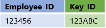
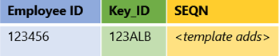
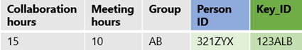
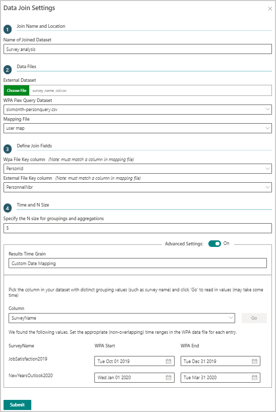
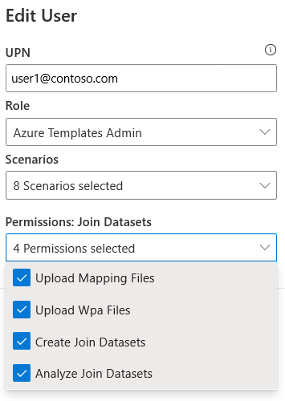

# Join Datasets Azure Template for Workplace Analytics

_These templates are only available as part of a Microsoft service engagement._

Workplace Analytics Azure Templates includes the Join Datasets Template that enables you to securely join, group, and aggregate data exported from Workplace Analytics with other third-party data sources, such as sensitive, personnel data or HR data that you want to combine and analyze. This template enforces the same data privacy settings that you set in Workplace Analytics, such as minimum group size, data exclusions, and other [settings](../use/settings.md).

Joining datasets opens up unique possibilities, such as correlating engagement survey results or sales quota attainment with Workplace Analytics metrics. This gives you new insights into how work gets done and what drives performance.

A barrier to adoption is data privacy and sensitivity, which typically stems from prevailing unstructured practices of joining sensitive data that operate mostly on a trust basis. This template enables the owners of the sensitive data, such as Workplace Analytics data and other similar engagement survey results, to permit another trusted person use of the files (without accessing the raw data) to create a joined dataset with a protected set of mapping keys.

The Join Datasets Azure Template addresses these data privacy concerns in the following unique way.

* **Separation of personas** - Separates the person who maintains the mapping file (key) from the owners of the sensitive data.
* **Achieve scale** - Requires the mapping file one time and reuse it on any number of datasets.
* **Maintain privacy** - Enforces grouping and systematically applies the set size visibility rules.

## Prerequisite tasks

Before you can create a joined dataset with this template, the HR manager needs to [create a mapping file](#create-a-mapping-file) and [upload the key in HR data to Workplace Analytics](#upload-the-key-in-hr-data-to-workplace-analytics).

### Create a mapping file

The owner of HR system data (such as the HR manager) needs to do the following to create and maintain the mapping file. Ideally that file. Ideally this file is only accessible to the owner outside of Workplace Analytics. This file enables the template to match up query data from Workplace Analytics with real world users.

1. Create a new .csv file that maps a new unique key identifier for each employee to each identifier used in another dataset (outside of Workplace Analytics) that can be joined and analyzed along side Workplace Analytics query data. For example, the HR manager maps a new Key_ID that's unique and can't be interpreted or related back to an employee's identity and can only be mapped back to employees by using this table or file.

    

   >[!Important]
   >This mapping file must be securely maintained outside of Workplace Analytics to maintain employee privacy. After the key identifier in this file is uploaded to Workplace Analytics as part of the HR data upload, you could possibly use this file to identify employees included in Workplace Analytics query data.

2. Save the mapping file as a .csv file in UTF-8 format to use to join datasets.

### Upload the key in HR data to Workplace Analytics

The same unique ID column created in the mapping file (for example, **Key_ID**) needs to be added to the HR data that's next uploaded into Workplace Analytics.

Follow the steps in [Subsequent uploads](../setup/upload-organizational-data.md#file-upload) and select to **Append** in **Step 9** to add the new Key_ID data into Workplace Analytics.

## Join dataset overview

The key to a data join is the mapping file, which enables the template to map rows from Workplace Analytics queries to the same employee rows in other datasets. This is accomplished by uploading a unique, non-identifiable ID into Workplace Analytics through the HR data upload process.

For this example, the **Key_ID** column is uploaded to Workplace Analytics as a new HR attribute, which can then be included in the query data exported from Workplace Analytics and uploaded in the template.

1. The owner of the mapping file uploads it into the template.

    

2. The mapping file is stored securely in the template. This file is only used in creating joined datasets, which cannot be downloaded, accessed, or decrypted within the template. The mapping file is augmented with an auto-generated sequence (**SEQN**) value that is included in the final output.

    

3. The data owner uploads a Workplace Analytics query file (with **Key_ID** data included in the export).

   

4. The user uploads an external dataset that includes the same employee identifiers that were included in the mapping file (for example, **Employee_ID**) to **Key_ID**.

   

5. The template then uses the mapping file to combine the two data sources into a new joined dataset. For this example, **Employee_ID** values are added temporarily to the Workplace Analytics query file and matched up to the **Key_ID** values, and then the data rows for the two datasets are combined into one joined dataset.

   The identifier columns, such as **Key_ID** and **Employee_ID**, are then removed from the joined dataset and replaced with system-generated sequence IDs in a new **SEQN** column, which keeps the data de-identified for analysis purposes.

   

## Join dataset tasks

You can use this template to create and analyze joined datasets as follows.

1. **[Upload the mapping file](#upload-the-mapping-file) and share it with template users.** - The mapping file owner uploads it into the template and then can share the mapping file with those who need it to create joined datasets. The users you share it with can only use it for joins in the template and cannot access or download the mapping file directly.

2. **[Add a query file](#add-a-query-file)** - The owner of the third-party data who has access to Workplace Analytics queries needs to select and update relevant query results in .csv format, ensuring the output contains the key identifier column from the most recent HR data upload into Workplace Analytics, which is used for joins.

3. **[Create a new join](#create-a-new-join)** - While adding a join, you select a third-party data file in .csv format with the same employee identifiers that match up to the employee identifiers in the mapping file.

4. **[Create new analysis](#create-and-view-analysis)** - After a join dataset is successfully created, you can:

   * Use it to create new analysis within the template.
   * Download it as a .csv file (only an option for mapping file owners).
   * Share with other users who can use it to create new analysis.

## Upload the mapping file

>[!Note]
>Only users who are assigned the **Can upload mapping file** permission for joined datasets in Admin settings can see the **Upload Mapping File** option.

1. In Workplace Analytics Azure Templates, select **Join Datasets** > **Mapping Data**.
2. Select **Add New Mapping File** at top right of the table.
3. In **Upload Mapping File**, enter a name, select the .csv file that you created in the previous steps, and then select **Upload Mapping File**.
4. After the upload succeeds, it'll be available in the **Mapping Data** list with the following options:

   * When the **Status** is a green check mark, the data was successfully uploaded. A red X means it failed.
   * Select a table column heading, such as **Name** or **Submitted**, to sort by it.
   * Select the **Update** icon to refresh the data in the mapping file. This is useful as your organization's employee data changes over time, such as for new hires.
   * Select the **Share** icon next to the file name, and then you can select which data owners get permission to use this file for joins.
   * Select the **Delete** (trashcan) icon to delete the file from the list.

## Add a query file

>[!Note]
>Only users who are assigned the **Upload WPA Files** permission for joined datasets in Admin settings can see the **Add New WPA File** option.

1. In Workplace Analytics (WPA) Azure Templates, select **Join Datasets** > **WPA Data**.
2. Select **Add New WPA file** at top right of the table.
3. In **Upload WPA File**, select the .csv query file to upload, the time group you want data for, and whether you want to allow raw Workplace Analytics metrics in the aggregations.
4. Select **Upload WPA File**.
5. If prompted to define columns, select which columns in the query data you want to use as a metric for aggregations (calculations) and as an attribute for groupings, and then select **Submit**.
6. After the upload succeeds, the query will be available in the **WPA Data** list with the following options:

   * When the **Status** is a green check mark, the data was successfully uploaded. A red X means it failed.
   * Select a table column heading, such as **Name** or **Submitted**, to sort by it.
   * Select the **Share** icon next to the name to share access to this data with other users.
   * Select the **Delete** (trashcan) icon to delete the query from the list.

## Create a new join

>[!Note]
>Only users who are assigned the **Create Join Datasets** permission for joined datasets in Admin settings can see the **Add New Join** option.

1. In Workplace Analytics Azure Templates, select **Join Datasets** > **Joined Datasets**.
2. Select **Add New Join** at top right of the table.
3. In **Data Join Settings**, enter a name for the joined dataset, select the external dataset that matches up with the .csv query file and related mapping file.
4. In **Define Join Fields**, select the Workplace Analytics key column and the third-party external file key column, such as **PersonId** and **PersonnelNbr**, as shown in the following graphic.
5. In **Time and N Size**, specify the minimum group size for groupings and aggregations. For more information about minimum group sizes, see [Minimum group size](../use/privacy-settings.md#minimum-group-size).
6. In **Results Time Grain**, you can select a preset option or use the advanced settings option to specify a custom date ranges based on distinct values in your external dataset. The advanced functionality is useful when the date values in your external dataset don’t correspond neatly to the dates of the WPA data you’re interested in, but another key column does have values, such as titles.

   * To use the preset time ranges, leave **Advanced Settings Off**, and select how you want the data grouped, by week, month, quarter, or year.
   * To use a custom date range, change **Advanced Settings** to **On**, and then:

     1. Select the column in the dataset with distinct grouping values, and then select **Go**. For example, **SurveyName** is shown as selected in the following graphic.
     2. Then select the start and end dates for the distinct sets of values in the selected column. Note that the date ranges cannot overlap and need to be unique for each distinct grouping value.

    

7. Select **Submit**.
8. After the dataset is successfully created, it'll be available in the **Joined Datasets** list with the following options:

   * When the **Status** is a green check mark, the dataset was successfully created. A red X means it failed. Check the job details to view an available error message.
   * Select a table column heading, such as **Name** or **Submitted**, to sort by it.
   * Select the **Download** icon to download the joined dataset as a .csv file.
   * Select the **Job Details** (i) icon next to **Status** to view the job details.
   * Select the **Delete Join** (trashcan) icon to delete it from the list.
   * Select the **Share** icon next to the name to share access to this data with other users.

## Create and view analysis

> [!Note]
> Only users who are assigned the analyst role or have create joins permission for joined datasets in Admin settings can see the **Joined Datasets** page.

1. In Workplace Analytics Azure Templates, select **Join Datasets** > **Joined Datasets**.
2. Select the name of the dataset from the list to view existing analysis and to add new analysis.
3. Select **Add New Analysis** at top right of the table.
4. In **New Analysis Settings**, enter a name, select which attribute to group by, and which fields to aggregate (use for calculations), and then select **Submit**.
5. After the analysis is successfully created, it'll be available in the **Joined Datasets** list with the following options:

   * When the **Status** is a green check mark, the analysis was successfully created. A red X means it failed. Check the job details to view an available error message.
   * Select a table column heading, such as **Name** or **Submitted**, to sort by it.
   * Select the **Download** icon to download the analysis as a .csv file.
   * Select the **Dataset Parameters** icon to view parameter details.
   * Select the **Job Details** (i) icon next to **Status** to view the job details.
   * Select the **Delete Analysis** (trashcan) icon to delete it from the list.

## User permissions for joined datasets

An Azure Templates Admin can select user permissions for joined datasets. In **Admin** > **User Management**, select the **Edit** (pencil) icon for a user, and then select which permissions to enable for that user.

   

Specific permissions for joined datasets are based on how users need access to use the data. Specific permissions can be restricted to specific roles, such as Azure Templates Analysts are limited only to the **Analyze Join Datasets** permission.

|Permission | Description |
|-------------|-------------|
|Upload Mapping Files |Enables a user to upload mapping files (and allow other users to use those files in their joins). |
|Upload WPA Files |Enables a user to upload Workplace analytics query files (and allow other users to use those files in their joins). |
|Create Join Datasets |Enables a user to upload an external file and create a joined dataset (if query and mapping files are uploaded and available). Can also allow other users to analyze joined datasets they created. |
|Analyze Join Datasets |Enables a user to do groupings on and create new analysis with their own or shared joined datasets. |

## Joined dataset retention setting

Your template admin sets the number of days to retain data created and saved as joined datasets with this template. The current system default is **30 days**. See [Other configuration options](./deploy-configure.md#other-configuration-options) for details.

## Related topics

* [Workplace Analytics Azure Templates overview](./overview.md)
* [Deploy and configure Workplace Analytics Azure Templates](./deploy-configure.md)
