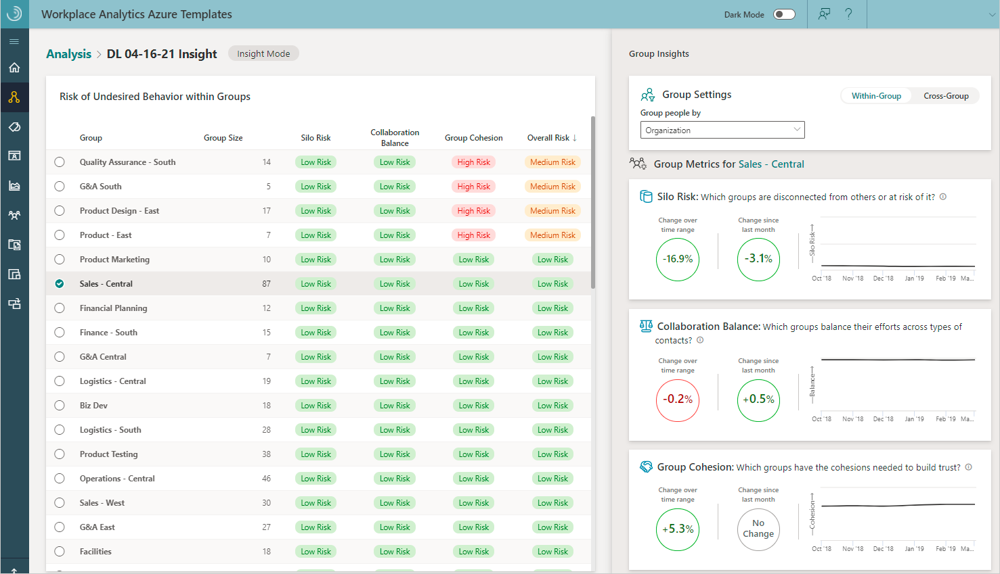

---

ROBOTS: NOINDEX,NOFOLLOW
title: Insights in the Organizational Network Analysis Azure Template
description: Learn how to create and use insights in the Organizational Network Analysis Azure Template for Workplace Analytics
author: madehmer
ms.author: v-mideh
ms.topic: article
localization_priority: normal 
search.appverid:
- MET150
ms.prod: wpa
ms.collection: M365-analytics
manager: scott.ruble
audience: Admin
---

# Insights in the ONA Azure Template

The Organizational Network Analysis (ONA) Template includes Insights that you can use to view actionable recommendations and metrics about internal collaboration trends in your organization. You can analyze how individuals collaborate within the same group or how groups collaborate with each another. This analysis helps you identify groups that are showing either positive and negative collaboration trends. With this analysis, you can work on improving the flow of information within your organization.

Insights include the following trends about how people within the selected group are collaborating for the selected date range. For this within-group analysis, you select what metric to group people by in **Group Settings**.

* **Silo risk** - Shows which groups are disconnected from others or are at risk of being disconnected.
* **Collaboration balance** - Shows which groups balance their efforts across types of contacts.
* **Group cohesion** - Shows which groups have the cohesions needed to build trust.

For example, the following graphic shows within-group trends for the **Sales - Central** group. These high-level trends highlight overall collaboration patterns for this group over time.

You can also view cross-group collaboration trends between groups based on the selected group settings and which cell is selected in the table. For example, the following shows that the **Biz Dev** and **Customer Service** groups had a positive 64 percent change in expected collaboration over the selected time range and a positive 17.4 percent change as compared to last month's collaboration.

Use **Focus on** to select which groups you want to hide or show in the **Collaboration Across Group** table. You can also hide a group by selecting the **Clear Row** (**eye**) icon that's available when you hover on the group's column or row name within the table. To unhide a group, select the group name in **Focus on**. The following graphic shows the **eye** icon for the **Sales** group in the table.

To see more details about the collaboration metrics or the interaction matrix that this insight analysis uses, you can select them as **Download** options for an insight.

## To create a new insight

1. In Workplace Analytics Azure Templates, select **Organizational Network Analysis**.
2. In **Insights**, select **Create New Insight** at top right.
3. In **Define Insight Settings**, enter a name and select a path to the data.

   

4. In **Specify the time range**, select a date range that includes a minimum of two months to get collaboration trends about.
5. In **Select the Grouping Attributes**, select up to a maximum of five internal attributes to analyze for the insight. The available attributes match up to the HR attributes included in the imported [organizational data](../setup/prepare-organizational-data.md#attribute-reference) from Workplace Analytics.
6. If **Advanced Mode** is **Off** (at the top), skip to the next step. If **Advanced Mode** is **On**, you'll see the **Specify the Interaction Types and Thresholds** section, where you can specify the following:

   * **Choose the interaction type(s)** - Select what to analyze in the dataset, independently or in combination, including emails, meetings, Teams chats, and Teams calls. Note that if you include meetings and Teams calls in your analysis, only unscheduled Team calls are counted to avoid double counting meeting call activity.
   * **Max number of people involved in each interaction** - Select the maximum number of people involved in each interaction.
   * **Minimum number of unique interaction types** - Select the minimum number of interaction types that indicate a meaningful interaction.
   * **Maximum duration of a meeting or call** - Select the maximum number of interactions between the selected groups or people.
   * **Advanced Settings** - Select to turn it **On** if you want to specify individual interaction thresholds that define a meaningful connection, such as a minimum number of emails, meetings, chats, calls, and interactions across two or more types.

   >[!Important]
   >When analyzing calls or chats, you'll only see data from the time period where all signals exist. For example, if you select meetings and calls to analyze and 13 months of meeting data is available, but only three months of Microsoft Teams data is available, you'd only see data for the three months that include all of the selected types of interactions.

7. Select **Submit**. Based on the data size, it might take anywhere from a few minutes up to a few hours to successfully create the insight.

## To view an insight

1. In **Organizational Network Analysis** > **Insights**, select the name of the insight in the table.
2. The following information and options are available in the table for existing insights:

   * When the **Status** is a green check mark, the insight was successfully saved and can be viewed.
   * During insight creation, select the **Job Details** (i) icon to view details about where the job is at in the process.
   * If the analysis fails with a **Status** of a **red X**, select the **Job Details** (i) icon to view details and see what might've caused the failure.
   * Select a table column heading, such as **Name** or **Submitted**, to sort by it.
   * Select the **Parameters** icon next to the name to view details about its parameters, such as the time range, network boundary condition filters, and node and group metrics.
   * Select the **Delete Analysis** (trashcan) icon to delete analysis that you created from the list.
   * Select the **Download** icon to download one of the following as a .csv file.

     * **Download metrics** for the person and group metrics in the saved insight, which are based on the selected date range and other options.
     * **Download interaction matrix** for the PersonID interactions and related data, such as date range and connection weights by hours and counts.

     >[!Important]
     >When you calculate metrics in a **Download interaction matrix** file, know that your calculations might be different than the metrics calculated in a group-level download file. These differences occur because a person's HR attribute values can change over time and the calculations in the different downloads only use a snapshot of the latest available HR values.

   

## Related topics

* [Organizational Network Analysis Azure Template](./organization-network-analysis.md)
* [Workplace Analytics Azure Templates overview](./overview.md)
