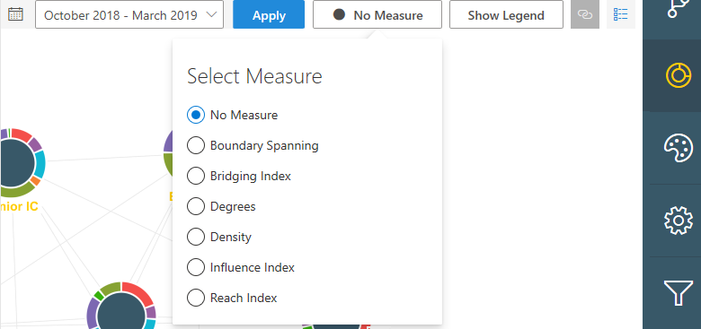

---
# Metadata Sample
# required metadata

ROBOTS: NOINDEX,NOFOLLOW
title: Metric calculations for Organizational Network Analysis Azure template
description: Learn how the metrics are calculated for the Organizational Network Analysis Azure Template for Workplace Analytics
author: madehmer
ms.author: v-midehm
ms.topic: article
localization_priority: normal 
ms.prod: wpa
ms.collection: M365-analytics
manager: scott.ruble
audience: Admin
---
# Metric calculations for the Organizational Network Analysis Azure template

_This template is only available as part of a Microsoft service engagement._

The Organizational Network Analysis Azure template for Workplace Analytics has a variety of metrics to help you visualize and analyze formal and informal relationships within your organization.

You can apply the following node sizing options to change how the data is measured and shown in the template graphs. The following shows the measures (metrics) available in the *Combined View* of a graph.

## Weighted and directed calculations

All the network analysis metrics are calculated as *weighted* (based on the strength of connections between people or groups, which are not the same for everyone) and *directed* graphs (because a person can give time to their colleagues without receiving time from them). These calculations more accurately represents the interactions between people and individuals within the company.

These metrics can be computed on an individual- and on a group-level basis. The individual metrics apply to a single person (de-identified), while the group metrics apply to a specific set of people, such as a department within the organization.

The interpretation of the metrics for individuals and groups is the same. For example:

* If a person has a high Reach Index, it indicates the person is closer to everyone in the network than those with lower scores.
* If a group has a high Reach Index, it indicates the group is closer to everyone in the network than other groups with lower scores.

It's important to note that the Reach Index scores are not simply the average (or median, maximum, minimum) of the scores of the individuals within the group. They are the actual scores of the group. In some cases, the two may be equal but that's generally not the case.

A simple example of this is a water molecule, which is made up of two hydrogen atoms and one oxygen atom. If you take the properties of hydrogen and oxygen (both gases) and average them together, it won't generate the properties of a water molecule. Just like atoms and molecules, how individuals are connected within a group in an organization makes the properties of the group different than the average properties of the individuals within the group. For these calculations, the template generates the properties of the group, which depends on the network structure. You can generate summary statistics of individuals within the group from the individual level metrics.

## Boundary Spanning

Employee Level
This is defined as the geometric mean between the total collaboration time an individual gave to those outside of his/her group (α) and the total number of unique groups this same individual collaborated with (β):

BSP_i=√(α_i β_i )
α_i= ∑_j▒z_ij ,"where" j "is outside of " i"'s group" 
α_i is the total collaboration time individual i spent with people outside his/her group
z_ij is the collaboration time i gave to j
β_i is the number of unique, external groups i collaborated with.
BSP_i is the Boundary Spanner Score for individual i
If individuals A and B have the same amount of external collaboration time, but A has collaborated with more unique external groups, then A will have a higher BSP.  If individuals A and B have collaborated with the same number of unique external groups, but B has more overall collaboration time, then B will have a higher BSP.

Group Level
The definition of BSP is the same for groups, except that α is now the total collaboration time group i spent with people outside its group and β is the number of unique, external groups group i collaborated with.

## Bridging Index

The flow of information through a network is often characterized by random-walk betweenness measures, which do not limit the flow of information through a network to shortest-paths.  The traditional definition of information centrality or current-flow closeness centrality is computationally expensive.  As such, we have adopted a more computationally efficient measure called LineRank [7]. 
LineRank measures “the importance of a node by aggregating the importance score of its incident edges” [7].  The importance score of an edge is the probability that information visiting an edge through a node will stay at the edge.  Essentially, LineRank indicates that a node is more important than another node if information tends to flow through its incident edges rather than the other node’s incident edges.
Employee Level
As such, we calculate the LineRank importance scores for all edges in the network and then sum up the importance scores for edges incident to the employee of interest.
Group Level
We define LineRank at a group level as the sum of the importance scores of a group’s incident edges, where the importance score of edges is the same for both employee and group level metrics. As such, we calculate the LineRank importance scores for all edges in the network and then sum up the importance scores for edges incident to the group of interest.  
Metric
Bridging Index measures  the importance of a node by aggregating the importance score of its incident edges is the number of times a person is on the most probable path of information flow between two other people 
indicates that a node is more important than another node if information tends to flow through its incident edges rather than the other node’s incident edges.
Meaning
Represents potential control over the flow of information
Insight
High values can indicate gatekeepers, liaisons, change agents, or bottlenecks. Can be advantageous or stressful playing this role. The periphery may be less influenced by others.

## Degrees

Degrees centrality is based on the number of edges connected to a node. The overall degree is the number of incoming and outgoing edges connected to a node. The Indegree centrality is the number of incoming edges. The Outdegree centrality is the number of outgoing edges from the node.

* **Employee level**: These are all calculated with [GraphX by Apache Spark](https://spark.apache.org/graphx/).
* **Group level**: The group degree centrality is the number of nodes outside the group that are connected to members of the group. The normalized group degree centrality is calculated as follows:

    **Degree Centrality** = |**N**(**C**)|/(|**V**|-|**D**|)
   
   Where |**N**(**C**)| is the number of unique nodes which are not in **group C** but are adjacent to a member of **C**. And |**V**| is the number of nodes in the network and |**D**| is the number of nodes in group C. You can apply this same formula  to calculate indegree and outdegree measures by considering only “indegree” nodes or “outdegree” nodes.

## Density

From MSR: Proportion of possible intra-community edge weight based on each node’s max edge weight. Higher density scores represent a better inwardly-connected community

## Influence Index

Influence Index as a centrality measure in social networks can be used as a measure of a node’s potential influence on opinions of the network or as an estimate of social status.  Basically, Influence Index counts the number and quality of edges coming into a node.  

### Employee level

Mathematically, Influence Index is:

(Ι-αP)x=(1-α)v

where Ι is the identity matrix; P is a column stochastic matrix where all entries are non-negative and the sum of entries in each column is 1; x is the vector of Influence Index scores corresponding to each node; v is a column, stochastic vector that sums to 1; and α is the damping parameter between 0 and 1. Traditionally α=0.15.

This equation can be solved iteratively using the following algorithm:
x^(k+1)=αPx^k+(1-α)v,       "where " x^0=v
Additionally,
P_(j,i)=A_(i,j)/(∑_r▒A_(i,r) )
where A is the adjacency matrix and A_(i,j) is the edge weight between nodes i and j. By this definition, we use the relative collaboration time between individuals as the weights of the edges in our determination of Influence Index for a node.  For nodes that do not have any out-links (i.e., sinks), the columns in P corresponding to those nodes are replaced by v.  

### Group level

For group metrics, the Influence Index is the number and quality of edges coming into the group. Intra-group connections do not contribute to the Influence Index for the group. The network is collapsed into group nodes where the edge weights between groups is the sum of the individual node weights connecting the two groups.  This group graph then forms a new adjacency matrix A_G which is fed into the original Influence Index algorithm described in the previous section. 

## Reach Index

Reach Index measures how close a node is to all other nodes in the network. It was originally defined as the inverse of a node’s farness, where farness is the sum of the distances from the node to all the other nodes in the network.  This definition requires the network to be fully connected, which means that each node can reach all other nodes in the network. This assumption is not always true in directed graphs and never true for disconnected graphs. Accordingly, we make several modifications to our calculation of closeness because of the directed nature (and possibly disconnected as well) of our social network graphs.

### Employee level

Traditionally, closeness centrality (C_i) is calculated as follows:  

Where **n** is the total number of nodes in the network and **d(i,j)** is the distance from **node i** to **node j**.

If the graph is disconnected, then the closeness centrality will be calculated as zero (0). To correct for this, the template will take the sum of the inverse distances:

Now, the nodes that can’t be reached will not contribute to the sum if the graph is disconnected. This modification gives different values for the centrality for an individual than the original measure, but approximately maintains the ratio of an individual’s score to others in the network. Since a disconnected graph can be considered with this implementation, the closeness scores are normalized by n-1. Note that this normalization considers all the nodes in the network, not just those in the largest, connected component of the network.

Weights between nodes are not considered for the current implementation of closeness.  Hence the distance is defined as the number of nodes (i.e., people) between nodes i and j on the shortest path p.  The distances between nodes are calculated by using the single-source shortest path algorithm.   The higher the value of closeness the fewer nodes on average it takes that node to reach others in the network.

### Group level

The equation used for employee level closeness is also used to calculate the group level closeness. Essentially, the group closeness only considers the distances from nodes inside the group to nodes outside of the group.  Within group distances are ignored [1]. Again, we consider only the shortest paths between nodes. It is normalized by the number of nodes outside of the source node’s group C.

## Related topics

* [Organizational Network Analysis Azure Template](./organization-network-analysis.md)
* [Workplace Analytics Azure Templates overview](./overview.md)
* [What's new in Workplace Analytics Azure Templates](./release-notes.md)
* [Deploy and configure Workplace Analytics Azure Templates](./deploy-configure.md)