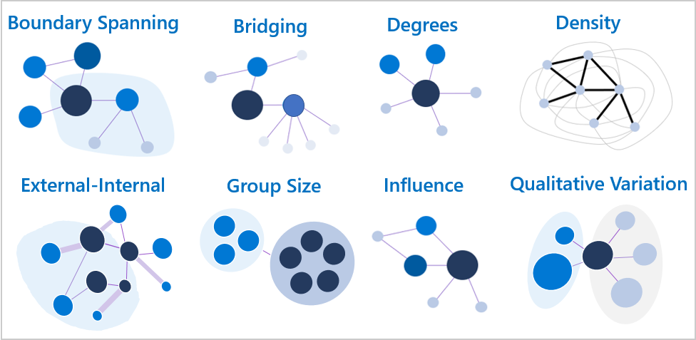
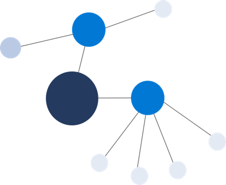

---
# Metadata Sample
# required metadata

ROBOTS: NOINDEX,NOFOLLOW
title: Measure calculations for Organizational Network Analysis Azure template
description: Learn how the metrics are calculated for the Organizational Network Analysis Azure Template for Workplace Analytics
author: madehmer
ms.author: v-midehm
ms.topic: article
localization_priority: normal 
ms.prod: wpa
ms.collection: M365-analytics
manager: scott.ruble
audience: Admin
---
# Measure calculations for the Organizational Network Analysis Azure template

_This template is only available as part of a Microsoft service engagement._

The Organizational Network Analysis Azure template for Workplace Analytics has a number of measures to help you visualize and analyze formal and informal relationships within your organization.

Each dot or node in the template's network graph represents either an employee or a group. The lines between the nodes represent connections, which are collaborative relationships between the connected employees or groups.

The node measures for employees are de-identified to maintain their privacy. Group node measures represent the group's measures, such as for a department (Sales) or a functional group (program managers) within the organization.

## Highlight key network connections

You can size the nodes and connections based on what you want to highlight by using the **Scale Nodes** option (**No Measure** by default) at the top.

The following shows the different Node Sizing options where the largest node in each graph represents the one with the highest measure for that option, including: [Boundary Spanning](#boundary-spanning), [Bridging Index](#bridging-index), [Degrees](#degrees), [Density](#density) (only in Combined View), [Influence Index](#influence-index), and [Reach Index](#reach-index).

## How are connections measured?

Each of the measures are based on the connections between the nodes. To ensure the calculations accurately represent the interactions between people or groups within the organization, the measures account for connection weight and direction:

* Connections are weighted based on the amount of collaboration time in meetings and email between two nodes (connection strength).
* They are also directed because they specifically account for who sent and who received email. For these calculations, meetings do not have direction.

## How are the measures for people and graph different?

The measure interpretations for employees and groups are the same. For example:

* If an employee has a high degree, it indicates the person has more connections in the network than those with lower scores.
* If a group has a high degree, it indicates the group has more connections in the network than other groups with lower scores.

However, group measures are not simply the average (or median, maximum, or minimum) of the scores of the employees within the group. Instead it’s the cumulative score of how the people within the group interact with people in other groups. In some cases, the two may be equal but that's generally not the case.

A simple example of this is a water molecule, which is made up of two hydrogen atoms and one oxygen atom. If you average together the properties of hydrogen and oxygen (both gases), it won't generate the properties of a water molecule.

Just like atoms and molecules, how people are connected within an organizational group makes the properties of the group different than the average properties of the individual people within the group. You can generate summary statistics of employees within the group from the employee-level (de-identified) measures.

For more general information about these network measures, see [Centrality](https://en.wikipedia.org/wiki/Centrality).

## Boundary Spanning

Boundary Spanning measures the extent to which employees act as representatives of their group across the organization. It indicates the sharing of information with other groups.

For a defined group, Boundary Spanning measures an employee’s collaboration with members of other groups, with a boost for the diversity of their connections (number of groups). This does not consider ties inside their own group.

* **Employee level**: Boundary Spanning is the geometric mean between the total collaboration time a person spent with those outside of their group (emails sent and meetings attended) and the total number of unique groups this same person collaborated with.

* **Group level**: This is the same for groups as for employees, except that the totals represent a group instead of a person. It's the geometric mean between the total collaboration time a specified group gave to people outside its own group and the total number of unique, external groups that the group collaborated with.

The following shows a Boundary Spanning network where the largest node is the boundary spanner.

## Bridging Index

The Bridging Index represents employees or groups that potentially control the flow of information throughout the network. The nodes with high Bridging Index values can indicate gatekeepers or liaisons of information or change agents. Depending on the function of the group or individual, it can be advantageous or stressful playing this role in an organization.

It is the number of times a person or group is on the most probable path of information flow between two other people or groups. The value is greater than 0, where the largest value is the highest ranked node.

This measure accounts for both directionality and tie strength. The most meaningful information from Bridging Index is the rank of the nodes.For example, assume that node A has a Bridging Index of 0.7 and node B has a Bridging Index of 0.35. You can accurately assume that node A tends to control more information throughout the network than node B, because node A ranks higher than node B. However, you cannot assume node A controls twice as much information or is twice as likely to be a change agent in the network as node B, because the values indicate a *ranking* of information flow and not the *amount* of information.

This measure is not limited to the shortest paths between nodes but accounts for all possible ways that information flows between nodes in a network.

* **Employee level**: The Bridging Index calculates the tendency for information to flow between a given connection in the network and converts them into importance scores. An individual’s Bridging Index of all connection importance scores that are connected to the employee of interest.

* **Group level**: At a group level, the Bridging Index sums up the importance scores of a group’s connections to nodes outside of its own group, where the importance score of connections is the same for both employee and group level metrics. As such, we calculate the importance scores for all connections in the network and then sum up the importance scores for connections to the group of interest.

The following shows a Bridging Index network where the largest node is the bridge that controls the flow of information to the other nodes in the graph.

## Degrees

Degrees is based on the number of connections to a node. The overall degree is the number of incoming and outgoing edges connected to a node. <!-- The Indegree centrality is the number of incoming edges. The Outdegree centrality is the number of outgoing edges from the node.-->

Degrees measures the degrees (number of links) of all nodes in the graph, which does not count any self-links (links that have the same node at both ends). Where there are multiple links between two nodes, each link is counted.

* **Employee level**: These are all calculated by counting the number of connections to an individual employee. The value is between 0 and 1 because it is divided by the total number of employees in the graph.

* **Group level**: The group degree centrality is the unique number of nodes outside the group that are connected to members of the group. The value is between 0 and 1 because it is divided by the number of people outside of the group.

The following shows a Degrees network where the largest node has the highest degree (five) of connections in the graph.

## Density

Density measures how many and how strongly employees within groups or between groups are connected. Higher density indicates higher levels of connectivity within or between communities. Dense groups indicate a cohesion among the members of that group. Less dense groups are at risk of being siloed and might not be receiving useful information from other group members.  

Density is the number of actual connections among employees divided by the total possible number of connections that could exist among the same employees. The measure accounts for the strength of the connections between individuals and normalizes them to help control  the tendency of larger groups to have lower densities. This makes it easier to compare densities for different groups with different sizes. Density values are between 0 and 1, where 1 indicates that all individuals in that group are strongly connected to each other.

This measure also uses directionality, which means the density between group A and group B will only count the interactions that went from A to B, but not the interactions that went from B to A. Because the densities between groups will vary depending on whether the density is from group A to B or from B to A, the density matrix is not symmetrical.

In the following density table, the direction of connections is the groups listed in the left-hand column (senders) are connected with and send information to the groups listed across the top row of the table (recipients). The density of communication going from group A to group B is the intersecting number for group A on the left-hand column and group B across the top of the table.

The following shows a Density network that highlights the density of connections between the nodes.

## Influence Index

Influence Index indicates a node’s potential influence on opinions of the network or an estimate of social status. Essentially, it uses the number and strength of connections coming into a node to rank the nodes. The value is greater than zero where the largest value is the highest ranked node.

The most meaningful information from Influence Index is the rank of the nodes. For example, assume that node A has an Influence Index of 0.6 and node B has an Influence Index of 0.3. You can accurately assume that node A is a more influential than node B, because node A ranks higher than node B. However, you cannot assume node A is twice as influential as node B because the values indicate a *ranking* or source of influence, not the *amount* of influence.

* **Employee level**: The calculations use the relative collaboration time between individuals as the strengths of the connections for a person's influence measure.

* **Group level**: For group metrics, the Influence Index is the number and strength of connections coming into the group. Intra-group connections do not contribute to the Influence Index for the group. The network is collapsed into group nodes where the tie strengths between groups is the sum of the individual node strengths connecting the two groups.

The following is an Influence Index where the largest node has the highest ranking influence in the graph.

## Reach Index

Reach Index measures how close a node is to all other nodes in the network. It was originally defined as the inverse of a node’s farness, where farness is the sum of the distances from the node to all the other nodes in the network.

This measure requires the network to be fully connected, which means that each node can reach all other nodes in the network. This assumption is not always true in directed graphs and never true for disconnected graphs. Accordingly, we make several modifications to our calculation of closeness because of the directed nature (and possibly disconnected as well) of our social network graphs.

* **Employee level**: In a fully connected graph, where there is a path from any node to any other node, closeness is calculated as the reciprocal of "farness" (for example: 1/farness). The farness of a node is defined as the sum of the distances to each of the other nodes.

* **Group level**: The group equation is the same as the employee level one. Essentially, the group closeness only considers the distances from nodes inside the group to nodes outside of the group. Within group distances are ignored and only the shortest paths between nodes are considered. It is normalized by the number of nodes outside of the source node’s group. Within group distances are ignored. Again, we consider only the shortest paths between nodes. It is normalized by the number of nodes outside of the source node’s group C.

This value will be between 0 and 1 and usually larger than the reach of individual nodes, due to higher connectivity. Reach index values do not typically have large separation among the top ranked members. This means that those nodes highest in reach are all quite similar to each other in how they can connect to the rest of the network.

The following is an example of a simplified Reach Index graph.

## Related topics

* [Organizational Network Analysis Azure Template](./organization-network-analysis.md)
* [Workplace Analytics Azure Templates overview](./overview.md)
* [What's new in Workplace Analytics Azure Templates](./release-notes.md)
* [Deploy and configure Workplace Analytics Azure Templates](./deploy-configure.md)