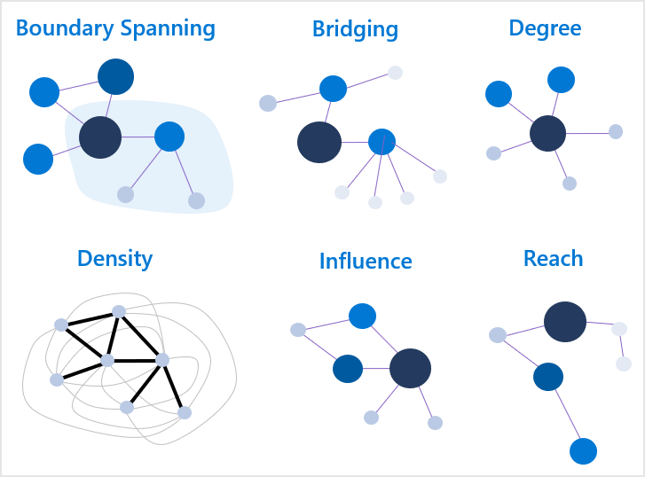

---
# Metadata Sample
# required metadata

ROBOTS: NOINDEX,NOFOLLOW
title: Measure calculations for Organizational Network Analysis Azure template
description: Learn how the metrics are calculated for the Organizational Network Analysis Azure Template for Workplace Analytics
author: madehmer
ms.author: v-midehm
ms.topic: article
localization_priority: normal 
ms.prod: wpa
ms.collection: M365-analytics
manager: scott.ruble
audience: Admin
---
# Measure calculations for the Organizational Network Analysis Azure template

_This template is only available as part of a Microsoft service engagement._

The Organizational Network Analysis Azure template for Workplace Analytics has a number of measures to help you visualize and analyze collaborative relationships within your organization.

In the network graphs, each dot or node represents an employee or a group. The lines between the nodes represent connections, which are collaborative relationships between them. The node measures for employees are de-identified to maintain their privacy. Group node measures represent the group's measures, such as for a department (Sales) or a functional group (program managers) within the organization.

## How are connections measured?

Each of the measures are based on the connections between the nodes. To ensure the calculations accurately represent the interactions between people or groups within the organization, the measures account for connection weight and direction:

* **Weight** - Connections are weighted based on the amount of collaboration time in meetings and email between two nodes (connection strength).
* **Direction** - They are also directed because they specifically account for who sent and who received email. For these calculations, meetings do not have direction.

## Highlight key employees or groups

You can highlight key employees or groups by sizing the nodes in the graph by using the **Scale Nodes** option (**No Measure** by default).

You can size the nodes based on various network metrics. The following shows the different Node Sizing options where the largest node in each graph represents the one with the highest measure for that option, including: [Boundary Spanning](#boundary-spanning), [Bridging Index](#bridging-index), [Degrees](#degrees), [Density](#density) (only in Combined View), and[Influence Index](#influence-index).

## Are the measures for employees and groups different?

No, the measure interpretations for employees and groups are the same. For example:

* If an employee has a high degree, it indicates the person has more connections in the network than those with lower scores and therefore has more exposure or access to information.
* If a group has a high degree, it indicates the group has more connections in the network than other groups with lower scores and therefore has more exposure or access to information.

In terms of calculations, group measures are not simply the average (or median, maximum, or minimum) of the scores of the employees within the group. Instead, the measures are the cumulative scores of how the people within the group interact with people in other groups. In some cases, the two may be equal but that's generally not the case. The key difference is that the group measures  do not account for connections that occur between members of the same group.

A simple analogy of this is a water molecule, which is made up of two hydrogen atoms and one oxygen atom. If you average together the properties of hydrogen and oxygen (both gases), it won't generate the properties of a water molecule.

Just like atoms and molecules, how people are connected within an organizational group makes the properties of the group different than the average properties of the individual people within the group. You can generate summary statistics of employees within the group from the employee-level (de-identified) measures.

For more general information about these network measures, see [Centrality](https://wikipedia.org/wiki/Centrality).

## Boundary Spanning

Boundary Spanning measures the extent to which employees act as representatives of their group across the organization. It indicates the sharing of information with other groups.

For a defined group, Boundary Spanning measures an employee’s collaboration with members of other groups, with a boost for the diversity of their connections (number of groups). This does not consider ties inside their own group.

This measure is calculated as follows for employees as compared to groups.

* **Employee level**: Boundary Spanning is the geometric mean between the total collaboration time a person spent with those outside of their group (emails sent and meetings attended) and the total number of unique groups this same person collaborated with.

* **Group level**: This is the same for groups as for employees, except that the totals represent a group instead of a person. It's the geometric mean between the total collaboration time a specified group gave to people outside its own group and the total number of unique, external groups that the group collaborated with.

* Both levels for this measure account for direction and weight.

## Bridging Index

The Bridging Index represents employees or groups that control the flow of information throughout the network. The nodes with high Bridging Index values can indicate gatekeepers or liaisons of information. Depending on the function of the group or individual, it can be advantageous or stressful playing this role in an organization.

This index measures the number of times a person or group is on the most probable path of information flow between two other people or groups. This measure is not limited to the shortest paths between nodes but accounts for all possible ways that information flows between nodes in a network.

The most meaningful insights that you can derive from the Bridging Index is the rank of the nodes. The largest value is the highest ranked node and all values are greater than zero.

For example, assume that node A has a Bridging Index of 0.7 and node B has a Bridging Index of 0.35. You can accurately assume that node A tends to control more information throughout the network than node B, because node A ranks higher than node B. However, you cannot assume node A controls twice as much information or is twice as likely to be a change agent in the network as node B, because the values indicate a *ranking* of information flow and not the *amount* of information.

This measure is calculated as follows for employees as compared to groups.

* **Employee level**: An employee’s Bridging Index is the sum of the importance scores for the connections that are tied to that employee. Importance scores represent a connection’s likelihood that information will flow through the connection. These scores are estimated by using the strength of the connection and the number of network paths the connection is included in.

* **Group level**: Similarly, the group’s Bridging Index is the sum of the importance scores of the connections between nodes in the group and nodes outside of their group. No connections between nodes of the same group are considered in the group measure.

* Both levels for this measure account for direction and weight.

## Degrees

Degrees denotes the network size and is based on the number of connections to a node. Simply, the overall degree is the number of edges (incoming and outgoing) connected to a node. <!-- The Indegree centrality is the number of incoming edges. The Outdegree centrality is the number of outgoing edges from the node.-->

This measure is calculated as follows for employees as compared to groups.

* **Employee level**: These are all calculated by counting the number of connections to an individual employee. The value is between 0 and 1 because it is divided by two times the total number of employees in the graph. This measure accounts for the direction but not the weight of the connections.

* **Group level**: The group degree centrality is the unique number of nodes outside the group that are connected to members of the group. The value is between 0 and 1 because it is divided by the number of people outside of the group. This measure does not consider the weight or directionality of the connections.

## Density

Density measures the extent to which and how strongly employees within or between groups are connected. A higher density indicates higher levels of connectivity within or between communities. Dense groups indicate a cohesion among the members of that group.  

Density is the number of actual connections among employees divided by the total possible number of connections that could exist among the same employees. Density values are between 0 and 1, where 1 indicates that all individuals in that group are strongly connected to each other.

The measure accounts for the strength of the connections between individuals and normalizes them to help control  the tendency of larger groups to have lower densities. This makes it easier to compare densities for different groups with different sizes.

This measure also uses directionality, which means the density between group A and group B will only count the interactions that went from A to B, but not the interactions that went from B to A. Because the densities between groups will vary depending on whether the density is from group A to B or from B to A, the density matrix is not symmetrical.

In the following density table, the direction of connections is the groups listed in the left-hand column (senders) are connected with and send information to the groups listed across the top row of the table (recipients). The density of communication going from group A to group B is the intersecting number for group A on the left-hand column and group B across the top of the table.

For more information, see [Density](https://wikipedia.org/wiki/Dense_graph).

## Influence Index

Influence Index indicates a node’s potential influence on opinions of the network or an estimate of social status. Essentially, it uses the number and strength of connections coming into a node to rank the nodes. The value is greater than zero where the largest value is the highest ranked node.

The most meaningful information from Influence Index is the rank of the nodes. For example, assume that node A has an Influence Index of 0.6 and node B has an Influence Index of 0.3. You can accurately assume that node A is a more influential than node B, because node A ranks higher than node B. However, you cannot assume node A is twice as influential as node B because the values indicate a *ranking* or source of influence, not the *amount* of influence.

This measure is calculated as follows for employees as compared to groups:

* **Employee level**: The calculations use the relative collaboration time between individuals as the strengths of the connections for a person's influence measure.

* **Group level**: For group metrics, the Influence Index is the number and strength of connections coming into the group. Intra-group connections do not contribute to the Influence Index for the group. The network is collapsed into group nodes where the tie strengths between groups is the sum of the individual node strengths connecting the two groups.

* Both levels for this measure account for direction and weight.

For more information, see [PageRank](https://wikipedia.org/wiki/PageRank).

<!--## Reach Index

Reach Index indicates the ability to access or share information across the organization while going through the fewest number of people. Those people or groups that have high Reach Index values are most likely spreading information within the network and might be effective in the adoption of new ideas.

Specifically, Reach Index measures how many nodes on average other nodes must go through to reach other nodes in the network. The score is normalized between 0 and 1 by dividing the number of nodes external to the source node. This accounts for overall network size and group sizes for comparing Reach Index values across networks and groups. It also ensures that nodes who cannot be reached from a source node do not bias the source node’s overall Reach Index.

Currently, the calculation does not factor the strength or weight of the connection. All connections between nodes have the same strength.

This measure is calculated as follows for employees as compared to groups:

* **Employee level**: The Reach Index for an individual is the average of the reciprocal distances between that individual and everyone else in the network to whom they are directly or subsequently connected. Distance is the count of individuals that are on the shortest path between the source individual and the target individual.

* **Group level**: The group's Reach Index is similar to the employee index, except that it only accounts for the distances from the nodes inside the group to nodes outside of the group while following the shortest possible paths. Distances among group members are not considered. It's also normalized by the number of nodes outside of the source node’s group.

Group level Reach Index values are usually larger than the reach of individual nodes due to higher connectivity. Additionally, Reach Index values do not typically have large separation among the top ranked members because of the high amount of connections within social networks. Meaning the nodes highest in reach are all similar to each other in how they connect to the rest of the network.

For more information, see [Closeness Centrality](https://wikipedia.org/wiki/Closeness_centrality).-->

## Related topics

* [Organizational Network Analysis Azure Template](./organization-network-analysis.md)
* [Workplace Analytics Azure Templates overview](./overview.md)
* [What's new in Workplace Analytics Azure Templates](./release-notes.md)
* [Deploy and configure Workplace Analytics Azure Templates](./deploy-configure.md)