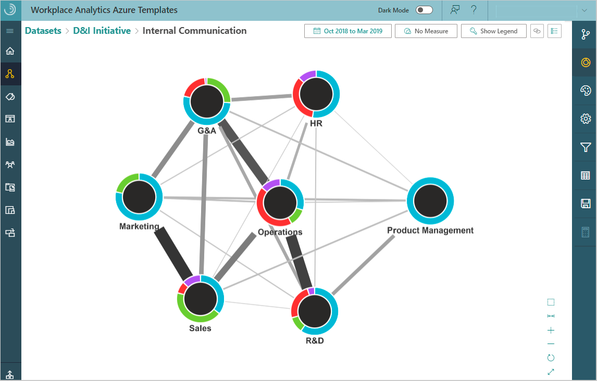

---

ROBOTS: NOINDEX,NOFOLLOW
title: Organizational Network Analysis Azure Template for Workplace Analytics 
description: Learn about the Organizational Network Analysis Azure Template for Workplace Analytics and how to use it for advanced analysis
author: madehmer
ms.author: v-mideh
ms.topic: article
localization_priority: normal 
search.appverid:
- MET150
ms.prod: wpa
ms.collection: M365-analytics
manager: scott.ruble
audience: Admin
---
# Organizational Network Analysis Azure Template for Workplace Analytics

_This template is only available as part of a Microsoft service engagement._

Workplace Analytics Azure Templates include the Organizational Network Analysis (ONA) Template that enables you to visualize connections within your organization, pinpoint internal and external collaboration patterns, and drive change.

Workplace Analytics has a variety of measures to help you visualize and analyze formal and informal relationships within your organization. You can also analyze how your internal organization collaborates with external accounts or people outside your company. This ONA analysis can help you shape a business strategy that improves communication, making your business more effective and sustainable.

This ONA template includes the following options:

* [Insights](ona-insights.md) - Use to create insights that show trends about how people within a group collaborate or how two or more groups collaborate with each other.
* [Analysis](ona-analysis.md) - Use to create analysis about external or internal collaboration data that you can then view as graphs in the template.

The following is an example of within-group collaboration trends created through **Insights**.

The following is an example of an ONA graph created through **Analysis** for a new dataset.

## Related topics

* [Workplace Analytics Azure Templates overview](./overview.md)
* [What's new in Workplace Analytics Azure Templates](./release-notes.md)
* [Deploy and configure Workplace Analytics Azure Templates](./deploy-configure.md)
