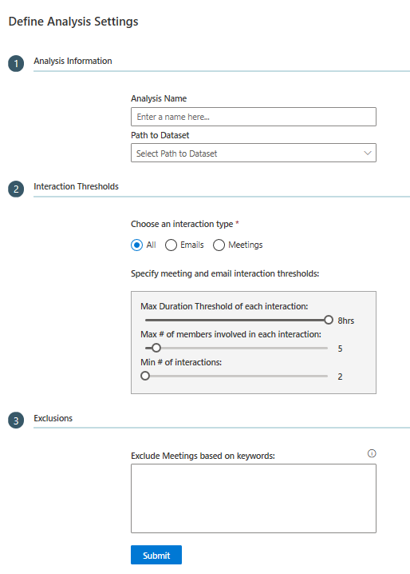
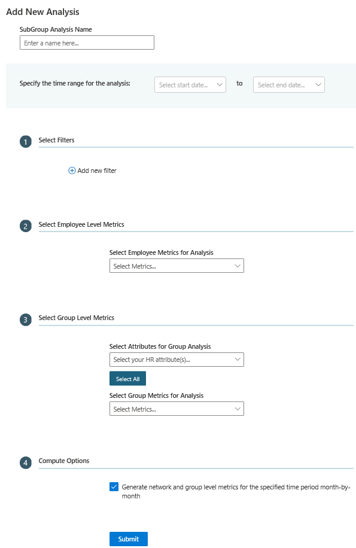
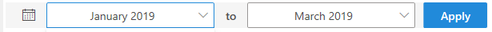
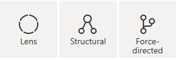
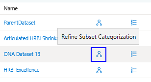
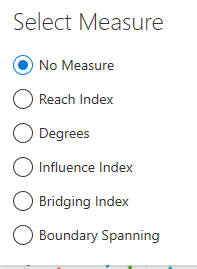

---
# Metadata Sample
# required metadata

ROBOTS: NOINDEX,NOFOLLOW
title: Organizational Network Analysis Azure Template for Workplace Analytics 
description: Learn about the Organizational Network Analysis Azure Template for Workplace Analytics and how to use it for advanced data analysis
author: madehmer
ms.author: v-midehm
ms.topic: article
localization_priority: normal 
ms.prod: wpa
ms.collection: M365-analytics
manager: scott.ruble
audience: Admin
---
# Organizational Network Analysis Azure Template for Workplace Analytics

_These templates are only available as part of a Microsoft service engagement._

Workplace Analytics Azure Templates include the Organizational Network Analysis template that enables you to visualize connections within your organization, pinpoint collaboration patterns, and drive change.

Workplace Analytics has several metrics to help you visualize and analyze formal and informal relationships within your organization. This analysis can help you shape a business strategy that improves communication, making your business more effective and sustainable.

You can also analyze a subset (child) dataset and graph to compare or focus your analysis on specific subgroups within the selected (parent) dataset.

## To add new analysis

1. In Workplace Analytics Azure Templates, select **Organizational Network Analysis**.
2. On the **Organizational Network Analysis** page, select **Add New Dataset** at top right.
3. In **Define Analysis Settings**, enter a name and select a path to the dataset for analysis.

   

4. In **Interaction Thresholds**, select the following.

   * **Choose an interaction type**: Select what you want to analyze in the dataset, either email, meeting, or all.
   * **Max Duration Threshold of each interaction**: Select the maximum number of hours for each interaction.
   * **Max # of members involved in each interaction**: Select the maximum number of people involved in each interaction.
   * **Min # of interactions**: Select the minimum number of interactions between the selected groups or people.

5. Optionally, in **Exclusions**, enter one or more terms separated by a comma to exclude meetings with these keywords in the meeting subject line from this analysis.
6. Optionally, in **Graph Analysis**, select one or more filters and which attributes you want to analyze in the graph. By default, all available attributes are selected. The available filters match up to the HR attributes included in the imported [organizational data](../setup/prepare-organizational-data.md##attribute-reference) from Workplace Analytics. For example, Domain and FunctionType are HR attributes, as shown in the following graphic.

   

7. Select **Render Graph**. Based on the data size, it might take a few minutes for the graph to successfully load.

## To create a subset dataset and graph analysis

Analysis of a subset (child) dataset and graph enables you to compare or focus your analysis on specific subgroups within the selected (parent) dataset.

1. Follow the previous steps to open the graph you want to base your subset analysis on.
2. Select **Define Analysis** to create a subset (child) dataset that is based on this saved graph. If no analysis has been created, the subset list will be empty.
3. Select **Add New Analysis**.
4. In the **Add New Analysis** pane, enter a name for this subgroup analysis, and then select a start and end date for the time range to analyze.

   

5. Optionally, in **Select Filters**, select one or more filters to focus your analysis on.
6. In **Select Employee Level Metrics**, select which employee level metrics, such as Boundary Spanning or Bridging Index to analyze in the graph. For [Boundary Spanning](#boundary-spanning), you'll need to also select what attributes by which to calculate it and show in the graph as nodes.
7. In **Select Group Level Metrics**, select the group HR attributes and group metrics to analyze in the combined view. See [Node Sizing](#node-sizing) for more details about the metric options, such as [Reach Index](#reach-index) and [Influence Index](#influence-index).
8. For **Compute Options**, you can select to generate both network and group level metrics to get both the aggregated metric calculations for the whole date range and the monthly metric calculations for the selected date range. If you don't select this option, you'll only get the monthly metric calculations.
9. Select **Submit** to create the graph analysis.

## To view graph analysis

1. After the analysis successfully loads, select the dataset from the list, and then at top right, select **Load Saved Graph**.
2. Select the name of the graph analysis from the list. If no analysis has been created, the list will be empty.
3. At top left of the graph, you can select a new start and end date for the time range to analyze, and then select **Apply** to update the graph view.

   

4. Use the following options to change, save, or download the current graph view.

   Option |Name |Description
   ------------|--------------|------------
   | No Measure | Change how the data is measured and shown in the graph based on the Node Sizing option you choose.
   | Show or Hide Legend  | Opens or closes the legend of assigned node colors for the HR attribute shown in the graph.
    | Link Color |Select a different color for the line links shown in the graph.
    | Dataset Parameters |Choose to view the network parameter details that you set for the selected dataset.
   | Network View  | Change how the graph shows the network, which you can view in either the **Force-directed**, **Lens**, or **Structural** layout.
    |Combined View | Change the graph view to Combined View, which prompts you to select an HR attribute meeting metric to display the nodes for , such as FunctionType.
    | Change Node Colors | You can select to change the color of any of the nodes shown in the graph.
    | Change Settings |Scales the thickness or color darkness of the link lines. You can also use this to turn node labels and tool tips on or off.
    | Filter by HR attributes |Change the filters selected for the rendered graph.
    | Save Graph |Choose to save this graph as shown in the template to load and view later.

## To view a saved graph

1. On the **Organizational Network Analysis** page, select the name of the analysis in the table.
2. At the top right of the **Graph Analysis** page, select **Load Saved Graph**.
3. Select the name of the graph that you want to view. To view a subset dataset graph, select the **Refine Subset Categorization** icon next to the dataset name, and then select the subset's name to view it. If no analysis has been created, the subset list will be empty.

   

4. Additional options on the analysis pages:

   * When the **Status** is a green check mark, the graph analysis was successfully saved and can be viewed.
   * If the analysis fails with the **Status** of a red x, select the **Job Details** (i) icon next to Status to view details and see what might've caused the failure.
   * Select a table column heading, such as Name or Submitted, to sort by it.
   * Select the **Dataset Parameters** icon next to the name to view them for the analysis in that row.
   * Select the **Delete Analysis** (trashcan) icon to delete the analysis from the list.
   * For subsets, select the **Download Dataset** icon, to download an .xlsx file with the person and group metrics in the saved subgroup graph analysis, which are based on the selected date range and other options. For example, Interconnectedness will have multiple values based on the attributes selected for the graph.

## Node Sizing

You can apply the following node sizing options to change how the data is measured and shown in the graph.

For Subset Categorizations, you must select the applicable metrics when creating the analysis to see these measure options in the graph.

### Betweenness

Betweenness measures how much of a key connector a person or group (node) is in the network. This is calculated by finding the shortest paths between all nodes to all other nodes in the network and finding the number of times a node appears on the shortest path. The more times a node appears on the shortest path between other nodes, the more of a key connector that node is and therefore the higher the node’s betweenness score is.

### Boundary Spanning

This option is only available in Subset Categorization analysis. Indicates the time employees spend collaborating with unique groups. Depending on the direction of the relationships, can indicate resources to other functions, or cross-functional liaisons. Higher boundary spanning can indicate people with access to information that’s meaningfully different from what's available to others in the organization, or the ability to share it with others who're likely unfamiliar with it.

### Bridging Index

This option is only available in Subset Categorization analysis. Indicates potential control over the flow of information and points of failure or overload. High values can indicate gatekeepers, liaisons, or change agents. This role can be advantageous or stressful.

### Closeness

Closeness measures the closeness between nodes in a network, based on their ability to reach them. It then calculates each node’s shortest path to every other node, then assigns each node a score based on the sum of all the paths. Nodes with a high closeness value have a lower distance to all other nodes and therefore are efficient broadcasters of information.

### Degrees

Degrees measures the highest number of links to other nodes within the network. Nodes with a high degree of links are those people or groups who have the best connections to others in the network. These people or groups can be key influencers or might just be strategically important for communication.

### Density

Density measures the number of actual connections out of the number of possible connections within a network or subgroup, which is a table view. Higher density indicates higher levels of connectivity. Large groups tend to have small values since it’s much harder for everyone to connect with everyone else, so be careful comparing across groups. Dense groups indicate cohesion between members.

As shown in the following graphic, the table depicts the density score within and across the respective groups, where:

 **Density** = **Actual connections**/**Potential connections**

### Eigen Centrality

Eigen Centrality is a measure of influence that considers the number of links each person or group (node) has and the number of links their connections have, and so on throughout the network. The larger nodes represent the people or groups with high centrality and can be key influencers in their network.

As shown in the following graphic, Engineering, R&D, and Sales are key influencers that connect all the other groups.

### Influence Index

This option is only available in Subset Categorization analysis. Indicates how much influence an individual has in the network. Influence occurs from providing information to people who also provide information to many others, and so on. High values suggest the central individual’s perspective will flow through the organization with efficiency.

### Interconnectedness

This option is only available in Node View. Interconnectedness is a measure of how diverse a node’s connections are. The higher the interconnection for a node, the more that node’s connections come from other nodes. The nodes with high interconnection can be good ambassadors and help drive collaboration for the intersecting nodes.

### Network size

This option is only available in Subset Categorization analysis. Indicates size of social load without adjusting for potential quality of connections.

### Number of employees

This option is only available in Combined View. The node size is based on the number of people in that particular group. The larger node sizes represent the nodes with the larger number of people in that network.

### Reach Index

Represents ability to access or share information across the organization while going through minimal intermediaries. Closeness Centrality calculates the average distance between an individual and others in the network.

### Graph notes

* **Insufficient group size** - If one or more nodes represent groups that are smaller than the set Minimum Group Size, they're combined and listed as an insufficient group (such as in the color node list). For the combined view, the insufficient group's edges and node won't show in the graph.

* **Delete a node** - If you want to exclude a node from the graph, you can use the filter options or select the node in the graph to highlight it, and then press **Delete** (on your keyboard). Before saving the graph, you can right-click in the graph, and then select **Show Hidden** to undo a delete.

## Related topics

* [Workplace Analytics Azure Templates overview](./overview.md)
* [What's new in Workplace Analytics Azure Templates](./release-notes.md)
* [Deploy and configure Workplace Analytics Azure Templates](./deploy-configure.md)
* [Topic Analysis Azure Template](./topic-analysis.md)
* [Process Explorer Azure Template](./process-explorer.md)
